# Algorithms

- [Algorithms](#algorithms)
  - [1. Union−Find](#1-unionfind)
    - [1.1. Dynamic connectivity problem](#11-dynamic-connectivity-problem)
    - [1.2. Quick find algorithm (eager approach)](#12-quick-find-algorithm-eager-approach)
    - [1.3. Quick union algorithm (lazy approach)](#13-quick-union-algorithm-lazy-approach)
    - [1.4. Quick union improvements](#14-quick-union-improvements)
    - [1.5. Union-Find applications](#15-union-find-applications)
  - [2. Analysis of Algorithms](#2-analysis-of-algorithms)
    - [2.1. Motivation](#21-motivation)
    - [2.2. Observations](#22-observations)
    - [2.3. Mathematical models](#23-mathematical-models)
    - [2.4. Order-of-growth classifications](#24-order-of-growth-classifications)
    - [2.5. Theory of algorithms](#25-theory-of-algorithms)
    - [2.6. Memory](#26-memory)

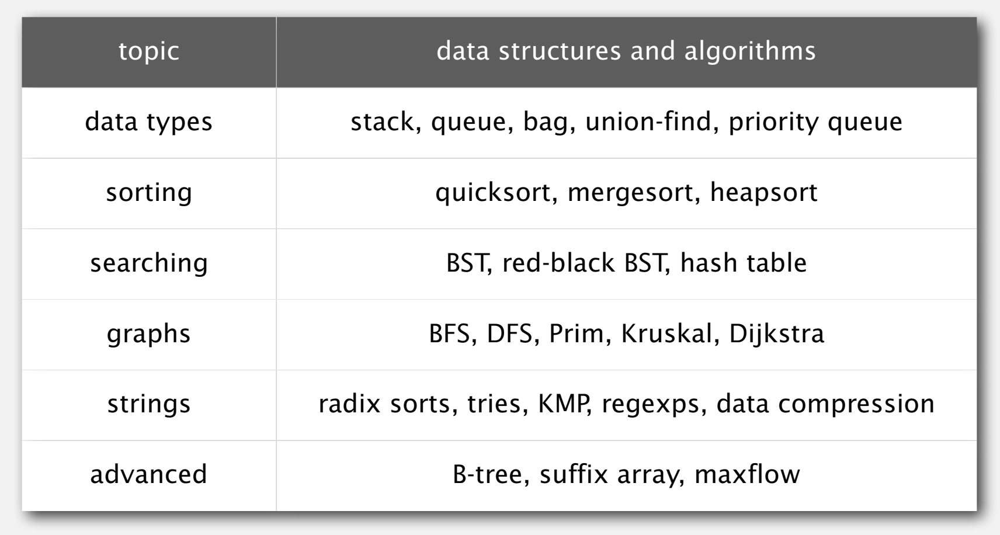

## 1. Union−Find

Union-find is a set of algorithms for solving the dynamic connectivity problem.

### 1.1. Dynamic connectivity problem

- Problem definition

  Given a set of N objects, find if there is a path connecting p and q.
  - Union command: connect two objects.
  - Find/connected query: is there a path connecting the two objects?

  

- Modeling the objects by naming objects 0 to N –1.
  - Use integers as array index.
  - Suppress details not relevant to union-find.

- Modeling the connections

  Assume "is connected to" is an equivalence relation:
  - Reflexive: p is connected to p.
  - Symmetric: if p is connected to q, then q is connected to p.
  - Transitive: if p is connected to q and q is connected to r,
  then p is connected to r

- Connected components

  Maximal set of objects that are mutually connected. E.g. there are 3 connected components: {0,5,6}, {1,2,7}, and {3,4,8,9}

- Implementing the operations

  - Find query. Check if two objects are in the same component. E.g. `connected(5,7)`
  - Union command. Replace components containing two objects. E.g. `union(2,3)`
with their union.

- Union-find data type (API)

  - Goal: Design efficient data structure for union-find.

    - Number of objects N can be huge.
    - Number of operations M can be huge.
    - Find queries and union commands may be intermixed.

  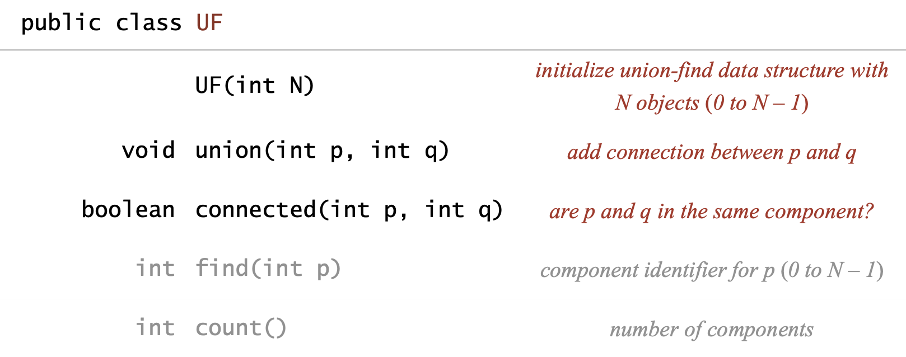

- Dynamic-connectivity client

  - Read in number of objects N from standard input.
  - Repeat:
    - read in pair of integers from standard input
    - if they are not yet connected, connect them and print out pair

  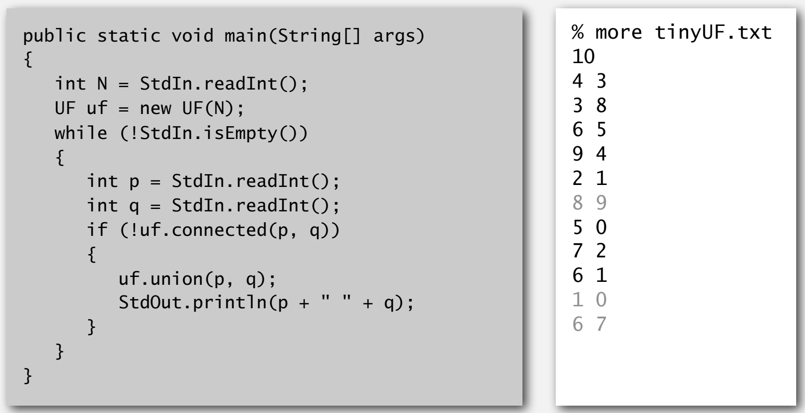

### 1.2. Quick find algorithm (eager approach)

- Data structure
  - Integer array `id[]` of length N.
  - Interpretation: p and q are connected iff they have the same id.

  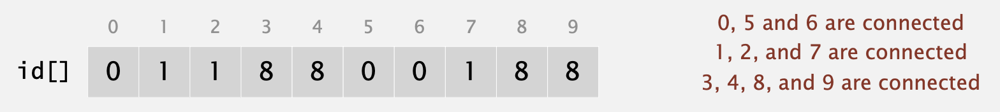

- Find: Check if p and q have the same id.

  E.g., if `id[6] = 0; id[1] = 1`, then 6 and 1 are not connected

- Union: To merge components containing p and q, change all entries
whose id equals `id[p]` to `id[q]`.

  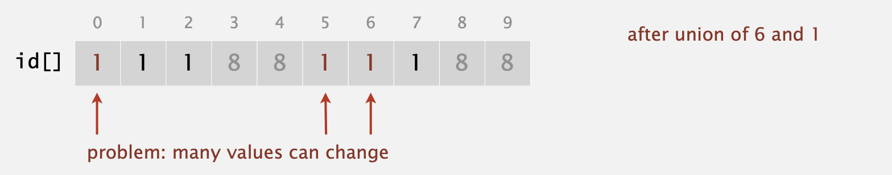

- Java implementation

    ```java
    public class QuickFindUF
    {
        private int[] id;

        // set id of each object to itself
        // (N array accesses)
        public QuickFindUF(int N)
        {
            id = new int[N];
            for (int i = 0; i < N; i++)
                id[i] = i;
        }

        // check whether p and q are in the same component
        // (2 array accesses)
        public boolean connected(int p, int q)
        { return id[p] == id[q]; }

        // change all entries with id[p] to id[q]
        // (at most 2N + 2 array accesses)
        public void union(int p, int q)
        {
            int pid = id[p];
            int qid = id[q];
            for (int i = 0; i < id.length; i++)
                if (id[i] == pid) id[i] = qid;
        }
    }
    ```

- Quick-find is too slow

  - Cost model. Number of array accesses (for read or write).
  
    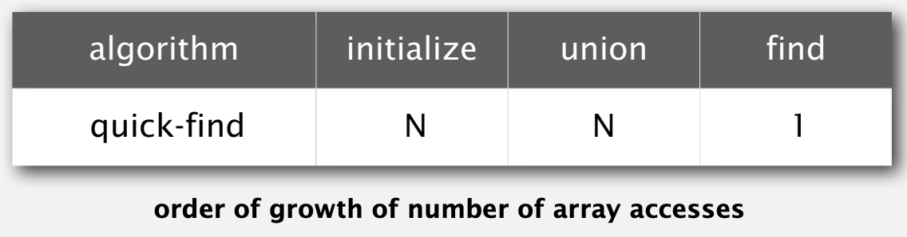

  - Quick-find defect
    - (-) Union too expensive (N array accesses). It takes N^2 (quadratic) array accesses to process a sequence of N union commands on N objects.
    - (-) Trees are flat, but too expensive to keep them flat.

### 1.3. Quick union algorithm (lazy approach)

- Data structure
  - Integer array `id[]` of length N.
  - Interpretation: `id[i]` is parent of i.
  - Root of i is `id[id[id[...id[i]...]]]`, keep going until it doesn’t change (algorithm ensures no cycles).

  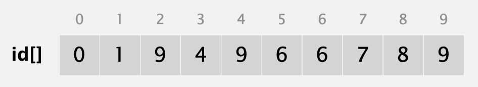
  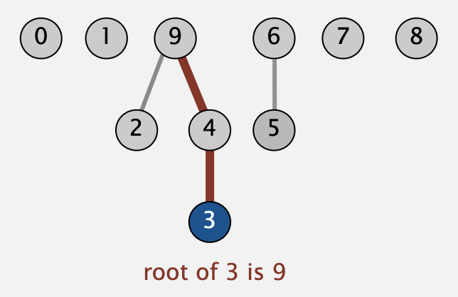

- Find: Check if p and q have the same root

- Union: To merge components containing p and q, set the id of p's root to the id of q's root.

  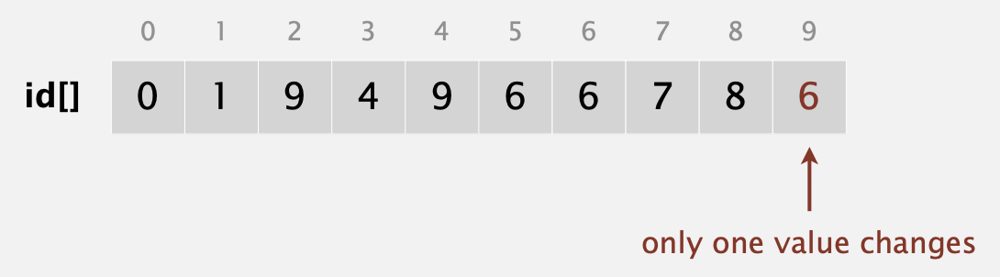
  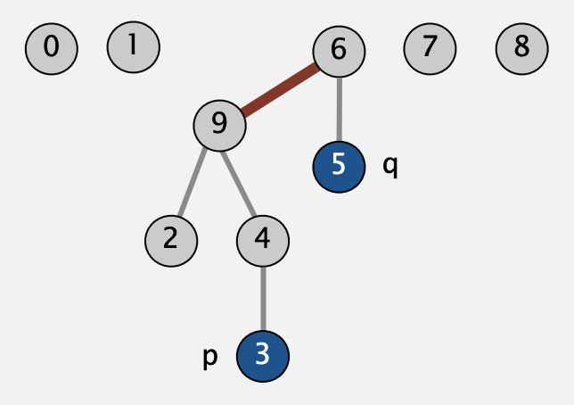

- Java Implementation

    ```java
    public class QuickUnionUF
    {
        private int[] id;

        // set id of each object to itself
        // (N array accesses)
        public QuickUnionUF(int N)
        {
            id = new int[N];
            for (int i = 0; i < N; i++) id[i] = i;
        }

        // chase parent pointers until reach root
        // (depth of i array accesses)
        private int root(int i)
        {
            while (i != id[i]) i = id[i];
            return i;
        }

        // check if p and q have same root
        // (depth of p and q array accesses)
        public boolean connected(int p, int q)
        {
            return root(p) == root(q);
        }

        // change root of p to point to root of q
        // (depth of p and q array accesses)
        public void union(int p, int q)
        {
            int i = root(p);
            int j = root(q);
            id[i] = j;
        }
    }
    ```

- Quick-union is too slow

  - Cost model. Number of array accesses (for read or write)

    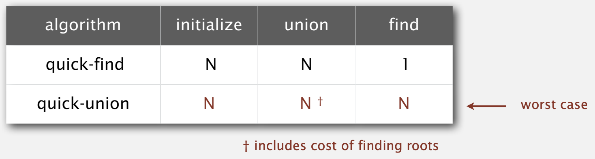

  - Quick-union defect.
    - (-) Trees can get tall.
    - (-) Find too expensive (could be N array accesses).

### 1.4. Quick union improvements

- #### Improvement 1: Weighting

  - Weighted quick-union

    - Modify quick-union to avoid tall trees.
    - Keep track of size of each tree (number of objects).
    - Balance by linking root of smaller tree to root of larger tree. Reasonable alternatives: union by height or "rank"

    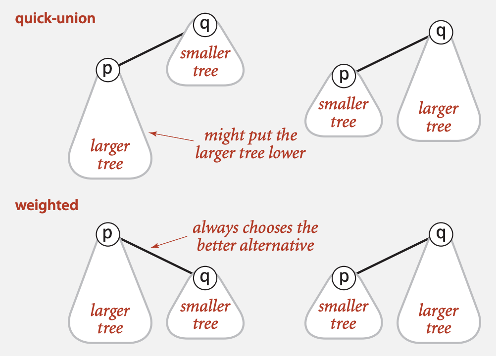

  - Weighted quick-union Java implementation

    - Data structure. Same as quick-union, but maintain extra array `sz[i]` to count number of objects in the tree rooted at i.
    - Find. Identical to quick-union.

        ```java
        return root(p) == root(q);
        ```

    - Union. Modify quick-union to:
      - Link root of smaller tree to root of larger tree.
      - Update the `sz[]` array

      ```java
      int i = root(p);
      int j = root(q);
      if (i == j) return;
      if (sz[i] < sz[j]) { id[i] = j; sz[j] += sz[i]; }
      else { id[j] = i; sz[i] += sz[j]; }
      ```

  - Weighted quick-union analysis

    - Running time
      - Find: takes time proportional to depth of p and q.
      - Union: takes constant time, given roots.
    - Proposition. Depth of any node x is at most `lg N`, where lg = base-2 logarithm.
    - Proof. When does depth of x increase?
      Increases by 1 when tree T1 containing x is merged into another tree T2.
      - The size of the tree containing x at least doubles since `|T2| ≥ |T1|`.
      - Size of tree containing x can double at most `lg N` times.

    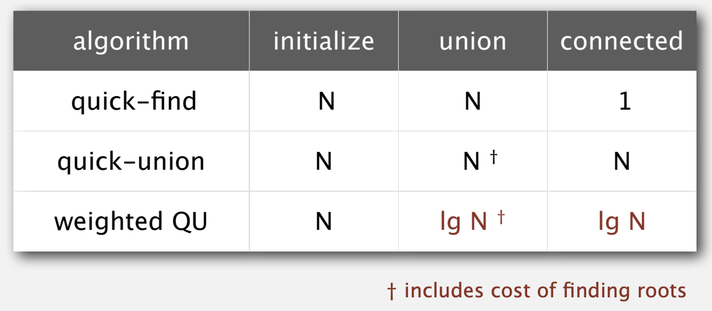

- #### Improvement 2: Path compression

  - Quick union with path compression
  
    Just after computing the root of p, set the id of each examined node to point to that root.

    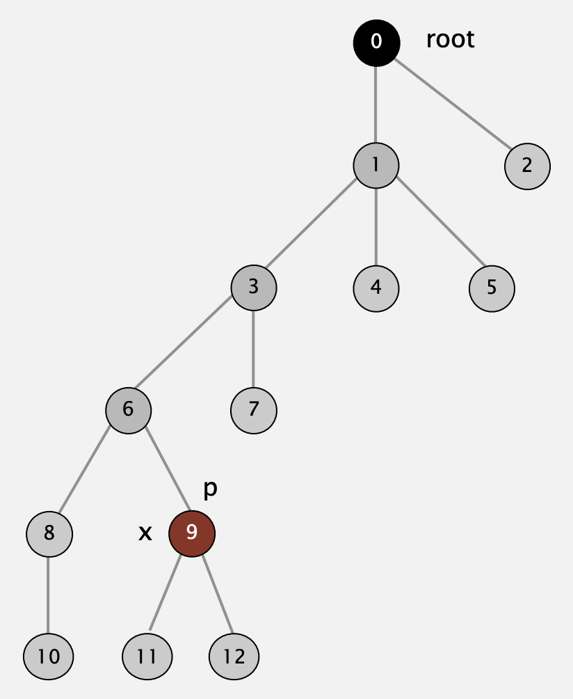
    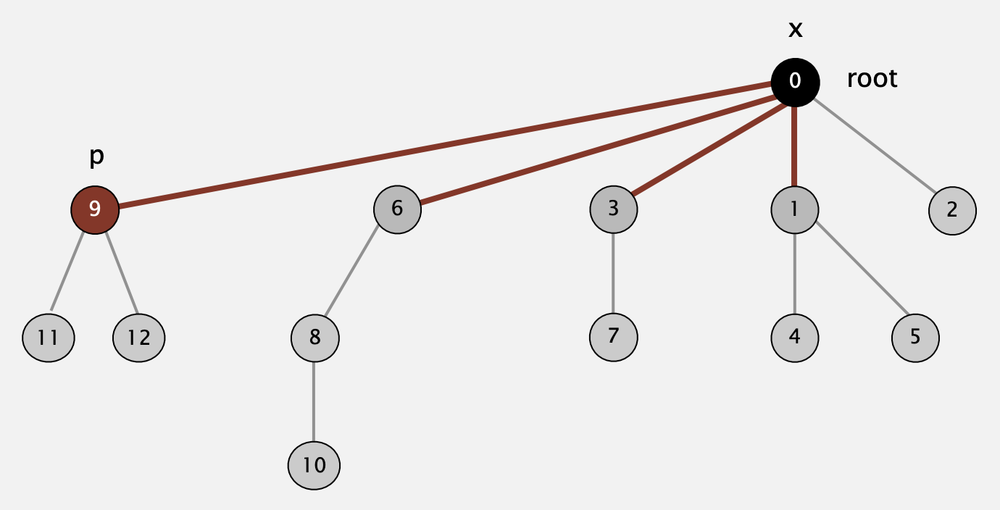

  - Path compression Java implementation

    One-pass implementation: Make every other node in path point to its root (thereby halving path length).

    ```java
    private int root(int i)
    {
        while (i != id[i])
        {
            id[i] = id[id[i]];
            i = id[i];
        }
        return i;
    }
    ```

  - Weighted quick-union with path compression (WQUPC): amortized analysis

    - Proposition. [Hopcroft-Ulman, Tarjan] Starting from an
    empty data structure, any sequence of M union-find ops
    on N objects makes ≤ `c ( N + M lg* N )` array accesses. `lg* N` is iterate log function.
      - Analysis can be improved to `N + M α(M, N)`.
      - Simple algorithm with fascinating mathematics.
      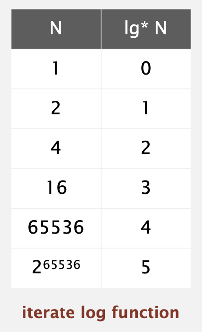
    - Linear-time algorithm for M union-find ops on N objects?
      - Cost within constant factor of reading in the data.
      - In theory, WQUPC is not quite linear.
      - In practice, WQUPC is linear.
      - Amazing fact. [Fredman-Saks] No linear-time algorithm exists.
    - Weighted quick union (with path compression) makes it possible to solve problems that could not otherwise be addressed.
      - Ex. [109 unions and finds with 109 objects]. WQUPC reduces time from 30 years to 6 seconds.
      - Supercomputer won't help much; good algorithm enables solution
    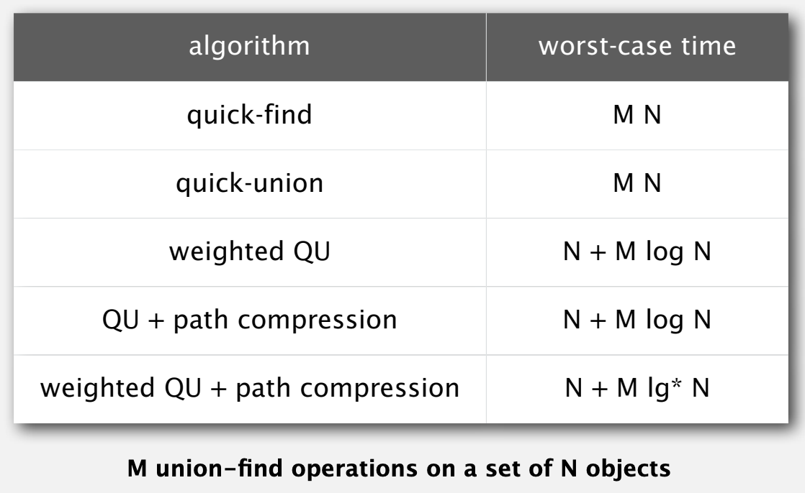

### 1.5. Union-Find applications

- Percolation.
  A model for many physical systems:
  - N-by-N grid of sites.
  - Each site is open with probability p (or blocked with probability 1 – p).
  - System percolates iff top and bottom are connected by open sites.
  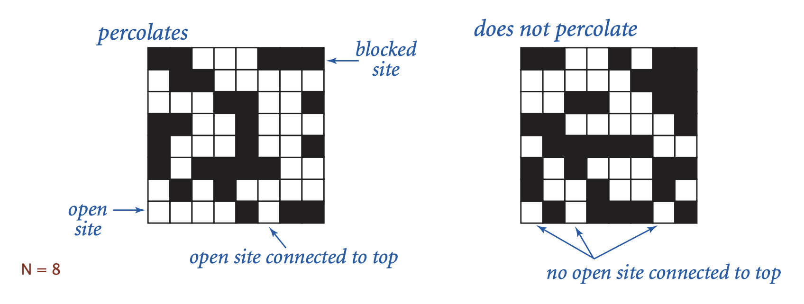
- Games (Go, Hex).
- Dynamic connectivity.
- Least common ancestor.
- Equivalence of finite state automata.
- Hoshen-Kopelman algorithm in physics.
- Hinley-Milner polymorphic type inference.
- Kruskal's minimum spanning tree algorithm.
- Compiling equivalence statements in Fortran.
- Morphological attribute openings and closings.
- Matlab's bwlabel() function in image processing.

## 2. Analysis of Algorithms

### 2.1. Motivation

- Reasons to analyze algorithms: avoid performance bugs
  - Predict performance
  - Compare algorithms
  - Provide guarantees
  - Understand theoretical basis

- Scientific method

  A framework for predicting performance and comparing algorithms.

  - Observe some feature of the natural world.
  - Hypothesize a model that is consistent with the observations.
  - Predict events using the hypothesis.
  - Verify the predictions by making further observations.
  - Validate by repeating until the hypothesis and observations agree.

- Scientific method principles
  - Experiments must be reproducible.
  - Hypotheses must be falsifiable.

### 2.2. Observations

- Doubling hypothesis

  Running time is about a N^b with b = lg ratio

  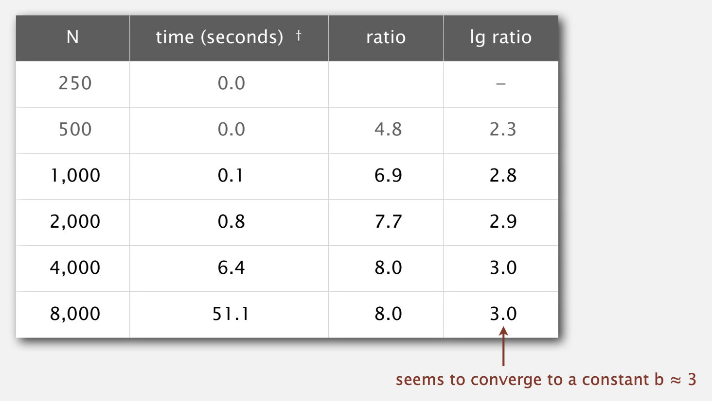

- Experimental algorithmics

  - System independent effects.
    - Algorithm.
    - Input data.

  - System dependent effects.
    - Hardware: CPU, memory, cache, …
    - Software: compiler, interpreter, garbage collector, …
    - System: operating system, network, other apps, …

  - Difficult to get precise measurements, but much easier and cheaper than other sciences. Can run huge number of experiments.

### 2.3. Mathematical models

- Total running time: sum of cost × frequency for all operations.
  - Need to analyze program to determine set of operations.
  - Cost depends on machine, compiler.
  - Frequency depends on algorithm, input data.

- In principle, accurate mathematical models are available.
  - Reference: The Art of Computer Programming by Donald Knuth
  - Cost of basic operations <br>
    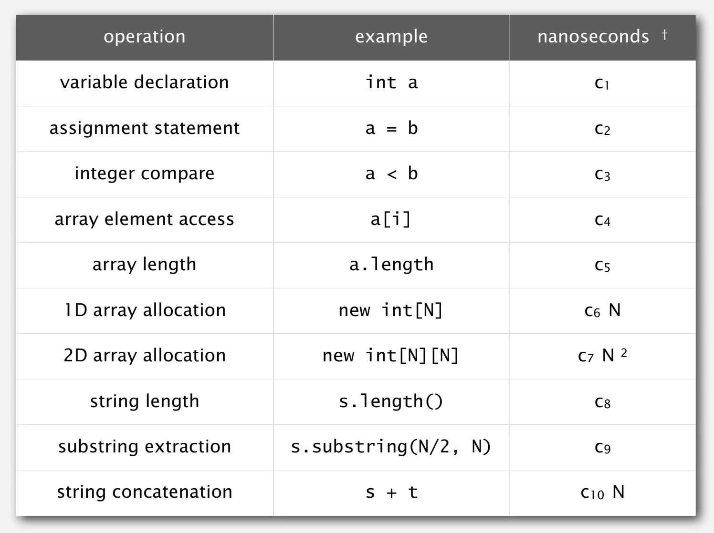

- In practice, use approximate models, because
  - Advanced mathematics might be required.
  - Formulas can be complicated.
  - Exact models best left for experts.

- Simplifying the calculation of frequency

  - Cost model: Use some basic operation, e.g., array access, as a proxy for running time. <br>
    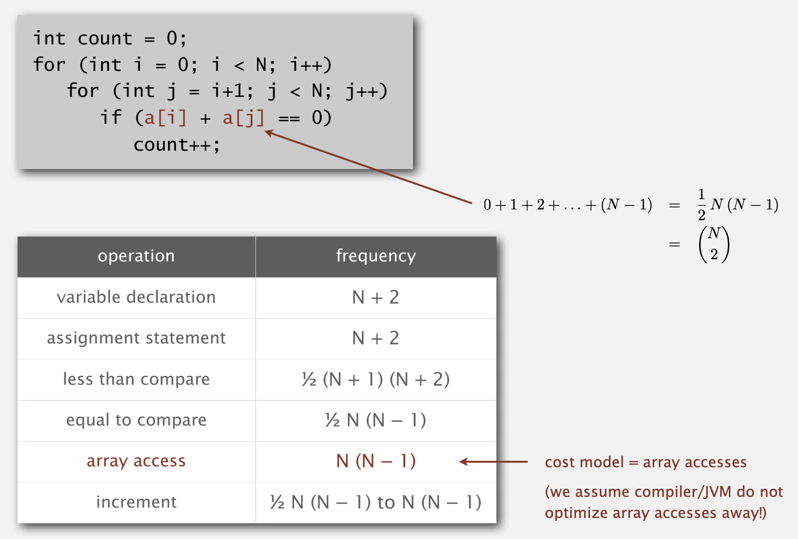
  - Tilde notation: Estimate running time (or memory) as a function of input size N and ignore lower order terms. <br>
    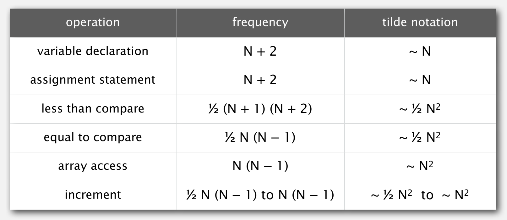

### 2.4. Order-of-growth classifications

- Common order-of-growth classifications

  Small set of functions suffices to describe order-of-growth of typical algorithms. Order of growth discards leading coefficient.

  

  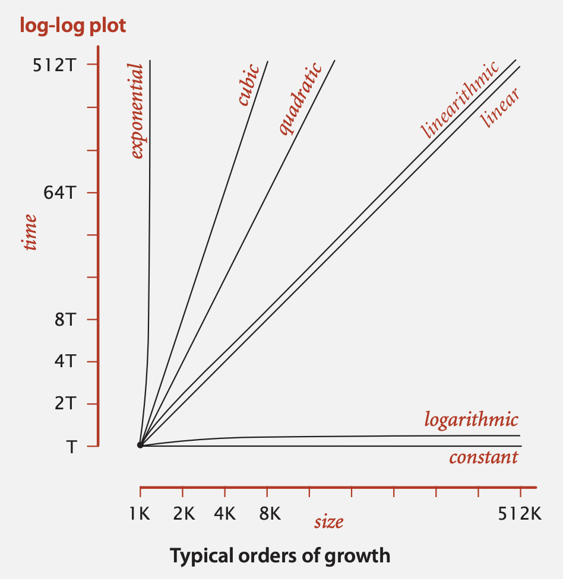

- Examples for order-of-growth classifications

  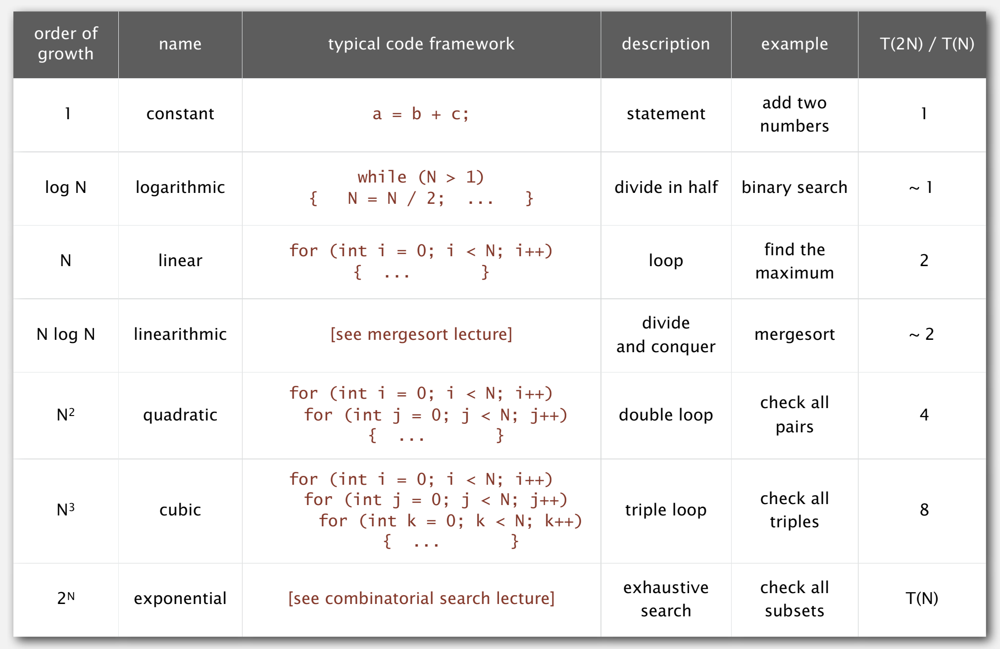

- Practical implications of order-of-growth

  Need linear or linearithmic alg to keep pace with Moore's law.

  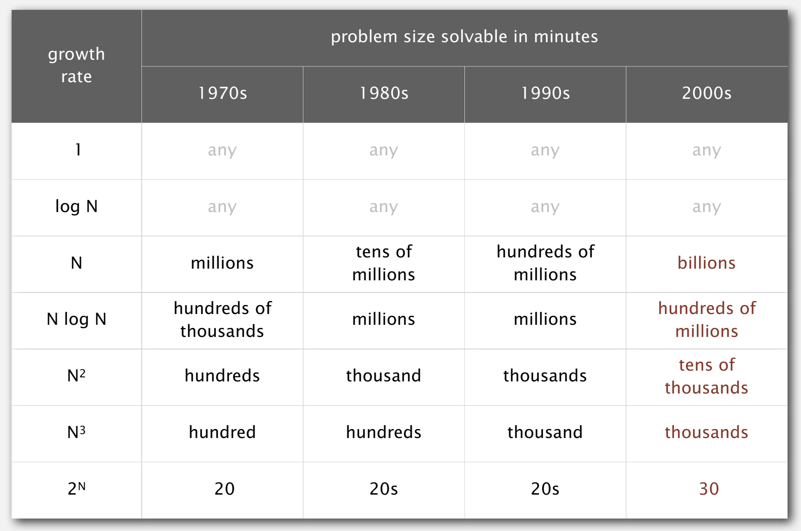

### 2.5. Theory of algorithms

- Types of analyses
  - Best case. Lower bound on cost.
  - Worst case. Upper bound on cost.
  - Average case. Expected cost for random input.

- Commonly-used notations in the theory of algorithms

  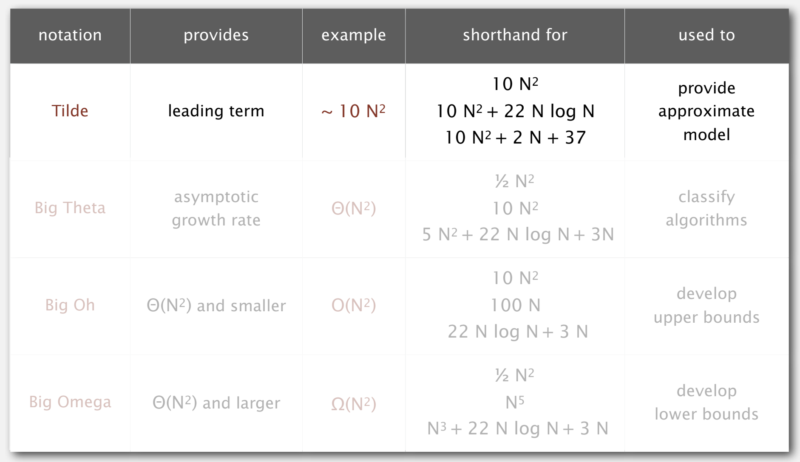

  Common mistake: Interpreting big-Oh as an approximate model.

- Theory of algorithms

  - Goals.
    - Establish “difficulty” of a problem and develop “optimal” algorithms.
  - Approach.
    - Suppress details in analysis: analyze “to within a constant factor”.
    - Eliminate variability in input model by focusing on the worst case.
  - Optimal algorithm.
    - Performance guarantee (to within a constant factor) for any input.
    - No algorithm can provide a better performance guarantee.

  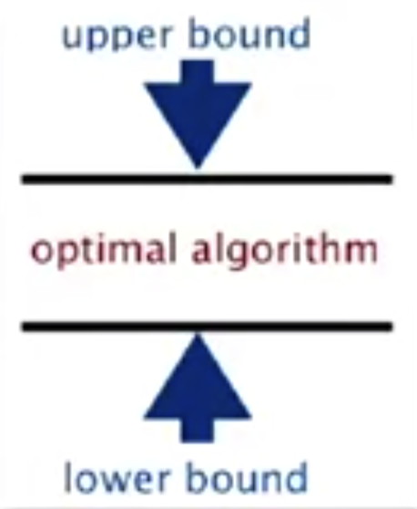

- Theory of algorithms example

  - Goals.
    - Ex. 1-SUM = “Is there a 0 in the array? ”
  - Upper bound. A specific algorithm.
    - Ex. Brute-force algorithm for 1-SUM: Look at every array entry.
    - Running time of the optimal algorithm for 1-SUM is O(N).
  - Lower bound. Proof that no algorithm can do better.
    - Ex. Have to examine all N entries (any unexamined one might be 0).
    - Running time of the optimal algorithm for 1-SUM is Ω(N).
  - Optimal algorithm.
    - Lower bound equals upper bound (to within a constant factor).
    - Ex. Brute-force algorithm for 1-SUM is optimal: its running time is Θ(N ).

- Algorithm design approach

  - Start.
    - Develop an algorithm.
    - Prove a lower bound.
  - Gap?
    - Lower the upper bound (discover a new algorithm).
    - Raise the lower bound (more difficult).
  - Caveats.
    - Overly pessimistic to focus on worst case.
    - Need better than “to within a constant factor” to predict performance.

### 2.6. Memory

- Basics

  - Bit. 0 or 1.
  - Byte. 8 bits.
  - Megabyte (MB). 1 million or 220 bytes.
  - Gigabyte (GB). 1 billion or 230 bytes.

- Typical memory usage for primitive types and arrays

  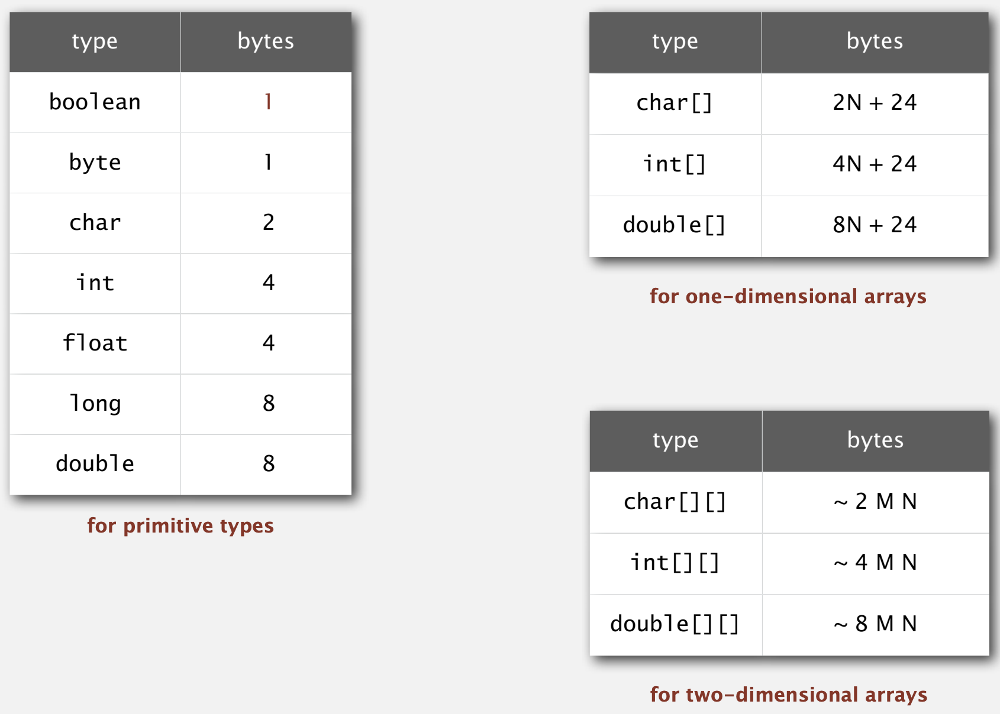

- Typical memory usage for objects in Java

  - Object overhead. 16 bytes.
  - Reference. 8 bytes.
    - Shallow memory usage: Don't count referenced objects.
    - Deep memory usage: If array entry or instance variable is a reference, add memory (recursively) for referenced object.
  - Padding. Each object uses a multiple of 8 bytes.
  - Memory for each instance variable.

  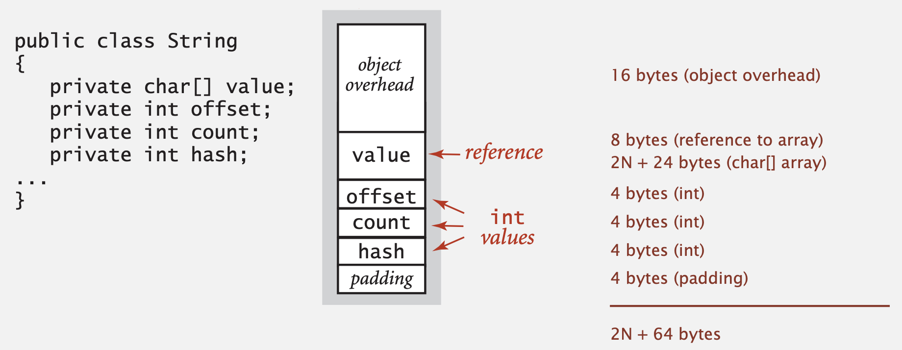
