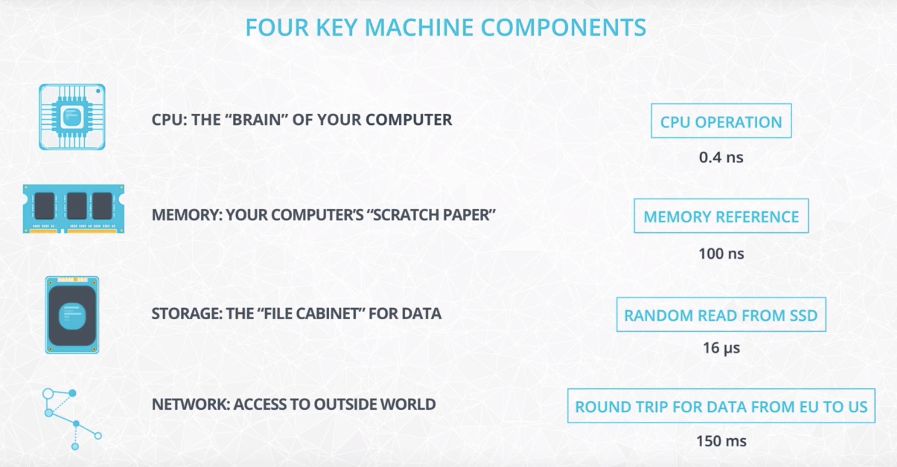
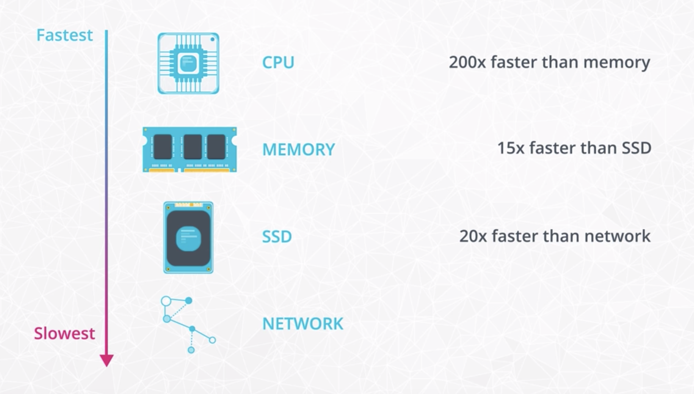
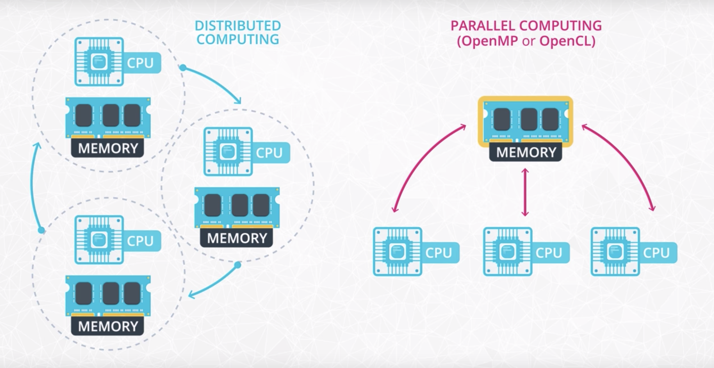

# Big data

According to IBM: "Every day, 2.5 billion gigabytes of high-velocity data are created in a variety of forms, such as social media posts, information gathered in sensors and medical devices, videos and transaction records"

- [Big data](#big-data)
  - [1. What is big data](#1-what-is-big-data)
  - [2. The hardware behind big data](#2-the-hardware-behind-big-data)
    - [2.1. CPU (Central Processing Unit)](#21-cpu-central-processing-unit)
    - [2.2. Memory (RAM)](#22-memory-ram)
    - [2.3. Storage (SSD or Magnetic Disk)](#23-storage-ssd-or-magnetic-disk)
    - [2.4. Network (LAN or the Internet)](#24-network-lan-or-the-internet)
  - [3. Introduction to distributed systems](#3-introduction-to-distributed-systems)

## 1. What is big data

**Big Data** is a loosely defined term used to describe data sets so large and complex that they become awkward to work with using standard statistical software.

**Big data** is high volume, high velocity, and/or high variety information assets that require new forms of processing to enable enhanced decision making, insight discovery and process optimization.

Challenges with big data

- **Volume** (size of data): Needs a cheaper way to store data reliably and to read and process data efficiently.
- **Velocity** (speed at which data were generated and needs to be processed): Needs to store and process at fast speed.
- **Variety** (difference sources and formats): Unstructured data can be difficult to store and reconcile in traditional systems (SQL)
- **Veracity** (uncertainty)

## 2. The hardware behind big data

### 2.1. CPU (Central Processing Unit)

- The CPU is the "brain" of the computer. Every process on your computer is eventually handled by your CPU. This includes calculations and also instructions for the other components of the computer.

- The CPU can also store small amounts of data inside itself in what are called **registers**. These registers hold data that the CPU is working with at the moment. The registers make computations more efficient: the registers avoid having to send data unnecessarily back and forth between memory (RAM) and the CPU.

### 2.2. Memory (RAM)

- When your program runs, data gets temporarily stored in memory before getting sent to the CPU. Memory is ephemeral storage - when your computer shuts down, the data in the memory is lost.

- Efficient, Expensive, and Ephemeral

- For most use cases in the industry, memory and CPU aren't the bottleneck. Instead the storage and network slow down many tasks you'll work on in the industry.

- Using distributed clusters of commodity hardware has become the industry standard.

### 2.3. Storage (SSD or Magnetic Disk)

- Storage is used for keeping data over long periods of time. When a program runs, the CPU will direct the memory to temporarily load data from long-term storage.

### 2.4. Network (LAN or the Internet)

- Network is the gateway for anything that you need that isn't stored on your computer. The network could connect to other computers in the same room (a Local Area Network) or to a computer on the other side of the world, connected over the internet.

- Distributed systems try to minimize **shuffling** data back and forth across different computers. Shuffling is moving data back and forth between nodes of a cluster.

## 3. Introduction to distributed systems

