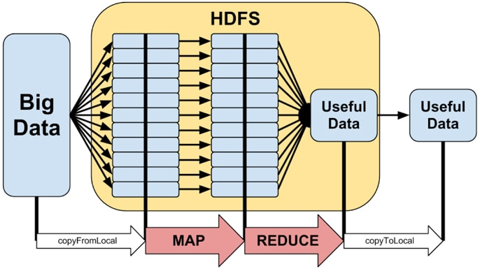
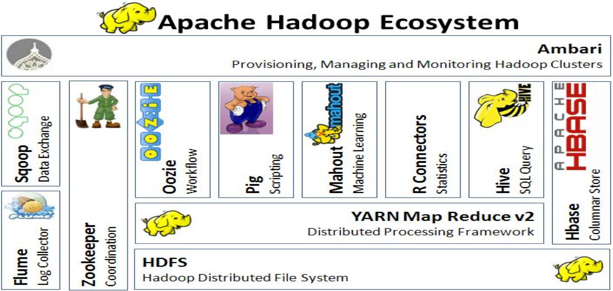
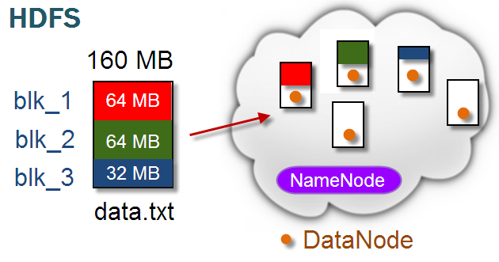
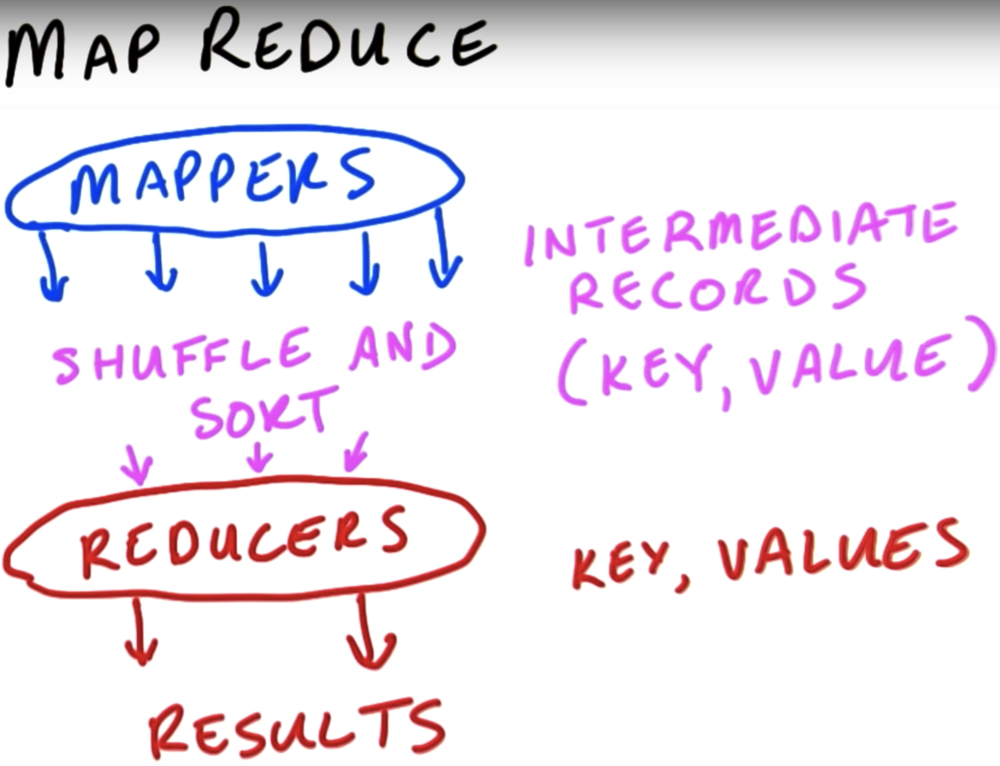
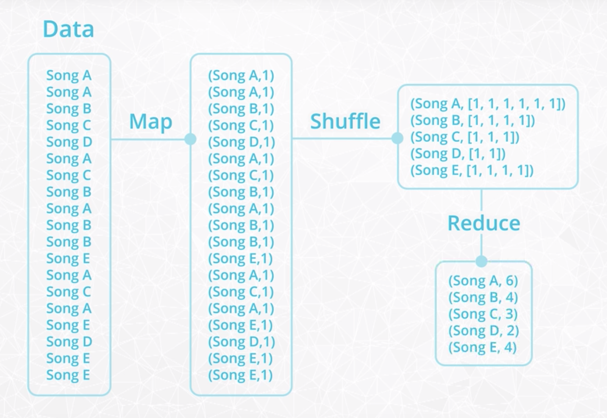

# Hadoop

Hadoop - an ecosystem of tools for big data storage and data analysis.

- [Hadoop](#hadoop)
  - [1. Hadoop basics](#1-hadoop-basics)
    - [1.1. Core Hadoop](#11-core-hadoop)
    - [1.2. Hadoop ecosystem](#12-hadoop-ecosystem)
    - [1.3. Hadoop distributed file system (HDFS)](#13-hadoop-distributed-file-system-hdfs)
    - [1.4. MapReduce](#14-mapreduce)
  - [2. Running Hadoop](#2-running-hadoop)
    - [2.1. MRjob - a Python library for Hadoop](#21-mrjob---a-python-library-for-hadoop)

## 1. Hadoop basics

### 1.1. Core Hadoop

- Store in Hadoop distributed file system (HDFS)
- Process with MapReduce

    

### 1.2. Hadoop ecosystem

Hadoop Ecosystem is a platform or framework which solves big data problems. It is a suite which encompasses a number of services (ingesting, storing, analyzing and maintaining) inside it.



- **Hadoop MapReduce:** a system for processing and analyzing large data sets in parallel.
- **Hadoop YARN:** a resource manager that schedules jobs across a cluster. The manager keeps track of what computer resources are available and then assigns those resources to specific tasks.

- **Hadoop Distributed File System (HDFS):** a big data storage system that splits data into chunks and stores the chunks across a cluster of computers.

- **Apache Pig:** a SQL-like language that runs on top of Hadoop MapReduce

- **Apache Hive:** another SQL-like interface that runs on top of Hadoop MapReduce

### 1.3. Hadoop distributed file system (HDFS)

HDFS partitions large datasets and stores files across a network of machines.

- **Daemons** of MapReduce
    - Active NameNode: Holds the metadata for HDFS
    - Standby NameNode: Backup the NameNode
    - DataNode: Stores actual HDFS data blocks

    <br>

- Resolving node failures

    - Data redundancy: To resolve DataNode failure, Hadoop replicates each block 3 times as it is stored in HDFS
    - NameNode standby: To resolve NameNode failure, configure active NameNode + standby NameNode

- Pros and Cons

    - (+) Handles Terabytes of data
    - (+) Write once - read many times
    - (+) Uses Commodity hardware
    - (-) Not good to low latency access
    - (-) Bad for lots of small files
    - (-) Not for multiple writers

### 1.4. MapReduce

- **MapReduce** is a programming technique for manipulating large data sets. "Hadoop MapReduce" is a specific implementation of this programming technique.
- **Map:** each data is analyzed and converted into a (key, value) pair. Then these key-value pairs are **shuffled** across the cluster to find all of the data across the clusters that have the same key. And all of those data points with that key are brought into the same network node for further analysis.
- **Reduce** takes the output from a map as input and combines the values with the same keys.

  

  E.g.

  

- **Daemons** of MapReduce
    - JobTracker: Manages MapReduce jobs, distributes indiviual tasks to machines running the TaskTracker, coordinates MapReduce stages.
    - TaskTracker: Instantiates and monitors individual Map and Reduce tasks.

    

## 2. Running Hadoop

Running a mapreduce job with the vm alias <br>
`hs {mapper script} {reducer script} {input_file} {output directory}`

### 2.1. MRjob - a Python library for Hadoop

- Install mrjob library. This package is for running MapReduce jobs with Python

    `pip install mrjob`

- Python file named `bacon.py`

    ```python
    # %%file is an Ipython magic function that saves the code cell as a file
    %%file wordcount.py

    # Import the mrjob library
    from mrjob.job import MRJob

    class Bacon_count(MRJob):

        # The map step
        def mapper(self, key, line):
            for word in line.split():
                if word.lower() == "bacon":
                    yield "bacon", 1

        # The reduce step
        def reducer(self, key, values):
            yield key, sum(values)

    if __name__ == "__main__":
        Bacon_count.run()
    ```

- Command line `python bacon.py input.txt` where `input.txt` contains paragraphs of text