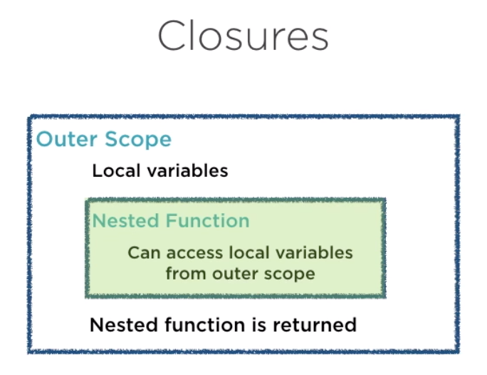
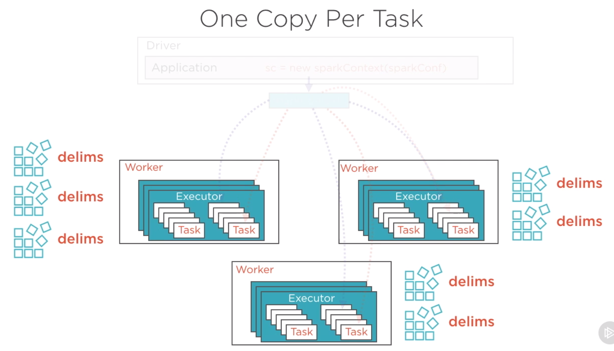

# Data wrangling with PySpark

- [Data wrangling with PySpark](#data-wrangling-with-pyspark)
  - [1. Creating DataFrame](#1-creating-dataframe)
    - [1.1. Spark session](#11-spark-session)
    - [1.2. Read data file into dataframe](#12-read-data-file-into-dataframe)
    - [1.3. Create dataframe](#13-create-dataframe)
    - [1.4. Write data file from dataframe](#14-write-data-file-from-dataframe)
    - [1.5. Convert between PySpark dataframe and pandas dataframe](#15-convert-between-pyspark-dataframe-and-pandas-dataframe)
  - [2. Exploring data with DataFrame](#2-exploring-data-with-dataframe)
    - [2.1. Overview of dataframe](#21-overview-of-dataframe)
    - [2.2. Access data from dataframe](#22-access-data-from-dataframe)
    - [2.3. Broadcast variables and accumulators](#23-broadcast-variables-and-accumulators)
  - [3. DataFrame functions](#3-dataframe-functions)
    - [3.1. Aggregation](#31-aggregation)
    - [3.2. Join dataframes](#32-join-dataframes)
    - [3.3. User defined functions (UDF)](#33-user-defined-functions-udf)
    - [3.4. Window functions](#34-window-functions)
    - [3.5. Date](#35-date)

## 1. Creating DataFrame

### 1.1. Spark session

The first component of a Spark program is a `SparkContext`, or equivalently `SparkSession` in `pyspark.sql`

- Instantiate Spark session

    ```python
    import pyspark
    from pyspark import SparkConf
    from pyspark.sql import SparkSession

    # Set or update SparkSession parameters
    spark = SparkSession \
    .builder \
    .appName("Our first Python Spark SQL example") \
    .getOrCreate()

    # Check if the change went through
    spark.sparkContext.getConf().getAll()
    ```

- Stop Spark session

    ```python
    # Stop at the end
    spark.stop()
    ```

### 1.2. Read data file into dataframe

- Read json

    ```python
    path = "data/sparkify_log_small.json" # or the data file path of remote cluster
    df = spark.read.json(path)
    ```

- Read csv

    ```python
    # From local
    path = "data/sparkify_log_small.csv"
    df = spark.read.csv(path, header=True)
    ```

    ```python
    # From remote
    from pyspark import SparkFiles
    url = "https://s3.amazonaws.com/zepl-trilogy-test/food.csv"
    spark.sparkContext.addFile(url)
    df = spark.read.csv(SparkFiles.get("food.csv"), sep=",", header=True)
    df.show()
    ```

- Read data with date format

    ```python
    from pyspark import SparkFiles
    url ="https://s3.us-east-2.amazonaws.com/trilogy-dataviz/rainfall.csv"
    spark.sparkContext.addFile(url)
    df = spark.read.csv(SparkFiles.get("rainfall.csv"), sep=",", header=True, inferSchema=True, timestampFormat="yyyy/MM/dd HH:mm:ss")
    df.show()
    ```

- Read data with defined schema

    ```python
    # Import struct fields that we can use
    from pyspark.sql.types import StructField, StringType, IntegerType, StructType, LongType

    # Next we need to create the list of struct fields
    schema_fields = [
        StructField("food", StringType(), True),
        StructField("price", LongType(), True),
        StructField("amount", IntegerType(), True)
    ]

    # Pass in our fields
    schema = StructType(fields=schema_fields)

    # Read our data with our new schema
    dataframe = spark.read.csv(SparkFiles.get("food.csv"), sep=",", header=True, schema=schema)
    ```

### 1.3. Create dataframe

- Create dataframe from RDD using Row function

    ```python
    # Row functions allow specifying column names for dataframes
    data = sc.parallelize([
        Row(id=1, name="Alice", score=50),
        Row(id=2, name="Bob", score=80)
    ])
    df = data.toDF()
    ```

- Create dataframe from raw data using SQLContext

    ```python
    # SQLContext can create dataframes directly from raw data
    sqlContext = SQLContext(sc)
    data = [
        ('Alice', 50),
        ('Bob', 80),
    ]
    df = sqlContext.createDataFrame(data, ['Name', 'Score'])
    ```

- Create dataframe using SQL Context and the Row function

    ```python
    data = sc.parallelize([
        Row(1, "Alice", 50),
        Row(2, "Bob", 80),
    ])
    column_names = Row('id', 'name', 'score')  
    students = data.map(lambda r: column_names(*r))
    df = sqlContext.createDataFrame(students)
    ```

- Create dataframe with inferred schema

    ```python
    # Read text
    lines = sc.textFile("../datasets/students.txt")
    # ['Emily,44,55,78', 'Andy,47,34,89', 'Rick,55,78,55', 'Aaron,66,34,98']

    # Map into a list of lists of values
    parts = lines.map(lambda l: l.split(","))

    # Map into rows
    students = parts.map(lambda p: Row(name=p[0], math=int(p[1]), english=int(p[2]), science=int(p[3])))

    # Create dataframe
    schemaStudents = spark.createDataFrame(students)

    # Checkout inferred schema
    schemaStudents.schema
    ```

- Create dataframe with explicit schema

    ```python
    # Import struct fields that we can use
    from pyspark.sql.types import StructField, StringType, IntegerType, StructType, LongType

    # Next we need to create the list of struct fields
    schema_fields = [
        StructField("food", StringType(), True),
        StructField("price", LongType(), True),
        StructField("amount", IntegerType(), True)
    ]

    # Pass in our fields
    schema = StructType(fields=schema_fields)

    # Create dataframe with explicit schema
    schemaStudents = spark.createDataFrame(parts, schema)

    # Checkout schema
    schemaStudents.schema
    ```

### 1.4. Write data file from dataframe

- Write csv

    ```python
    # Write as csv
    out_path = "data/sparkify_log_small.csv"
    df.write.save(out_path, format="csv", header=True)
    ```

    ```python
    # Repartitions the dataframe into a single partition to write out a single file
    df.select("api_id", "overall_rating")\
        .coalesce(1)\
        .write\
        .option("header", "true")\
        .csv("players_overall.csv")
    ```

- Write json

    ```python
    # Write as json
    df.select("api_id", "overall_rating")\
        .write\
        .json("players_overall.json")
    ```

### 1.5. Convert between PySpark dataframe and pandas dataframe

- Convert pyspark dataframe into pandas dataframe

    ```python
    pandas_df = df.toPandas()
    pandas_df.head()
    ```

- Convert pandas dataframe into pyspark dataframe

    ```python
    sqlContext.createDataFrame(pandas_df).show()
    ```

## 2. Exploring data with DataFrame

### 2.1. Overview of dataframe

- Print table schema

    ```python
    df.printSchema()
    ```

- Describe data types

    ```python
    df.describe()
    ```

- Show the columns

    ```python
    df.columns
    ```

- Show the first few rows

    ```python
    # Show as a table
    df.show(n=1)
    ```

    ```python
    # Show as a list of rows
    df.take(5)
    ```

    ```python
    # Show the first row
    df.first()
    ```

    ```python
    df.head()
    ```

- Show a sample of the dataset

    ```python
    df.sample(fraction=0.1).show()
    ```

- Describe summary statistics

    ```python
    # All columns
    df.describe().show()
    ```

    ```python
    # An individual column
    df.describe("artist").show()
    ```

- Check the number of rows

    ```python
    df.count()
    ```

### 2.2. Access data from dataframe

- [Declarative]: create a view to run SQL queries

    ```python
    # The view is valid for one session
    # This is required to run SQL commands on the dataframe
    df.createOrReplaceTempView("df_table")
    ```

    ```python
    # Access the view
    spark.sql(
        '''
        SELECT *
        FROM df_table
        WHERE userID == '1046'
        LIMIT 2
        '''
    ).show() # or .collect()
    ```

- [Declarative]: create a global view across all Spark sessions

    ```python
    # Temporary view shared across multiple sessions
    # Kept alive till the Spark application terminates
    df.createGlobalTempView("df_table")
    ```

    ```python
    # Access global view
    spark.sql('SELECT * FROM global_temp.df_table').show()
    ```

- Select column(s)

    ```python
    # Select 1 column
    df['price'] # is of type pyspark.sql.column.Column
    df.select('price') # is of type pyspark.sql.dataframe.DataFrame
    df.select('price').show() # show selected data
    ```

    ```python
    # Select multiple columns
    df.select(["age", "height_meter", "weight_kg"]).show()
    ```

    ```python
    # Select distinct values
    df.select("borough").distinct()
    ```

    ```python
    # Collect a column as a list
    df.select("price").collect()
    ```

    ```python
    # Select with "where" condition
    df.select(['userId', 'firstName']).where(df.userID == "1046").collect()
    ```

- Filter rows with given condition

    ```python
    # Filter using SQL syntax
    df.filter("price<20").show()
    ```

    ```python
    # Filter using Python syntax
    df.filter(df["price"] < 200).show()
    df.filter( (df["price"] < 200) | (df['points'] > 80) ).show()
    df.filter(df["country"] == "US").show()
    df.filter(df['year'].isin(["2015", "2016"]))
    df.filter(df['userId'] != "")
    ```

- Drop NaN

    ```python
    df_valid = df.dropna(how='any', subset=['userId', 'sessionId'])
    df_valid.count()
    ```

- Drop duplicates

    ```python
    df.select("page").dropDuplicates().sort("page").show()
    ```

- Drop column

    ```python
    df.drop("column_name")
    ```

- Edit column

    ```python
    # Edit using map function
    complex_data_df.rdd\
        .map(lambda x: (x.col_string + " Boo"))\
        .collect()
    ```

- Add new column

    ```python
    # Add a new column
    df = df.withColumn('newprice', df['price'])
    ```

    ```python
    # Add a new column with calculation
    df = df.withColumn('doubleprice',df['price']*2)
    ```

    ```python
    # Add a new column with built-in function
    df = df.withColumn("Desc", concat(col("Title"), lit(' '), col("Body")))
    ```

- Update column name

    ```python
    # Rename a column
    df.withColumnRenamed('price','newerprice').show()
    ```

    ```python
    # Equivalently, set alias
    df.select(df.price.alias("newerprice")).show()
    ```

- Access cell value

    ```python
    # Access cell value in row 0, column 2
    df.collect()[0][2]
    ```

- Order by

    ```python
    # Order a dataframe by ascending values
    df.orderBy(df["points"].asc()).head(5)
    ```

    equivalently

    ```python
    # Order a dataframe by ascending values
    from pyspark.sql.functions import asc
    df.orderBy(asc("points")).head(5)
    ```

    equivalently

    ```python
    # Order a dataframe by ascending values
    df.sort("points").head(5)
    ```

### 2.3. Broadcast variables and accumulators

- Characteristics of a function in Scala

  - A function can be stored in a variable or value
  - The return value of a function can be a function
  - A parameter of a function can be a function

- Spark is written in Scala and heavily utilizes **closures**

  

  The nested function that is returned from the outer scope and can access the local variables in the outer scope is called a closure.

  - The closure retains its copies of local variables even after the outer scope ceases to exist.
  - Tasks that run on individual workers are closures. Note that a single node can have multiple tasks. Closures allow Spark to distribute compute processes to the different nodes in a cluster. Every task will contain a copy of the variable that it works on.

- Example of closure

  ```python
  # MyScript.py
  if __name__ = "__main__":
      delim = " " # Define a variable in outer scope

      def myFunc(s): # Define a function
          words = s.aplit(delim) # Reference that variable
          return len(words)

      sc = SparkContext(...)
      sc.textFile("file.txt").map(myFunc) # Map function to RDD
  ```

  - The variable `delim` will be copied to each task on which map function runs, i.e., the variable becomes part of the myFunc closure
  - The copying is done from master node alone

  

- **Broadcast variables** and **accumulators** are used when we need shared variables across tasks on the same node

  

  - Broadcast variables
    - Only 1 read-only copy per node (not 1 copy per task)
    - Cached in-memory on each node
    - Used whenever tasks across stages need same data (e.g. training data, lookup table)
  - Accumulators
    - Broadcast to workers but can be modified by adding to it
    - Used when there is distributed processes that should updated the same counter values

- Broadcast and join

    Perform join operations by broadcasting DataFrames to share the data across tasks

  - Broadcast the smaller dataframe so it is available on all cluster machines
  - The data should be small enough so it is held in memory
  - All nodes in the cluster distribute the data as fast as they can so overall computation is faster

  ```python
  # Broadcast
  from pyspark.sql.functions import broadcast

   df1.select("api_id", "player_name")\
      .join(broadcast(df2), ['api_id'], 'inner')
  ```

- Accumulator and join

    Shared variables which are updated by processes running across multiple nodes

    ```python
    # Join
    heading_acc = df3.select('api_id', 'accuracy')\
        .join(broadcast(df1), df3.api_id == df1.api_id)

    # Accumulator
    short_count = spark.sparkContext.accumulator(0)
    tall_count = spark.sparkContext.accumulator(0)

    # Count
    def count_by_height(row):
        height = float(row.height)

        if (height <= 175 ):
            short_count.add(1)
        elif (height > 195) :
            tall_count.add(1)

    heading_acc.foreach(lambda x: count_by_height(x))
    all_counts = [short_count.value, tall_count.value]
    ```

- Custom accumulator

    ```python
    # Create custom accumulator
    from pyspark.accumulators import AccumulatorParam

    class VectorAccumulatorParam(AccumulatorParam):

        # Initialize the accumulator when it's first created
        def zero(self, value):
            return [0.0] * len(value)

        # Add to the current accumulated vector value
        def addInPlace(self, v1, v2):
            for i in range(len(v1)):
                v1[i] += v2[i]
            return v1
    ```

    ```python
    # Create the accumulator
    vector_accum = sc.accumulator([10.0, 20.0, 30.0], VectorAccumulatorParam())
    vector_accum.value
    ```

    ```python
    # Add value to the accumulator
    vector_accum += [1, 2, 3]
    vector_accum.value
    ```

## 3. DataFrame functions

### 3.1. Aggregation

Spark SQL provides built-in methods for the most common aggregations such as `count()`, `countDistinct()`, `avg()`, `max()`, `min()`, etc. in the pyspark.sql.functions module. These methods are not the same as the built-in methods in the Python Standard Library

- Group by

    ```python
    # Find the average precipitation per year
    averages = df.groupBy("year").avg()
    averages = df.groupBy("year").agg({"prcp": "avg"}) # Equivalent
    averages.orderBy("year").select("year", "avg(prcp)").show()
    ```

- Filter, group by, order by

    ```python
    songs_in_hour = df.filter(df.page == "NextSong").groupby(df.hour).count().orderBy(df.hour.cast("float"))
    songs_in_hour.show()
    ```

- Take average

    ```python
    # Use avg
    from pyspark.sql.functions import avg
    df.select(avg("points")).show()
    ```

    equivalently

    ```python
    # Use agg
    df.agg({"points": "avg"}).show()
    ```

    equivalently

    ```python
    # Use agg with avg
    df.agg(avg("points")).show()
    ```

- Cross tabulation

    ```python
    # Cross tabulation to have `borough` as rows and `major_category` as columns
    data.crosstab('borough', 'major_category')\
        .select('borough_major_category', 'Burglary', 'Drugs', 'Fraud or Forgery', 'Robbery')\
        .show()
    ```

### 3.2. Join dataframes

- Join

    ```python
    # Inner join
    df1.join(df2, df1.api_id == df2.api_id)

    # Alternative syntax
    df1.join(df2, ["api_id"])
    ```

- Outer join

    ```python
    # Left outer join
    df1.join(df2, df1.name == df2.name, how='left')
    ```

    ```python
    # Right outer join
    df1.join(df2, df1.name == df2.name, how='right')
    ```

    ```python
    # Full outer join
    df1.join(df2, df1.name == df2.name, how='full')
    ```

### 3.3. User defined functions (UDF)

The default type of the returned variable for UDFs is string. If we would like to return an other type we need to explicitly do so by using the different types from the pyspark.sql.types module.

- Output string

    ```python
    # Add a new column based on user-defined function
    from pyspark.sql.functions import udf
    import datetime

    get_hour = udf(lambda x: datetime.datetime.fromtimestamp(x / 1000.0). hour)
    df = df.withColumn("hour", get_hour(df.ts))
    ```

- Output integer

    ```python
    # Add a new column based on user-defined function
    from pyspark.sql.functions import udf
    from pyspark.sql.types import StringType
    from pyspark.sql.types import IntegerType

    flag_downgrade_event = udf(lambda x: 1 if x == "Submit Downgrade" else 0, IntegerType())
    df = df.withColumn("downgraded", flag_downgrade_event("page"))
    ```

- [Declarative]: UDF with SQL syntax

    ```python
    # User-defined function
    spark.udf.register("get_hour", lambda x: int(datetime.datetime.fromtimestamp(x / 1000.0).hour))

    # SQL query using the user-defined function
    songs_in_hour = spark.sql(
        '''
        SELECT get_hour(ts) AS hour, COUNT(*) as plays_per_hour
        FROM df_table
        WHERE page = "NextSong"
        GROUP BY hour
        ORDER BY cast(hour as int) ASC
        '''
    )
    ```

### 3.4. Window functions

Window functions are a way of combining the values of ranges of rows in a dataframe. When defining the window we can choose how to sort and group (with the partitionBy method) the rows and how wide of a window we'd like to use (described by rangeBetween or rowsBetween).

For further information see the [Spark SQL, DataFrames and Datasets Guide](https://spark.apache.org/docs/latest/sql-programming-guide.html) and the [Spark Python API Docs](https://spark.apache.org/docs/latest/api/python/index.html).

- Cumulative sum

    ```python
    from pyspark.sql import Window
    from pyspark.sql.functions import desc
    from pyspark.sql.functions import sum as Fsum

    # Create window function
    windowval = Window.partitionBy("userId").orderBy(desc("ts")).rangeBetween(Window.unboundedPreceding, 0)

    # Add a column of cumulative sum
    df = df.withColumn("phase", Fsum("downgraded").over(windowval))
    ```

- [Declarative]: cumulative sum with SQL syntax

    ```python
    spark.sql(
        '''
        SELECT userId, ts, home_flag
        SUM(home_flag) OVER(PARTITION BY userId ORDER BY ts DESC RANGE BETWEEN UNBOUNDED PRECEDING AND CURRENT ROW) phase
        FROM df_table
        '''
    )
    ```

- Rank function within partitions

    ```python
    # Add a rank column based on price within each category
    import sys
    from pyspark.sql.window import Window
    import pyspark.sql.functions as func

    windowSpec1 = Window \
    .partitionBy(products['category']) \
    .orderBy(products['price'].desc())

    product_rank = products.select(
            products['product'],
            products['category'],
            products['price']
    ).withColumn('rank', func.rank().over(windowSpec1))
    product_rank.show()
    ```

- Max function between rows

    ```python
    # Add a column that shows the max value between the current and previous rows
    windowSpec2 = Window \
        .partitionBy(products['category']) \
        .orderBy(products['price'].desc()) \
        .rowsBetween(-1, 0)

    price_max = (func.max(products['price']).over(windowSpec2))

    products.select(
        products['product'],
        products['category'],
        products['price'],
        price_max.alias("price_max")).show()
    ```

- Difference from max within partitions

    ```python
    # Add a columns that shows the difference from the max value of the partition
    windowSpec3 = Window \
        .partitionBy(products['category']) \
        .orderBy(products['price'].desc()) \
        .rangeBetween(-sys.maxsize, sys.maxsize) # all rows within that partition

    price_difference = \
    (func.max(products['price']).over(windowSpec3) - products['price'])

    products.select(
        products['product'],
        products['category'],
        products['price'],
        price_difference.alias("price_difference")).show()
    ```

### 3.5. Date

- Show the year and month for the date column

    ```python
    # Import date time functions
    from pyspark.sql.functions import year, month

    # Show the year for the date column
    df.select(year(df["date"])).show()

    # Show the month
    df.select(month(df['Date'])).show()
    ```
