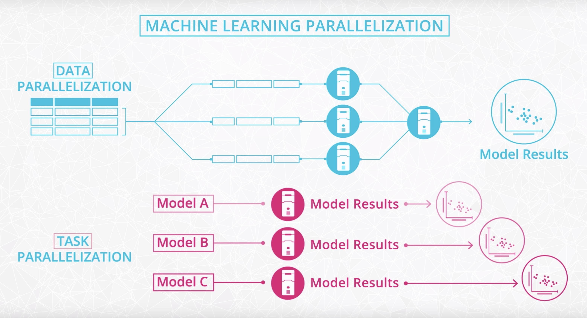
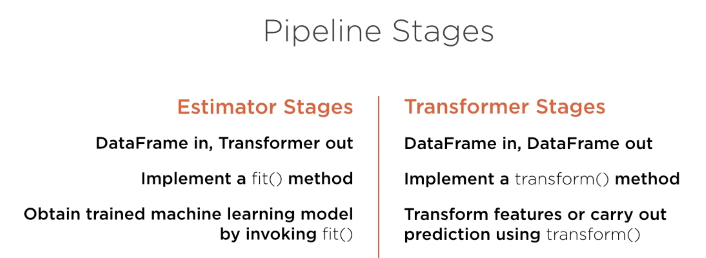
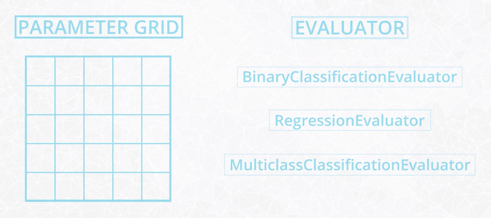

# Machine learning with Pyspark

- [Machine learning with Pyspark](#machine-learning-with-pyspark)
  - [1. Spark ML](#1-spark-ml)
  - [2. Getting started](#2-getting-started)
    - [2.1. Spark session](#21-spark-session)
    - [2.2. Read data](#22-read-data)
  - [3. Natural language processing](#3-natural-language-processing)
    - [3.1. Tokenization](#31-tokenization)
    - [3.2. Count vectorizer](#32-count-vectorizer)
    - [3.3. Inter-document frequency](#33-inter-document-frequency)
  - [4. Feature extraction](#4-feature-extraction)
    - [4.1. Assembling vectors](#41-assembling-vectors)
    - [4.2. Numerical feature scaling](#42-numerical-feature-scaling)
    - [4.3. Categorical variables encoding](#43-categorical-variables-encoding)
    - [4.4. More on feature engineering](#44-more-on-feature-engineering)
  - [5. Model training](#5-model-training)
    - [5.1. Dimensionality reduction](#51-dimensionality-reduction)
    - [5.2. Supervised learning algorithms](#52-supervised-learning-algorithms)
    - [5.3. Linear regression example](#53-linear-regression-example)
    - [5.4. Logistic regression example](#54-logistic-regression-example)
    - [5.5. Unsupervised learning algorithms](#55-unsupervised-learning-algorithms)
    - [5.6. K-means example](#56-k-means-example)
  - [6. Machine learning pipelines](#6-machine-learning-pipelines)
    - [6.1. Pipeline components](#61-pipeline-components)
    - [6.2. Example pipeline](#62-example-pipeline)
  - [7. Model selection and tuning](#7-model-selection-and-tuning)
    - [7.1. Hyperparameter tuning with Spark ML](#71-hyperparameter-tuning-with-spark-ml)
    - [7.2. Tuning example](#72-tuning-example)

## 1. Spark ML

Spark’s latest release - version 2.2.1 - supports 2 machine learning libraries `spark.ml` and `spark.mllib`. Both libraries are part of Spark's Machine Learning Library known as "MLlib".

- `Spark.mllib`, an RDD based library, has been in maintenance mode since version 2.0. It will be removed in Spark 3.0.
- `spark.ml`, the Dataframe based API, will be feature complete by version 2.3. So as time goes on `spark.ml` is becoming Spark’s standard machine learning library.
- The term "Spark ML" is sometimes used to refer to the Spark Machine Learning library, which is officially called "MLlib". For further details see the [MLlib documentation](https://spark.apache.org/docs/latest/ml-guide.html).

- 2 types of parallelization for machine learning

    

## 2. Getting started

### 2.1. Spark session

- Load dependencies

    ```python
    from pyspark.sql import SparkSession
    from pyspark import SparkFiles
    from pyspark.sql.functions import avg, col, concat,count, desc, explode, lit, min, max, split, stddev, udf
    from pyspark.sql.types import IntegerType

    from pyspark.ml import Pipeline
    from pyspark.ml.classification import LogisticRegression
    from pyspark.ml.evaluation import MulticlassClassificationEvaluator
    from pyspark.ml.feature import CountVectorizer, IDF, Normalizer, PCA, RegexTokenizer, Tokenizer, StandardScaler, StopWordsRemover, StringIndexer, VectorAssembler
    from pyspark.ml.regression import LinearRegression
    from pyspark.ml.clustering import KMeans
    from pyspark.ml.tuning import CrossValidator, ParamGridBuilder
    from pyspark.ml.feature import VectorAssembler

    import re
    ```

- Create a SparkSession

    ```python
    spark = SparkSession.builder \
        .master("local") \
        .appName("Word Count") \
        .getOrCreate()
    ```

### 2.2. Read data

- Read data

    ```python
    # From local
    path = 'Train_onetag_small.json'
    df = spark.read.json(path)
    df.head()
    ```

    ```python
    # From remote
    url ="https://s3.amazonaws.com/zepl-trilogy-test/data.csv"
    spark.sparkContext.addFile(url)
    df = spark.read.csv(SparkFiles.get("data.csv"), sep=",", header=True)
    df.show()
    ```

## 3. Natural language processing

### 3.1. Tokenization

Tokenization splits strings into separate words. Spark has a [Tokenizer](https://spark.apache.org/docs/latest/ml-features.html#tokenizer) class as well as RegexTokenizer, which allows for more control over the tokenization process.

- Split the body text into separate words

    ```python
    # RegexTokenizer
    regexTokenizer = RegexTokenizer(inputCol="Body", outputCol="words", pattern="\\W")
    df = regexTokenizer.transform(df)
    ```

    ```python
    # Tokenizer
    tokenizer = Tokenizer(inputCol="Poem", outputCol="words")
    df = tokenizer.transform(df)
    ```

- Count the number of words in each body tag

    ```python
    body_length = udf(lambda x: len(x), IntegerType())
    df = df.withColumn("BodyLength", body_length(df.words))
    ```

- Count the number of paragraphs and links in each body tag

    ```python
    number_of_paragraphs = udf(lambda x: len(re.findall("</p>", x)), IntegerType())
    number_of_links = udf(lambda x: len(re.findall("</a>", x)), IntegerType())
    df = df.withColumn("NumParagraphs", number_of_paragraphs(df.Body))
    df = df.withColumn("NumLinks", number_of_links(df.Body))
    ```

- Remove stop words

    ```python
    remover = StopWordsRemover(inputCol="words", outputCol="filtered")
    df = remover.transform(df)
    ```

### 3.2. Count vectorizer

- Find the term frequencies of the words

    ```python
    cv = CountVectorizer(inputCol="words", outputCol="TF", vocabSize=1000) #keep the 1000 most common words
    cvmodel = cv.fit(df)
    df = cvmodel.transform(df)
    ```

- Show the vocabulary

    ```python
    cvmodel.vocabulary
    ```

### 3.3. Inter-document frequency

- Find the Inter-document frequency of the words

    ```python
    idf = IDF(inputCol="TF", outputCol="TFIDF")
    idfModel = idf.fit(df)
    df = idfModel.transform(df)
    ```

## 4. Feature extraction

### 4.1. Assembling vectors

- Assembling vectors

    ```python
    # Combine the body length, number of paragraphs, and number of links columns into a vector
    assembler = VectorAssembler(inputCols=["BodyLength", "NumParagraphs", "NumLinks"], outputCol="NumFeatures")
    df = assembler.transform(df)
    ```

### 4.2. Numerical feature scaling

- Documentation

  - [Normalizer](https://spark.apache.org/docs/latest/ml-features.html#normalizer)
  - [StandardScaler](https://spark.apache.org/docs/latest/ml-features.html#standardscaler)
  - [MinMaxScaler](https://spark.apache.org/docs/latest/ml-features.html#minmaxscaler)
  - [MaxAbsScale](https://spark.apache.org/docs/latest/ml-features.html#maxabsscaler)

- Normalize the vectors

    ```python
    scaler = Normalizer(inputCol="NumFeatures", outputCol="ScaledNumFeatures")
    df = scaler.transform(df)
    ```

- Scale the vectors

    ```python
    scaler2 = StandardScaler(inputCol="NumFeatures", outputCol="ScaledNumFeatures2", withStd=True, withMean=True)
    scalerModel = scaler2.fit(df)
    df = scalerModel.transform(df)
    ```

### 4.3. Categorical variables encoding

- Documentation

  - [StringIndexer](https://spark.apache.org/docs/latest/ml-features.html#stringindexer)
  - [IndexToString](https://spark.apache.org/docs/latest/ml-features.html#indextostring)
  - [VectorIndexer](https://spark.apache.org/docs/latest/ml-features.html#vectorindexer)

- StringIndexer

    ```python
    indexer = StringIndexer(inputCol="oneTag", outputCol="label")
    df = indexer.fit(df).transform(df)
    ```

### 4.4. More on feature engineering

- Feature extractors

    Feature extractors create features from raw data. E.g., TF-IDF, Word2Vec, CountVectorizer

    - Count vectors
      - (-) Large vocabulary -> enormous feature vectors
      - (-) Unordered -> lost all context
      - (-) Semantic and word relationships lost

    - Hash vectors
      - (+) Hash words to bucket to have a fixed vocabulary size
      - Choose enough buckets so that collisions are rare

    - TF-IDF
      - Captures how often a word occurs in a document as well as across the entire corpus
      - (+) Feature vector much more tractable in size
      - (+) Frequency and relavance captured
      - (-) Context still not captured

- Feature transformers

    Feature transformers refine existing features. E.g., Tokenizer, PCA, StandardScaler, OneHotEncoder

    - Tokenizer: Splits documents into paragraphs, paragraphs into sentences, sentences into words, with simple library functions available
    - One-Hot Encoding: On categorical data
    - Standardized data: Prevents high variance data from dominating

- Feature selectors

    Feature selectors choose a subset of features. E.g., VectorSlicer, RFormula, ChiSqSelector

- Locality sensitive hashing (LSH)

    LSH reduces the dimensionality of data by grouping similar records together. E.g., NearestNeighbor Search, Similarity Join, Clustering

## 5. Model training

### 5.1. Dimensionality reduction

- PCA

    ```python
    pca = PCA(k=100, inputCol="TFIDF", outputCol="pcaTFIDF")
    model = pca.fit(df)
    df = model.transform(df)
    ```

### 5.2. Supervised learning algorithms

- Classification algorithms supported by Spark

    - Logistic regression
    - Random forests
    - Gradient-boosted trees
    - Support vector machines
    - Naive Bayes

- Regression algorithms supported by Spark

    - Linear regression
    - Generalized linear regression
    - Tree based regression

### 5.3. Linear regression example

Regression to predict the number of tags based on body lengths.

- Create the number of tags feature

    ```python
    number_of_tags = udf(lambda x: len(x.split(" ")), IntegerType())
    df = df.withColumn("NumTags", number_of_tags(df.Tags))
    ```

- Convert feature into vector

    Spark ML needs features to be of vector type

    ```python
    assembler = VectorAssembler(inputCols=["BodyLength"], outputCol="LengthFeature")
    df = assembler.transform(df)
    ```

- Select features and label from the dataset

    ```python
    data = df.select(col("NumTags").alias("label"), col("LengthFeature").alias("features"))
    ```

- Specify machine learning model

    ```python
    lr = LinearRegression(maxIter=5, regParam=0.0, fitIntercept=False, solver="normal") # does not fit the intercept in this case
    ```

- Fit the model

    ```python
    lrModel = lr.fit(data)
    ```

- Check fitting results

    ```python
    # Coefficients
    lrModel.coefficients
    ```

    ```python
    # Intercept
    lrModel.intercept
    ```

    ```python
    # Fitting statistics
    lrModelSummary = lrModel.summary
    lrModelSummary.r2
    ```

### 5.4. Logistic regression example

Multi-class classification to predict the number of tags based on TFIDF features.

- Select features and label from the dataset

    ```python
    data2 = df.select(col("label").alias("label"), col("TFIDF").alias("features"))
    ```

- Specify machine learning model

    ```python
    lr2 = LogisticRegression(maxIter=10, regParam=0.0)
    ```

- Fit the model

    ```python
    lrModel2 = lr2.fit(data2)
    ```

- Check fitting results

    ```python
    # Coefficient matrix
    lrModel2.coefficientMatrix
    ```

    ```python
    # Intercept vector
    lrModel2.interceptVector
    ```

    ```python
    # Fitting statistics
    lrModel2.summary.accuracy
    ```

### 5.5. Unsupervised learning algorithms

- Unsupervised learning algorithms supported by Spark

    - K-means
    - Latent Dirichlet allocation
    - Gaussian mixture model

### 5.6. K-means example

- Specify machine learning model

    ```python
    kmeans = KMeans().setParams(featuresCol="DescVec", predictionCol="DescGroup", k=5, seed=42)
    ```

- Fit the model

    ```python
    model = kmeans.fit(df)
    ```

- Transform the dataframe

    ```python
    df = model.transform(df)
    ```

## 6. Machine learning pipelines

### 6.1. Pipeline components

- **Transformer:** an abstraction that includes feature transformers and learned models. Technically, a Transformer implements a method `transform()`, which converts one DataFrame into another, generally by appending one or more columns.

- **Estimator:** abstracts the concept of a learning algorithm or any algorithm that fits or trains on data. Technically, an Estimator implements a method `fit()`, which accepts a DataFrame and produces a Model, which is a Transformer.

- A **Pipeline** is specified as a sequence of stages, and each stage is either a Transformer or an Estimator. These steps need to form a Directed Acyclic Graph (**DAG**), meaning that there isn't any cycle in these dependencies.

    

### 6.2. Example pipeline

- Read data

    ```python
    # Text data
    df2 = spark.read.json(stack_overflow_data)
    df2.persist()
    ```

    ```python
    # Structured data
    rawData = spark.read\
        .format('csv')\
        .option('header', 'false')\
        .option('ignoreLeadingWhiteSpace', 'true')\
        .load('../datasets/adult.csv')
    dataset = rawData.toDF('Age','WorkClass','EducationNum','Label')
    ```

- Define transformers and estimators

    ```python
    # Transform text data
    regexTokenizer = RegexTokenizer(inputCol="Body", outputCol="words", pattern="\\W")
    cv = CountVectorizer(inputCol="words", outputCol="TF", vocabSize=10000)
    idf = IDF(inputCol="TF", outputCol="features")
    indexer = StringIndexer(inputCol="oneTag", outputCol="label")
    ```

    ```python
    # Transform structured data
    # Create transformers
    indexers = [StringIndexer(
        inputCol=column, 
        outputCol=column + '_index', 
        handleInvalid='keep') for column in categoricalFeatures]
    encoders = [OneHotEncoder(
        inputCol=column + '_index', 
        outputCol= column + '_encoded') for column in categoricalFeatures]
    labelIndexer = [StringIndexer(
        inputCol='Label', outputCol='Label_index')]

    # VectorAssembler is a transformer that combines a given list of columns into a single vector column. It is useful for combining raw features and features generated by different feature transformers into a single feature vector
    assembler = VectorAssembler(inputCols=requiredFeatures, outputCol='features')
    transformedDF = assembler.transform(transformedDF)
    ```

- Specify machine learning model

    ```python
    # Modeling text data
    lr =  LogisticRegression(
        featuresCol='features',
        labelCol='label',
        maxIter=10,
        regParam=0.0,
        elasticNetParam=0
    )
    ```

    ```python
    # Modeling structured data
    rf = RandomForestClassifier(
        labelCol='Label_index',
        featuresCol='features',
        maxDepth=5
    )
    ```

- Create the pipeline

    ```python
    # Pipeline for text data
    pipeline = Pipeline(stages=[regexTokenizer, cv, idf, indexer, lr])
    ```

    ```python
    # Pipeline for structured data
    pipeline = Pipeline(
        stages=indexers + encoders + labelIndexer + [assembler, rf]
    )
    ```

- Fit the pipeline

    ```python
    # Fitting on text data
    plrModel = pipeline.fit(df2)
    ```

    ```python
    # Fitting on structured data
    model = pipeline.fit(trainingData)
    ```

- Make prediction using the pipeline

    ```python
    # Prediction on text data
    df3 = plrModel.transform(df2) # 2 new columns: probability and prediction
    ```

    ```python
    # Prediction on structured data
    predictions = model.transform(testData)
    ```

- Evaluate the prediction

    ```python
    # Evaluate prediction on text data
    df3.filter(df3.label == df3.prediction).count()
    ```

    ```python
    # Evaluate prediction on structured data
    evaluator = MulticlassClassificationEvaluator(
        labelCol='Label_index', 
        predictionCol='prediction', 
        metricName='accuracy'
    )
    accuracy = evaluator.evaluate(predictions)
    print('Test Accuracy = ', accuracy)
    ```

## 7. Model selection and tuning

### 7.1. Hyperparameter tuning with Spark ML

- Spark allows hyperparameter tuning via

    - Train-test split
    - K-fold cross validation

- Specify 2 more objects

    - Parameter grid
    - Evaluator: defines the metrics used to evaluate results on the test set

    

### 7.2. Tuning example

- Read data

    ```python
    df = spark.read.json(stack_overflow_data)
    df.persist()
    ```

- Train-test split

    ```python
    # Train, test
    train, test = df.randomSplit([0.8, 0.2], seed=42)
    ```

- Configure an ML pipeline

    ```python
    # Define transformers and estimators
    regexTokenizer = RegexTokenizer(inputCol="Body", outputCol="words", pattern="\\W")
    cv = CountVectorizer(inputCol="words", outputCol="TF", vocabSize=10000)
    idf = IDF(inputCol="TF", outputCol="features")
    indexer = StringIndexer(inputCol="oneTag", outputCol="label")
    ```

    ```python
    # Specify machine learning model
    lr =  LogisticRegression(
        featuresCol='features',
        labelCol='label',
        maxIter=10,
        regParam=0.0,
        elasticNetParam=0
    )
    ```

    ```python
    # Create the pipeline
    pipeline = Pipeline(stages=[regexTokenizer, cv, idf, indexer, lr])
    ```

- Wrap the Pipeline estimator into a CrossValidator instance

    A CrossValidator requires an **Estimator**, a set of **Estimator ParamMaps**, and an **Evaluator**.

    ```python
    # Construct a grid of parameters to search over
    paramGrid = ParamGridBuilder() \
        .addGrid(cv.vocabSize, [1000, 5000]) \
        .addGrid(lr.regParam, [0.0, 0.1]) \
        .build()
    ```

    ```python
    # Create an evaluator for classification
    evaluator = MulticlassClassificationEvaluator()

    # Create an evaluator for regression
    evaluator = RegressionEvaluator(
        labelCol='price',
        predictionCol='prediction',
        metricName='r2'
    )
    ```

    ```python
    # Cross validation
    crossval = CrossValidator(
        estimator=pipeline,
        estimatorParamMaps=paramGrid,
        evaluator=evaluator,
        numFolds=3 # use 3+ folds in practice
    )
    ```

- Fit the pipeline

    ```python
    cvModel = crossval.fit(train)
    ```

- Evaluate the training performance

    ```python
    cvModel.avgMetrics
    ```

- Evaluate the testing performance

    ```python
    results = cvModel.transform(test)
    print(results.filter(results.label == results.prediction).count())
    print(results.count())
    ```
