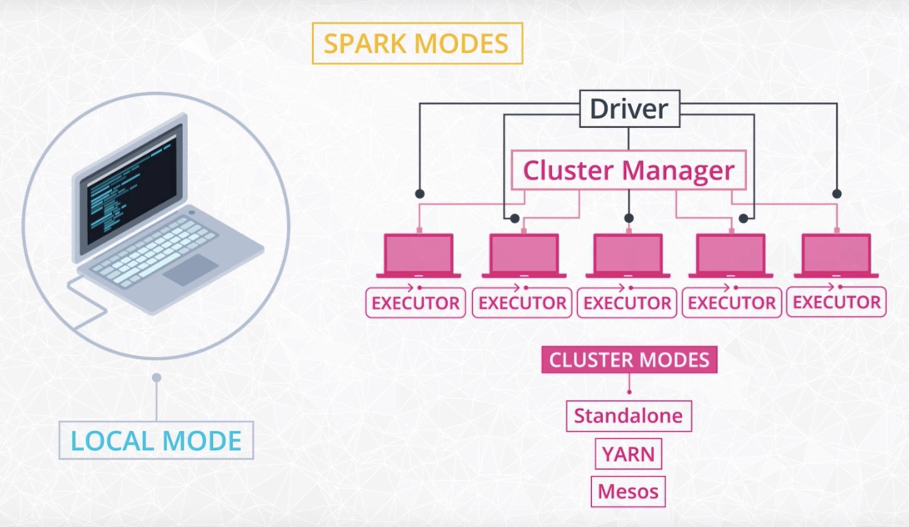
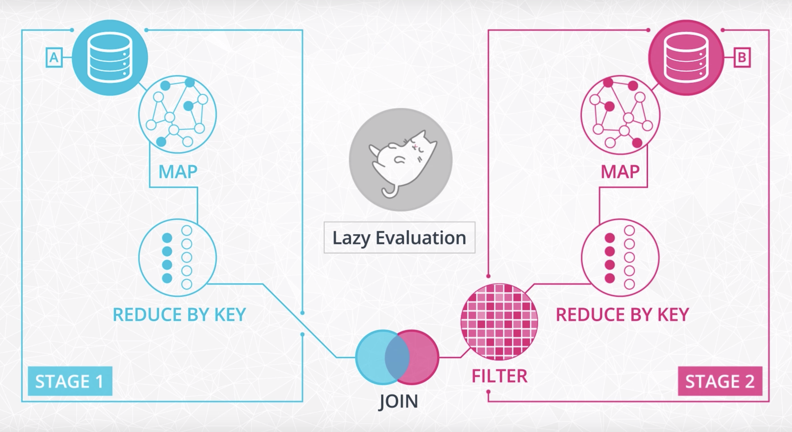
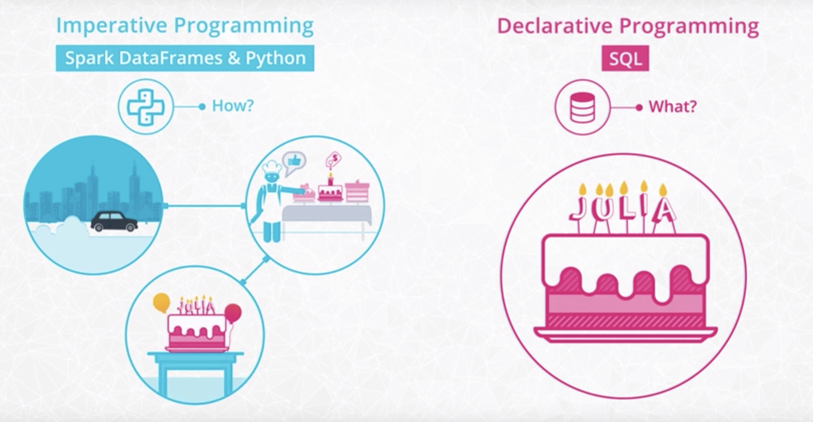
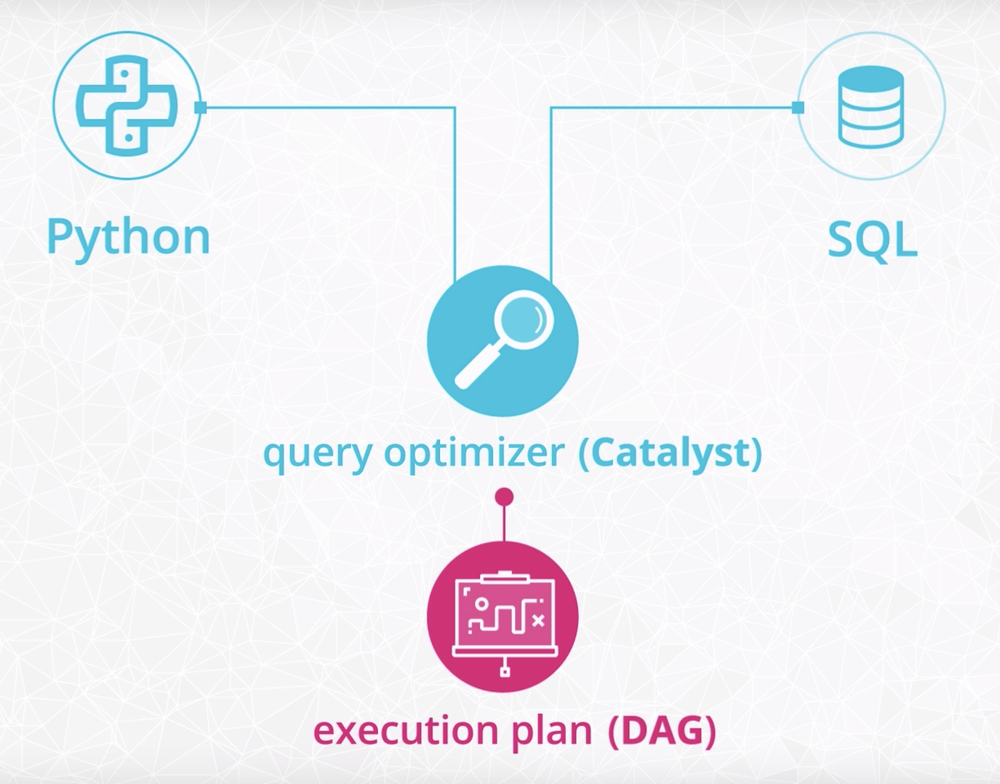
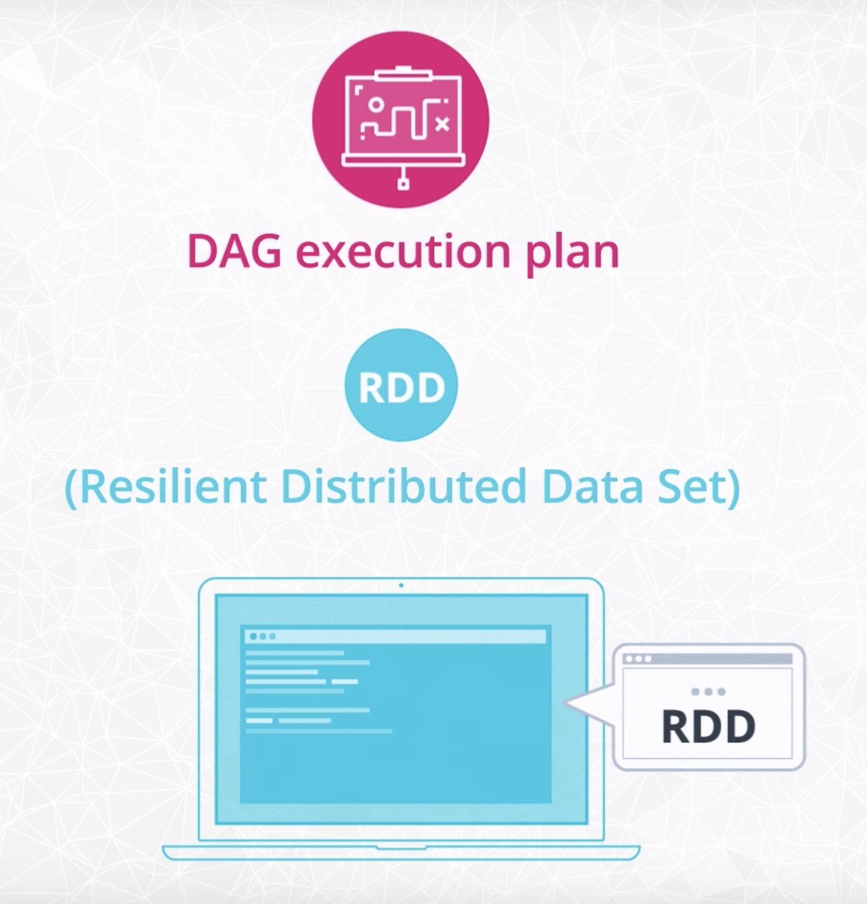

# Spark

- [Spark](#spark)
  - [1. What is Spark](#1-what-is-spark)
    - [1.1. Spark vs. Hadoop](#11-spark-vs-hadoop)
    - [1.2. Streaming data](#12-streaming-data)
    - [1.3. Four different modes to setup Spark](#13-four-different-modes-to-setup-spark)
    - [1.4. Spark use cases](#14-spark-use-cases)
    - [1.5. You don't always need Spark](#15-you-dont-always-need-spark)
    - [1.6. Spark's limitations](#16-sparks-limitations)
    - [1.7. Beyond Spark for Storing and Processing Big Data](#17-beyond-spark-for-storing-and-processing-big-data)
  - [2. Spark and functional programming](#2-spark-and-functional-programming)
    - [2.1. Functional programming](#21-functional-programming)
    - [2.2. Directed Acyclic Graph (DAG)](#22-directed-acyclic-graph-dag)
    - [2.3. Maps and lambda functions](#23-maps-and-lambda-functions)
    - [2.4. Imperative vs declarative programming](#24-imperative-vs-declarative-programming)
    - [2.5. Resilient distributed dataset (RDD)](#25-resilient-distributed-dataset-rdd)
  - [3. Data wrangling with Spark](#3-data-wrangling-with-spark)
    - [3.1. Spark session](#31-spark-session)
    - [3.2. Read and write data into Spark dataframe](#32-read-and-write-data-into-spark-dataframe)
    - [3.3. Overview of the loaded data](#33-overview-of-the-loaded-data)
    - [3.4. General functions](#34-general-functions)
    - [3.5. Aggregate functions](#35-aggregate-functions)
    - [3.6. User defined functions (UDF)](#36-user-defined-functions-udf)
    - [3.7. Window functions](#37-window-functions)
    - [3.8. Convert PySpark dataframe to pandas dataframe](#38-convert-pyspark-dataframe-to-pandas-dataframe)
    - [3.9. Date](#39-date)

## 1. What is Spark

### 1.1. Spark vs. Hadoop

- Hadoop is an older system than Spark but is still used by many companies.

- The major difference between Spark and Hadoop is how they use memory. Hadoop writes intermediate results to disk whereas Spark tries to keep data in memory whenever possible. This makes Spark faster for many use cases. Spark does in memory distributed data analysis, in order to make jobs faster.

- While Spark is great for iterative algorithms, there is not much of a performance boost over Hadoop MapReduce when doing simple counting. Migrating legacy code to Spark, especially on hundreds of nodes that are already in production, might not be worth the cost for the small performance boost.

- Spark does not include a file storage system. You can use Spark on top of HDFS but you do not have to. Spark can read in data from other sources as well such as [Amazon S3](https://aws.amazon.com/s3/).

### 1.2. Streaming data

- The use case is when you want to store and analyze data in real-time such as Facebook posts or Twitter tweets.

- Spark has a streaming library called [Spark Streaming](https://spark.apache.org/docs/latest/streaming-programming-guide.html) although it is not as popular and fast as some other streaming libraries. Other popular streaming libraries include [Storm](http://storm.apache.org/) and [Flink](https://flink.apache.org/).

### 1.3. Four different modes to setup Spark

- Local mode - prototype
- Other three modes - distributed and declares a cluster manager.
    - The **cluster manager** is a separate process that monitors the available resources, and makes sure that all machines are responsive during the job.
    - 3 different options of cluster managers
        - Standalone cluster manager
        - YARN (from Hadoop)
        - Mesos (open source from UC Berkeley's AMPLab Coordinators)

    

### 1.4. Spark use cases

Here are a few resources about different Spark use cases.

- [Data Analytics](http://spark.apache.org/sql/)
- [Machine Learning](http://spark.apache.org/mllib/)
- [Streaming](http://spark.apache.org/streaming/)
- [Graph Analytics](http://spark.apache.org/graphx/)

### 1.5. You don't always need Spark

- Spark is meant for big data sets that cannot fit on one computer. But you don't need Spark if you are working on smaller data sets.

- Sometimes, you can still use pandas on a single, local machine even if your data set is only a little bit larger than memory. E.g., `pandas` can read data in chunks.

- If the data is already stored in a relational database, you can leverage SQL to extract, filter and aggregate the data. If you would like to leverage `pandas` and SQL simultaneously, you can use libraries such as `SQLAlchemy`, which provides an abstraction layer to manipulate SQL tables with generative Python expressions.

- The most commonly used Python Machine Learning libraries are `scikit-learn` and `TensorFlow` or `PyTorch`.

### 1.6. Spark's limitations

- For streaming data, Spark is slower than native streaming tools such as [Storm](http://storm.apache.org/), [Apex](https://apex.apache.org/), and [Flink](https://flink.apache.org/).

- For machine learning, Spark has limited selection of machine learning algorithms. Currently, Spark only supports algorithms that scale linearly with the input data size. In general, deep learning is not available either, though there are many projects integrate Spark with Tensorflow and other deep learning tools.

### 1.7. Beyond Spark for Storing and Processing Big Data

- Spark is not a data storage system, and there are a number of tools besides Spark that can be used to process and analyze large datasets.

- Sometimes it makes sense to use the power and simplicity of SQL on big data. For these cases, a new class of databases, know as NoSQL and NewSQL, have been developed.

- E.g., newer database storage systems like [HBase](https://hbase.apache.org/) or [Cassandra](http://cassandra.apache.org/); distributed SQL engines like [Impala](https://impala.apache.org/) and [Presto](https://prestodb.io/). Many of these technologies use query syntax.

## 2. Spark and functional programming

Spark is written in Scala, which is a functional programming. There are application programming interfaces in Java, R, Python; e.g. Python API - `PySpark`

### 2.1. Functional programming

- **Functional programming** is the process of building software by composing **pure functions**, avoiding **shared state**, **mutable data**, and **side-effects**.

    - **Pure functions:** functions that preserve inputs and avoid side effects.

    - **Function composition:** the process of combining two or more functions in order to produce a new function or perform some computation.

    - When you avoid **shared state**, the timing and order of function calls don’t change the result of calling the function. With pure functions, given the same input, you’ll always get the same output.

    - **Mutable data:** no property can change, regardless of the level of the property in the object hierarchy

    - **Side-effects:** any application state change that is observable outside the called function other than its return value.

### 2.2. Directed Acyclic Graph (DAG)

Spark features an advanced Directed Acyclic Graph (DAG) engine supporting cyclic data flow. Each Spark job creates a DAG of task stages to be performed on the cluster.

- In lazy evaluation, data is not loaded until it is necessary.

    

- Compared to MapReduce, which creates a DAG with two predefined stages - Map and Reduce, DAGs created by Spark can contain any number of stages.

### 2.3. Maps and lambda functions

In Spark, maps take data as input and then transform that data with whatever function you put in the map. They are like directions for the data telling how each input should get to the output.

- Create a `SparkContext` object

    With the `SparkContext`, you can input a dataset and parallelize the data across a cluster. If using Spark in local mode on a single machine, technically the dataset isn't distributed yet.

    ```python
    # The findspark Python module makes it easier to install
    # Spark in local mode on your computer. This is convenient
    # for practicing Spark syntax locally.
    import findspark
    findspark.init('spark-2.3.2-bin-hadoop2.7')

    # Instantiate a SparkContext object
    import pyspark
    sc = pyspark.SparkContext(appName="maps_and_lazy_evaluation_example")

    # Read in the log_of_songs list into Spark
    log_of_songs = [
        "Despacito",
        "Nice for what",
        "No tears left to cry",
        "Despacito",
        "Havana",
        "In my feelings",
        "Nice for what",
        "despacito",
        "All the stars"
    ]

    # parallelize the log_of_songs to use with Spark
    distributed_song_log = sc.parallelize(log_of_songs)
    ```

- Convert to lowercase

    ```python
    # Define a function
    def convert_song_to_lowercase(song):
        return song.lower()

    # Apply this function using a map step
    distributed_song_log.map(convert_song_to_lowercase)
    # Due to lazy evaluation, Spark does not actually
    # execute the map step unless it needs to.

    # Can also use anonymous (lambda) functions as well
    # as built-in Python functions like string.lower().
    distributed_song_log.map(lambda x: x.lower()).collect()

    # Get Spark to actually run the map step.
    distributed_song_log.map(convert_song_to_lowercase).collect()
    # The collect() method takes the results from all
    # of the clusters and "collects" them into a single
    # list on the master node.
    ```

    Spark is not changing the original data set: Spark is merely making a copy.

### 2.4. Imperative vs declarative programming

- How to achieve the result vs. what result to get

    

### 2.5. Resilient distributed dataset (RDD)

- **RDD** is a fundamental data structure of Spark. It is an immutable distributed collection of objects. RDDs are a low-level abstraction of the data. You can think of RDDs as long lists distributed across various machines. You can still use RDDs as part of your Spark code although data frames and SQL are easier.

     <br>
    

- Additional resources

  - Explanation of the difference between RDDs and DataFrames in Databricks' [A Tale of Three Apache Spark APIs: RDDs, DataFrames, and Datasets](https://databricks.com/blog/2016/07/14/a-tale-of-three-apache-spark-apis-rdds-dataframes-and-datasets.html) blog post.

  - Link to the Spark documentation's [RDD programming guide](https://spark.apache.org/docs/latest/rdd-programming-guide.html).

## 3. Data wrangling with Spark

### 3.1. Spark session

The first component of a Spark program is a `SparkContext`, or equivalently `SparkSession` in `pyspark.sql`

- Instantiate Spark session

    ```python
    import pyspark
    from pyspark import SparkConf
    from pyspark.sql import SparkSession

    # Set or update SparkSession parameters
    spark = SparkSession \
    .builder \
    .appName("Our first Python Spark SQL example") \
    .getOrCreate()

    # Check if the change went through
    spark.sparkContext.getConf().getAll()
    ```

- Stop Spark session

    ```python
    # Stop at the end
    spark.stop()
    ```

### 3.2. Read and write data into Spark dataframe

- Read json

    ```python
    path = "data/sparkify_log_small.json" # or the data file path of remote cluster
    df = spark.read.json(path)
    ```

- Read csv

    ```python
    # From local
    path = "data/sparkify_log_small.csv"
    df = spark.read.csv(path, header=True)
    ```

    ```python
    # From remote
    from pyspark import SparkFiles
    url = "https://s3.amazonaws.com/zepl-trilogy-test/food.csv"
    spark.sparkContext.addFile(url)
    df = spark.read.csv(SparkFiles.get("food.csv"), sep=",", header=True)
    df.show()
    ```

- Read data with date format

    ```python
    from pyspark import SparkFiles
    url ="https://s3.us-east-2.amazonaws.com/trilogy-dataviz/rainfall.csv"
    spark.sparkContext.addFile(url)
    df = spark.read.csv(SparkFiles.get("rainfall.csv"), sep=",", header=True, inferSchema=True, timestampFormat="yyyy/MM/dd HH:mm:ss")
    df.show()
    ```

- Read data with defined schema

    ```python
    # Import struct fields that we can use
    from pyspark.sql.types import StructField, StringType, IntegerType, StructType

    # Next we need to create the list of struct fields
    schema = [StructField("food", StringType(), True), StructField("price", IntegerType(), True),]

    # Pass in our fields
    final = StructType(fields=schema)

    # Read our data with our new schema
    dataframe = spark.read.csv(SparkFiles.get("food.csv"), sep=",", header=True, schema=final)
    ```

- Write csv

    ```python
    out_path = "data/sparkify_log_small.csv"

    # Write as csv
    df.write.save(out_path, format="csv", header=True)
    ```

### 3.3. Overview of the loaded data

- Print table schema

    ```python
    df.printSchema()
    ```

- Describe data types

    ```python
    df.describe()
    ```

- Show the columns

    ```python
    df.columns
    ```

- Show the first few rows

    ```python
    # Show as a table
    df.show(n=1)
    ```

    ```python
    # Show as a list of rows
    df.take(5)
    ```

    ```python
    df.head()
    ```

- Describe summary statistics

    ```python
    # All columns
    df.describe().show()
    ```

    ```python
    # An individual column
    df.describe("artist").show()
    ```

- Check the number of rows

    ```python
    df.count()
    ```

### 3.4. General functions

- [Declarative]: create a view to run SQL queries

    ```python
    df.createOrReplaceTempView("df_table")
    ```

- Select column(s)

    ```python
    # Select 1 column
    df['price'] # is of type pyspark.sql.column.Column
    df.select('price') # is of type pyspark.sql.dataframe.DataFrame
    df.select('price').show() # show selected data
    ```

    ```python
    # Select multiple columns
    df.select(["age", "height_meter", "weight_kg"]).show()
    ```

    ```python
    # Collect a column as a list
    df.select("price").collect()
    ```

    ```python
    # Select with "where" condition
    df.select(['userId', 'firstName']).where(df.userID == "1046").collect()
    ```

- [Declarative]: select clause with SQL syntax

    ```python
    spark.sql(
        '''
        SELECT *
        FROM df_table
        WHERE userID == '1046'
        LIMIT 2
        '''
    ).show() # or .collect()
    ```

- Filter rows with given condition

    ```python
    # Filter using SQL syntax
    df.filter("price<20").show()
    ```

    ```python
    # Filter using Python syntax
    df.filter(df["price"] < 200).show()
    df.filter( (df["price"] < 200) | (df['points'] > 80) ).show()
    df.filter(df["country"] == "US").show()
    df.filter(df['userId'] != "")
    ```

- Drop NaN

    ```python
    df_valid = df.dropna(how='any', subset=['userId', 'sessionId'])
    df_valid.count()
    ```

- Drop duplicates

    ```python
    df.select("page").dropDuplicates().sort("page").show()
    ```

- Add new column

    ```python
    # Add a new column
    df = df.withColumn('newprice', df['price'])
    ```

    ```python
    # Add a new column with calculation
    df = df.withColumn('doubleprice',df['price']*2)
    ```

    ```python
    # Add a new column with built-in function
    df = df.withColumn("Desc", concat(col("Title"), lit(' '), col("Body")))
    ```

- Update column name

    ```python
    df.withColumnRenamed('price','newerprice').show()
    ```

- Group by

    ```python
    # Find the average precipitation per year
    averages = df.groupBy("year").avg()
    averages.orderBy("year").select("year", "avg(prcp)").show()
    ```

- Order by

    ```python
    # Order a dataframe by ascending values
    df.orderBy(df["points"].asc()).head(5)
    ```

    equivalently

    ```python
    # Order a dataframe by ascending values
    from pyspark.sql.functions import asc
    df.orderBy(asc("points")).head(5)
    ```

    equivalently

    ```python
    # Order a dataframe by ascending values
    df.sort("points").head(5)
    ```

- Filter, group by, order by

    ```python
    songs_in_hour = df.filter(df.page == "NextSong").groupby(df.hour).count().orderBy(df.hour.cast("float"))
    songs_in_hour.show()
    ```

### 3.5. Aggregate functions

Spark SQL provides built-in methods for the most common aggregations such as `count()`, `countDistinct()`, `avg()`, `max()`, `min()`, etc. in the pyspark.sql.functions module. These methods are not the same as the built-in methods in the Python Standard Library

- Take average

    ```python
    # Use avg
    from pyspark.sql.functions import avg
    df.select(avg("points")).show()
    ```

    equivalently

    ```python
    # Use agg
    df.agg({"points": "avg"}).show()
    ```

    equivalently

    ```python
    # Use agg with avg
    df.agg(avg("points")).show()
    ```

### 3.6. User defined functions (UDF)

The default type of the returned variable for UDFs is string. If we would like to return an other type we need to explicitly do so by using the different types from the pyspark.sql.types module.

- Output string

    ```python
    # Add a new column based on user-defined function
    from pyspark.sql.functions import udf
    import datetime

    get_hour = udf(lambda x: datetime.datetime.fromtimestamp(x / 1000.0). hour)
    df = df.withColumn("hour", get_hour(df.ts))
    ```

- Output integer

    ```python
    # Add a new column based on user-defined function
    from pyspark.sql.functions import udf
    from pyspark.sql.types import StringType
    from pyspark.sql.types import IntegerType

    flag_downgrade_event = udf(lambda x: 1 if x == "Submit Downgrade" else 0, IntegerType())
    df = df.withColumn("downgraded", flag_downgrade_event("page"))
    ```

- [Declarative]: UDF with SQL syntax

    ```python
    # User-defined function
    spark.udf.register("get_hour", lambda x: int(datetime.datetime.fromtimestamp(x / 1000.0).hour))

    # SQL query using the user-defined function
    songs_in_hour = spark.sql(
        '''
        SELECT get_hour(ts) AS hour, COUNT(*) as plays_per_hour
        FROM df_table
        WHERE page = "NextSong"
        GROUP BY hour
        ORDER BY cast(hour as int) ASC
        '''
    )
    ```

### 3.7. Window functions

Window functions are a way of combining the values of ranges of rows in a dataframe. When defining the window we can choose how to sort and group (with the partitionBy method) the rows and how wide of a window we'd like to use (described by rangeBetween or rowsBetween).

For further information see the [Spark SQL, DataFrames and Datasets Guide](https://spark.apache.org/docs/latest/sql-programming-guide.html) and the [Spark Python API Docs](https://spark.apache.org/docs/latest/api/python/index.html).

- Cumulative sum

    ```python
    from pyspark.sql import Window
    from pyspark.sql.functions import desc
    from pyspark.sql.functions import sum as Fsum

    # Create window function
    windowval = Window.partitionBy("userId").orderBy(desc("ts")).rangeBetween(Window.unboundedPreceding, 0)

    # Add a column of cumulative sum
    df = df.withColumn("phase", Fsum("downgraded").over(windowval))
    ```

- [Declarative]: cumulative sum with SQL syntax

    ```python
    spark.sql(
        '''
        SELECT userId, ts, home_flag
        SUM(home_flag) OVER(PARTITION BY userId ORDER BY ts DESC RANGE BETWEEN UNBOUNDED PRECEDING AND CURRENT ROW) phase
        FROM df_table
        '''
    )
    ```

### 3.8. Convert PySpark dataframe to pandas dataframe

- Convert to pandas dataframe

    ```python
    pandas_df = df.toPandas()
    pandas_df.head()
    ```

### 3.9. Date

- Show the year and month for the date column

    ```python
    # Import date time functions
    from pyspark.sql.functions import year, month

    # Show the year for the date column
    df.select(year(df["date"])).show()

    # Show the month
    df.select(month(df['Date'])).show()
    ```