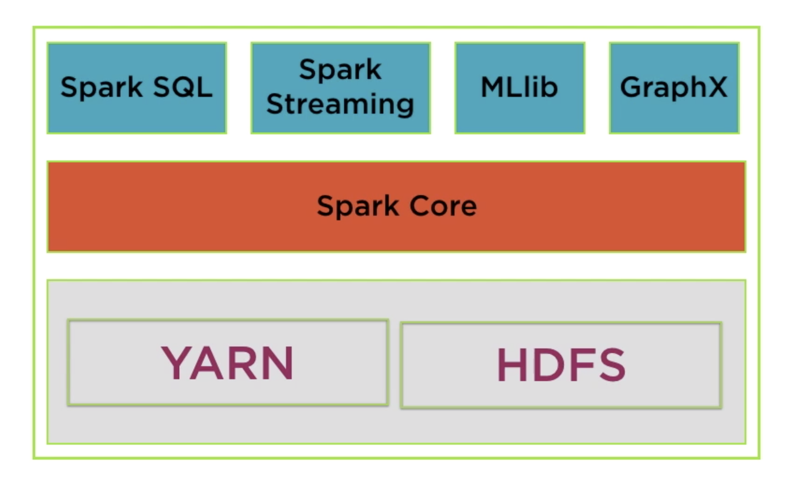
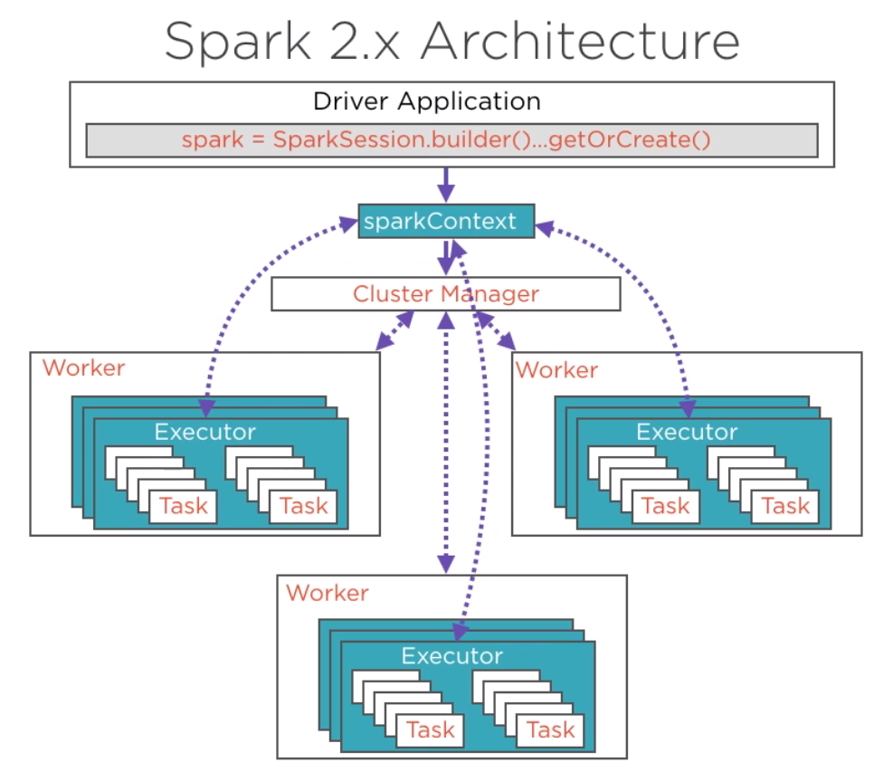
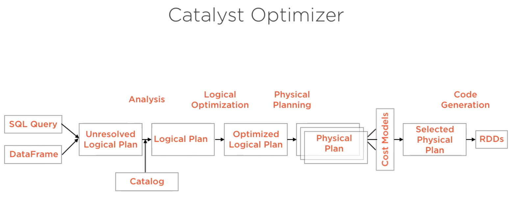
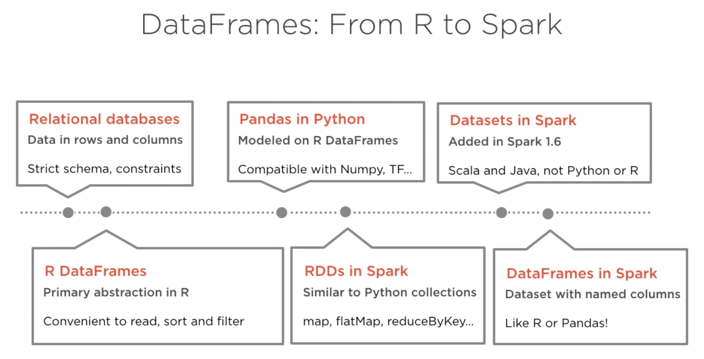

# Spark

- [Spark](#spark)
  - [1. What is Spark](#1-what-is-spark)
    - [1.1. Spark vs. Hadoop](#11-spark-vs-hadoop)
    - [1.2. Spark ecosystem](#12-spark-ecosystem)
    - [1.3. Four different modes to setup Spark](#13-four-different-modes-to-setup-spark)
    - [1.4. Spark use cases](#14-spark-use-cases)
    - [1.5. You don't always need Spark](#15-you-dont-always-need-spark)
    - [1.6. Spark's limitations](#16-sparks-limitations)
    - [1.7. Beyond Spark for Storing and Processing Big Data](#17-beyond-spark-for-storing-and-processing-big-data)
  - [2. Spark architecture and functional programming](#2-spark-architecture-and-functional-programming)
    - [2.1. Spark architecture](#21-spark-architecture)
    - [2.2. Functional programming](#22-functional-programming)
    - [2.3. Directed Acyclic Graph (DAG)](#23-directed-acyclic-graph-dag)
    - [2.4. Maps and lambda functions](#24-maps-and-lambda-functions)
    - [2.5. Imperative vs declarative programming](#25-imperative-vs-declarative-programming)
    - [2.6. Resilient distributed dataset (RDD)](#26-resilient-distributed-dataset-rdd)
    - [2.7. RDDs, Datasets, and DataFrames](#27-rdds-datasets-and-dataframes)

## 1. What is Spark

### 1.1. Spark vs. Hadoop

- Hadoop is an older system than Spark but is still used by many companies.

- The major difference between Spark and Hadoop is how they use memory. Hadoop writes intermediate results to disk whereas Spark tries to keep data in memory whenever possible. This makes Spark faster for many use cases. Spark does in memory distributed data analysis, in order to make jobs faster.

- While Spark is great for iterative algorithms, there is not much of a performance boost over Hadoop MapReduce when doing simple counting. Migrating legacy code to Spark, especially on hundreds of nodes that are already in production, might not be worth the cost for the small performance boost.

- Spark does not include a file storage system. You can use Spark on top of HDFS but you do not have to. Spark can read in data from other sources as well such as [Amazon S3](https://aws.amazon.com/s3/).

### 1.2. Spark ecosystem



- Spark core: General purpose computing engine
- YARN: Cluster manager. Alternatives: Mesos, Spark Standalone
- HDFS: Distributed storage system
- Spark libraries

  - Streaming data

    - The use case is when you want to store and analyze data in real-time such as Facebook posts or Twitter tweets.

    - Spark has a streaming library called [Spark Streaming](https://spark.apache.org/docs/latest/streaming-programming-guide.html) although it is not as popular and fast as some other streaming libraries. Other popular streaming libraries include [Storm](http://storm.apache.org/) and [Flink](https://flink.apache.org/).

### 1.3. Four different modes to setup Spark

- Local mode - prototype

    

- Other three modes - distributed and declares a cluster manager.

### 1.4. Spark use cases

Here are a few resources about different Spark use cases.

- [Data Analytics](http://spark.apache.org/sql/)
- [Machine Learning](http://spark.apache.org/mllib/)
- [Streaming](http://spark.apache.org/streaming/)
- [Graph Analytics](http://spark.apache.org/graphx/)

### 1.5. You don't always need Spark

- Spark is meant for big data sets that cannot fit on one computer. But you don't need Spark if you are working on smaller data sets.

- Sometimes, you can still use pandas on a single, local machine even if your data set is only a little bit larger than memory. E.g., `pandas` can read data in chunks.

- If the data is already stored in a relational database, you can leverage SQL to extract, filter and aggregate the data. If you would like to leverage `pandas` and SQL simultaneously, you can use libraries such as `SQLAlchemy`, which provides an abstraction layer to manipulate SQL tables with generative Python expressions.

- The most commonly used Python Machine Learning libraries are `scikit-learn` and `TensorFlow` or `PyTorch`.

### 1.6. Spark's limitations

- For streaming data, Spark is slower than native streaming tools such as [Storm](http://storm.apache.org/), [Apex](https://apex.apache.org/), and [Flink](https://flink.apache.org/).

- For machine learning, Spark has limited selection of machine learning algorithms. Currently, Spark only supports algorithms that scale linearly with the input data size. In general, deep learning is not available either, though there are many projects integrate Spark with Tensorflow and other deep learning tools.

### 1.7. Beyond Spark for Storing and Processing Big Data

- Spark is not a data storage system, and there are a number of tools besides Spark that can be used to process and analyze large datasets.

- Sometimes it makes sense to use the power and simplicity of SQL on big data. For these cases, a new class of databases, know as NoSQL and NewSQL, have been developed.

- E.g., newer database storage systems like [HBase](https://hbase.apache.org/) or [Cassandra](http://cassandra.apache.org/); distributed SQL engines like [Impala](https://impala.apache.org/) and [Presto](https://prestodb.io/). Many of these technologies use query syntax.

## 2. Spark architecture and functional programming

Spark is written in Scala, which is a functional programming. There are application programming interfaces in Java, R, Python; e.g. Python API - `PySpark`

### 2.1. Spark architecture



Spark cluster is set up in the classic master/worker configuration. The master node coordinates all processes that run on worker nodes.

- The master node runs a **Driver** program, which is a separate JVM process.

  - The driver program is responsible for **launching tasks**, which run on individual worker node. These tasks operate on subsets of RDDs (see Section 2.6. below) that are present on that node.
  - The driver program hosts **SparkContext**, which is the gateway to any Spark application.
  - The driver program run several groups of **services**
    - SparkEnv
    - DAGScheduler
    - Task Scheduler
    - SparkUI
    - ...

- The **Spark Application** is instantiated within the Driver program.

  - Uses SparkContext as entry point to start a Spark Application.
  - The Application will read data, perform a series of transformations and actions. These operations are represented in the form of a Directed Acyclic Graph (DAG) of RDDs.
  - Internally, Spark creates **Stages** (physically execution plan). Multiple logical operations may be grouped together into a single physical stage, so each Stage is split into operations on RDD partitions called **Tasks**. These tasks are made up of the actual transformations and actions specified in the code.

- **Execution** in Spark 2 has significant performance optimization

  - Performance optimization is powered by the 2nd generation **Tungsten engine**, which introduces optimizations in Spark to make the Spark engine compute much faster:
    - Eliminate virtual function calls
    - Store data in registers, not RAM/cache
    - Perform compiler optimization, e.g. loop unrolling. pipelining

  - **Catalyst optimizer** is the optimization engine that powers Spark SQL as well as DataFrame API

    

    - SQL query and DataFrame: relations to be processed
    - Unresolved logical plan: unresolved as column types and existence yet to be ascertained
    - Catalog: tracks tables in all data sources to resolve plan
    - Logical plan: output of the analysis phase
    - Optimized logical plan: optimize costs of predicate pushdown, projection pruning, null propagation, expression simplification
    - Physical plan: generate different alternative physical plans for this optimized logical plan. Here Catalyst interfaces with the Spark execution engine Tungsten
    - Cost models: apply cost models to find the best physical plan
    - Selected physical plan: generate Java bytecode to run on each machine

- **SparkContext**, hosted by the Driver program, is the entry point to Spark application

  - Interact with all the Spark constructs for distributed data processing, e.g. create RDDs, accumulators, and run jobs
  - SparkContext is wrapped in SparkSession that encapsulates SQLContext, HiveContext, etc.

- **Cluster manager**

  - The cluster manager is a separate process that monitors the available resources, and makes sure that all machines are responsive during the job.
  - 3 different options of cluster managers
    - Standalone cluster manager
    - YARN (from Hadoop)
    - Mesos (open source from UC Berkeley's AMPLab Coordinators)

- **Workers**

  - Compute nodes in cluster that are responsible for running the Spark application code
  - When SparkContext is created, each worker starts executors
    - **Executors**: distributed agents that execute tasks - the basic units of execution

### 2.2. Functional programming

- **Functional programming** is the process of building software by composing **pure functions**, avoiding **shared state**, **mutable data**, and **side-effects**.

    - **Pure functions:** functions that preserve inputs and avoid side effects.

    - **Function composition:** the process of combining two or more functions in order to produce a new function or perform some computation.

    - When you avoid **shared state**, the timing and order of function calls don’t change the result of calling the function. With pure functions, given the same input, you’ll always get the same output.

    - **Mutable data:** no property can change, regardless of the level of the property in the object hierarchy

    - **Side-effects:** any application state change that is observable outside the called function other than its return value.

### 2.3. Directed Acyclic Graph (DAG)

Spark features an advanced Directed Acyclic Graph (DAG) engine supporting cyclic data flow. Each Spark job creates a DAG of task stages to be performed on the cluster.

- In lazy evaluation, data is not loaded until it is necessary.

    

- Compared to MapReduce, which creates a DAG with two predefined stages - Map and Reduce, DAGs created by Spark can contain any number of stages.

### 2.4. Maps and lambda functions

In Spark, maps take data as input and then transform that data with whatever function you put in the map. They are like directions for the data telling how each input should get to the output.

- Create a `SparkContext` object

    With the `SparkContext`, you can input a dataset and parallelize the data across a cluster. If using Spark in local mode on a single machine, technically the dataset isn't distributed yet.

    ```python
    # The findspark Python module makes it easier to install
    # Spark in local mode on your computer. This is convenient
    # for practicing Spark syntax locally.
    import findspark
    findspark.init('spark-2.3.2-bin-hadoop2.7')

    # Instantiate a SparkContext object
    import pyspark
    sc = pyspark.SparkContext(appName="maps_and_lazy_evaluation_example")

    # Read in the log_of_songs list into Spark
    log_of_songs = [
        "Despacito",
        "Nice for what",
        "No tears left to cry",
        "Despacito",
        "Havana",
        "In my feelings",
        "Nice for what",
        "despacito",
        "All the stars"
    ]

    # parallelize the log_of_songs to use with Spark
    distributed_song_log = sc.parallelize(log_of_songs)
    ```

- Convert to lowercase

    ```python
    # Define a function
    def convert_song_to_lowercase(song):
        return song.lower()

    # Apply this function using a map step
    distributed_song_log.map(convert_song_to_lowercase)
    # Due to lazy evaluation, Spark does not actually
    # execute the map step unless it needs to.

    # Can also use anonymous (lambda) functions as well
    # as built-in Python functions like string.lower().
    distributed_song_log.map(lambda x: x.lower()).collect()

    # Get Spark to actually run the map step.
    distributed_song_log.map(convert_song_to_lowercase).collect()
    # The collect() method takes the results from all
    # of the clusters and "collects" them into a single
    # list on the master node.
    ```

    Spark is not changing the original data set: Spark is merely making a copy.

### 2.5. Imperative vs declarative programming

- How to achieve the result vs. what result to get

    

### 2.6. Resilient distributed dataset (RDD)

- **RDD** is a fundamental data structure of Spark. It is an **immutable distributed collection of objects** (rows, records). RDDs are a low-level abstraction of the data. You can think of RDDs as long lists distributed across various machines. You can still use RDDs as part of your Spark code although data frames and SQL are easier.

     <br>
    

- Characteristic of RDDs

  - **Partitioned**: Split across data nodes in a cluster

    - Processing occurs on nodes in parallel
    - Data is stored in memory for each node in the cluster

  - **Immutable**: RDDs, once created, cannot be changed. RDDs support only 2 types of operations:

    - **Transformation**: transformation into another RDD. Transformations are executed only when a result is requested
    - **Action**: Request a result

        Lazy evaluation: Spark keeps a record of the series of transformations rquested by the user. It groups the transformations in an efficient way when an Action is requested.

  - **Resilient**: Can be reconstructed even if a node crashes.

    - RDDs can be created in 2 ways:

        Reading a file <br>
        Transforming another RDD

    - Spark tracks the source and every transformation that led to the current RDD, aka., the **lineage** of RDD. The lineage allows RDDs to be (1) reconstructed when nodes crash, and (2) lazily instantiated (materialized) when accessing the results.

- Additional resources

  - Explanation of the difference between RDDs and DataFrames in Databricks' [A Tale of Three Apache Spark APIs: RDDs, DataFrames, and Datasets](https://databricks.com/blog/2016/07/14/a-tale-of-three-apache-spark-apis-rdds-dataframes-and-datasets.html) blog post.

  - Link to the Spark documentation's [RDD programming guide](https://spark.apache.org/docs/latest/rdd-programming-guide.html).

### 2.7. RDDs, Datasets, and DataFrames

- DataFrame

    

  - Built on top of RDDs
  - Each row represents 1 observation

- Comparison

    | RDDs | Datasets | DataFrames |
    | --- | --- | --- |
    | Primary abstraction since initial version | Added to Spark in 1.6 | Added to Spark in 1.3 |
    | Immutable and distributed | Immutable and distributed | Immutable and distributed |
    | Strong typing, use of lambda | Supports strong typing, lambda |  |
    | No optimized execution | Leverage optimizers in recent versions |  |
    | Available in all languages | Present in Scala and Java, not Python or R | Available in all languages |
    |  | No named columns | Named columns, like Pandas or R |
    |  | Extension of DataFrames: type-safe, OOP interface | Conceptually equal to a table in a relational database management system (RDBMS) |
    |  | Compile-time type safety | No type safety at compile time |
    |  | Datasets of the `Row()` object in Scala/Java often called DataFrames | Equivalent to `Dataset<Row>` in Java or `Dataset[Row]` in Scala |

    Starting from Spark 2.0, APIs for Datasets and DataFrames have merged
