# What's New in Apache Spark 3.0

Notes taken from Spark+AI Summit training by Doug Bateman

- [What's New in Apache Spark 3.0](#whats-new-in-apache-spark-30)
  - [1. Performance](#1-performance)
    - [1.1. Adaptive Query Execution](#11-adaptive-query-execution)
    - [1.2. Dynamic Partition Pruning](#12-dynamic-partition-pruning)
    - [1.3. Join Optimization Hints](#13-join-optimization-hints)
  - [2. Usability](#2-usability)
    - [2.1. Spark SQL: Explain Formatted](#21-spark-sql-explain-formatted)
    - [2.2. Structured Streaming UI](#22-structured-streaming-ui)
    - [2.3. Pandas UDFs (a.k.a. Vectorized UDFs)](#23-pandas-udfs-aka-vectorized-udfs)
    - [2.4. Data Source API V2](#24-data-source-api-v2)
  - [3. Compatibility Considerations](#3-compatibility-considerations)
    - [3.1. Spark 3.0 Builds](#31-spark-30-builds)
    - [3.2. Spark Core](#32-spark-core)
    - [3.3. Spark SQL, Datasets, and DataFrames](#33-spark-sql-datasets-and-dataframes)
    - [3.4. SparkML](#34-sparkml)
    - [3.5. PySpark](#35-pyspark)
    - [3.6. SparkR](#36-sparkr)
  - [4. Spark Ecosystem](#4-spark-ecosystem)
    - [4.1. Project Hydrogen](#41-project-hydrogen)
    - [4.2. Delta](#42-delta)
    - [4.3. MLfLow](#43-mlflow)

## 1. Performance

3.0 comes with performance improvements to make Spark faster, cheaper, and more flexible

### 1.1. Adaptive Query Execution

Re-optimizes queries based on the most up-to-date runtime statistics.

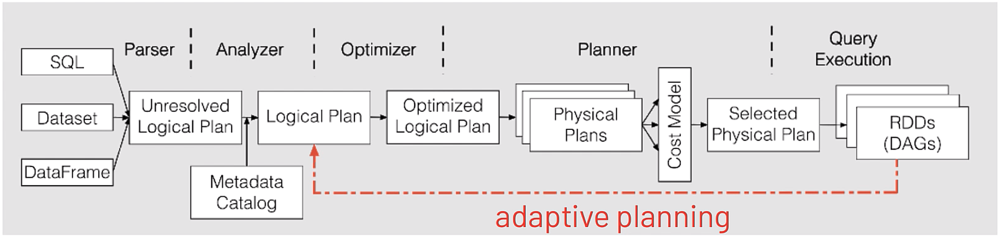

- History
  - Spark 1.x, Rule (Catalyst rule-based optimizer)
  - Spark 2.x, Rule + Cost (file sizes and data statistics stored in Hive meta store)
  - Spark 3.0, Rule + Cost + Runtime (runtime statistics, looking at size of the data as it's being processed, so that queries can be rewritten and optimized based on the size of the data at runtime)

- Benefit
  
  Based on statistics of the finished plan nodes, re-optimize the execution plan of the remaining queries

  - Dynamically switch join strategies: E.g., convert short merge join to broadcast hash join at run time
  - Dynamically coalesce shuffle partitions: Automatically coalesce partitions if needed after each query stage
  - Dynamically optimize skew joins: Dynamically discover in the process of the shuffle which particular partition file is to large, then rewrite query plan for downstream stage to split large partition into multiple partitions, thereby reducing task size

- Configuration settings

  - Set `spark.sql.adaptive.enabled` to true

### 1.2. Dynamic Partition Pruning

Optimizes query by reading only the data you need.

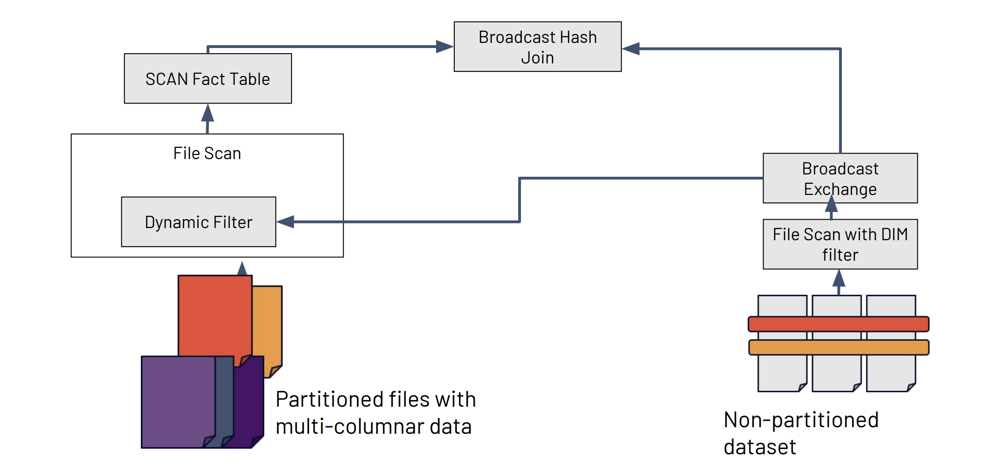

- Benefit
  
  Optimizes queries by pruning partitions read from a (large) fact table by identifying the partitions that result from filtering (small) dimension tables

- Configuration settings

  - DPP is enabled by default

### 1.3. Join Optimization Hints

Join hints enable the user to override the optimizer to select their own
join strategies. Spark 3.0 extends the existing broadcast join hint by implementing other join strategy hints: Shuffle hash, Sort-merge, and Cartesian Product

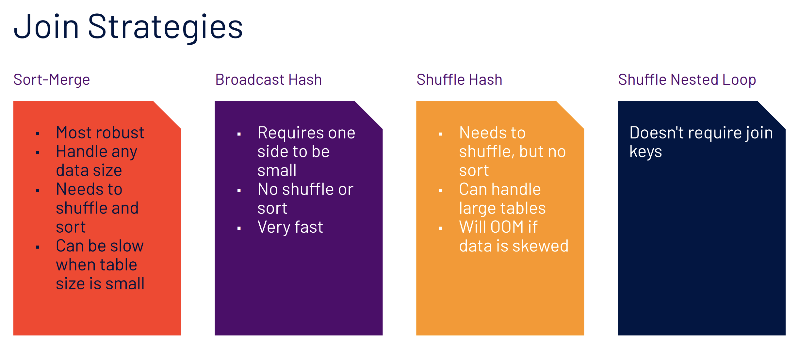

## 2. Usability

Spark is easier to use

### 2.1. Spark SQL: Explain Formatted

Explain formatted

- Separates basic operating tree from operation details
- Subqueries are listed separately

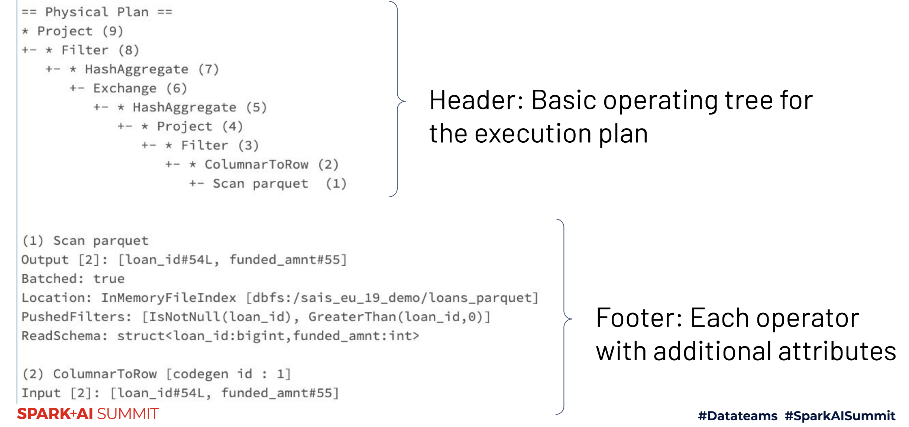

### 2.2. Structured Streaming UI

Get real-time metrics via the structured streaming tab including

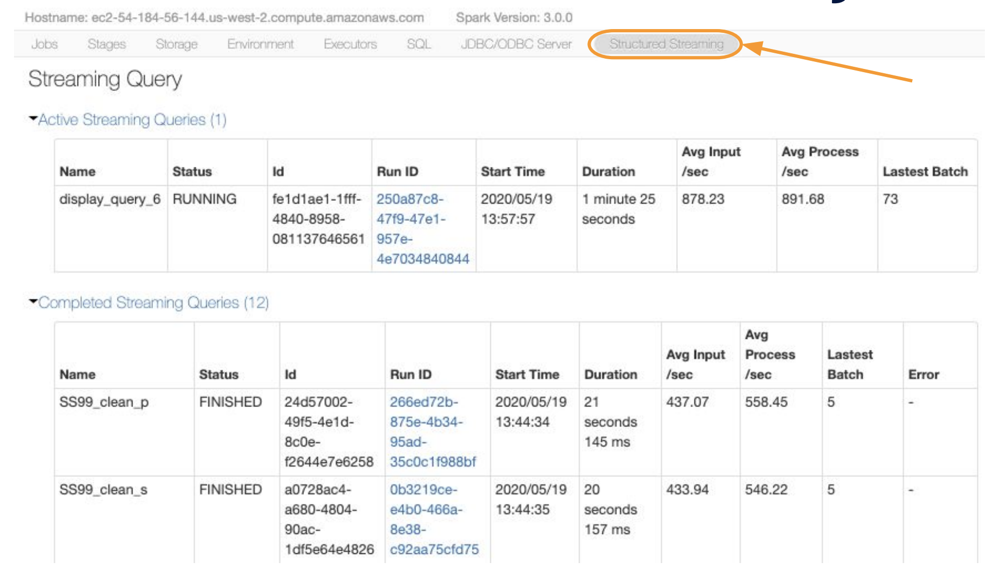

### 2.3. Pandas UDFs (a.k.a. Vectorized UDFs)

Python Type Hints

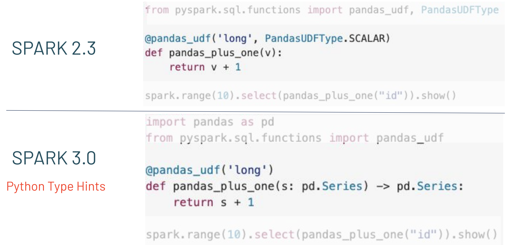

### 2.4. Data Source API V2

Add more information about the underlying data source to allow for significant performance gain in queries.

- Benefit

  - Enables external data-source plugin for catalog and table
  management
  - Supports pushdown and pruning for supported file formats like ORC, Kafka, Cassandra, Delta Lake, Apache Iceberg
  - Provides unified APIs for streaming and batch processing of data sources
  - Catalog plug in: Users can register customized catalogs and use Spark to access/manipulate table
metadata directly

## 3. Compatibility Considerations

View notable compatibility/behavior changes

### 3.1. Spark 3.0 Builds

- Only builds with Scala 2.12
- Deprecates Python 2 (already EOL)
- Can build with various Hadoop/Hive versions
  - Hadoop 2.7 + Hive 1.2
  - Hadoop 2.7 + Hive 2.3 (supports Java 11)  [Default]
  - Hadoop 3.2 + Hive 2.3 (supports Java 11)
- Supports the following Hive metastore versions:
  - "0.12", "0.13", "0.14", "1.0", "1.1", "1.2", "2.0", "2.1", "2.2", "2.3", "3.0", "3.1"

### 3.2. Spark Core

- Built with Scala 2.12 (should be backwards compatible)
- Event log files will be written as UTF-8 encoding, NOT the default charset of the driver JVM process
- SparkConf will reject bogus entries
  - Code will fail if developers set config keys to invalid values
- spark.driver.allowMultipleContexts is removed. Use sub spark sessions that share a single context instead.

### 3.3. Spark SQL, Datasets, and DataFrames

- For many changes, you do have the option to restore behavior before
Spark 3.0 using spark.sql.legacy._______
- Type coercions are performed per ANSI SQL standards when inserting new values into a column. Unreasonable conversions will fail and throw an exception
- Argument order of the trim function has been reversed: TRIM(trimStr, str) → TRIM(str, trimStr)

### 3.4. SparkML

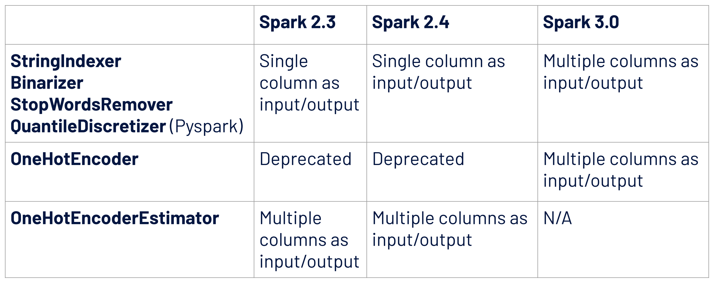

### 3.5. PySpark

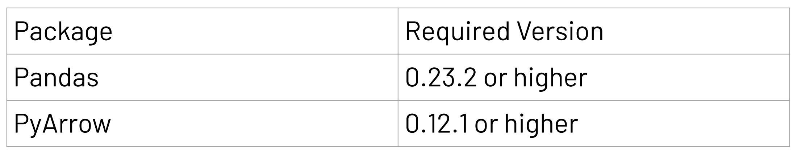

### 3.6. SparkR

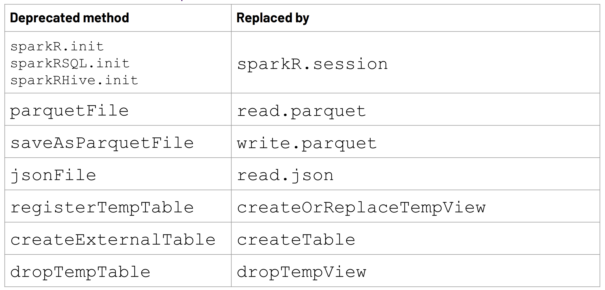

## 4. Spark Ecosystem

Learn about developments in Delta , MLFlow,
and Project Hydrogen

### 4.1. Project Hydrogen

The goal of Project Hydrogen is to enable first-class support for all distributed ML frameworks

- Barrier Execution Mode
  - Since 2.4, gang scheduling has been implemented on top of the MapReduce execution model. Gang scheduling enables barrier execution mode
  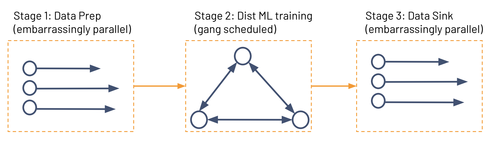
- Accelerator Aware Scheduling
  - Used to accelerate special workloads like deep learning and signal processing
  - Supports Standalone, YARN, and Kubernetes
  - Supports GPUs
  - Required resources are specified by configuration, so works only at the application level
  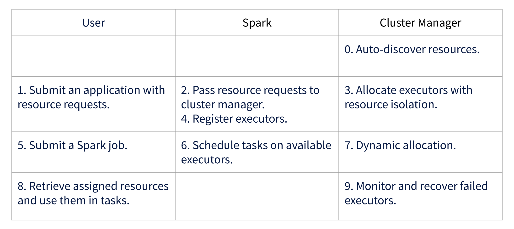

### 4.2. Delta

Delta Lake is an open-source storage layer that brings ACID transactins to Apache Spark and big data workloads.

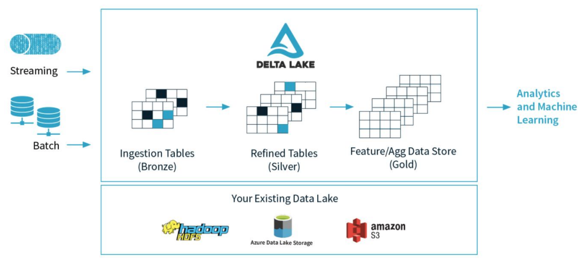

Delta Lake is a file format that improves upon Parque format, adding ACID transactions to get the scalability throughput benefits of Parquet with updates and transactional benefits for modern data lake applications.

- Challenges with data lakes
  - Hard to append data. Adding newly arrived data leads to incorrect reads.
  - Modification of existing data difficult. GDPR/CCPA requires making fine grained changes to existing data lake. Very costly with Spark.
  - Jobs failing mid way. Half of the data appears in the data lake, the rest missing.
  - Real-time operations hard – mixing streaming and batch leads to inconsistency.
  - Costly to keep historical versions of the data – regulated environments require reproducibility, auditing, and governance.
  - Difficult to handle large metadata – for large data lakes the metadata itself becomes difficult to manage.
  - "Too many files” problems. Data lakes not great at handling millions of small files.
  - Fine grained access control difficult. Enforcing enterprise-wide role based access control on data difficult.
  - Hard to get great performance – partitioning the data for performance error-prone and difficult to change.
  - Data quality issues. Hard to ensure that all the data is correct and has the right quality.

- Delta Lake addresses challenges of traditional Data Lakes
  - Adds reliability, quality, performance to Data Lakes
  - Brings the best of data warehousing and data lakes
  - Based on open source and open format (Parquet)
  - Fully backwards compatible with Apache Spark
  
  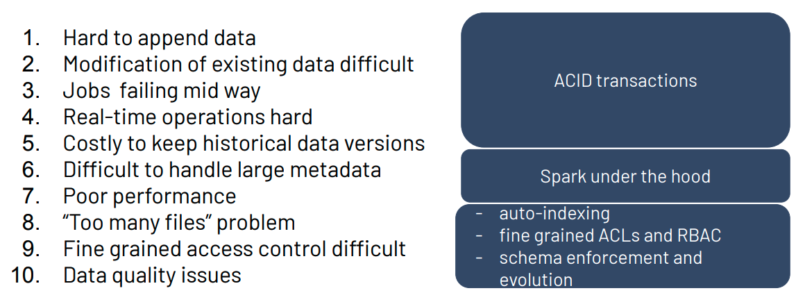

### 4.3. MLfLow

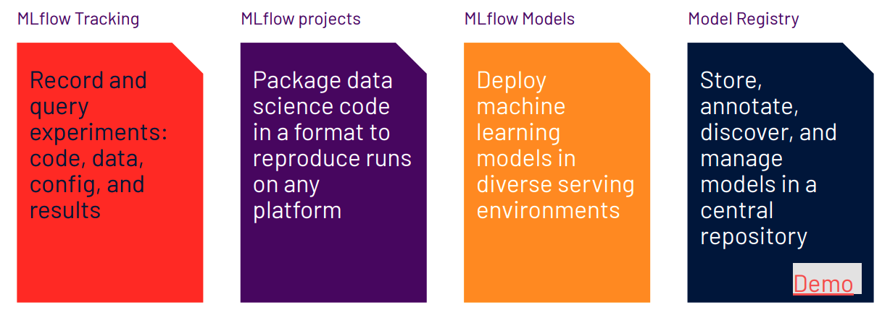

- MLflow model registry benefits
  - One Collaborative Hub: The Model Registry provides a central hub for making models discoverable, improving collaboration and knowledge sharing across the organization.
  - Manage the entire Model Lifecycle (MLOps): The Model Registry provides lifecycle management for models from experimentation to deployment, improving reliability and robustness of the model deployment process.
  - Visibility and Governance: The Model Registry provides full visibility into the deployment stage of all models, who requested and approved changes, allowing for full governance and auditability.
