# Apache Spark Tuning and Best Practices

Notes taken from [Spark+AI Summit training by Ken Jones](https://files.training.databricks.com/events/summit-2020-06/tuning/index.html)

- [Apache Spark Tuning and Best Practices](#apache-spark-tuning-and-best-practices)
  - [1. The Spark UI](#1-the-spark-ui)
    - [1.1. Jobs](#11-jobs)
    - [1.2. Stages](#12-stages)
    - [1.3. Storage](#13-storage)
    - [1.4. Environment](#14-environment)
    - [1.5. Executors](#15-executors)
    - [1.6. SQL](#16-sql)
  - [2. Common Problems (The 4 Ss)](#2-common-problems-the-4-ss)
    - [2.1. The largest tuning opportunity](#21-the-largest-tuning-opportunity)
    - [2.2. Spill](#22-spill)
    - [2.3. Skew](#23-skew)
    - [2.4. Shuffle](#24-shuffle)
    - [2.5. Small files](#25-small-files)
  - [3. Key Data Ingestion Concepts](#3-key-data-ingestion-concepts)
    - [3.1. Predicate Pushdown](#31-predicate-pushdown)
    - [3.2. Disk Partitioning](#32-disk-partitioning)
    - [3.3. Z-Order Clustering](#33-z-order-clustering)
    - [3.4. Bucketing](#34-bucketing)
    - [3.5. Combined strategies](#35-combined-strategies)
  - [4. New Strategies for Spark 3.0](#4-new-strategies-for-spark-30)

## 1. The Spark UI

Introduction to different tabs of Spark UI, and identify some key points to pay attention to.

### 1.1. Jobs

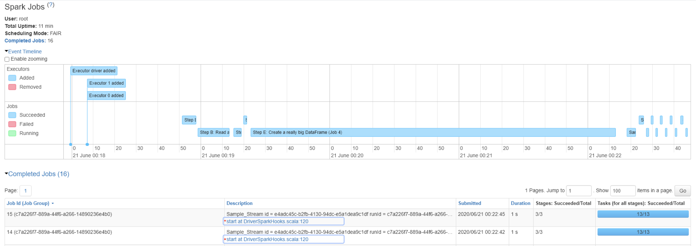

- Duration: can sort the job by duration and focus on the job that takes the longest to run

- Description: what Spark action triggered the execution of particular Job Id

  - Directed Acyclic Graph (DAG) Visualization
  
    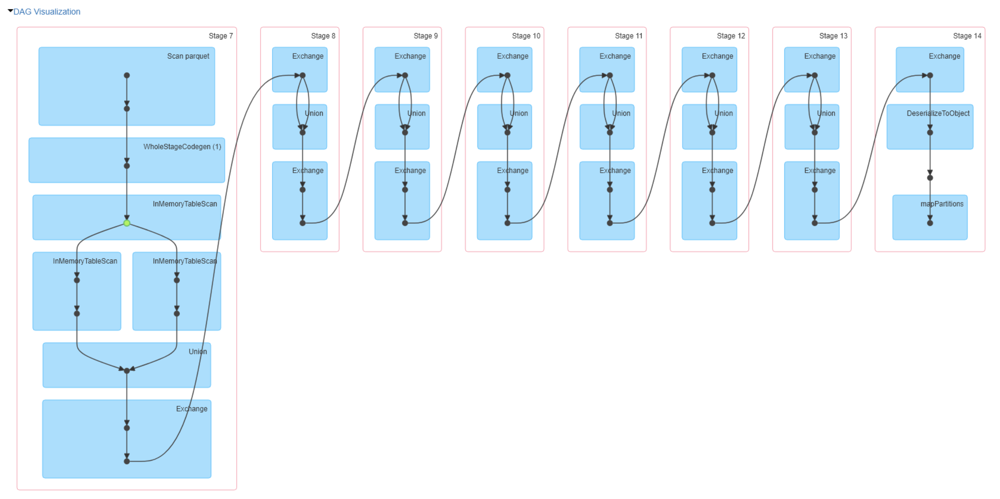

    DAG Visualization represents low level RDD manipulation that is taking place. It direcrtly reflects the RDD code written in Spark 1.x. However, the Dataframe API is a higher level API built on top of RDD. Catalyst Optimizer optimizes and translates our queries to actual tasks to dispatch to executors. Parsing query into abstract syntax tree representation, Catalyst Optimizer optimizes queries to figure out an Optimized Plan, generates the Physical Plan, and translates the Physical Plan into Java byte code that is the actual task definition that is sent to executor. The actual tasks generated are low level RDD manipulations. So even though we are writing with dataframe API, at run time it's RDD interactions. So DAG Visualization can be ignored.

### 1.2. Stages

- Completed stages

  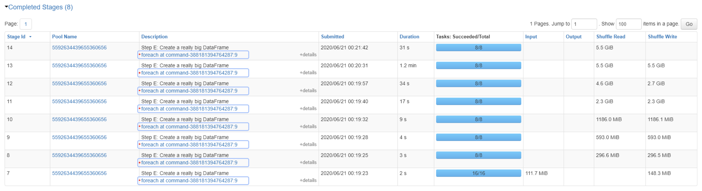

  A list of stages executed as part of each specific job. The number of stages of a job is determined by the number of times Spark needs to shuffle the data to get result we want.

  - Input: Bytes read in from storage
  - Output: Bytes written to storage
  - Shuffle Read: Bytes and records read from a shuffle in a previous stage
  - Shuffle Write: Bytes and records written for a shuffle in a future stage

- Stage details: one of the most useful pages of Spark UI to find out what's going on and detect potential performance problems

  - Stage summary

    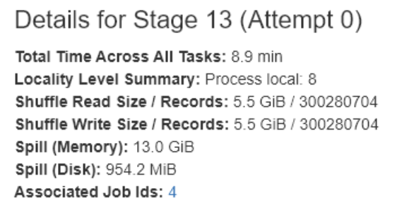

    **Spill** occurs when Spark is processing data. Executor core processes a partition of data while accumulating the results in memory. If the results cannot fit in memory and there are still more data to process, Spark spills live data to disk to be able to keep processing the remaining data. By spilling to disk, we are adding disk IO to the processing of this task. Because disk IO is much slower than CPU execution time, performance plummets whenever we start getting spill in our application.

    - Spill (Memory): the amount of data in memory that we had to spill
    - Spill (Disk): how much disk space to consume when written to disk. Compacted for writing to disk, so it's much smaller than Spill (Memory)

  - Should investigate spill in Spark application
    - Possibly caused by partition size of dataframe too large to fit in executor
    - Can repartition dataframe to distribute data to more smaller size partitions
    - Can increase memory allocation of executor

  - Event timeline

    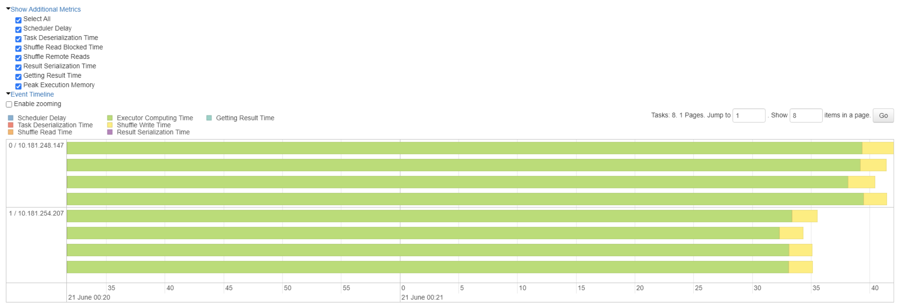

    - Shows how much time each task is spending in the various stages (scheduling vs serialization vs execution etc.)
    - Green color represents **executor computing time**, which is the time that executor core is actually processing data. All other colors are overhead activities

  - Should investigate event timeline

    - We want to spend as much time in execution as possible.
      - If there is significant overhead time compared to task time, partitions sizes are likely too small. Can repartition into fewer larger partitions
    - We want all tasks end at roughly the same time.
      - For Spark 2.x, all of the tasks of one stage must complete before Spark begins execution of the next task.
      - If there is skew in partition sizes, can repartition dataframe before starting this job to more evenly distribute the records across partitions

  - Summary metrics of tasks

    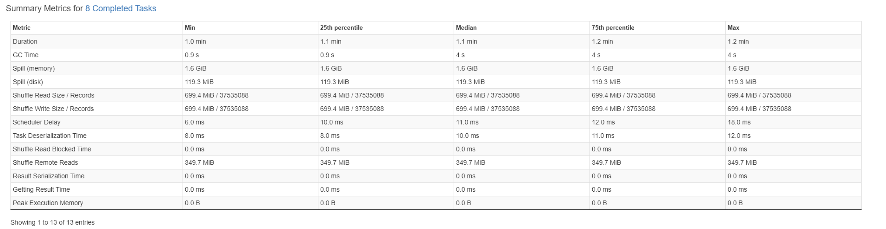

    - Duration: executor computing time
    - Compare median duration with median of the rest of the overhead
    - **Gabage Collection**: a feature of Java Virtual Machine. The executors are Java processes that are subject to JVM memory management. When memory is filled, garbage collection is triggered to take out all the dead objects

  - Should investigate excessive garbage collection
    - Caching consumes memory that can be otherwised used for processing data, and also generating garbage. The way that data are represented in cache is different from the way that they are represented when processing task. When caching, Spark has to do a conversion, which has side effect of generating garbage. So the more is cached, the more garbage is generated, and the more time will spent during garbage collection.
    - UDF - custom column-level transformation. Spark is not representing the records as a collection of Java objects. Since Spark 2.0, the way that a record is represented is in efficient binary format. So the records being processed during the task are represented as byte arrays in memory. But UDF does not know how to access data from byte array, so any time we use a UDF when processing a dataframe, for each record Spark has to deserialize into a collection of Java object, give them to UDF to process, and then serialize back to (Spark's native) binary representation for each record. Once the record is processed, the Java object is not needed anymore, so UDF generates a lot of garbage. Should avoid using UDF as much as possible. UDF should be the last resort.

### 1.3. Storage

- A list of dataframes (backed by RDDs) being cached

  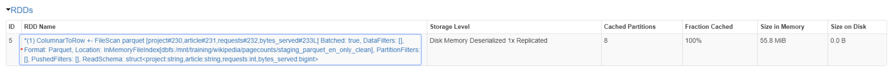

  - Partition-level cache information

    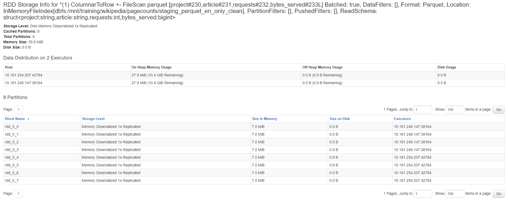

### 1.4. Environment

- Runtime information

  E.g. version of Java and Scala

- Classpath Entries

  Can be used to find and eliminate library conflicts

### 1.5. Executors

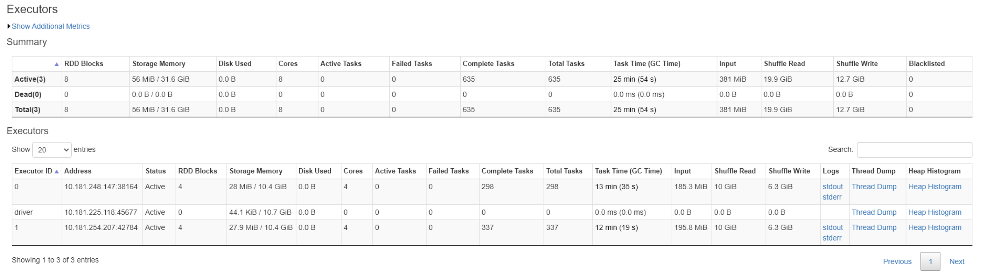

- Summary
  - Active: number of active nodes including the Driver node

### 1.6. SQL

A list of SQL queries that have been evaluated on the cluster

- Completed queries

  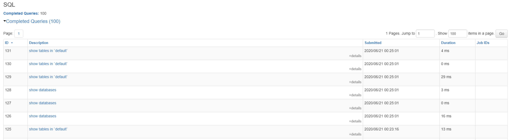

  Lots of queries don't have associated jobs, because they were invoked by the Driver. Many of them are Driver talking to e.g. metastore

- SQl details

  - Query plan visualization

    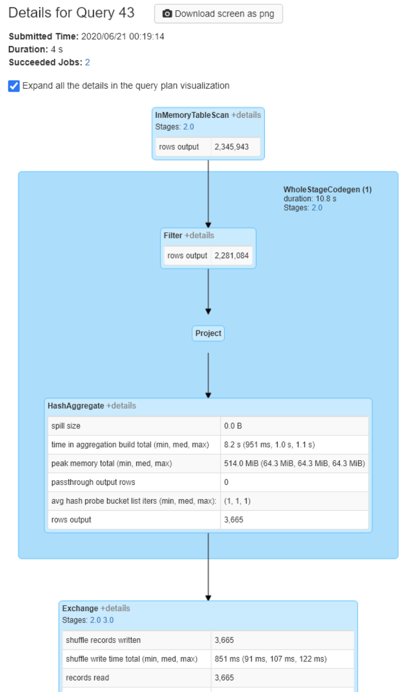

    Another place that indicates if we have spill as part of the execution of a stage

  - Details of query plans

    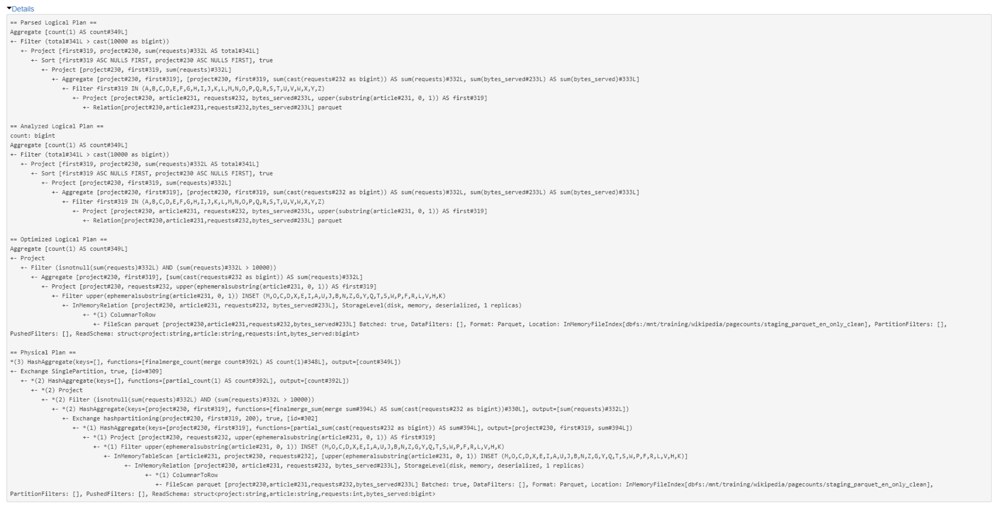

    Presented in the form of lineage

## 2. Common Problems (The 4 Ss)

### 2.1. The largest tuning opportunity

Reduce time spent reading data. Planning for how data is ingested often mitigates a lots of other problems. For example,

- Skew can be mitigated by salting a dataset on disk
- Shuffles can be mitigated by denormalizing a dataset or by using AQE & DPP
- And many other problems can be mitigated with properly sized part files, on-disk partitioning and a mix of other techniques

### 2.2. Spill

The writing of temp files to disk due to a lack of memory

- Problem

  Spill is the term used to refer to the act of moving an RDD from RAM to disk, and later back into RAM again. This occurs when a given partition is simply too large to fit into RAM. In this case, Spark is forced into potentially expensive disk reads and writes to free up local RAM. All of this just to avoid the dreaded OOM Exception

- There are a number of ways to induce this problem

  - Partition size too large. Set `spark.sql.files.maxPartitionBytes` to high (default is 128 MB)
  - The `explode()` of even a small array
  - The `join()` or `crossJoin()` of two tables. Join involves shuffle so that records with same join key are in the same executor. If there is skew in the distribution of join key, there can be a lot of records being shuffled to a big partition.
  - Aggregating results by a skewed feature

- Mitigation

  - Increase the memory allocation of the executor
  - Should repartition dataframe to reduce partition size

### 2.3. Skew

An imbalance in the size of partitions

- Problem

  Data is typically read in as 128 MB partitions and evenly distributed. As the data is transformed (e.g. aggregated), it’s possible to have significantly more records in one partition than another. A small amount of skew is ignorable, but large skews can result in spill or worse, hard to diagnose OOMs errors.

- Caused by

  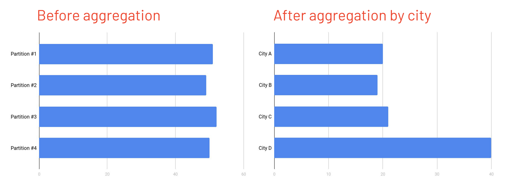

  - e.g. before vs. after aggregation
  - e.g. after skew join

- Mitigation

  - Adaptive Query Execution (AQE) of Spark 3.0 automatically detects skew and deals with it
  - Salt the skewed column with a random number creating better distribution across each partition at the cost of extra processing. Look up Spark Salted Join for more details

### 2.4. Shuffle

The exchange of data between executors between stages. Involves disk IO (reading writing of shuffle files) and network IO (data transmission between executors).

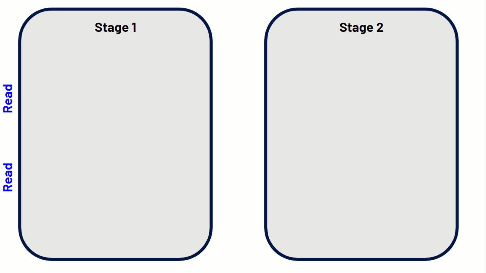 ([animation](https://files.training.databricks.com/images/animations/spark-shuffle.gif))

- Caused by

  Shuffling is a side effect of wide transformations, e.g., `join()`, `distinct()`, `groupBy()`, `orderBy()`. And technically some actions, e.g. `count()`

- Mitigation

  - Shuffles are often a necessary evil. Many shuffle operations are actually quite fast.
  - Focus on the more expensive operations instead. Targeting skew, spill, tiny files, etc. often yield better payoffs.

### 2.5. Small files

A set of problems indicative of high overhead due to tiny files

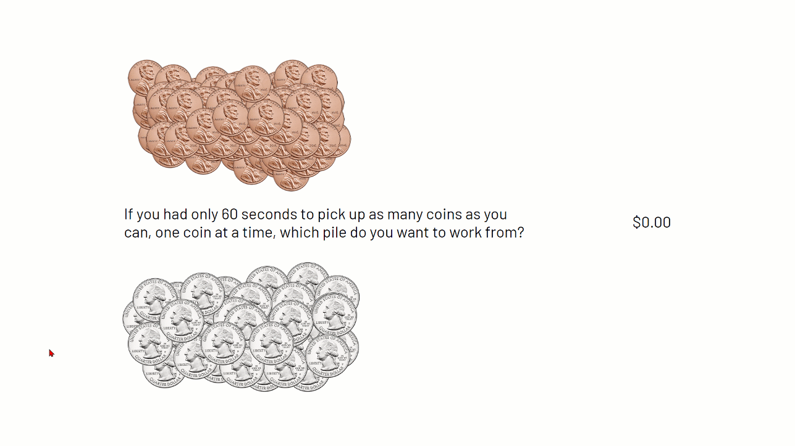 ([animation](https://files.training.databricks.com/images/animations/tiny-files-high-res.gif))

- **Storage**

  - Problem

    - Opening a file is a rather expensive operation

  - Caused by

    - E.g., Streaming

  - Mitigation

    - Ideal part-file size is between 128MB (Hadoop block size) and 1GB (Cloud storage)
      - Smaller than 128MB -> tiny files problem
      - Larger than 1GB -> problems associated with creating these large Spark partitions
      - 1 Spark partition == 1 part-file upon write

    - Good file formats are Parquet, ORC, Delta

    - Manually compact tiny files

      

    - Automatically compact tiny files

      Delta storage format, open source since last year

      - ACID transaction guaranteed
      - Provides snapshot isolation: consumer reading data sees consistent snapshot when another is writing
      - Good for compaction type of workload

- **Directory scanning**

  - Problem

    - Overly partitioned data on disk causes performance problem

      For every disk-partition there is another directory to scan. Multiply that number of directories by N secondary & M tertiary partitions. These have to be scanned by the driver one directory at a time

  - Mitigation

    - Only use storage based partitioning for low cardinality column

- **Reading and merging schemas**

  - Problem

    - Inferring json and csv schemas requires a full read of the file to determine data types, even if you only want a subset of the data
    - Reading Parquet files requires a one-time read of the schema
    - If schema evolution has been used for Parquet, needs fetch and merge schema of each part file

  - Mitigation

    - Provide the schema every time
      - Especially for JSON and CSV
      - Applicable to Parquet and other formats when doing schema evolution
    - Use meta store to track table schema
      - Expose data in tables registered in meta stores, which allows to treat data in storage as though they were tables in a relational database. Meta store stores metadata about what is the virtual table name, where is the data stored, and what's the schema of the data
    - Use Delta that maintains the schema of datasets in storage efficiently

## 3. Key Data Ingestion Concepts

### 3.1. Predicate Pushdown

- Predicate pushdown to reduce data ingestion

  - Predicate pushdown is applying a condition to records read in by a Spark job to be selective when reading.
    - E.g. `filter()`, `where()`, `select()`, `drop()` transformations are pushed down to the underlying data store.  
    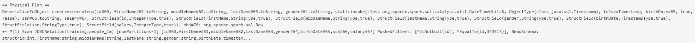
  - Reducing Data Ingestion is one of the best strategies for mitigating performance problems in Apache Spark. The Predicate Pushdown is the basis for most of the reduction strategies

- Predicate pushdown should be applied as early as possible

  - If applied early early enough, records can be excluded and never pulled into the executor
  - If applied late, all records are pulled into the executor after which non-matching records are discarded
  - One common mistake is introducing transformations (analysis barriers) between the initial read and filtering transformation
  - Avoid over-caching to leverage predicate pushdown

- Column selection can also be pushed down

  - With a database via **SELECT** statement
  - For files with columnar file format using either truncated schema or select/drop transformations
    - Columnar File formats store data by column: Delta, Parquet, and ORC
    - Row-Based File formats store data by row: CSV, TSV, JSON, and AVRO
    

### 3.2. Disk Partitioning

- Disk-Partitioning applies to partitions of data on disk

  - Disk-Partitioning uses a special directory structure to aggregate like records together
  - E.g., file paths for dataset not partitioned  
    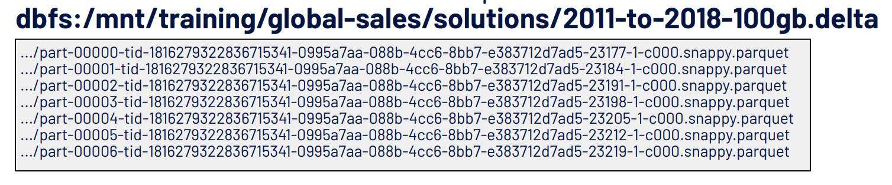
  - E.g., file paths for dataset partitioned  
    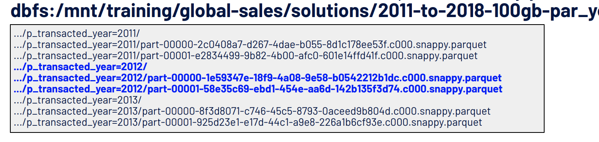

- The part-file does not necessarily retain partitioned columns

  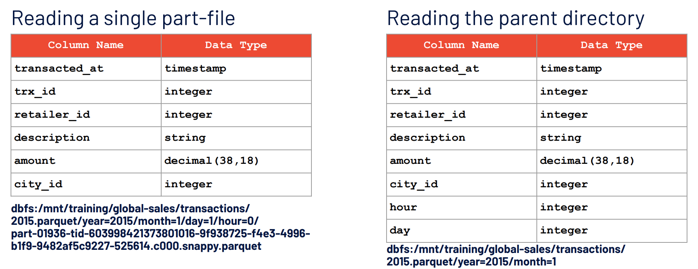

  - Virtual columns as an artifact of storage based partitioning

- Disk-Partitioning to reduce data injestion

  - Spark can push a predicate down to the scanner. Only those directories that match the predicate are read in. Spark infers column types and names from the directory structure further reducing the number of bytes read from disk.
  - Works for Delta, Parquet, ORC, CSV, JSON and many more

- Warnings

  - Over partitioning can lead to small files
  - Over partitioning can result in excessive directory scanning by creating a highly nested structure
  - Advertise partitioned columns so that they get used
  - Avoid shadowing a partitioned column
    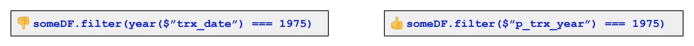

### 3.3. Z-Order Clustering

This feature requires Delta on Databricks

- Z-order clustering reduces the scan time for highly selective queries

  - Supports binary comparison operators such as `StartsWith`, `Like`, `In <list>` as well as `AND`, `OR` and `NOT` operations and others
  - While disk-partitioning targets large data segments (e.g. partitioned by year), Z-Ordering is ideal for the needle-in-the-haystack type of query

  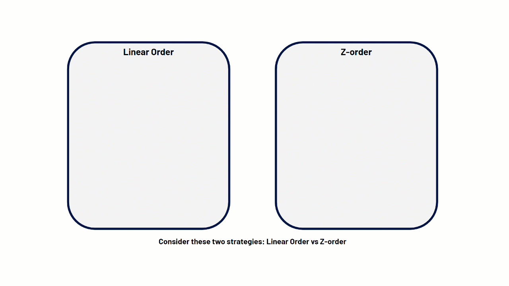 ([animation](https://files.training.databricks.com/images/animations/z-order.gif))

- Syntax

  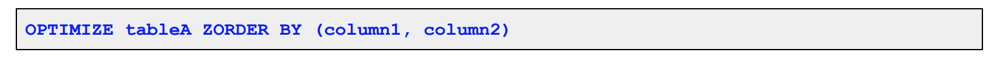

### 3.4. Bucketing

Bucketing is a feature available only if dataset registered as table in meta store.

- Bucketing aims to minimize the effect of SortMergeJoin by eliminating the exchange and minimizing the sort

  - Pre-shuffle data into buckets and write to storage. When read and join, no need to re-shuffle.
    - E.g., Useful when joining TB fact table with 100MB dimension table needs shuffling
  - Bucketing enables predicate push downs by means of the data structure
  - Due to the typical cost of bucketing, the performance gains are seen
later, after multiple reads and joins against the bucketed data

- Limitations

  - Narrow use cases: There can be many dimension tables
  - Takes time to bucket: Read in, sorting, writing not efficient if table changes frequently

- How to bucket

  - Both sides of the join should employ the same number of buckets to avoid the exchanges and sorts, but it isn’t required
  - The number of spark-partitions will equal the number of buckets
  - Watch out for skew in the bucketed column & the tiny files problem

  Example

  - The total number of part-files will equal N-partitions * M-buckets (e.g. 100 partitions * 400 buckets = 40,000 part-files)
  - That are 40,000 bucketed part-files vs. the original 100 part-files
  - The number of files can be reduced by first partitioning the data in Spark
  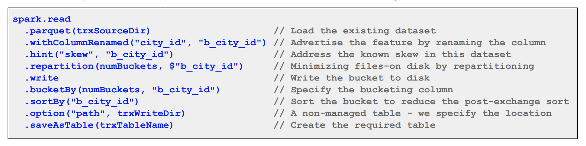

### 3.5. Combined strategies

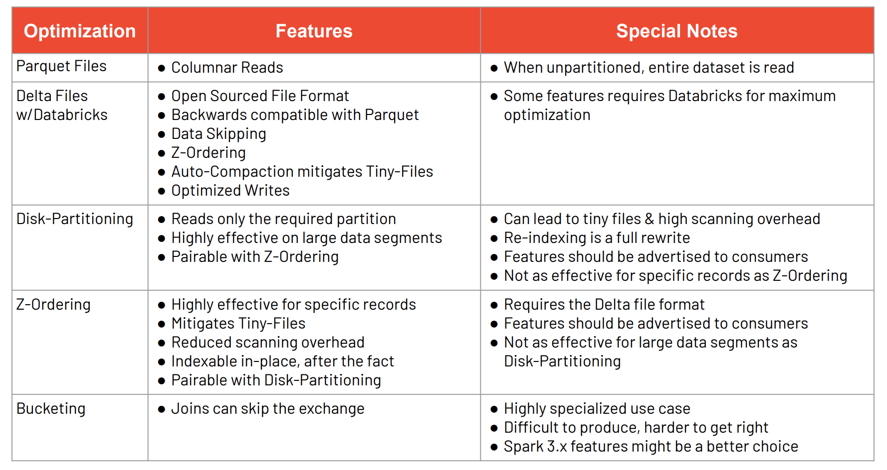

- What file format to use: Parquet, ORC, Delta
- Disk-partitioning: Partition by the largest segment

## 4. New Strategies for Spark 3.0

Check out more details at [What's New in Apache Spark 3.0](spark3.md)

- Adaptive Query Execution (AQE)

  At the end of each stage, collect statistics, modifies the Physical Plan based on runtime information dynamically during execution

  - E.g. Tuning shuffle partitions `spark.sql.shuffle.partitions` -> AQE changes # partitions dynamically
  - E.g. Join optimization -> AQE adjusts Physical Plan to broadcast small table or use subqueries
  - E.g. Skew join optimization -> AQE redistributes partition size on the fly

- Dynamic Partition Pruning

  - E.g. when broadcasting small table during join, create a subquery to filter both big and small tables. Minimal shuffling.
