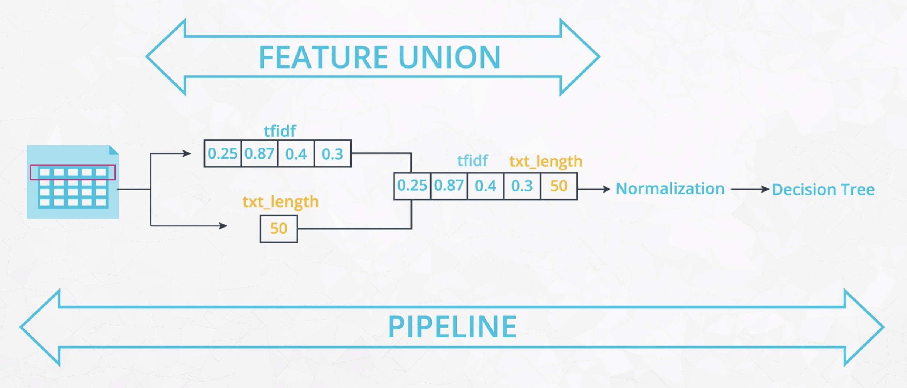

# Data pipelines

Data pipeline is a generic term for moving data from one place to another. For example, it could be moving data from one server to another server.

- [Data pipelines](#data-pipelines)
  - [1. ETL (Extract Transform Load) Pipelines](#1-etl-extract-transform-load-pipelines)
    - [1.1. Extract data from different sources](#11-extract-data-from-different-sources)
    - [1.2. Transform data](#12-transform-data)
    - [1.3. Load data](#13-load-data)
  - [2. Natural Language Processing (NLP) Pipelines](#2-natural-language-processing-nlp-pipelines)
    - [2.1. Text Processing](#21-text-processing)
    - [2.2. Feature Extraction](#22-feature-extraction)
    - [2.3. Modeling](#23-modeling)
  - [3. Machine Learning Pipelines](#3-machine-learning-pipelines)
    - [3.1. Scikit-learn terminology](#31-scikit-learn-terminology)
    - [3.2. Scikit-learn pipeline](#32-scikit-learn-pipeline)
    - [3.3. Advantages of using pipeline](#33-advantages-of-using-pipeline)
    - [3.4. Feature Union](#34-feature-union)
    - [3.5. Create custom transformer](#35-create-custom-transformer)
    - [3.6. Grid search with pipeline](#36-grid-search-with-pipeline)

## 1. ETL (Extract Transform Load) Pipelines

- An **ETL** (extract transform load) pipeline is a specific kind of data pipeline and very common. Oftentimes, it makes sense to run ETL pipelines and store data in a more readable or intuitive format. This can help data analysts and scientists work more efficiently as well as help an organization become more data driven.

- **ELT** (extract, load, transform) pipelines have gained traction since the advent of cloud computing, which lowered the cost of storing data and running queries on large, raw data sets.

### 1.1. Extract data from different sources

- csv files
- json files
- APIs
- etc.
  
### 1.2. Transform data

- combining data from different sources
- data cleaning
- data types
- parsing dates
- file encodings
- missing data
- duplicate data
- dummy variables
- remove outliers
- scaling features
- engineering features

### 1.3. Load data

- send the transformed data to a database

## 2. Natural Language Processing (NLP) Pipelines

### 2.1. Text Processing

Take raw input text, clean it, normalize it, and convert it into a form that is suitable for feature extraction. The goal is to (1) extract plain text that is free of any source specific markup or constructs that are not relevant to your task, and (2) to reduce complexity.

- Encoding-check
- Foreign language detection
- Cleaning non-text entity
- Normalization
- Tokenization
- Stop Word Removal
- Part of Speech Tagging
- Named Entity Recognition
- Conference resolution
- Stemming and Lemmatization

### 2.2. Feature Extraction

Extract and produce feature representations that are appropriate for the type of NLP task you are trying to accomplish and the type of model you are planning to use.

- Bag of Words
- TF-IDF
- Word Embeddings

### 2.3. Modeling

Design a statistical or machine learning model, fit its parameters to training data, use an optimization procedure, and then use it to make predictions about unseen data.

## 3. Machine Learning Pipelines

### 3.1. Scikit-learn terminology

- **Estimator:** An estimator is any object that learns from data, whether it's a classification, regression, or clustering algorithm, or a transformer that extracts or filters useful features from raw data. Since estimators learn from data, they each must have a fit method that takes a dataset. For example, the `CountVectorizer`, `TfidfTransformer`, and `RandomForestClassifier` are all estimators, and each have a fit method.
- **Transformer:** A transformer is a specific type of estimator that has a fit method to learn from training data, and then a transform method to apply a transformation model to new data. These transformations can include cleaning, reducing, expanding, or generating features. For example, `CountVectorizer` and `TfidfTransformer` are transformers.
- **Predictor:** A predictor is a specific type of estimator that has a predict method to predict on test data based on a supervised learning algorithm, and has a fit method to train the model on training data. For example, `RandomForestClassifier` is a predictor.

### 3.2. Scikit-learn pipeline

Scikit-learn can automate fitting, transforming, and predicting, by chaining these estimators together into a single estimator object. That single estimator would be scikit-learn's **pipeline**.

- Example without pipeline

  ```python
  vect = CountVectorizer()
  tfidf = TfidfTransformer()
  clf = RandomForestClassifier()

  # train classifier
  X_train_counts = vect.fit_transform(X_train)
  X_train_tfidf = tfidf.fit_transform(X_train_counts)
  clf.fit(X_train_tfidf, y_train)

  # predict on test data
  X_test_counts = vect.transform(X_test)
  X_test_tfidf = tfidf.transform(X_test_counts)
  y_pred = clf.predict(X_test_tfidf)
  ```

- Example with pipeline

  To create the pipeline, we need a list of (key, value) pairs, where the key is a string containing what you want to name the step, and the value is the estimator object. **Every step of this pipeline has to be a transformer, except for the last step, which can be of an estimator type.**

  ```python
  X = df['text'].values
  y = df['label'].values
  X_train, X_test, y_train, y_test = train_test_split(X, y)
  
  # pipeline
  pipeline = Pipeline([
      ('vect', CountVectorizer()),
      ('tfidf', TfidfTransformer()),
      ('clf', RandomForestClassifier()),
  ])

  # train classifier
  pipeline.fit(Xtrain, y_train) # fitting and transforming each of these steps to training data

  # evaluate all steps on test set (`predict` because the pipeline is a predictor)
  predicted = pipeline.predict(Xtest) # `transform` each transformer object to test data and then calling `predict` on the final estimator
  ```

- Predict multiple classes

  The [MultiOutputClassifier](http://scikit-learn.org/stable/modules/generated/sklearn.multioutput.MultiOutputClassifier.html) will be helpful for predicting multiple target variables.

  ```python
  # pipeline
  pipeline = Pipeline([
      ('vect', CountVectorizer()),
      ('tfidf', TfidfTransformer()),
      ('clf', MultiOutputClassifier(RandomForestClassifier(n_estimators=10))),
  ])
  ```

### 3.3. Advantages of using pipeline

1. Simplicity and Convencience

    - **Automates repetitive steps** - Chaining all of your steps into one estimator allows you to fit and predict on all steps of your sequence automatically with one call. It handles smaller steps for you, so you can focus on implementing higher level changes swiftly and efficiently.
    - **Easily understandable workflow** - Not only does this make your code more concise, it also makes your workflow much easier to understand and modify. Without Pipeline, your model can easily turn into messy spaghetti code from all the adjustments and experimentation required to improve your model.
    - **Reduces mental workload** - Because Pipeline automates the intermediate actions required to execute each step, it reduces the mental burden of having to keep track of all your data transformations. Using Pipeline may require some extra work at the beginning of your modeling process, but it prevents a lot of headaches later on.

2. Optimizing Entire Workflow

    - **Grid search over full pipeline tunes parameters for both data preparation and model.**
      - Grid search automates the process of testing different hyper parameters to optimize a model.
      - By running grid search on your pipeline, you're able to optimize your entire workflow, including data transformation and modeling steps. This accounts for any interactions among the steps that may affect the final metrics.
      - Without grid search, tuning these parameters can be painfully slow, incomplete, and messy.

3. Preventing Data leakage

    - **Contains all steps within each fold of cross validation** - Using Pipeline, all transformations for data preparation and feature extractions occur within each fold of the cross validation process.
    - **Protects training process from influenced by test or validation data** - This prevents common mistakes where you’d allow your training process to be influenced by your test data - for example, if you used the entire training dataset to normalize or extract features from your data.

### 3.4. Feature Union

- Feature union is a class in scikit-learn’s Pipeline module that allows us to perform steps in parallel and take the union of their results for the next step.

  

  - A pipeline performs a list of steps in a linear sequence, while a feature union performs a list of steps in parallel and then combines their results.
  - In more complex workflows, multiple feature unions are often used within pipelines, and multiple pipelines are used within feature unions.

- Build a pipeline with feature union

  ```python
  # Example code to extract both tfidf and length of text for machine learning
  X = df['text'].values
  y = df['label'].values
  X_train, X_test, y_train, y_test = train_test_split(X, y)

  # pipeline with feature union
  def model_pipeline():
      pipeline = Pipeline([
          ('features', FeatureUnion([

              ('text_pipeline', Pipeline([
                  ('vect', CountVectorizer(tokenizer=tokenize)),
                  ('tfidf', TfidfTransformer())
              ])),

              ('starting_verb', StartingVerbExtractor()) # this is a custom transformer
          ])),

          ('clf', RandomForestClassifier())
      ])

      return pipeline

  # train classifier
  model = model_pipeline()
  model.fit(X_train, y_train)

  # predict on test data
  y_pred = model.predict(X_test)
  ```

### 3.5. Create custom transformer

- By extending the base class in Scikit-Learn

  ```python
  import nltk
  nltk.download(['punkt', 'wordnet', 'averaged_perceptron_tagger'])
  import re
  import numpy as np
  from sklearn.base import BaseEstimator, TransformerMixin
  from nltk.tokenize import word_tokenize
  from nltk.stem import WordNetLemmatizer
  url_regex = 'http[s]?://(?:[a-zA-Z]|[0-9]|[$-_@.&+]|[!*\(\),]|(?:%[0-9a-fA-F][0-9a-fA-F]))+'

  # Create custom transformer
  class StartingVerbExtractor(BaseEstimator, TransformerMixin):
      def __init__(self):
          pass

      def starting_verb(self, text):
          sentence_list = nltk.sent_tokenize(text)
          for sentence in sentence_list:
              pos_tags = nltk.pos_tag(tokenize(sentence))
              first_word, first_tag = pos_tags[0]
              if first_tag in ['VB', 'VBP'] or first_word == 'RT':
                  return True
          return False

      # Fit method
      def fit(self, X, y=None):
          return self

      # Transform method
      def transform(self, X):
          X_tagged = pd.Series(X).apply(self.starting_verb)
          return pd.DataFrame(X_tagged)

  # Clean, normalize, lemmatize, and tokenize
  def tokenize(text):
      detected_urls = re.findall(url_regex, text)
      for url in detected_urls:
          text = text.replace(url, "urlplaceholder")

      tokens = word_tokenize(text)
      lemmatizer = WordNetLemmatizer()

      clean_tokens = []
      for tok in tokens:
          clean_tok = lemmatizer.lemmatize(tok).lower().strip()
          clean_tokens.append(clean_tok)

      return clean_tokens

  # Sanity check
  starting_verb = StartingVerbExtractor()
  X = df['text'].values
  starting_verb.transform(X)
  ```

- by using `FunctionTransformer` from Scikit-learn preprocessing

  This allows you to wrap an existing function to become a transformer. This provides less flexibility, but is much simpler. Read more [here](https://scikit-learn.org/stable/modules/generated/sklearn.preprocessing.FunctionTransformer.html#sklearn.preprocessing.FunctionTransformer)

  ```python
  import numpy as np
  from sklearn.preprocessing import FunctionTransformer
  
  # Convert an existing Python function into a transformer
  transformer = FunctionTransformer(np.log1p, validate=True)

  # Sanity check
  X = np.array([[0, 1], [2, 3]])
  transformer.transform(X)
  ```

### 3.6. Grid search with pipeline

Most machine learning algorithms have a set of parameters that need tuning. **Grid search** is a tool that allows you to define a “grid” of parameters, or a set of values to check. Your computer automates the process of trying out all possible combinations of values. Grid search scores each combination with cross validation, and uses the cross validation score to determine the parameters that produce the most optimal model.

- Advantages of using grid search with pipeline

  - (+) A powerful benefit to using pipeline is the ability to perform a grid search on your entire workflow. Running grid search on your pipeline allows you to try multiple parameter combinations for both data preparation and machine learning model.

  - (+) Pipelines make sure that in each fold of cross validation, the rescaling is done only on the data that the model is trained on, preventing leakage from the validation set.

- Syntax

  ```python
  # Grid search with pipeline
  def build_model():
      # Build pipeline
      pipeline = Pipeline([
          ('features', FeatureUnion([

              ('text_pipeline', Pipeline([
                  ('vect', CountVectorizer(tokenizer=tokenize)),
                  ('tfidf', TfidfTransformer())
              ])),

              ('starting_verb', StartingVerbExtractor())
          ])),

          ('clf', RandomForestClassifier())
      ])

      # # View parameters in pipeline
      # pipeline.get_params()

      # Specify parameters for grid search
      parameters = {
          'features__text_pipeline__vect__ngram_range': ((1, 1), (1, 2)),
          'features__text_pipeline__vect__max_df': (0.5, 0.75, 1.0),
          'features__text_pipeline__vect__max_features': (None, 5000, 10000),
          'features__text_pipeline__tfidf__use_idf': (True, False),
          'clf__n_estimators': [50, 100, 200],
          'clf__min_samples_split': [2, 3, 4],
          'features__transformer_weights': (
              {'text_pipeline': 1, 'starting_verb': 0.5},
              {'text_pipeline': 0.5, 'starting_verb': 1},
              {'text_pipeline': 0.8, 'starting_verb': 1},
          )
      }

      cv = GridSearchCV(pipeline, param_grid=parameters)

      return cv
  ```

  ```python
  # Apply grid search with pipeline
  X_train, X_test, y_train, y_test = train_test_split(X, y)
  model = build_model()
  model.fit(X_train, y_train)
  y_pred = model.predict(X_test)
  print("Labels:", np.unique(y_pred))
  print("Confusion Matrix:\n", confusion_matrix(y_test, y_pred, labels=labels))
  print("Accuracy:", (y_pred == y_test).mean())
  print("\nBest Parameters:", model.best_params_)
  ```


