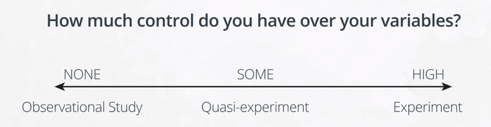
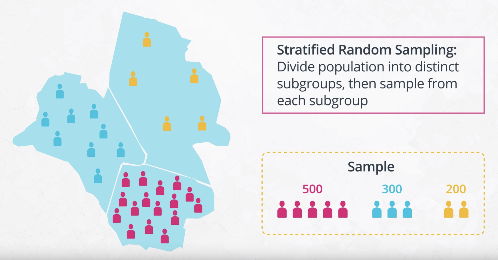
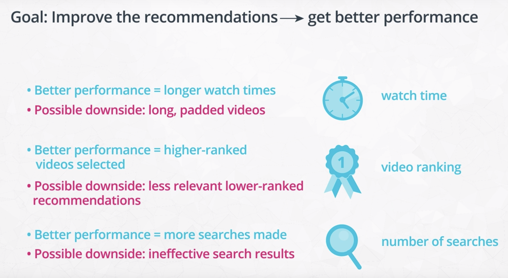
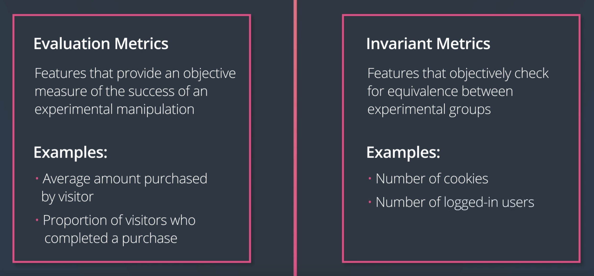

# Concepts of Experiment Design

- [Concepts of Experiment Design](#concepts-of-experiment-design)
  - [1. Types of study](#1-types-of-study)
  - [2. Key features of an experiment](#2-key-features-of-an-experiment)
  - [3. Types of experiment](#3-types-of-experiment)
  - [4. Types of sampling](#4-types-of-sampling)
  - [5. Measuring outcomes](#5-measuring-outcomes)
  - [6. Creating metrics](#6-creating-metrics)
  - [7. Potential problems of a study - Checking validity](#7-potential-problems-of-a-study---checking-validity)
  - [8. Potential problems of a study - Checking bias](#8-potential-problems-of-a-study---checking-bias)
  - [9. Potential problems of a study - Ethics in experimentation](#9-potential-problems-of-a-study---ethics-in-experimentation)

## 1. Types of study

There are many ways in which data can be collected in order to test or understand the relationship between two variables of interest. These methods can be put into three main bins, based on the amount of control that you hold over the variables in play:

- If you have a lot of control over features, then you have an **experiment**.

  - Having multiple groups
  - Equivalence between groups

- If you have no control over the features, then you have an **observational study**, also known as naturalistic or correlational studies.

  - No control is exerted on the variables of interest, perhaps due to ethical concerns or a lack of power to enact the manipulation. 
  - Example scenario
    - E.g., in medical studies, if we want to look at the effects of smoking on health, the potential risks make it unethical to force people into smoking behaviors. Instead, we need to rely on existing data or groups to make our determinations.
  - Usefulness
    - (-) Typically **cannot infer causality** in an observational study due to our lack of control over the variables. Any relationship observed between variables may be due to unobserved features, or the direction of causality might be uncertain.
    - (+) Observational study **can still be useful**. E.g. an interesting relationship might be the spark needed to perform additional studies or to collect more data. These studies can help strengthen the understanding of the relationship we're interested in by ruling out more and more alternative hypotheses.

- If you have some control, then you have a **quasi-experiment**.

  - Some, but not all, of the control requirements of a true experiment are met.
  - Example scenarios
    - E.g. rolling out a new website interface to all users to see how much time they spend on it might be considered a quasi-experiment. While the manipulation is controlled by the experimenter, **there aren't multiple groups to compare**. The experimenter can still use the behavior of the population pre-change and compare that to behaviors post-change, to make judgment on the effects of the change. However, there is the possibility that there are other effects outside of the manipulation that caused the observed changes in behavior. For the example earlier in this paragraph, it might be that users would have naturally gravitated to higher usage rates, regardless of the website interface.
    - E.g. we might have two different groups upon which to make a comparison of outcomes, but the original **groups themselves might not be equivalent**. A classic example of this is if a researcher wants to test some new supplemental materials for a high school course. If they select two different schools, one with the new materials and one without, we have a quasi-experiment since the differing qualities of students or teachers at those schools might have an effect on the outcomes. Ideally, we'd like to match the two schools before the test as closely as possible, but we can't call it a true experiment since the assignment of student to school can't be considered random.
  - Usefulness
    - (-) A quasi-experiment may not have the same strength of causality inference as a true experiment
    - (+) The results can still provide a strong amount of evidence for the relationship being investigated. This is especially true if some kind of matching is performed to identify similar units or groups.
    - (+) Another benefit of quasi-experimental designs is that the relaxation of requirements makes the quasi-experiment more flexible and easier to set up.

## 2. Key features of an experiment

In the social and medical sciences, an **experiment** is defined by comparing outcomes between two or more groups, and ensuring equivalence between the compared groups *except* for the manipulation that we want to test. **Our interest in an experiment is to see if a change in one feature has an effect in the value of a second feature**, like seeing if changing the layout of a button on a website causes more visitors to click on it.

1. Comparison between groups, by changing the feature we care about
  
   - **Having multiple groups** is necessary in order to compare the outcome for when we apply the manipulation to when we do not (e.g. old vs. new website layout), or to compare different levels of manipulation (e.g. drug dosages).
  
2. Control for other variables, typically through randomization

   - We also need **equivalence between groups** so that we can be as sure as possible that the differences in the outcomes were only due to the difference in our manipulated feature.

   - Equivalence between groups is typically carried out through some kind of randomization procedure. A **unit of analysis** is the entity under study, like a page view or a user in a web experiment. If we randomly assign our units of analysis to each group, then on the whole, we should expect the feature distributions between groups to be about the same.

   - Randomization theoretically isolates the changes in the outcome to the changes in our manipulated feature. Of course, we can always **dig deeper afterwards** to see if certain other features worked in tandem with, or against, our manipulation.

SMART Mnemonic for Experiment Design can be used as a sanity check. Considerations of ethical issues or bias will need to be considered separately.

- Specific: Make sure the goals of your experiment are specific.
- Measurable: Outcomes must be measurable using objective metrics
- Achievable: The steps taken for the experiment and the goals must be realistic.
- Relevant: The experiment needs to have purpose behind it.
- Timely: Results must be obtainable in a reasonable time frame.

## 3. Types of experiment

- **Between-subjects experiment**

  - Each unit only participates in, or sees, one of the conditions being used in the experiment.
  
  - The simplest of these has just two groups or conditions to compare. In one group, we have either no manipulation, or maintenance of the status quo. This is like providing a known drug treatment, or an old version of a website. This is known as the **control group**. The other group includes the manipulation we wish to test, such as a new drug or new website layout. This is known as our **experimental group**. We can compare the outcomes between groups (e.g. recovery time or click-through rate) in order to make a judgement about the effect of our manipulation. (Since we have an experiment, we'll randomly assign each unit to either the control or experimental group.) For web-based experiments, this kind of basic experiment design is called an **A/B test**: the "A" group representing the old control, and "B" representing the new experimental change.

  - We could have multiple experimental groups to compare, rather than just one control group and one experimental group. This could form an A/B/C test for a web-based experiment, with control group "A" and experimental groups "B" and "C".

- **Within-subjects design**, also known as repeated measures design

  - An individual completes all conditions, rather than just one.

  - (+) We can account for individuals' aptitudes or inclinations in our analysis. For example, if an individual rates three different color palettes for a product, we can know if a high rating for one palette is particularly good compared to the others (e.g. 10 vs. 5, 6) or if it's not a major distinction (e.g. 10 vs. 8, 9).

  - (+/-) By measuring an individual's output in all conditions, we know that the distribution of features in the groups will be equivalent. Randomization still has a part in the within-subjects design in the order in which individuals complete conditions. This is important to reduce potential bias effects.

  - (-) It's not always possible to pull off a within-subjects design. For example, when a user visits a website and completes their session, we usually can't guarantee when they'll come back. The purpose of their following visit also might not be comparable to their first. It can take a lot more effort in control in order to set up an effective within-subjects design.

- **Factorial designs**

  - Factorial designs manipulate the value of multiple features of interest. For example, with two independent manipulations "X" and "Y", we have four conditions: "control", "X only", "Y only", "X and Y". Experimental designs where multiple features are manipulated simultaneously are more frequently seen in engineering and physical sciences domains, where the system units tend to be under stricter control. They're less seen in the social and medical realms, where individual differences can impede experiment creation and analysis.

## 4. Types of sampling

While web and other online experiments have an easy time collecting data, collecting data from traditional methods involving real populations is a much more difficult proposition. If you need to perform a survey of a population, it could be unreasonable in both time and money costs to try and collect thoughts from every single person in the population. This is where sampling comes in. **The goal of sampling is to use a subset of the whole population to make inferences about the full population, so that we didn't need to record data from everyone.**

- Probabilistic sampling

  - **Simple random sampling**

    - In a simple random sample, each individual in the population has an equal chance of being selected. We just randomly make draws from the population until we have the sample size desired; your sample size depends on the level of uncertainty you are willing to have about the collected data.
    - (+) Since everyone has an equal chance of being drawn, we can expect the feature distribution of selected units to be similar to the distribution of the population as a whole.
    - (+) In addition, a simple random sample is easy to set up.
    - (-) It is possible that certain groups are underrepresented in a simple random sample, especially those that make up a low proportion of the population.

      

  - **Stratified random sampling**

    - In a stratified random sample, we need to first divide the entire population into disjoint groups, or strata. That is, each individual must be a part of one group, and only one group. For example, you could divide people by gender (male, female, other), or age (e.g. 18-25, 26-35, etc.). Then, from each group, you take a simple random sample.

    - (+) If there are certain rarer subgroups of interest, it can be worth adding one additional step and performing stratified random sampling.

    - **Proportional sample**

      - The sample size is proportional to how large the group is in the full population. For example, if you require 1000 data points, and stratified individuals of proportion {0.5, 0.3, 0.2}, then you would take 500 people from the first group, 300 from the second, and 200 from the third.
      - (+) This guarantees a certain level of knowledge from each subset, and theoretically a more representative overall inference on the population.

      

    - **Nonproportional sample**

      - For example, we could simply sample 500 people from each group.
      - (+) Computing the overall statistics in this case requires weighting each group separately, but this extra effort offers a higher understanding of each subgroup in a deeper investigation.

- Non-probabilistic sampling

  - (-) At the risk of harming the validity of your results.

  - **Convenience sample**

    - Convenience sample records information from readily available units. Studies performed in the social sciences at colleges often fall into this kind of sampling. The people participating in these tasks are often just college students, rather than representatives of the population at large. When performing inferences from this type of study, it's important to consider how well your results might apply to the population at large.

## 5. Measuring outcomes

In order to evaluate whether or not this improvement has happened, you need to have a way to objectively measure the effect of the tested feature.

- **Evaluation metrics**: features that provide an objective measure of the success of an experimental manipulation.

  - Need to **make sure the metric aligns with the study goal**.

  - As a rule of thumb, it's a good idea to **consider the goals of a study separate from the evaluation metrics**. This provides a couple of useful benefits.

    - (+) First, this makes it clear that the metric isn't the main point of a study: it's the implications of the metric relative to the goal that matters. This is especially important if a metric isn't directly attached to the goal. For example, measuring students' confidence going into a standardized test might be a proxy for the goal of test preparedness, in the absence of being able to get their test scores directly or in a timely fashion.

    - (+) Secondly, having the metric separate from the goal can clarify the purpose of conducting the study or experiment. It makes sure we can answer the question of why we want to run a study or experiment. From the above example, we aren't measuring confidence just to make people feel good about themselves: we're doing it to try and improve their actual performances.

  - Alternate terminology

    - In the social sciences, it's common to hear a "**construct**" as analogous to the goal or objective under investigation, and the "**operational definition**" as the way outcomes are measured. For example, the construct of "reaction time" could be operationally defined as "time in milliseconds to click on the correctly indicated button."

    - In general company operations, you might encounter the terms **"key results" (KRs)** or **"key performance indicators" (KPIs)** as ways of measuring progress against quarterly or annual "**objectives**". These objectives and KRs / KPIs serve a similar purpose as study goals and evaluation metrics, and might even be driving factors in the creation of an experiment.

## 6. Creating metrics

- **User funnel** (in a web experiment)

  

  - User funnel is the path or steps taken by a user from the start of their experience to the desired destination state. Typically, the funnel ends at the place where your main evaluation metric is recorded, and includes a step where your experimental manipulation can be performed.

  - One property about user funnels is that typically there will be some **dropoff** in the users that move from step to step. This is much like how an actual funnel narrows from a large opening to a small exit. Outside of an experiment, funnels can be used to analyze user flows. Observations from these flows can then be used to motivate experiments to try and improve the dropoff rates.

  - It's also worth noting that the flow through a funnel might be idealized compared to actual user practice. In the above example, users might perform multiple searches in a single session, or want to purchase multiple things. A user might access the site through a specific link, subverting the top part of the funnel. Refining the funnel and being specific about the kinds of events that are expected can help you create a consistent, reliable design and analysis.

- **Unit of diversion**

  

  - The unit of diversion is the place where you implement the experimental manipulation in the funnel. It is the observational unit by which users are split into experimental groups.

  - Options for diversion

    - **Event-based diversion** (e.g. pageview): Each time a user loads up the page of interest, the experimental condition is randomly rolled.
      - (-) Since this ignores previous visits, this can create an inconsistent experience, if the condition causes a user-visible change.
    - **Cookie-based diversion**: A cookie is stored on the user's device, which determines their experimental condition as long as the cookie remains on the device.
      - (-) Cookies don't require a user to have an account or be logged in, but can be subverted through anonymous browsing or a user just clearing out cookies.
    - **Account-based diversion** (e.g. User ID): User IDs are randomly divided into conditions.
      - (-) Account-based diversions are reliable, but requires users to have accounts and be logged in. This means that our pool of data might be limited in scope, and you'll need to consider the risks of using personally-identifiable information.

  - Selecting a unit of diversion

    Once you have a funnel, think about how you can implement your experimental manipulation in the funnel.

    - The consistency of the experience required can be a major factor to consider. For the example provided, we need something more consistent than pageview events. So we then consider the cookie-based diversion. If the differences in interface between control and experiment are fairly minor, then we're probably okay with cookie-based diversion. But if we think that users will notice the change and we believe that it will have a major effect on experience, then we might be inclined to choose an account-based diversion.

- **Invariant and evaluation metrics**

  

  A funnel will also be of benefit when it comes to deciding on metrics to track and analyze as part of the experiment. The immediate features that come out of a funnel come in the form of counts and ratios. For example, we could count the number of times a search results in a product being selected (a count), or the ratio of selections to searches as adjacent slices in the funnel (a ratio).

  There are two major categories that we can consider features: as evaluation metrics or as invariant metrics. 
  
  - **Evaluation metrics**: features that provide an objective measure of the success of an experimental manipulation. Ideally, we hope to see a difference between groups that will tell us if our manipulation was a success. We might want to see an increased click-through-rate from search results to products, or an increase in overall revenue.
  - **Invariant metrics**: features that objectively check for equivalence between experimental groups. For example, in an experiment with cookie-based diversion, the number of cookies generated for each condition would be a good invariant metric. Another metric could compare the distribution of times in which cookies were generated, to check the bias in the randomization procedure.
  
  It's not unusual to track multiple invariant metrics as checks on the system's integrity, or multiple evaluation metrics to check different potential facets of a manipulation's effects. Don't think that you need to track every possible metric, however. It's better to focus on a few key metrics, ignoring features that might be less reliable or highly correlated to other, more informative features.

## 7. Potential problems of a study - Checking validity

When designing an experiment, it's important to keep in mind validity, which concerns how well conclusions can be supported. **Experimental validity** is the degree to which your experiment actually accomplishes the conclusions you state. There are three major conceptual dimensions upon which validity can be assessed:

- **Construct Validity**

  Construct validity is tied to how well one's goals are aligned to the **evaluation metrics** used to evaluate it. Poor construct validity can come about when an evaluation metric does not actually measure something related to the desired outcome concept. Alternatively, it might be that a metric is ill-constructed, such that it does not make clear distinctions on the outcome concept.

- **Internal Validity**

  Internal validity refers to the degree to which a **causal relationship** can be derived from an experiment's results. Controlling for and accounting for other variables is key to maintaining good internal validity.

  Controlling variables:

  - If we want to determine causality between two features, there are two main things to control. First of all, we need to enact the manipulation on one of the features of interest, so that we know that it is causing the change in the other feature. In order to know that it was our manipulated variable and not any other, the second major control point is that we want to make sure that all other features are accounted for. These two requirements make the arguments for causality much stronger with an experiment compared to a quasi-experiment or observational study.

  - If we aren't able to control all features or there is a lack of equivalence between groups, then we may be susceptible to **confounding variables**. A confounding variable is an unaccounted-for variable that interacts with our variables of interest. The correlation observed between two variables might be due to changes in a third variable, rather than one causing the other. Another possibility is that there is a causal relationship between the two features, but it is an indirect relationship mediated by a third, **intermediate variable**. This intermediate variable might be a larger driver of the changes in the output, with the manipulated variable only having a direct effect on the intermediate feature.

  - For the case where we see a relationship but don't perform a manipulation, we also need to be careful about the **direction of effect**. A relationship between variables "A" and "B" might be due to "A" having an effect on "B" or the reverse, "B" having an effect on "A". It might even be the case that "A" and "B" are related through some other function like a third variable.

- **External Validity**

  External validity is concerned with the ability of an experimental outcome to be **generalized** to a broader population. This is most relevant with experiments that involve sampling: how representative is the sample to the whole? For studies at academic institutions, a frequent question is if data collected using only college students can be generalized to other age or socioeconomic groups.

## 8. Potential problems of a study - Checking bias

Biases in experiments are systematic errors that interfere with the interpretation of experimental results, mostly in terms of internal validity. Just as humans can have a lot of different biases, there are numerous ways in which an experiment can become unbalanced.

- **Sampling Bias**

  Many experimental biases fall under the sampling bias umbrella. Sampling biases are those that cause our observations to not be representative of the population. For example, if assignment to experimental groups is done in an arbitrary fashion (as opposed to random assignment or matched groups), we risk our outcomes being based less on the experimental manipulation and more on the composition of the underlying groups.

  - Studies that use *surveys* to collect data often have to deal with the **self-selection bias**. The types of people that respond to a survey might be qualitatively very different from those that do not. A straight average of responses would not necessarily reflect the feelings of the full population; weighting responses based on the differences between the observed responses and properties of the target population may be needed to come to reasonable conclusions.

  - One type of sampling bias related to *missing data* is the **survivor bias**. Survivor bias is one where losses or dropout of observed units is not accounted for in an analysis. A key example of this was in British World War II operations research, where engineers avoided using survivor bias when they considered where to add armor to their planes. Rather than add armor to the spots where returning planes had bullet holes, armor was added to the spots where the planes didn't have bullet holes. That's because the planes that took shots to those places probably crashed, due to those locations being more vital for maintaining flight, so they didn't "survive" and weren't available for observation.

- **Novelty Bias**

  A novelty effect is one that causes observers to change their behavior simply because they're seeing something new. We might not be able to gauge the true effect of a manipulation until after the novelty wears off and population metrics return to a level that actually reflects the changes made. This will be important for cases where we want to track changes over time, such as trying to get users to re-visit a webpage or use an app more frequently. Novelty is probably not a concern (or perhaps what we hope for) when it comes to manipulations that are expected to only have a one-shot effect.

- **Order Biases**

  There are a couple of biases to be aware of when running a *within-subjects experiment*. Recall that in a within-subjects design, each participant performs a task or makes a rating in multiple experimental conditions, rather than just one. The order in which conditions are completed could have an effect on participant responses. A **primacy effect** is one that affects early conditions, perhaps biasing them to be recalled better or to serve as anchor values for later conditions. A **recency effect** is one that affects later conditions, perhaps causing bias due to being fresher in memory or task fatigue.

  An easy way of getting around order biases is to simply **randomize** the order of conditions. If we have three conditions, then each of the six ways of completing the task (ABC, ACB, BAC, BCA, CAB, CBA) should be equally likely. While there still might end up being order effects like carry-over effects, where a particular condition continues to have an effect on future conditions, this will be much easier to detect than if every participant completed the task in the exact same order of conditions.

- **Experimenter Bias**

  One bias to watch out for, especially in *face-to-face experiments*, is the experimenter bias. This is where the presence or knowledge of the experimenter can affect participants' behaviors or performance. If an experimenter knows what condition a participant is in, they might subtly nudge the participant towards their expected result with their interactions with the participant. In addition, participants may act differently in the presence of an experimenter, to try and act in the 'right' way – regardless of if a subject actually knows what the experimenter is looking for or not.

  This is where design steps like **blinding** are important. In blinding, the administrator of a procedure or the participant do not know the condition being used, to avoid that subconscious bias from having an effect. In particular, the double-blind design hides condition information from both the administrator and participant in order to have a strong rein on experimenter-based biases.

## 9. Potential problems of a study - Ethics in experimentation

- **Minimize participant risk:** Experimenters are obligated to construct experiments that minimize the risks to participants in the study. Risk of harm isn't just in the physical sense, but also the mental sense. If an experimental condition has potential to negatively affect a participant's emotions or mentality, then it's worth thinking about if the risks are really necessary to perform the desired investigation.

- **Have clear benefits for risks taken:** In some cases, risks may be unavoidable, and so they must be weighed against the benefits that may come from performing the study. When expectations for the study are not clearly defined, this throws into question the purpose of exposing subjects to risk. However, if the benefits are shown to be worth the risks, then it is still possible for the study to be run. This often comes up in medicine, where test treatments should show worthy potential against alternative approaches.

- **Provide informed consent:** Building up somewhat from the previous two points, subjects should be informed of and agree to the risks and benefits of participation before they join the study or experiment. This is also an opportunity for a participant to opt out of participation. However, there are some cases where deception is necessary. This might be to avoid biasing the participant's behavior by seeding their expectations, or if there is a dummy task surrounding the actual test to be performed. In cases like this, it's important to include a debriefing after the subject's participation so that they don't come away from the task feeling mislead.

- **Handle sensitive data appropriately:** If you're dealing with identifiable information in your study, make sure that you take appropriate steps to protect their anonymity from others. Sensitive information includes things like names, addresses, pictures, timestamps, and other links from personal identifiers to account information and history. Collected data should be anonymized as much as possible; surveys and census results are often also aggregated to avoid tracing outcomes back to any one person.