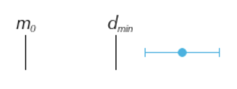
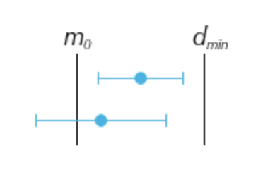
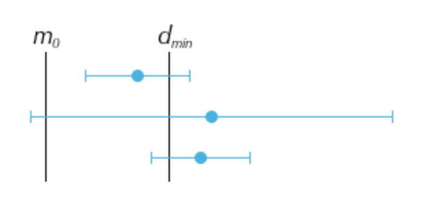
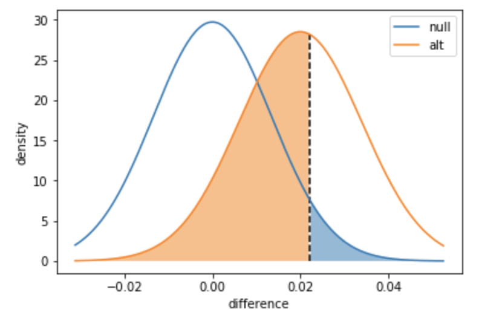
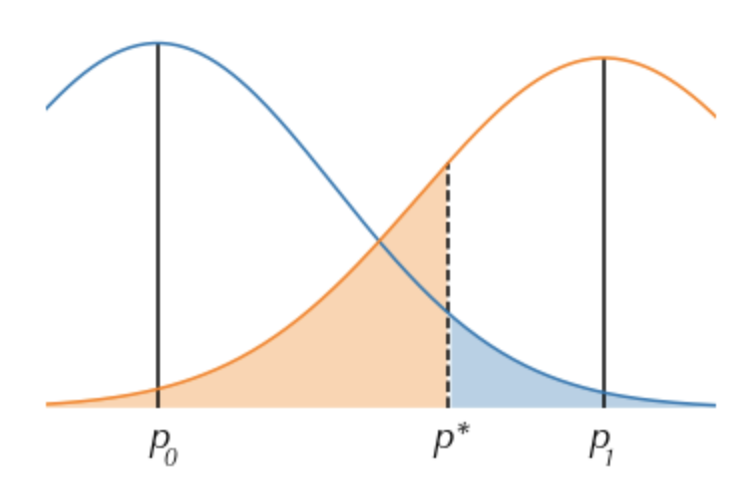
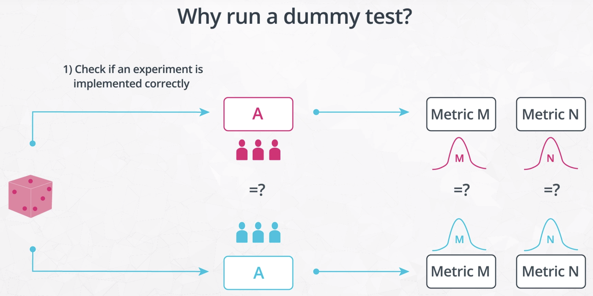
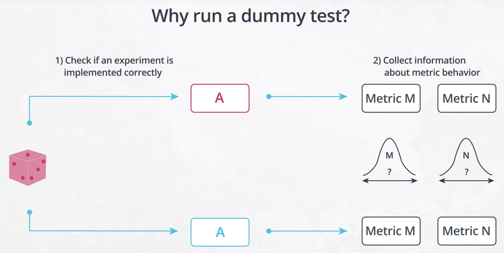
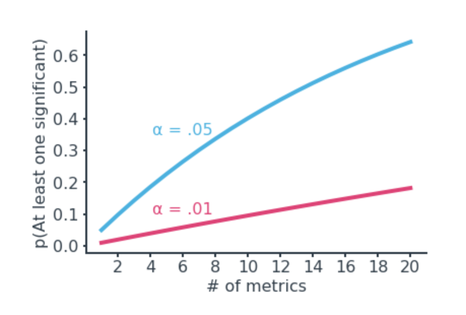
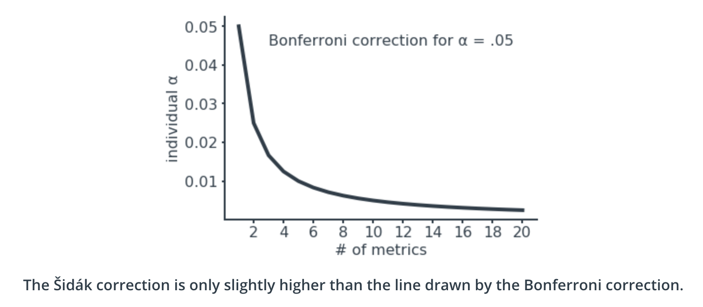

# Statistical Considerations in Testing

- [Statistical Considerations in Testing](#statistical-considerations-in-testing)
  - [1. Statistical significance](#1-statistical-significance)
  - [2. Practical significance](#2-practical-significance)
  - [3. Experiment size decision](#3-experiment-size-decision)
  - [4. Using dummy tests](#4-using-dummy-tests)
  - [5. Non-parametric test](#5-non-parametric-test)
  - [6. Analyzing multiple metrics](#6-analyzing-multiple-metrics)
  - [7. Early stopping](#7-early-stopping)

## 1. Statistical significance

- **Checking the Invariant Metric**

  First of all, we should check that the number of visitors assigned to each group is similar. It's important to check the invariant metrics as a prerequisite so that our inferences on the evaluation metrics are founded on solid ground. If we find that the two groups are imbalanced on the invariant metric, then this will require us to look carefully at how the visitors were split so that any sources of bias are accounted for. It's possible that a statistically significant difference in an invariant metric will require us to revise random assignment procedures and re-do data collection.

- **Checking the Evaluation Metric**

  After performing our checks on the invariant metric, we can move on to performing a hypothesis test on the evaluation metric, e.g., the click-through rate. For example, we want to see that the experimental group has a significantly larger click-through rate than the control group, a one-tailed test.

## 2. Practical significance

Even if an experiment result shows a statistically significant difference in an evaluation metric between control and experimental groups, that does not necessarily mean that the experiment was a success. If there are any costs associated with deploying a change, those costs might outweigh the benefits expected based on the experiment results. **Practical significance** refers to the level of effect that you need to observe in order for the experiment to be called a true success and implemented in truth. Not all experiments imply a practical significance boundary, but it's an important factor in the interpretation of outcomes where it is relevant.

If you consider the confidence interval for an evaluation metric statistic against the null baseline and practical significance bound, there are a few cases that can come about.

- **Confidence interval is fully in practical significance region**

  Below, $m_0$ indicates the null statistic value, $d_{min}$ the practical significance bound, and the blue line the confidence interval for the observed statistic. We assume that we're looking for a positive change, ignoring the negative equivalent for $d_{min}$

  

  If the confidence interval for the statistic does not include the null or the practical significance level, then the experimental manipulation can be concluded to have a statistically and practically significant effect. It is clearest in this case that the manipulation should be implemented as a success.

- **Confidence interval completely excludes any part of practical significance region**

  

  If the confidence interval does not include any values that would be considered practically significant, this is a clear case for us to not implement the experimental change. This includes the case where the metric is statistically significant, but whose interval does not extend past the practical significance bounds. With such a low chance of practical significance being achieved on the metric, we should be wary of implementing the change.

- **Confidence interval includes points both inside and outside practical significance bounds**

  

  This leaves the trickiest cases to consider, where the confidence interval straddles the practical significance bound. In each of these cases, there is an uncertain possibility of practical significance being achieved. In an ideal world, you would be able to **collect more data to reduce our uncertainty**, reducing the scenario to one of the previous cases. Outside of this, you'll need to **consider the risks** carefully in order to make a recommendation on whether or not to follow through with a tested change. Your analysis might also **reveal subsets of the population or aspects of the manipulation that do work**, in order to refine further studies or experiments.

## 3. Experiment size decision

- **Statistical power**

  Statistical power is the probability of rejecting the null hypothesis, given the true mean (different from the null). E.g., detect a 2% absolute increase in click-through rate 80% of the time (power = 0.8), at a Type I error rate of $\alpha$ = 0.05.

  We can use the knowledge of our desired practical significance boundary to plan out our experiment. By knowing how many observations we need in order to detect our desired effect to our desired level of reliability, we can see how long we would need to run our experiment and whether or not it is feasible.

  

- **Method 1: trial and error**

  One way we could solve this is through trial and error. Every sample size will have a level of power associated with it; testing multiple sample sizes will gradually allow us to narrow down the minimum sample size required to obtain our desired power level. This isn't a particularly efficient method, but it can provide an intuition for how experiment sizing works.

  - Compute power for a given experiment size

    ```python
    def power(p_null, p_alt, n, alpha = .05, plot = True):
        """
        Compute the power of detecting the difference in two populations with 
        different proportion parameters, given a desired alpha rate.
        
        Input parameters:
            p_null: base success rate under null hypothesis
            p_alt : desired success rate to be detected, must be larger than
                    p_null
            n     : number of observations made in each group
            alpha : Type-I error rate
            plot  : boolean for whether or not a plot of distributions will be
                    created
        
        Output value:
            power : Power to detect the desired difference, under the null.
        """
        
        # Compute the power
        se_null = np.sqrt(p_null*(1-p_null)/n + p_null*(1-p_null)/n)
        null_dist = stats.norm(loc=0, scale=se_null)
        p_crit = null_dist.ppf(1-alpha)
        
        se_alt = np.sqrt(p_null*(1-p_null)/n + p_alt*(1-p_alt)/n)
        alt_dist = stats.norm(loc=p_alt-p_null, scale=se_alt)
        beta = alt_dist.cdf(p_crit)
        
        if plot:
            # Compute distribution heights
            low_bound = null_dist.ppf(.01)
            high_bound = alt_dist.ppf(.99)
            x = np.linspace(low_bound, high_bound, 201)
            y_null = null_dist.pdf(x)
            y_alt = alt_dist.pdf(x)

            # Plot the distributions
            plt.plot(x, y_null)
            plt.plot(x, y_alt)
            plt.vlines(p_crit, 0, np.amax([null_dist.pdf(p_crit), alt_dist.pdf(p_crit)]),
                      linestyles = '--')
            plt.fill_between(x, y_null, 0, where = (x >= p_crit), alpha = .5)
            plt.fill_between(x, y_alt , 0, where = (x <= p_crit), alpha = .5)
            
            plt.legend(['null','alt'])
            plt.xlabel('difference')
            plt.ylabel('density')
            plt.show()
        
        # return power
        return (1 - beta)

    power(.1, .12, 1000)
    ```

  

  - Note on interpretation

    The example here is a one-tailed test, with the alternative value greater than the null. The power computations performed in this method will not work if the alternative proportion is lower than the null, e.g. detecting a proportion parameter of 0.88 against a null of 0.9.

- **Method 2: analytic solution**

  We can approach a closed-form solution for computing a minimum experiment size. The key point to notice is that, for an $\alpha$ and $\beta$ both < .5, the critical value for determining statistical significance will fall between our null click-through rate and our alternative, desired click-through rate. So, the difference between $p_0$ and $p_1$ can be subdivided into the distance from $p_0$ to the critical value $p^*$ and the distance from $p^*$ to $p_1$.

  

  Those subdivisions can be expressed in terms of the standard error and the z-scores:

  $$p^* - p_0 = z_{1-\alpha} SE_{0},$$
  $$p_1 - p^* = -z_{\beta} SE_{1};$$

  $$p_1 - p_0 = z_{1-\alpha} SE_{0} - z_{\beta} SE_{1}$$

  In turn, the standard errors can be expressed in terms of the standard deviations of the distributions, divided by the square root of the number of samples in each group:

  $$SE_{0} = \frac{s_{0}}{\sqrt{n}},$$
  $$SE_{1} = \frac{s_{1}}{\sqrt{n}}$$

  Substituting these values in and solving for $n$ will give us a formula for computing a minimum sample size to detect a specified difference, at the desired level of power:

  $$n = \lceil \big(\frac{z_{1-\alpha} s_{0} - z_{\beta} s_{1}}{p_1 - p_0}\big)^2 \rceil$$

  where $\lceil ... \rceil$ represents the ceiling function, rounding up decimal values to the next-higher integer. Implement the necessary variables in the function below, and test them with the cells that follow.

  - Compute minimum experiment size

    ```python
    def experiment_size(p_null, p_alt, alpha = .05, beta = .20):
        """
        Compute the minimum number of samples needed to achieve a desired power
        level for a given effect size.
        
        Input parameters:
            p_null: base success rate under null hypothesis
            p_alt : desired success rate to be detected
            alpha : Type-I error rate
            beta  : Type-II error rate
        
        Output value:
            n : Number of samples required for each group to obtain desired power
        """
        
        # Get necessary z-scores and standard deviations (@ 1 obs per group)
        z_null = stats.norm.ppf(1-alpha)
        z_alt  = stats.norm.ppf(beta)
        sd_null = np.sqrt(p_null*(1-p_null) + p_null*(1-p_null))
        sd_alt  = np.sqrt(p_null*(1-p_null) + p_alt*(1-p_alt))
        
        # Compute and return minimum sample size
        n = ((z_null*sd_null - z_alt*sd_alt)/(p_alt-p_null)) ** 2
        return np.ceil(n)

    experiment_size(.1, .12) # 2863
    ```

  - Note on interpretation

    One thing to realize is that if the true size of the experimental effect is the same as the desired practical significance level, then it's a coin flip whether the mean will be above or below the practical significance bound. This also doesn't even consider how a confidence interval might interact with that bound. In a way, experiment sizing is a way of checking on whether or not you'll be able to get what you want from running an experiment, rather than checking if you'll get what you need.

- **Method 3: Python packages for sample sizing decisions**

  - The sample size calculator [here](http://www.evanmiller.org/ab-testing/sample-size.html) is applicable for proportions, and provides the same results as the methods explored above. Note that the calculator assumes a two-tailed test, however.
  
  - Python package "statsmodels" has a number of functions in its [`power` module](https://www.statsmodels.org/stable/stats.html#power-and-sample-size-calculations) that perform power and sample size calculations. Unlike previously shown methods, differences between null and alternative are parameterized as an effect size (standardized difference between group means divided by the standard deviation). Thus, we can use these functions for more than just tests of proportions.

    If we want to do the same tests as before, the [`proportion_effectsize`](http://www.statsmodels.org/stable/generated/statsmodels.stats.proportion.proportion_effectsize.html) function computes [Cohen's h](https://en.wikipedia.org/wiki/Cohen%27s_h) as a measure of effect size. As a result, the output of the statsmodel functions will be different from the result expected above. This shouldn't be a major concern since in most cases, you're not going to be stopping based on an exact number of observations. You'll just use the value to make general design decisions.

  - Example of using statsmodels for sample size calculation

    ```python
    from statsmodels.stats.power import NormalIndPower
    from statsmodels.stats.proportion import proportion_effectsize

    # leave out the "nobs" parameter to solve for it
    NormalIndPower().solve_power(effect_size = proportion_effectsize(.12, .1), alpha = .05, power = 0.8,
                                alternative = 'larger')
    ```

- **Logistics after computing experiment size**

  - **Estimate a minimum experiment length:** After computing the number of observations needed for an experiment to reliably detect a specified level of experimental effect (i.e. statistical power), we need to divide by the expected number of observations per day in order to get a minimum experiment length. We want to make sure that an experiment can be completed in a reasonable time frame so that if we do have a successful effect, it can be deployed as soon as possible and resources can be freed up to run new experiments. What a 'reasonable time frame' means will depend on how important a change will be, but if the length of time is beyond a month or two, that's probably a sign that it's too long.

  - **Ways to reduce an experiment's duration:**

    - We could, of course, **change our statistical parameters**. Accepting higher Type I or Type II error rates will reduce the number of observations needed. So too will increasing the effect size: it's much easier to detect larger changes.

    - Another option is to **change the unit of diversion**. A 'wider' unit of diversion will result in more observations being generated. For example, you could consider moving from a cookie-based diversion in a web-based experiment to an event-based diversion like pageviews. The tradeoff is that event-based diversion could create inconsistent website experiences for users who visit the site multiple times.

## 4. Using dummy tests

- **Dummy test**

  Dummy test is an experiment run between equivalent groups (i.e. no experiment group).

- When it comes to designing an experiment, it might be useful to run a dummy test as a predecessor to or as part of that process. In a dummy test, you will implement the same steps that you would in an actual experiment to assign the experimental units into groups. However, the experimental manipulation won't actually be implemented, and the groups will be treated equivalently.

- There are multiple reasons to run a dummy test.
  - First, a dummy test can expose if there are any errors in the randomization or assignment procedures. A short dummy test can be worth the investment if an invariant metric is found to have a statistically significant difference, or if some other systematic bias is identified, because it can help avoid larger problems down the line.

    

  - A second reason to run a dummy test is to collect data on metrics' behaviors. If historic data is not enough to predict the outcome of recorded metrics or allow for experiment duration to be computed, then a dummy test can be useful for getting baselines.

    

- Of course, performing a dummy test requires an investment of resources, the most important of which is time. If time is of the essence, then you may need to just go ahead with the experiment, keeping an eye on invariant metrics for any trouble. An alternative approach is to perform a hybrid test. In the A/B testing paradigm, this can take the form of an A/A/B test. That is, we split the data into three groups: two control and one experimental. A comparison between control groups can be used to learn about null-environment properties before making inferences on the effect of the experimental manipulation.

## 5. Non-parametric test

- It's possible that you will encounter scenarios where you can't rely on only standard tests. This might be due to uncertainty about the true variability of a metric's distribution, a lack of data to assume normality, or wanting to do inference on a statistic that lacks a standard test. It's useful to know about some non-parametric tests, not just as a workaround for cases like this, but also as a second check on your experimental results.
  
  [Link to non-parametric test notes](../statistics/non_parametric_test.md)

## 6. Analyzing multiple metrics

- Type-I error correction for independent metrics

  If you're tracking multiple evaluation metrics, make sure that you're aware of how the Type I error rates on individual metrics can affect the overall chance of making some kind of Type I error. The simplest case we can consider is if we have _n_ independent evaluation metrics, and that seeing one with a statistically significant result would be enough to call the manipulation a success. In this case, the probability of making at least one Type I error is given by $\alpha_{over} = 1 - (1-\alpha_{ind})^n$
 , illustrated in the below image for individual $\alpha_{ind} = .05$ and $\alpha_{ind} = .01$

  

  To protect against this, we need to introduce a correction factor on the individual test error rate so that the overall error rate is at most the desired level.
  
    - **Bonferroni correction:** A conservative approach that divides the overall error rate by the number of metrics tested:

      $\alpha_{ind} = \alpha_{over}/n$

    - **Šidák correction:** If we assume independence between metrics, we can do a little bit better:

      $\alpha_{ind} = 1-(1-\alpha_{over})^{1/n}$

  

- Real-world considerations

  - In real life, evaluation scenarios are rarely so straightforward. Metrics will likely be correlated in some way, rather than being independent. If a positive correlation exists, then knowing the outcome of one metric will make it more likely for a correlated metric to also point in the same way. In this case, the corrections above will be more conservative than necessary, resulting in an overall error rate smaller than the desired level. (In cases of negative correlation, the true error rate could go either way, depending on the types of tests performed.)

  - In addition, we might need multiple metrics to show statistical significance to call an experiment a success, or there may be different degrees of success depending on which metrics appear to be moved by the manipulation. One metric may not be enough to make it worth deploying a change tested in an experiment. Reducing the individual error rate will make it harder for a truly significant effect to show up as statistically significant. That is, reducing the Type I error rate will also increase the Type II error rate – another conservative shift.

  - Ultimately, there is a small balancing act when it comes to selecting an error-controlling scheme. Being fully conservative with one of the simple corrections above means that you increase the risk of failing to roll out changes that actually have an impact on metrics. Consider the level of dependence between metrics and what results are needed to declare a success to calibrate the right balance in error rates. If you need to see a significant change in all of your metrics to proceed with it, you might not need a correction factor at all. You can also use dummy test results, bootstrapping, and permutation approaches to plan significance thresholds. Finally, don't forget that practical significance can be an all-important quality that overrides other statistical significance findings.

  - While the main focus here has been on interpretation of evaluation metrics, it's worth noting that these cautions also apply to invariant metrics. The more invariant metrics you test, the more likely it will be that some test will show a statistically significant difference even if the groups tested are drawn from equivalent populations. However, it might not be a good idea to apply a correction factor to individual tests since we want to avoid larger issues with interpretation later on. As mentioned previously, a single invariant metric showing a statistically significant difference is not necessarily cause for alarm, but it is something that merits follow-up in case it does have an effect on our analysis.

## 7. Early stopping

- If you peek at the results of an experiment before data collection is complete, and choose to stop early because the test is showing statistical significance, you run the risk of a significant increase in your Type I error rate: believing that your experiment had an effect, when in fact it did not.

- Code to calculate the proportion of trials that are statistically significant in any test, and the proportion of trials that are statistically significant after each individual block

  ```python
  def peeking_sim(alpha = .05, p = .5, n_trials = 1000, n_blocks = 2, n_sims = 10000):
      """
      This function simulates the rate of Type I errors made if an early
      stopping decision is made based on a significant result when peeking ahead.
      
      Input parameters:
          alpha: Supposed Type I error rate
          p: Probability of individual trial success
          n_trials: Number of trials in a full experiment
          n_blocks: Number of times data is looked at (including end)
          n_sims: Number of simulated experiments run
          
      Return:
          p_sig_any: Proportion of simulations significant at any check point, 
          p_sig_each: Proportion of simulations significant at each check point
      """
      
      # generate data
      trials_per_block = np.ceil(n_trials / n_blocks).astype(int)
      data = np.random.binomial(trials_per_block, p, [n_sims, n_blocks])
      
      # standardize data
      data_cumsum = np.cumsum(data, axis = 1)
      block_sizes = trials_per_block * np.arange(1, n_blocks+1, 1)
      block_means = block_sizes * p
      block_sds   = np.sqrt(block_sizes * p * (1-p))
      data_zscores = (data_cumsum - block_means) / block_sds
      
      # test outcomes
      z_crit = stats.norm.ppf(1-alpha/2)
      sig_flags = np.abs(data_zscores) > z_crit
      p_sig_any = (sig_flags.sum(axis = 1) > 0).mean()
      p_sig_each = sig_flags.mean(axis = 0)
      
      return (p_sig_any, p_sig_each)
      
  peeking_sim(n_trials = 10_000, n_sims = 100_000)
  # (0.083570000000000005, array([ 0.05002,  0.05058]))
  ```

  The probability of any significant test outcome across the two blocks is around 8.6% and the probability of a significant test outcome at each individual block checkpoint is around 5%.

- The safest way we could deal with performing multiple checks and making poor early stopping decisions is to simply not do it. Once an experiment has been planned and all assignment procedures checked, you should just let the experiment run to completion and just assess the results at the very end. **Performing early stopping requires additional planning.**

- One way in which you could solve for multiple peeking is to adjust the significance level of individual tests so that the overall error rate is at its desired level. But applying the Bonferroni or Šidák corrections as shown earlier in the lesson will definitely be too conservative, since we know that there is a correlation in test results between peeks. If we see some simulated run with z-score above the threshold at the halfway point, it's more likely to be above that threshold at the end point, compared to some other simulated run that is not statistically significant at the halfway point. One way in which we can obtain a better significance threshold is through the power of simulation.

- Code to adjust the individual test-wise error rate to preserve an overall error rate

  ```python
  def peeking_correction(alpha = .05, p = .5, n_trials = 1000, n_blocks = 2, n_sims = 10000):
      """
      This function uses simulations to estimate the individual error rate necessary
      to limit the Type I error rate, if an early stopping decision is made based on
      a significant result when peeking ahead.
      
      Input parameters:
          alpha: Desired overall Type I error rate
          p: Probability of individual trial success
          n_trials: Number of trials in a full experiment
          n_blocks: Number of times data is looked at (including end)
          n_sims: Number of simulated experiments run
          
      Return:
          alpha_ind: Individual error rate required to achieve overall error rate
      """
      
      # generate data
      trials_per_block = np.ceil(n_trials / n_blocks).astype(int)
      data = np.random.binomial(trials_per_block, p, [n_sims, n_blocks])
      
      # standardize data
      data_cumsum = np.cumsum(data, axis = 1)
      block_sizes = trials_per_block * np.arange(1, n_blocks+1, 1)
      block_means = block_sizes * p
      block_sds   = np.sqrt(block_sizes * p * (1-p))
      data_zscores = (data_cumsum - block_means) / block_sds
      
      # find necessary individual error rate
      max_zscores = np.abs(data_zscores).max(axis = 1)
      z_crit_ind = np.percentile(max_zscores, 100 * (1 - alpha))
      alpha_ind = 2 * (1 - stats.norm.cdf(z_crit_ind))
      
      return alpha_ind

  peeking_correction(n_trials = 10_000, n_sims = 100_000)
  # 0.03
  ```

- Note that there are other ways of putting together a design to allow for making an early decision on an experiment. For continuous tracking, [this page](https://www.evanmiller.org/sequential-ab-testing.html) describes a rule of thumb for rate-based metrics, tracking the number of successes in each group and stopping the experiment once the counts' sum or difference exceeds some threshold. More generally, tests like the [sequential probability ratio test](https://en.wikipedia.org/wiki/Sequential_probability_ratio_test) can be developed to make an early stopping decision while an experiment is running, if it looks statistically unlikely for a metric to move past or fall back against the statistical significance bound.