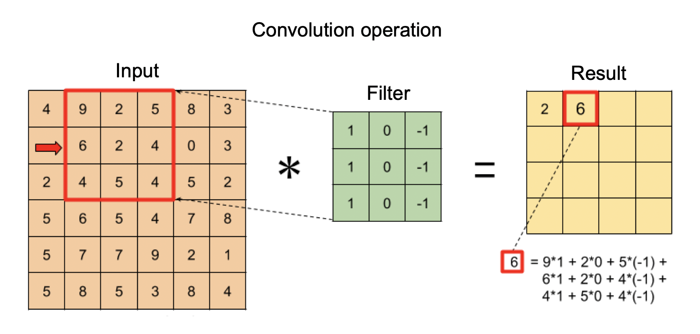
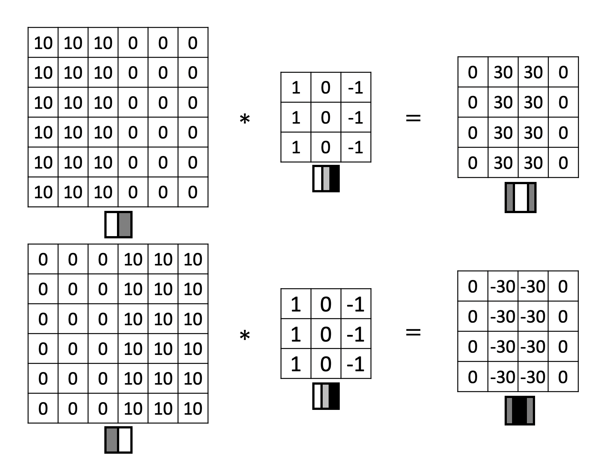
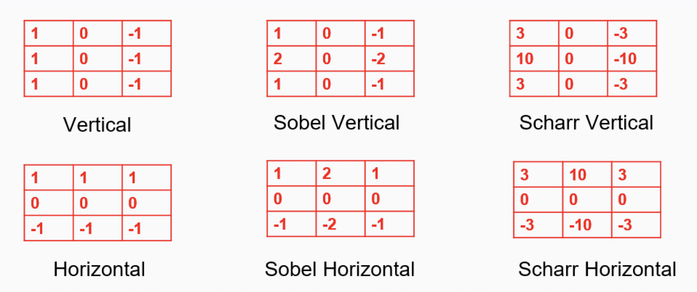
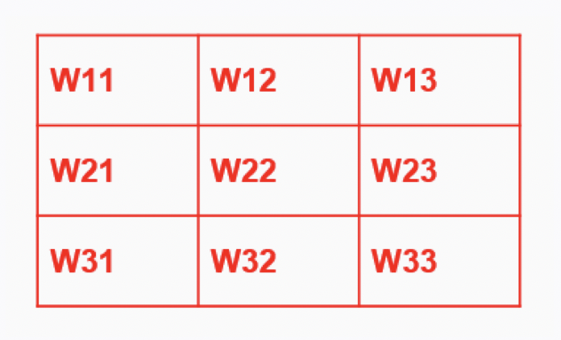
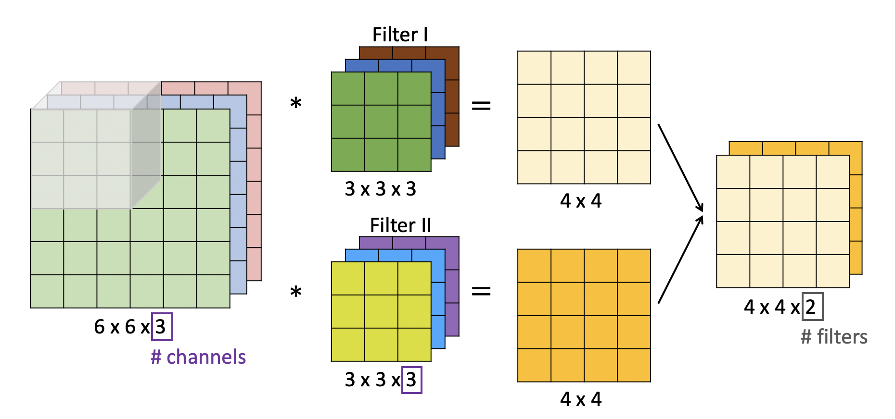
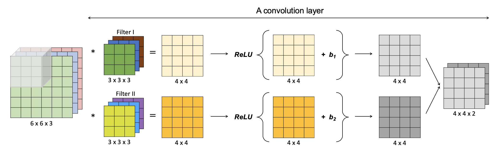
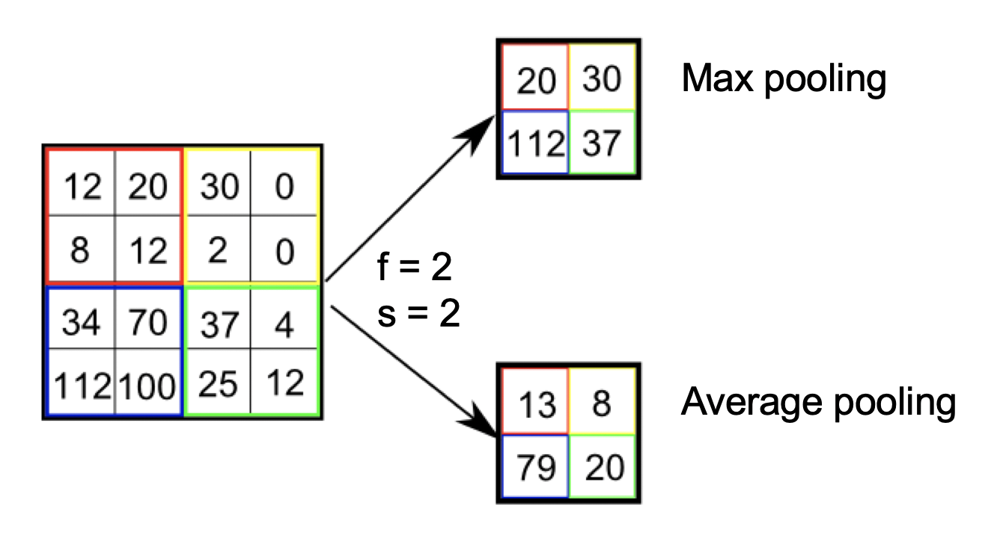
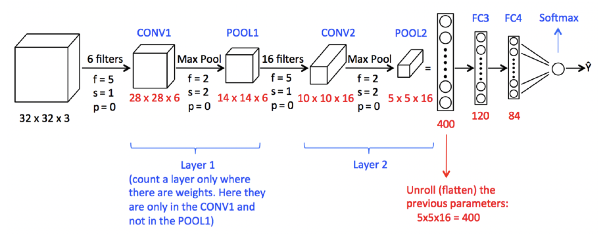
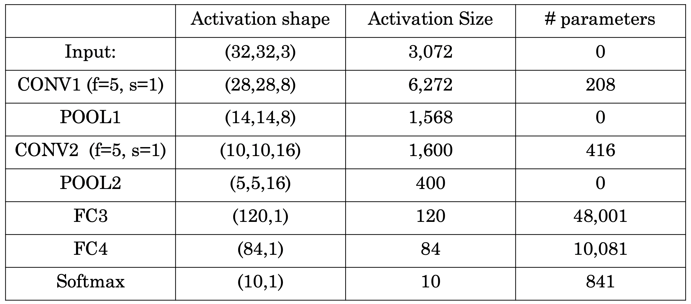
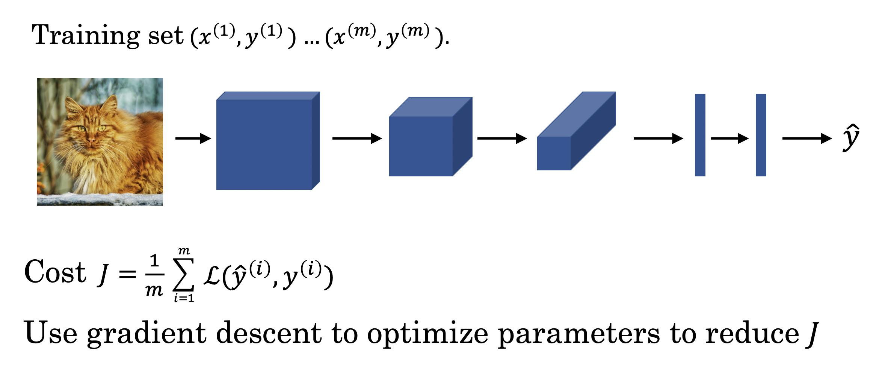

# Convolutional Neural Networks

- [Convolutional Neural Networks](#convolutional-neural-networks)
  - [1. Foundations of convolutional neural networks](#1-foundations-of-convolutional-neural-networks)
    - [1.1. Computer vision](#11-computer-vision)
    - [1.2. Convolution operation](#12-convolution-operation)
    - [1.3. Edge detection](#13-edge-detection)
    - [1.4. Padding](#14-padding)
    - [1.5. Strided convolution](#15-strided-convolution)
    - [1.6. Convolution layer](#16-convolution-layer)
    - [1.7. Pooling layer](#17-pooling-layer)
    - [1.8. CNN schematics](#18-cnn-schematics)
    - [1.9. Why convolutions](#19-why-convolutions)

## 1. Foundations of convolutional neural networks

### 1.1. Computer vision

- Why computer vision

  - Rapid advances in computer vision are enabling brand new applications
  - Cross-fertilization into other areas, because the computer vision research community has been so creative and so inventive in coming up with new neural network architectures and algorithms

- Computer vision applications

  - Image classification
  - Object detection
  - Neural style transfer

- One challenge of computer vision: the inputs can get really big

  - Easily overfitting
  - Infeasible computational and memory requirements

### 1.2. Convolution operation

- How convolution operation works

    
  Thechnically, this operation is called cross correlation by mathematicians

- Code

  - Python: `conv_forward`
  - TensorFlow: `tf.nn.conv2d`
  - Keras: `Conv2D`

### 1.3. Edge detection

- Edge example

  

- Vertical edge detection

  

- Hand-coded edge detection filters

  

  Dimension: , where f is usually odd

- Learn the filter parameters from neural network

  

### 1.4. Padding

- Downside of convolution operation

  - (-) Shrinking output
  - (-) throwing away information from edges

- Padding

  Common to zero-pad the border. In the example below, the padding p = 1.

  

- Valid and same convolutions

  - Valid convolution: no padding

    

  - Same convolution: pad so that output size is the same as the input sizes

    

- Advantages of padding

  - (+) Allows you to use a CONV layer without necessarily shrinking the height and width of the volumes. This is important for building deeper networks, since otherwise the height/width would shrink as you go to deeper layers.
  - (+) Helps us keep more of the information at the border of an image. Without padding, very few values at the next layer would be affected by pixels as the edges of an image.

### 1.5. Strided convolution

- Stride example

  In the example below, stride s = 2.

  

  Output dimension:   
  By convention, the filter must be fully contained in the input image to do convolution.

### 1.6. Convolution layer

- Convolutions over volume

  

  

- Notation

  - : filter size
  - : padding size
  - : stride size

- Dimensions

  - Input: 

  - Output: , where

        
      

  - Each filter: 

      Weights:   
      Bias: 

  - Activation: 

      Activation vectorized: 

     

### 1.7. Pooling layer

- Hyperparameters

  - : filter size
  - : stride size
  - Max or average pooling
  - Pooling usually does not use any padding

- Pooling

  - **Max-pooling layer:** slides an ( f, f ) window over the input and stores the max value of the window in the output.
  - **Average-pooling layer:** slides an ( f, f ) window over the input and stores the average value of the window in the output.

  

  

  - Applies to each channels independently
  - No parameters for backpropagation to learn

- Pdvantages of pooling in ConvNet

  - (+) Reduces the size of the input
  - (+) Speeds up the computation
  - (+) Makes feature detectors more invariant to its position in the input

### 1.8. CNN schematics

- Types of layer in a convolutional network

  - Convolution (CONV)
  - Pooling (POOL)
  - Fully-connected (FC)

- Schematics

  

  

   

  From left to right, the height and width often decrease, and the number of channels often increase.

### 1.9. Why convolutions

- Advantages of convolutional layers over fully connected layers

  - (+) **Parameter sharing:** A feature detector (such as a vertical edge detector) that’s useful in one part of the image is probably useful in another part of the image.

    - Reduces the total number of parameters, thus reducing overfitting.
    - Allows a feature detector to be used in multiple locations throughout the whole input image/input volume. Good at capturing **translation invariance** (e.g. over different places in a picture) because you are applying the same filter.

  - (+) **Sparsity of connections:** In each layer, each output value depends only on a small number of inputs.

- Putting all together

  

- Learn more about convolutional neural networks

  - [An intro to ConvNet and Image Recognition on YouTube](https://www.youtube.com/watch?v=2-Ol7ZB0MmU)
  - [An intuitive guide to ConvNet on Medium](https://medium.freecodecamp.org/an-intuitive-guide-to-convolutional-neural-networks-260c2de0a050)
