# Convolutional Neural Networks

- [Convolutional Neural Networks](#convolutional-neural-networks)
  - [1. Foundations of convolutional neural networks (CNN)](#1-foundations-of-convolutional-neural-networks-cnn)
    - [1.1. Computer vision](#11-computer-vision)
    - [1.2. Convolution operation](#12-convolution-operation)
    - [1.3. Padding](#13-padding)
    - [1.4. Strided convolution](#14-strided-convolution)
    - [1.5. Convolution layer](#15-convolution-layer)
    - [1.6. Pooling layer](#16-pooling-layer)
    - [1.7. CNN schematics](#17-cnn-schematics)
    - [1.8. Why convolutions](#18-why-convolutions)
  - [2. CNN case studies](#2-cnn-case-studies)
    - [2.1. Classic networks](#21-classic-networks)
    - [2.2. ResNet](#22-resnet)
    - [2.3. Inception neural networks](#23-inception-neural-networks)
  - [3. Practical advices for using CNN](#3-practical-advices-for-using-cnn)
    - [3.1. General tips](#31-general-tips)
    - [3.2. Data vs. hand-engineering](#32-data-vs-hand-engineering)
    - [3.3. Tips for doing well on benchmarks/winning competitions](#33-tips-for-doing-well-on-benchmarkswinning-competitions)
  - [4. Object detection](#4-object-detection)
    - [4.1. Object localization](#41-object-localization)
    - [4.2. Landmark detection](#42-landmark-detection)
    - [4.3. Object detection with sliding windows](#43-object-detection-with-sliding-windows)
    - [4.4. Convolutional implementation of sliding windows](#44-convolutional-implementation-of-sliding-windows)
    - [4.5. Bounding box predictions with YOLO](#45-bounding-box-predictions-with-yolo)
    - [4.6. Region proposals](#46-region-proposals)

## 1. Foundations of convolutional neural networks (CNN)

### 1.1. Computer vision

- Why computer vision

  - Rapid advances in computer vision are enabling brand new applications
  - Cross-fertilization into other areas, because the computer vision research community has been so creative and so inventive in coming up with new neural network architectures and algorithms

- Computer vision applications

  - Image classification
  - Object detection
  - Neural style transfer

- One challenge of computer vision: the inputs can get really big

  - Easily overfitting
  - Infeasible computational and memory requirements

### 1.2. Convolution operation

- How convolution operation works

    
  Thechnically, this operation is called cross correlation by mathematicians

- Code

  - Python: `conv_forward`
  - TensorFlow: `tf.nn.conv2d`
  - Keras: `Conv2D`

- Edge detection, an example application of convolution

  - Edge example

    

  - Vertical edge detection

    

  - Hand-coded edge detection filters

    

    Dimension: , where f is usually odd

  - Learn the filter parameters from neural network

    

### 1.3. Padding

- Downside of convolution operation

  - (-) Shrinking output
  - (-) throwing away information from edges

- Padding on the input matrix

  Common to zero-pad the border. In the example below, the padding p = 1.

  

- Valid and same convolutions

  - **Valid convolution:** no padding

    

  - **Same convolution:** pad so that output size is the same as the input sizes

    

- Padding conventions

  The most commonly used padding mode in CNN is "same" padding.

  - Same padding preserves the height and width of the input images or tensors, which make designing a network architecture more convenient.
  - For valid padding, the volume of the tensors would decrease substantially in neural networks with many layers, which can be dangerous to the network performance.
  - In practice,it is recommended that you preserve the spatial size using same padding for the convolutional layers and decrease the spatial size via pooling layers instead.

- Advantages of padding

  - (+) Allows you to use a CONV layer without necessarily shrinking the height and width of the volumes. This is important for building deeper networks, since otherwise the height/width would shrink as you go to deeper layers.
  - (+) Helps us keep more of the information at the border of an image. Without padding, very few values at the next layer would be affected by pixels as the edges of an image.

### 1.4. Strided convolution

- Stride example

  In the example below, stride s = 2.

  

  Output dimension:   
  By convention, the filter must be fully contained in the input image to do convolution.

### 1.5. Convolution layer

- Convolutions over volume

  

  

- Notation

  - : filter size
  - : padding size
  - : stride size

- Dimensions

  - Input: 

  - Output: , where

        
      

  - Each filter: 

      Weights:   
      Bias: 

  - Activation: 

      Activation vectorized: 

     

### 1.6. Pooling layer

- Hyperparameters

  - : filter size
  - : stride size
  - Max or average pooling
  - Pooling usually does not use any padding

- Pooling

  - **Max-pooling layer:** slides an ( f, f ) window over the input and stores the max value of the window in the output.
  - **Average-pooling layer:** slides an ( f, f ) window over the input and stores the average value of the window in the output.

  

  

  - Applies to each channels independently
  - No parameters for backpropagation to learn

- Advantages of pooling in ConvNet

  - (+) Reduces the size of the input
  - (+) Speeds up the computation
  - (+) Makes feature detectors more invariant to its position in the input

### 1.7. CNN schematics

- Types of layer in a convolutional network

  - Convolution (CONV)
  - Pooling (POOL)
  - Fully-connected (FC)

- Workflow

  

  

   

  - From left to right, the height and width often decrease, and the number of channels often increase.
  - In order to be able to build very deep networks, we usually only use pooling layers to downsize the height/width of the activation volumes while convolutions are used with “same” padding. Otherwise, we would downsize the input of the model too quickly.

### 1.8. Why convolutions

- Advantages of convolutional layers over fully connected layers

  - (+) **Parameter sharing:** A feature detector (such as a vertical edge detector) that’s useful in one part of the image is probably useful in another part of the image.

    - Reduces the total number of parameters, thus reducing overfitting.
    - Allows a feature detector to be used in multiple locations throughout the whole input image/input volume. Good at capturing **translation invariance** (e.g. over different places in a picture) because you are applying the same filter.

  - (+) **Sparsity of connections:** In each layer, each output value depends only on a small number of inputs.

- Putting all together

  

- Learn more about convolutional neural networks

  - [An intro to ConvNet and Image Recognition on YouTube](https://www.youtube.com/watch?v=2-Ol7ZB0MmU)
  - [An intuitive guide to ConvNet on Medium](https://medium.freecodecamp.org/an-intuitive-guide-to-convolutional-neural-networks-260c2de0a050)

## 2. CNN case studies

### 2.1. Classic networks

- #### LeNet-5

    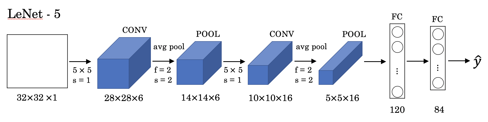  
    [LeCun et al., 1998. Gradient-based learning applied to document recognition]

    - The goal of LeNet-5 was to recognize handwritten digits on grayscale images of 32 by 32 by 1.
    - From left to right, the height and width decrease, and the number of channels increases.
    - ~60K parameters

- #### AlexNet

    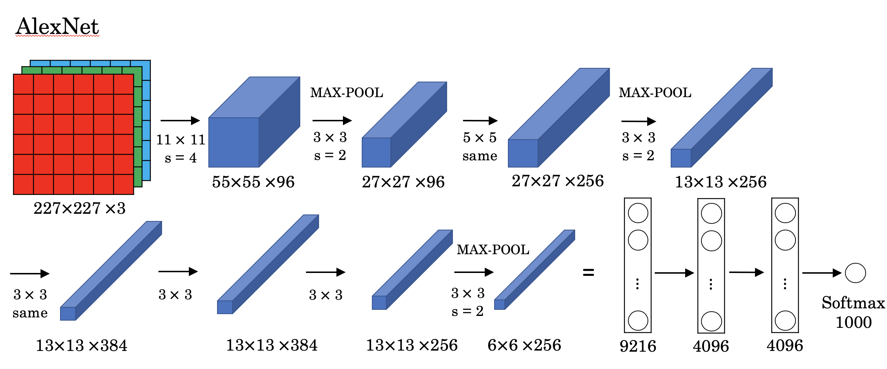  
    [Krizhevsky et al., 2012. ImageNet classification with deep convolutional neural networks]

    - Similar to LeNet-5 but much bigger
    - Uses ReLu activation rather than sigmoid/tanh
    - ~60M parameters

- #### VGG

    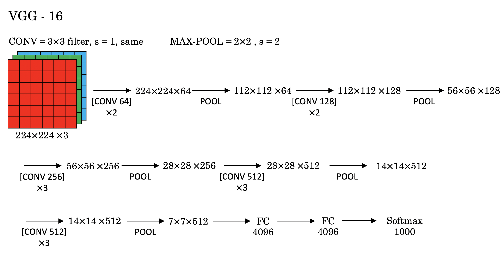  
    [Simonyan & Zisserman 2015. Very deep convolutional networks for large-scale image recognition]

    - Relatively deep CNN, 16 layers that have weights
    - Simplified architecture, with same hyperparameters among CONV layers, and same hyperparameters among POOL layers, except for the number of channels that roughly doubles for every step.
    - ~138M parameters

### 2.2. ResNet

- #### The problem of very deep neural networks

    The main benefit of a very deep network is that it can represent very complex functions. It can also learn features at many different levels of abstraction, from edges (at the lower layers) to very complex features (at the deeper layers). However, **very deep "plain" networks don't work in practice because they are hard to train due to vanishing gradients.**

    - Vanishing gradient is a huge barrier to training: very deep networks often have a gradient signal that goes to zero quickly, thus making gradient descent unbearably slow. More specifically, during gradient descent, as you backprop from the final layer back to the first layer, you are multiplying by the weight matrix on each step, and thus the gradient can decrease exponentially quickly to zero (or, in rare cases, grow exponentially quickly and "explode" to take very large values).
    - During training, you might therefore see the magnitude (or norm) of the gradient for the earlier layers descrease to zero very rapidly as training proceeds:

        

- #### Residual block

    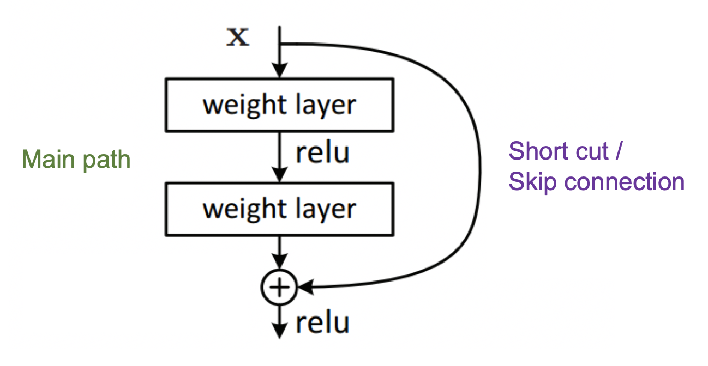  
    [He et al., 2015. Deep residual networks for image recognition]

    - **The identity block**

        The input activation  usually has the same dimension as the output activation  by using "same" padding.  
        

        

    - **The convolution block**

        When  and  don't have the same dimension, implement an additional matrix to convert 's dimension to 's.   

        

- #### Residual network

    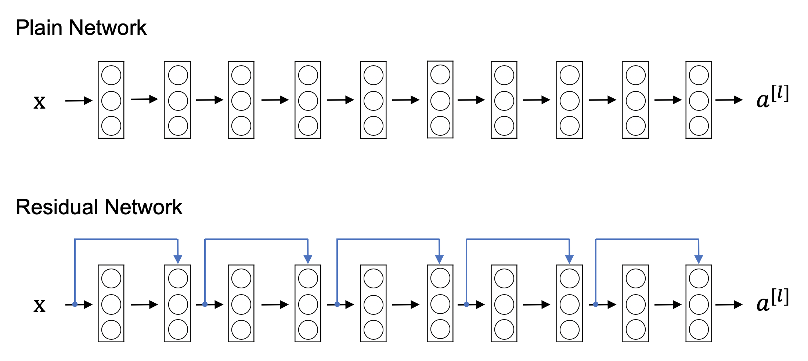  

    - (+) The skip connection helps to address vanishing gradient problem.
    - (+) The skip-connection makes it easy for a ResNet block to learn an identity mapping between the input and the output of the ResNet block.

        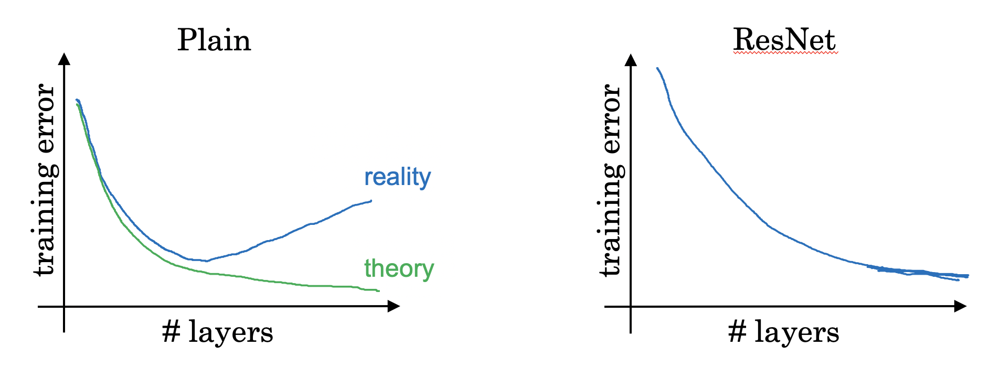

- #### Why ResNets work

    - (+) Allows to train much deeper neural networks without hurting the performance. Adding two layers in the neural network doesn't hurt the network's ability to do as well as this simpler network without these two extra layers, because identity function is easy for residual block to learn (not so easy in plain network).

    - (+) Helps with the vanishing and exploding gradient problems. Using a skip-connection helps the gradient to be directly backpropagated to earlier layers, and thus helps you to train deeper networks. May lead to a simpler architecture.

### 2.3. Inception neural networks

- #### Networks in networks and 1 x 1 convolutions

    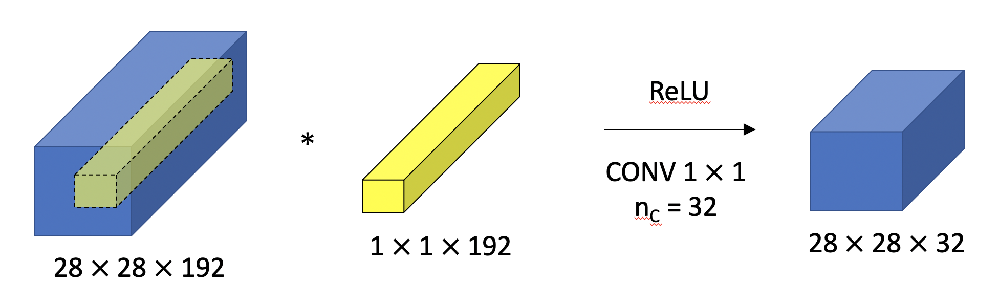  
    [Lin et al., 2013. Network in network]

    - (+) Allows to shrink the number of channels and therefore, saves computation in some networks
    - (+) Adds non-linearity by allowings to learn the more complex function

- #### Inception network motivation

    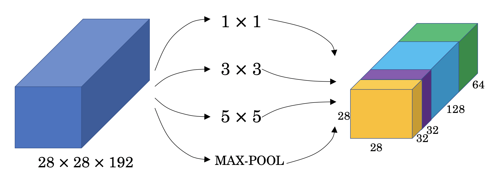  
    [Szegedy et al. 2014. Going deeper with convolutions]

- #### Use 1 x 1 convolutions to solve the computational cost problem

    - Convolution can be very costly

        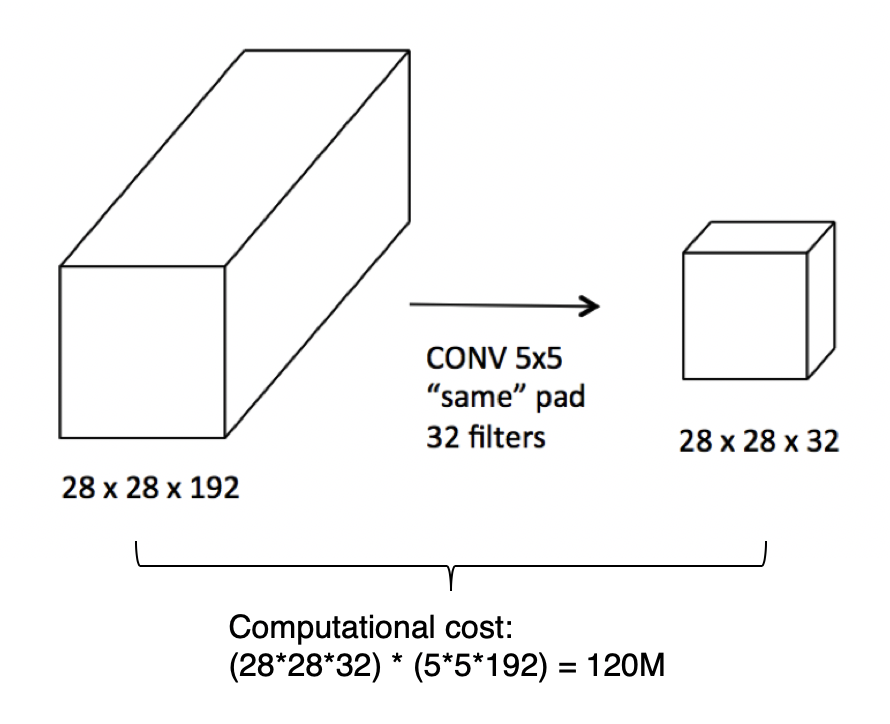

    - Use 1 x 1 convolution to reduce cost by a factor of ~10

        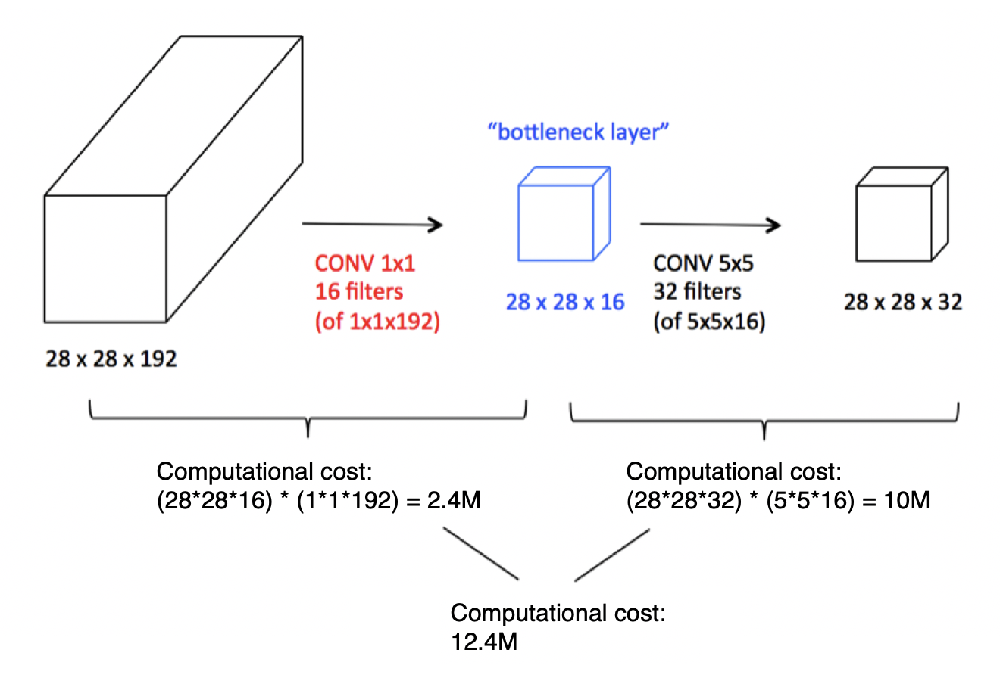

- #### Inception module

    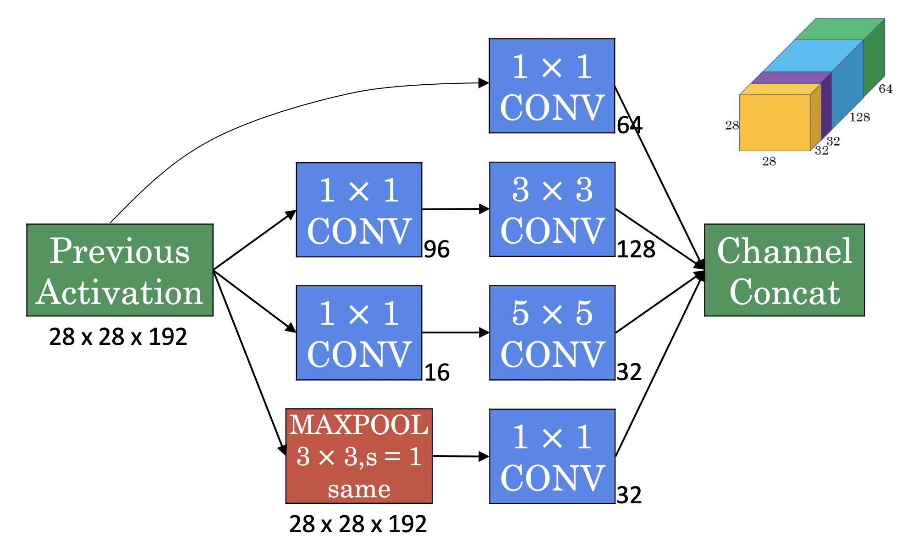  
    Building block of the inception network  
    [Szegedy et al., 2014, Going Deeper with Convolutions]

- #### Inception network

    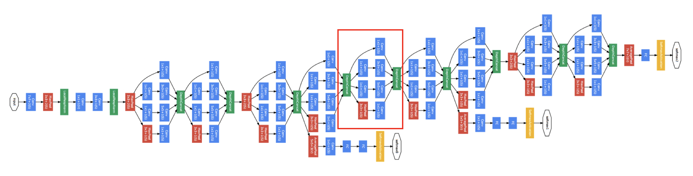  
    This particular network inception network is also known as "GoogleNet".  
    [Szegedy et al., 2014, Going Deeper with Convolutions]

    - (+) The additional outputs from the hidden layers help to ensure that the features computed even in the hidden layers not too bad for predicting the output class of a image, which appears to have a regularizing effect on the inception network and helps prevent this network from overfitting.

## 3. Practical advices for using CNN

### 3.1. General tips

- Use open source implementation instead of re-inventing the wheels

  - Use architectures of networks published in the literature
  - Use open source implementations if possible

- Transfer learning

  - Use pretrained models and fine tune on your dataset

- Data augmentation to improve the performance of computer vision systems

### 3.2. Data vs. hand-engineering

- 2 sources of knowledge

    - Labeled data
    - Hand-engineered features/network architecture/other components

    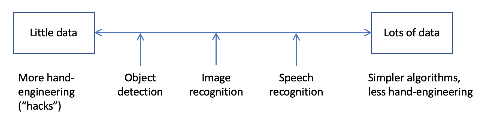

### 3.3. Tips for doing well on benchmarks/winning competitions

- Warning: not necessarily practical and rarely used when building production systems
- Ensembling: train several networks independently and average their outputs
- Multi-crop at test time: run classifier on multiple versions of test images and average results

## 4. Object detection

### 4.1. Object localization

- Classification, localization, and detection

    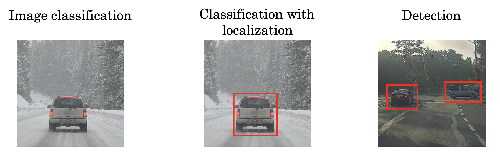

    - **Classification:** Label as a car
    - **Localization:** Label as a car AND specify a bounding box around the position of the car in the image. Records midpoint (bx, by), height bh, and width bw.
    - **Detection:** There can be multiple objects and/or of different categories to localize.

- Defining the target lable y

    , where

    -  represents whether there is any object in the image (0 or 1).
    - , , , and  are the object's midpoint coordinates, the object's height, and the object's width that define the bounding box.
    - , , and  are the dummy estimates of class 1, 2, and 3.

      

- Defining the loss function

      
    Alternatively, use log loss or logistic regression loss

### 4.2. Landmark detection

- Landmark detection

    Outputs the X,Y coordinates of different landmarks you want to recognize in an image. The identity of each landmark must be consistent across different images.

    E.g. face recognition

- Target label y

    E.g. (xi, yi) of all landmarks i

### 4.3. Object detection with sliding windows

- Sliding windows detection

    - Step 1: Slide a rectangular region across the entire image, and pass each of the cropped image into the object localization ConvNet to classify zero or one for each position as some stride.

    - Step 2: Resize the region and repeat Step 1.

    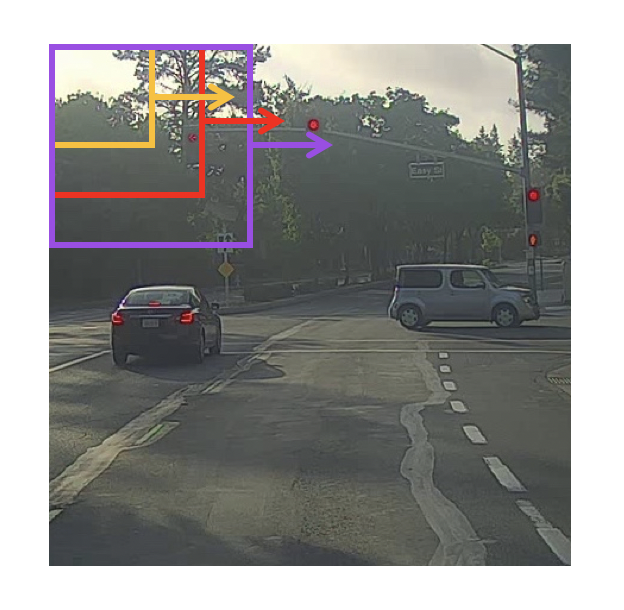

- Disadvantage of sliding windows detection with ConvNets

    - (-) Huge computation cost due to running so many different sliding windows with ConvNets independently/sequentially.

### 4.4. Convolutional implementation of sliding windows

- Turning FC layer into convolutional layers

    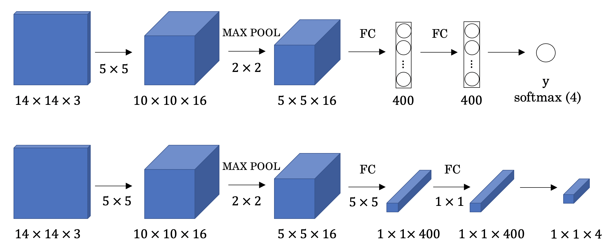

- Implementing sliding windows convolutionally

      
    [Sermanet et al., 2014, OverFeat: Integrated recognition, localization and detection using convolutional networks]

    - (+) Allows different ConvNets that have highly duplicated tasks to share a lot of computation.

        Instead of running ConvNets on different subsets of the input image independently, the convolutional implementation combines all into one computation and shares a lot of the computation in the common regions.

### 4.5. Bounding box predictions with YOLO

YOLO ("you only look once") is a popular algoritm because it achieves high accuracy while also being able to run in real-time. This algorithm "only looks once" at the image in the sense that it requires only one forward propagation pass through the network to make predictions. After non-max suppression, it then outputs recognized objects together with the bounding boxes.

- #### Output accurate bounding box with YOLO algorithm

    - Algorithm

        1. Place a grid (e.g. a 3x3 grid, or a 19x19 grid) on the image.
        2. Assign each object to the grid cell that contains the **midpoint** of that object.
        3. Each grid cell has an output that specifies whether there is any object, the bounding box of the object (fractions relative to the height and width of the grid cell), and the class of the object.

        Note that if the midpoint of an object falls into a grid cell, that grid cell is responsible for detecting that object. [Redmon et al., 2015, You Only Look Once: Unified real-time object detection]

    - Pros and cons

        - (+/-) YOLO works well so long as there aren't more than one object in each grid cell. For each object, even if the object spans multiple grid cells, that object is assigned only to one of the grid cells.
        - (+) Allows the network to output bounding boxes of any aspect ratio, and output much more precise coordinates that aren't just dictated by the stripe size of the sliding windows classifier.
        - (+) Efficient algorithm because it is a convolutional implantation, where you use one ConvNet with a lot of shared computation between all of the grid cells.

- #### Intersection over union (IoU) to evaluate object detection algorithm

    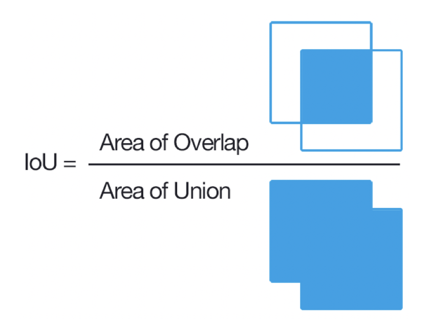  
    IoU is a measure of the overlap between 2 bounding boxes. By convention, "correct" if IoU ≥ 0.5

- #### Non-max suppression to clean up bounding boxes

    - Problem to address

        Because you're running the image classification and localization algorithm on every grid cell, it's possible that more than one of the grid cells think they have detected an object. So the object detection algorithm might end up with multiple detections of each object.

    - Algorithm

        Non-max suppression keeps the bounding box that has the maximum probability of detection (pc) of the object, and suppress the overlapping ones that are non-maximal.

        1. Discard all boxes with pc ≤ 0.5
        2. While there are any remaining boxes:

            - Pick the box with the largest pc, output that as a prediction.
            - Discard any remaining box with IoU ≥ 0.5 with the box output in the previous step.

        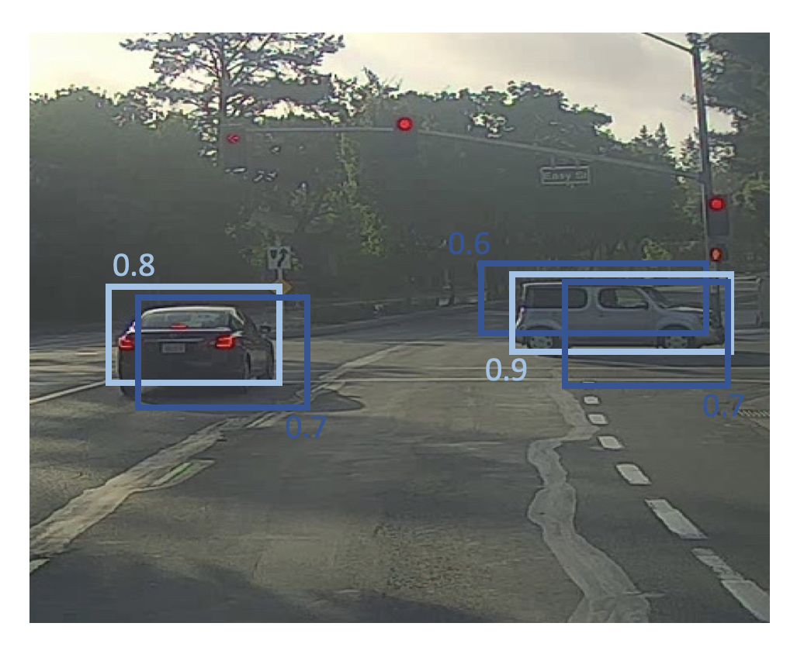

- #### Anchor boxes

    - Problem to address

        One of the problems with object detection is that each of the grid cells can detect only one object. What if a grid cell wants to detect multiple objects?

    - Algorithm

        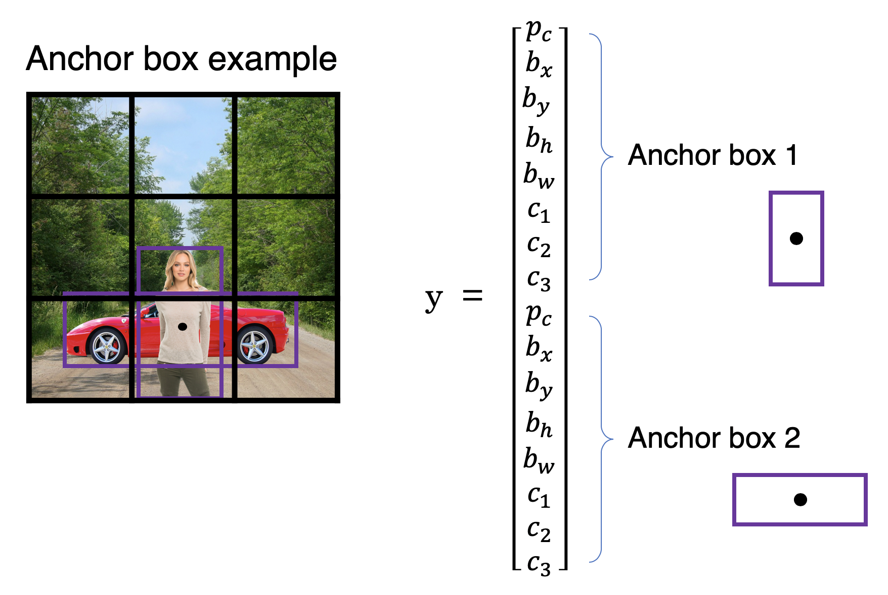  
        Each object in training image is assigned to grid cell that contains object’s midpoint and anchor box for the grid cell with highest IoU.

    - How to choose anchor boxes

        - By hand: Typically choose 5-10 anchor boxes that spans a variety of shapes to cover the types of objects.
        - Automatically: Use a K-means algorithm to group together the types of objects shapes you tend to get. And then select a set of anchor boxes that are most stereotypically representative of the objects.

    - Pros and cons

        - (-) Does not handle well when there are two anchor boxes but three objects in the same grid cell; or two objects associated with the same grid cell, but both of them have the same anchor box shape.

        - (+) Allows learning algorithm to specialize so that some of the outputs can specialize in detecting white, fat objects like cars, and some of the output units can specialize in detecting tall, skinny objects like pedestrians.

- #### Putting everything together: YOLO algorithm

    - Training and predicting

        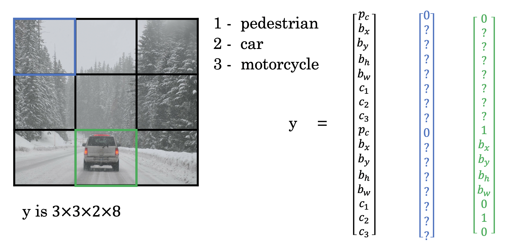

    - Outputting the non-max suppressed outputs

        - For each grid call, get 2 predicted bounding boxes.
        - Get rid of low probability predictions.
        - For each class (pedestrian, car, motorcycle) use non-max suppression to generate final predictions.

        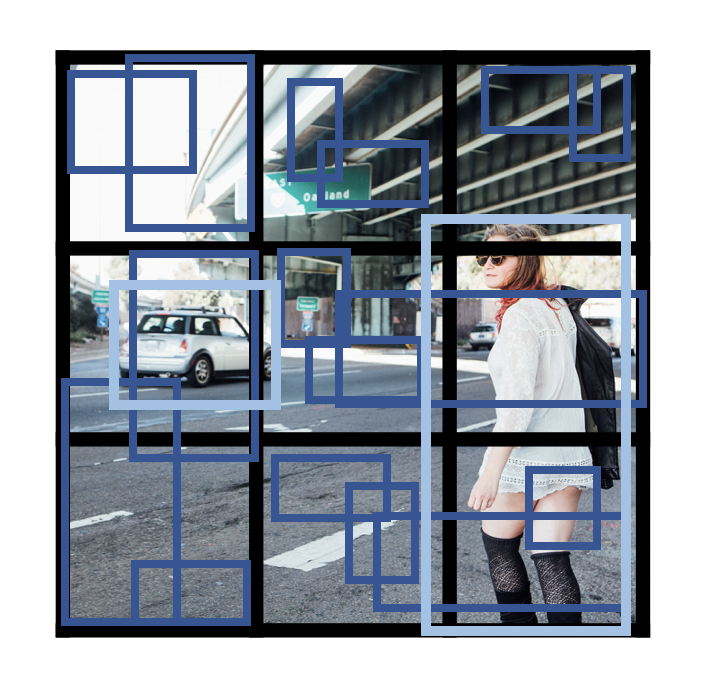

### 4.6. Region proposals

- #### Region proposal: R-CNN (Regions with CNN)

    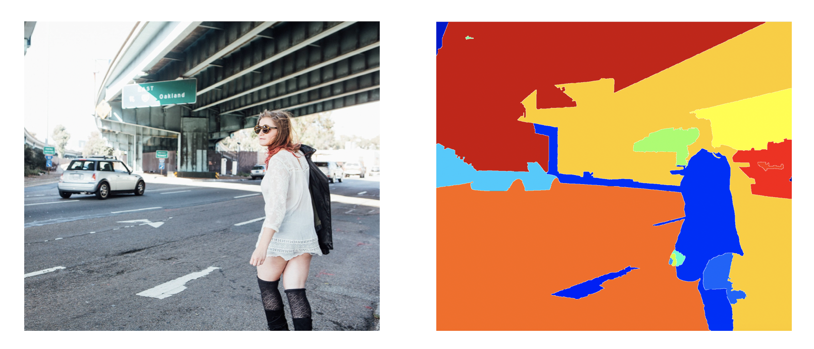  
    [Girshik et. al, 2013, Rich feature hierarchies for accurate object detection and semantic segmentation]

    Rather than running sliding windows on every single window, select just a few windows and run ConvNet classifier on these windows. Use segmentation algorithm to find blobs, and run classifier only on those blobs.

    - (-) R-CNN very slow

- #### Faster algorithms

    - Original **R-CNN:** Propose regions. Classify proposed regions one at a time. Output label + bounding box. [Girshik et. al, 2013. Rich feature hierarchies for accurate object detection and semantic segmentation]

    - **Fast R-CNN:** Propose regions. Use convolution implementation of sliding windows to classify all the proposed regions. [Girshik, 2015. Fast R-CNN]

        - (-) The clustering step to propose the regions is still quite slow.

    - **Faster R-CNN:** Use convolutional network to propose regions. [Ren et. al, 2016. Faster R-CNN: Towards real-time object detection with region proposal networks]

    R-CNN algorithms are usually slower than YOLO algorithm.

