# Deep Learning

<!-- TOC -->

- [Deep Learning](#deep-learning)
  - [1. Deep learning and neural network basics](#1-deep-learning-and-neural-network-basics)
    - [1.1. Intro to deep learning](#11-intro-to-deep-learning)
    - [1.2. Perceptron of neural networks](#12-perceptron-of-neural-networks)
    - [1.3. Activation function of neural networks](#13-activation-function-of-neural-networks)
    - [1.4. Log-loss error function](#14-log-loss-error-function)
    - [1.5. Gradient of the error function](#15-gradient-of-the-error-function)
    - [1.6. Gradient descent for neural networks](#16-gradient-descent-for-neural-networks)
    - [1.7. Some useful terminology](#17-some-useful-terminology)
  - [2. Improving deep neural networks](#2-improving-deep-neural-networks)
    - [2.1. Setting up deep neural network applications](#21-setting-up-deep-neural-network-applications)
    - [2.2. Reduce overfitting](#22-reduce-overfitting)
    - [2.3. Setting up optimization problem](#23-setting-up-optimization-problem)
    - [2.4. Optimization algorithms](#24-optimization-algorithms)
    - [2.5. Hyperparameter tuning](#25-hyperparameter-tuning)
    - [2.6. Batch normalization](#26-batch-normalization)
    - [2.7. Deep learning frameworks](#27-deep-learning-frameworks)
  - [3. Structuring machine learning projects](#3-structuring-machine-learning-projects)
    - [3.1. Orthogonalization](#31-orthogonalization)
    - [3.2. Setting up your goal](#32-setting-up-your-goal)
    - [3.3. Comparing to human-level performance](#33-comparing-to-human-level-performance)
  - [4. Building a neural network with keras](#4-building-a-neural-network-with-keras)
    - [4.1. Optimizers in Keras](#41-optimizers-in-keras)
    - [4.2. Keras script](#42-keras-script)
  - [5. Deep learning with PyTorch](#5-deep-learning-with-pytorch)
    - [5.1. Pytorch syntax](#51-pytorch-syntax)
    - [5.2. Initialize data](#52-initialize-data)
    - [5.3. Define layers and operations](#53-define-layers-and-operations)
    - [5.4. Define criterion, optimizer, and validation](#54-define-criterion-optimizer-and-validation)
    - [5.5. Train a neural network](#55-train-a-neural-network)
    - [5.6. Inference](#56-inference)
    - [5.7. Save and load trained networks](#57-save-and-load-trained-networks)
    - [5.8. Transfer learning with CUDA](#58-transfer-learning-with-cuda)

<!-- /TOC -->

## 1. Deep learning and neural network basics

### 1.1. Intro to deep learning

- Examples of neural network application:

  - real estate (standard NN)
  - online advertising (standard NN)
  - photo tagging (CNN)
  - speech recognition (RNN)
  - machine translation (RNN)
  - autonomous driving (hybrid NN)

  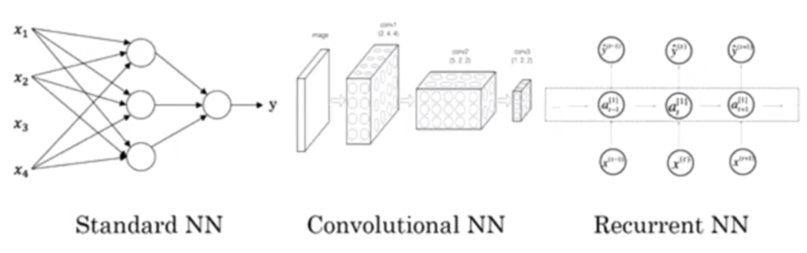

  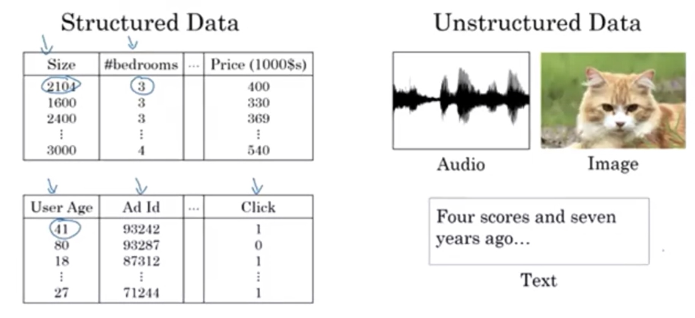

- Scale drives deep learning progress

  - More data
  - Faster computation
  - New and more efficient algorithms

  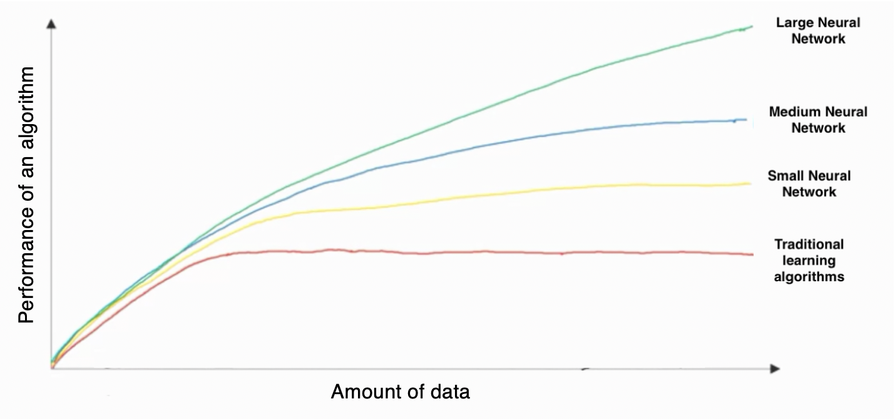

- Applied deep learning is a highly iterative and very empirical process

  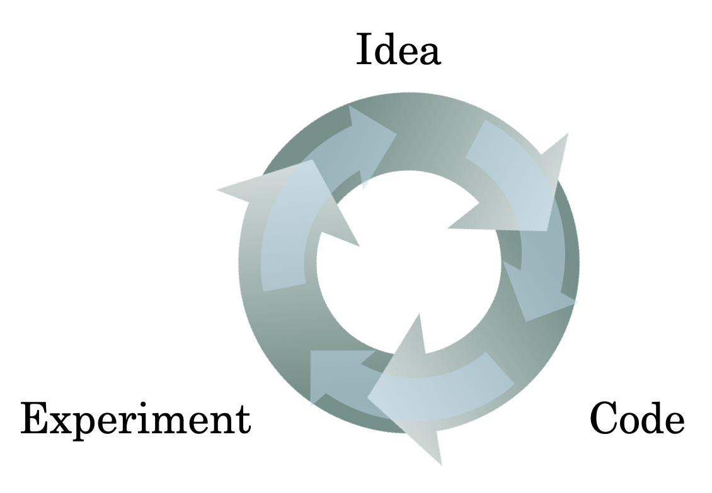

### 1.2. Perceptron of neural networks

- Decision boundary

  - Linear equation

    WX + b = 0

  - Notation

    W: weight <br>
    X: input features <br>
    b: bias <br>
    y: label 0 or 1 <br>
    <a href="https://www.codecogs.com/eqnedit.php?latex=\alpha" target="_blank"></a>: learning rate <br>

- Perceptron

  

  

- Perceptron trick

  <a href="https://www.codecogs.com/eqnedit.php?latex=w_1x_1&space;&plus;&space;w_2x_2&space;&plus;&space;b&space;=&space;0" target="_blank"></a> <br>
  Point <a href="https://www.codecogs.com/eqnedit.php?latex=(x_p,&space;x_q)" target="_blank"></a> classified incorrecctly <br>

  To move the decision boundary closer to the point, for every misclassified point:

  - if the incorrect prediction = 1
    
    <a href="https://www.codecogs.com/eqnedit.php?latex=w_1&space;:=&space;w_1&space;-&space;x_p\alpha" target="_blank"></a> <br>
    <a href="https://www.codecogs.com/eqnedit.php?latex=w_2&space;:=&space;w_2&space;-&space;x_q\alpha" target="_blank"></a> <br>
    <a href="https://www.codecogs.com/eqnedit.php?latex=b&space;:=&space;b&space;-&space;\alpha" target="_blank"></a> <br>

  - if the incorrect prediction = 0
    
    <a href="https://www.codecogs.com/eqnedit.php?latex=w_1&space;:=&space;w_1&space;&plus;&space;x_p\alpha" target="_blank"></a> <br>
    <a href="https://www.codecogs.com/eqnedit.php?latex=w_2&space;:=&space;w_2&space;&plus;&space;x_q\alpha" target="_blank"></a> <br>
    <a href="https://www.codecogs.com/eqnedit.php?latex=b&space;:=&space;b&space;&plus;&space;\alpha" target="_blank"></a> <br>

- Neural network architechture (Multi-Layer Perceptrons)

  

  

  

### 1.3. Activation function of neural networks

- Sigmoid function (2 classes)

  <a href="https://www.codecogs.com/eqnedit.php?latex=h_\theta(x)=\frac{1}{1&plus;e^{-\theta^Tx}}" target="_blank"></a>, denote <a href="https://www.codecogs.com/eqnedit.php?latex=a&space;=&space;h_\theta(x)&space;=&space;g(z)" target="_blank"></a> where <a href="https://www.codecogs.com/eqnedit.php?latex=z=\theta^Tx" target="_blank"></a>

  - (-) Often not used, except for the output layer of binary classification
  - (-) Gradient becomes very small when z is either very large or very small

- Softmax function (≥3 classes)

  <a href="https://www.codecogs.com/eqnedit.php?latex=h^i_\theta(x)=\frac{e^{Zi}}{e^{Z1}&plus;...&plus;e^{Zn}}" target="_blank"></a> for class i = 1,...,n

- Hyperbolic tangent function

  <a href="https://www.codecogs.com/eqnedit.php?latex=h_\theta(x)&space;=&space;tanh(z)&space;=&space;\frac{e^z&space;-&space;e^{-z}}{e^z&space;&plus;&space;e^{-z}}" target="_blank"></a>
  
  

  - (+) Often superior to sigmoid function
  - (+) Centralizes data to have zero mean
  - (-) Gradient becomes very small when z is either very large or very small

- Rectified linear unit (ReLU)

  <a href="https://www.codecogs.com/eqnedit.php?latex=h_\theta(x)&space;=&space;max(0,&space;z)" target="_blank"></a>

  

  - (+) Most commonly used
  - (+) Learns faster due to larger gradient when z is either very large or very small
  - (-) "Dying ReLU" always outputs 0

- Leaky ReLU

  <a href="https://www.codecogs.com/eqnedit.php?latex=h_\theta(x)&space;=&space;max(0.01&space;z,&space;z)" target="_blank"></a>

  - (+) Resolves dying ReLU problem

- Comparison of activation functions

  [ReLU vs. sigmoid from stackexchange](https://stats.stackexchange.com/questions/126238/what-are-the-advantages-of-relu-over-sigmoid-function-in-deep-neural-networks) <br>
  [Activation function comparison from medium](https://medium.com/@shrutijadon10104776/survey-on-activation-functions-for-deep-learning-9689331ba092)

### 1.4. Log-loss error function

- Mean squared error of sigmoid function is not convex

  - Cost function

    <a href="https://www.codecogs.com/eqnedit.php?latex=E=\frac{1}{2}\sum_i(y_{i}-f(\theta&space;x_{i}))^2" target="_blank"></a>

  - Gradient

    <a href="https://www.codecogs.com/eqnedit.php?latex=\frac{\partial}{\partial&space;\theta_j}E=-(y_{i}-f(\theta&space;x_{i}))\frac{\partial&space;f(\theta&space;x_{i})}{\partial&space;(\theta&space;x_{i})}x_i" target="_blank"></a>

- Maximum likelihood estimation

  <a href="https://www.codecogs.com/eqnedit.php?latex=\prod" target="_blank"></a> of all events's probabilities under the current model <br>
  <a href="https://www.codecogs.com/eqnedit.php?latex=m" target="_blank"></a>: number of observations <br>
  <a href="https://www.codecogs.com/eqnedit.php?latex=n" target="_blank"></a>: number of classes <br>
  <a href="https://www.codecogs.com/eqnedit.php?latex=p_i" target="_blank"></a>: probability of the event happening under the current model <br>
  
  - Binary

    <a href="https://www.codecogs.com/eqnedit.php?latex=likelihood=\prod_{i=1}^{m}p_i^{y_i}(1-p_i)^{(1-y_i)}" target="_blank"></a>

  - Multi-class

    <a href="https://www.codecogs.com/eqnedit.php?latex=likelihood=\prod_{i=1}^{m}\prod_{j=1}^{n}p_{ij}^{y_{ij}}" target="_blank"></a>

- Cross entropy

  - Binary

    <a href="https://www.codecogs.com/eqnedit.php?latex=cross\_entropy&space;=&space;-\sum_{i=1}^m[{y_ilog(p_i)&plus;(1-y_i)log(1-p_i)}]" target="_blank"></a>, aka., -log(likelihood) <br>

    Lower entropy means better model <br>
    Goal: minimize the cross entropy

  - Multi-class

    <a href="https://www.codecogs.com/eqnedit.php?latex=cross\_entropy&space;=&space;-\sum_{i=1}^m\sum_{j=1}^n{y_{ij}log(p_{ij})}" target="_blank"></a>

- Error function of logistic regression

  - Binary

    <a href="https://www.codecogs.com/eqnedit.php?latex=J(\Theta)=-\frac{1}{m}\sum_{i=1}^m[y_{(&space;i)}log(h_\Theta(x_{(i)}))&plus;(1-y_{(i)})log(1-h_\Theta(x_{(i)})]" target="_blank"></a>

  - Multi-class

    <a href="https://www.codecogs.com/eqnedit.php?latex=J(\Theta)=-\frac{1}{m}\sum_{i=1}^m\sum_{j=1}^ny_{(ij)}log(h_\Theta(x_{(ij)}))" target="_blank"></a>

### 1.5. Gradient of the error function

- Notation

  - <a href="https://www.codecogs.com/eqnedit.php?latex=a_i^{(l)}" target="_blank"></a>: "activation" of unit i in layer l where <a href="https://www.codecogs.com/eqnedit.php?latex=l&space;\in&space;[1,&space;L]" target="_blank"></a>
  - <a href="https://www.codecogs.com/eqnedit.php?latex=\Theta^{(l)}" target="_blank"></a>: matrix of weights controlling function mapping from layer l to layer l + 1, where <a href="https://www.codecogs.com/eqnedit.php?latex=\theta_{ij}^{(l)}" target="_blank"></a> relates unit j in layer l to unit i in layer l+1
  - If network has <a href="https://www.codecogs.com/eqnedit.php?latex=s_l" target="_blank"></a> units in layer j and <a href="https://www.codecogs.com/eqnedit.php?latex=s_{l&plus;1}" target="_blank"></a> units in layer l+1, then <a href="https://www.codecogs.com/eqnedit.php?latex=\Theta^{(l)}" target="_blank"></a> will be of dimension <a href="https://www.codecogs.com/eqnedit.php?latex=s_{l&plus;1}" target="_blank"></a> × <a href="https://www.codecogs.com/eqnedit.php?latex=(s_l&plus;1)" target="_blank"></a>
  - <a href="https://www.codecogs.com/eqnedit.php?latex=\delta_j^{(l)}" target="_blank"></a>: error of node j in layer l
  - <a href="https://www.codecogs.com/eqnedit.php?latex=\alpha" target="_blank"></a>: learning rate

- Forward propogation to calculate output unit and error

  <a href="https://www.codecogs.com/eqnedit.php?latex=z^{(l&plus;1)}=\Theta^{(l)}a^{(l)}" target="_blank"></a> <br>
  <a href="https://www.codecogs.com/eqnedit.php?latex=a^{(l&plus;1)}=g(z^{(l&plus;1)})=\frac{1}{1&plus;e^{-z^{(l&plus;1)}}}" target="_blank"></a> for sigmoid function

- Error function of each data point

  <a href="https://www.codecogs.com/eqnedit.php?latex=E&space;=&space;{y}log(a^{(L)})&plus;(1-y)log(1-a^{(L)})" target="_blank"></a>

- Gradient of the error function

  <a href="https://www.codecogs.com/eqnedit.php?latex=\delta_j^{(l)}=\frac{\partial&space;E}{\partial&space;z}=\frac{\partial&space;E}{\partial&space;a}\frac{\partial&space;a}{\partial&space;z}=\frac{\partial&space;E}{\partial&space;a}g'(z)" target="_blank"></a>, where <a href="https://www.codecogs.com/eqnedit.php?latex=g'(z^{(l)})=a^{(l)}(1-a^{(l)})" target="_blank"></a> for sigmoid function

  - When <a href="https://www.codecogs.com/eqnedit.php?latex=l=L" target="_blank"></a>:

    <a href="https://www.codecogs.com/eqnedit.php?latex=\delta_j^{(L)}=(-\frac{y}{a}&plus;\frac{1-y}{1-a})(a(1-a))=a_j^{(L)}-y_j" target="_blank"></a> for sigmoid function <br>
    <a href="https://www.codecogs.com/eqnedit.php?latex=\delta_j^{(L)}=a_j^{(L)}-y_j" target="_blank"></a> for softmax function

  - When <a href="https://www.codecogs.com/eqnedit.php?latex=l<L" target="_blank"></a>:

    <a href="https://www.codecogs.com/eqnedit.php?latex=\delta^{(l)}=(\Theta^{(l)})^T\delta^{(l&plus;1)}&space;*&space;g'(z^{(l)})" target="_blank"></a>

- Gradient with respect to the weights ignoring regularization

  <a href="https://www.codecogs.com/eqnedit.php?latex=\frac{\partial&space;E}{\partial&space;\theta_{ij}^{(l)}}=a_j^{(l)}\delta_i^{(l&plus;1)}" target="_blank"></a>

### 1.6. Gradient descent for neural networks

- Additional notation

  - m: the number of records, such that training set <a href="https://www.codecogs.com/eqnedit.php?latex={(x^{(1)},&space;y^{(1)}),&space;...,&space;(x^{(m)},&space;y^{(m)})}" target="_blank"></a>
  - <a href="https://www.codecogs.com/eqnedit.php?latex=g'(z^{(l)})=a^{(l)}(1-a^{(l)})" target="_blank"></a> for sigmoid function
  - <a href="https://www.codecogs.com/eqnedit.php?latex=\frac{\partial&space;J}{\partial&space;\theta_{ij}^{(l)}}" target="_blank"></a>: error gradient with respect to <a href="https://www.codecogs.com/eqnedit.php?latex=\theta_{ij}^{(l)}" target="_blank"></a>, averaged across data points

- (i) Initialize parameters
  
  - Initialize weights (excluding intercepts) near 0 with different starting values. A good value for the scale is <a href="https://www.codecogs.com/eqnedit.php?latex=\frac{1}{\sqrt{n}}" target="_blank"></a> where n is the number of input units, or <a href="https://www.codecogs.com/eqnedit.php?latex=\frac{\sqrt{2}}{\sqrt{n}}" target="_blank"></a> for ReLU.
  - Initialize bias units as 0
  - Set <a href="https://www.codecogs.com/eqnedit.php?latex=\Delta_{ij}^{(l)}=0" target="_blank"></a> for all l, i, j

- (ii) Forward propogation

  - <a href="https://www.codecogs.com/eqnedit.php?latex=z_i^{(l)}=\sum_j\theta_{ij}^{(l-1)}a_j^{(l-1)}" target="_blank"></a>
  - <a href="https://www.codecogs.com/eqnedit.php?latex=a_i^{(l)}=g^{(l)}(z_i^{(l)})" target="_blank"></a>

- (iii) Error function

  <a href="https://www.codecogs.com/eqnedit.php?latex=J=-\frac{1}{m}\sum_{i=1}^m[y_{i}log(a_i^{(L)})&plus;(1-y_{i})log(1-a_i^{(L)})]" target="_blank"></a>

- (iv) Backpropogation

  - Calculate error term for output unit <br><a href="https://www.codecogs.com/eqnedit.php?latex=\delta^{(L)}=a^{(L)}-y" target="_blank"></a>, for sigmoid function in output unit
  - Compute <a href="https://www.codecogs.com/eqnedit.php?latex=\delta^{(L-1)},&space;\delta^{(L-2)},&space;...,&space;\delta^{(1)}" target="_blank"></a> <br> <a href="https://www.codecogs.com/eqnedit.php?latex=\delta^{(l)}=(\Theta^{(l)})^T\delta^{(l&plus;1)}&space;*&space;g'(z^{(l)})" target="_blank"></a>

- (v) Cumulative error
  - Without regularization

    <a href="https://www.codecogs.com/eqnedit.php?latex=\frac{\partial&space;J}{\partial&space;\theta_{ij}^{(l)}}=-\frac{1}{m}\frac{\partial&space;E}{\partial&space;z}\frac{\partial&space;z}{\partial&space;\theta}=-\frac{1}{m}\sum_{data\&space;points}a_j^{(l)}\delta_i^{(l&plus;1)}" target="_blank"></a>, i.e., <a href="https://www.codecogs.com/eqnedit.php?latex=\frac{\partial&space;J}{\partial&space;\Theta^{(l)}}=-\frac{1}{m}\delta^{(l&plus;1)}(a^{(l)})^T" target="_blank"></a>

  - With regularization

    <a href="https://www.codecogs.com/eqnedit.php?latex=\frac{\partial&space;J}{\partial&space;\theta_{ij}^{(l)}}=-\frac{1}{m}\sum_{data\&space;points}a_j^{(l)}\delta_i^{(l&plus;1)}&plus;\lambda&space;\theta_{ij}^{(l)}" target="_blank"></a> if j≠0. <br>
    <a href="https://www.codecogs.com/eqnedit.php?latex=\frac{\partial&space;J}{\partial&space;\theta_{ij}^{(l)}}=-\frac{1}{m}\sum_{data\&space;points}a_j^{(l)}\delta_i^{(l&plus;1)}" target="_blank"></a> if j=0. By convention, regularization does not include bias units.

- (vi) Update parameters
  
  <a href="https://www.codecogs.com/eqnedit.php?latex=\theta_{ij}^{(l)}:=\theta_{ij}^{(l)}-\alpha&space;\frac{\partial&space;J}{\partial&space;\theta_{ij}^{(l)}}" target="_blank"></a> Repeat until convergence

- Further readings on backpropagation

  - [A gentle introduction to artificial neural networks](https://theclevermachine.wordpress.com/tag/backpropagation/)
  - [Yes you should understand backprop](https://medium.com/@karpathy/yes-you-should-understand-backprop-e2f06eab496b)
  - [a lecture from Stanford's CS231n course](https://www.youtube.com/watch?v=59Hbtz7XgjM)

### 1.7. Some useful terminology

- **One epoch** = one forward pass and one backward pass of all the training examples
- **Batch size** = the number of training examples in one forward/backward pass. The higher the batch size, the more memory space you'll need.
- **Number of iterations** = number of passes, each pass using [batch size] number of examples. To be clear, one pass = one forward pass + one backward pass.

  Example: if you have 1000 training examples, and your batch size is 500, then it will take 2 iterations to complete 1 epoch.

## 2. Improving deep neural networks

Orthogonalization

- Optimize cost function J, e.g. via gradient descent
- Reduce overfitting, e.g., via regularization

### 2.1. Setting up deep neural network applications

- #### Train / Dev / Test sets

  - For relatively small dataset, 70/30 or 60/20/20 train-dev-test split works well. But for much larger datasets, 98/1/1 or 99.5/0.25/0.25 is more reasonable sometimes.
    - Dev set is also known as "development set" or "hold-out cross validation set".
  - Make sure that Dev and Test sets come from the same distribution as Train set. In real applications Training set and Test/Dev sets might be mismatched.
  - Not having a Test set might be okay sometimes. Only Dev set.

- #### Bias and variance

  - High bias (based on training set performance)
    - Bigger networks
    - Train longer
    - Use more advanced algorithms
    - (NN architecture search)

  - High Variance (based on dev vs. training set performance)
    - More data
    - Regularization
    - (NN architecture search)

  - In deep learning, there isn't necessarily a "bias-variance tradeoff", e.g. when using more data, or when using a bigger network (with regularization).

### 2.2. Reduce overfitting

- #### Getting more data

- #### Data augmentation

  Rotate, resize, crop, flip, and sometimes random distortion of image data

- #### Early stopping

  Increase model complexity or the number of epochs, use gradient descent to train the model until cross validation error starts to increase.

  

  - (-) Breaks orthogonalization, and simultaneously tries to optimize cost while reducing overfitting.
  - (+) Running the gradient descent process just once, you get to try out values of small <a href="https://www.codecogs.com/eqnedit.php?latex=\theta" target="_blank"></a>, mid-size <a href="https://www.codecogs.com/eqnedit.php?latex=\theta" target="_blank"></a>, and large <a href="https://www.codecogs.com/eqnedit.php?latex=\theta" target="_blank"></a>, without needing to try a lot of values of the L2 regularization hyperparameter <a href="https://www.codecogs.com/eqnedit.php?latex=\lambda" target="_blank"></a>.

- #### Regularization

  Penalize large coefficients to resolve overfitting. L2 regularization is most commonly used, and is also known as "weight decay".

  Error function with L2 regularization <br>
  <a href="https://www.codecogs.com/eqnedit.php?latex=J=-\frac{1}{m}\sum_{i=1}^m&space;E(\hat{y}_i,&space;y_i)&plus;\frac{\lambda}{2m}\sum_{l=1}^L\left&space;\|&space;\Theta^{(l)}&space;\right&space;\|_F^2" target="_blank"></a>, where <a href="https://www.codecogs.com/eqnedit.php?latex=\left&space;\|&space;\Theta^{(l)}&space;\right&space;\|_F^2=\sum_{n=1}^{n^{(l-1)}}\sum_{j=1}^{n^{(l)}}(\theta_{ij}^{(l)})^2" target="_blank"></a> is the "Frobenius norm", and <a href="https://www.codecogs.com/eqnedit.php?latex=\Theta^{(l)}" target="_blank"></a> are the linear coefficients excluding the bias units.

  - (+) L2 regularization maintains all weights to be small.

- #### Dropout

  Randomly turn off some of the nodes to train all the nodes in neural networks. Dropout is a regularization technique. Learn more about "inverted dropout" [here](https://www.quora.com/What-is-inverted-dropout) when implementing dropout.

  

  - (+) As if working with a smaller neural network on every iteration, and so using a smaller neural network seems like it should have a regularizing effect.
  - (+) Can't rely on any one feature, so have to spread out weights and hence shrinking the weights. Has similar effects to L2 regularization.
  - (+) Very frequently used by computer vision, given the big input size.
  - (-) Error function J is less well defined under dropout.

### 2.3. Setting up optimization problem

- #### Feature scaling

  Calculate mean and variance using the training set, then subtract by the same mean and normalize by the same variance for both training and testing sets.

  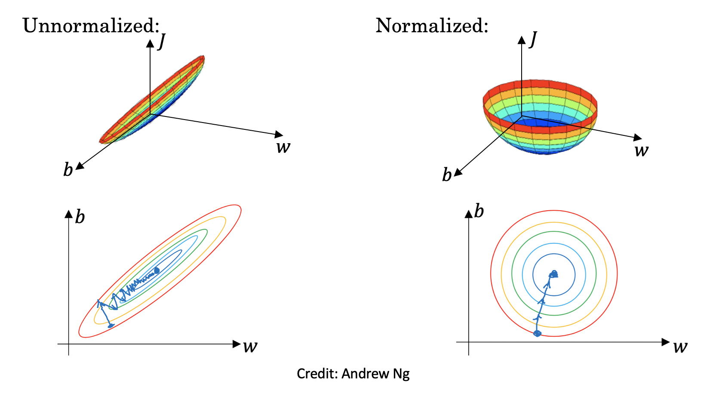

  - (+) Gradient descent converges much faster with feature scaling.

- #### Random weight initialization partially solves vanishing / exploding gradients

  Vanishing / exploding gradients: Weights (and gradients) can increase or decrease exponentially with the number of layers, causing exploding or vanishing gradients respectively, which makes training difficult.

  - (+) Careful choice of random weight initialization partially solves vanishing / exploding gradients.

  Initialize weights (excluding biases) near 0 with different starting values to break symmetry. In order to try stabilizing the gradients near 1, a good value for the scale is <a href="https://www.codecogs.com/eqnedit.php?latex=\frac{1}{\sqrt{n}}" target="_blank"></a>, where n is the number of input units.

  - ReLU: <a href="https://www.codecogs.com/eqnedit.php?latex=\xi&space;*&space;\sqrt{\frac{2}{n^{(l-1)}}}" target="_blank"></a> (He initialization), where <a href="https://www.codecogs.com/eqnedit.php?latex=\xi" target="_blank"></a> follows standard normal distribution
  - tanh: <a href="https://www.codecogs.com/eqnedit.php?latex=\xi&space;*&space;\sqrt{\frac{1}{n^{(l-1)}}}" target="_blank"></a> (Xavier initialization) or <a href="https://www.codecogs.com/eqnedit.php?latex=\xi&space;*&space;\sqrt{\frac{{2}}{{n^{(l-1)}}&plus;n^{(l)}}}" target="_blank"></a>

- #### Gradient checking

  Use numerical approximation of gradients to check that the implementation of backpropogation is correct.

  - (i) Contatenate <a href="https://www.codecogs.com/eqnedit.php?latex=\theta^{(l)}" target="_blank"></a>'s into a giant vector; concatenate <a href="https://www.codecogs.com/eqnedit.php?latex=\frac{\partial&space;J}{\partial&space;\theta^{(l)}}" target="_blank"></a>'s into a giant vector

  - (ii) For each component of <a href="https://www.codecogs.com/eqnedit.php?latex=\theta" target="_blank"></a>:

    Compute numerical approximation <br> <a href="https://www.codecogs.com/eqnedit.php?latex=(\frac{\partial&space;J}{\partial&space;\theta_i})_{approx}&space;:=&space;\frac{J(\theta_1,&space;\theta_2,&space;...,&space;\theta_i&plus;\epsilon,&space;...)-J(\theta_1,&space;\theta_2,&space;...,&space;\theta_i-\epsilon,&space;...)}{2\epsilon}" target="_blank"></a>

    Check Euclidean distance <a href="https://www.codecogs.com/eqnedit.php?latex=\frac{\left&space;\|&space;(\frac{\partial&space;J}{\partial&space;\theta})_{approx}&space;-&space;\frac{\partial&space;J}{\partial&space;\theta}&space;\right&space;\|_2}{\left&space;\|&space;(\frac{\partial&space;J}{\partial&space;\theta})_{approx}&space;\right&space;\|_2&space;&plus;&space;\left&space;\|&space;\frac{\partial&space;J}{\partial&space;\theta}&space;\right&space;\|_2}" target="_blank"></a>. Good if e.g. <a href="https://www.codecogs.com/eqnedit.php?latex=\epsilon" target="_blank"></a> = 1E-7, euclidean distance ≤ 1E-7

  - Tips for implementing gradient checking
    - Don't use in training, only to debug
    - If algorithm fails grad check, look at components to try to identify bug
    - Remember regularization
    - Doesn't work with dropout
    - Run at random initialization; perhaps again after some training when coefficients wander away from initial values.

### 2.4. Optimization algorithms

- #### Batch gradient descent

  Process entire training data all at the same time. <br> Batch Size = Size of Training Set

  - (+) Good for small training set (m≤~2000)
  - (-) Slow training with large dataset

- #### Stochastic gradient descent

  Split the data into several batches, run gradient descent on each batch consecutively. <br> Batch Size = 1

  - (-) Lose speedup from vectorization
  - (-) Won't converge, always oscillate around the region of minimum. Can reduce learning rate slowly to address it.

- #### Mini-batch gradient descent

  Shuffle the training data to ensure random split, partition the shuffled data into several mini-batches, and run gradient descent on each batch consecutively. Commonly-used batch sizes: 64, 128, 256, 512 given the way computer memory is layed out and accessed. <br> 1 < Batch Size < Size of Training Set

  

  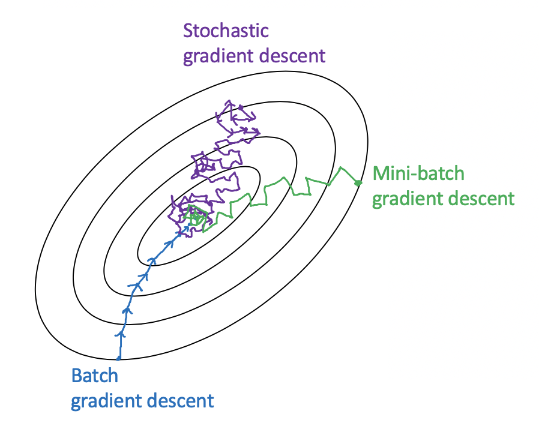

  - (+) Fast training with large dataset (m>~2000)
    - Vectorization
    - Make progress without needing to wait until processing the entire training set
  - (-) Doesn't always converge, sometimes oscillate around a very small region of minimum. Can reduce learning rate slowly to address it.

- #### Exponentially weighted moving averages

  <a href="https://www.codecogs.com/eqnedit.php?latex=\overline{\theta_t}=\beta&space;\&space;\overline{\theta_{t-1}}&space;&plus;&space;(1-\beta)&space;\theta_t" target="_blank"></a>, where <a href="https://www.codecogs.com/eqnedit.php?latex=\overline{\theta_t}" target="_blank"></a> is the moving average of <a href="https://www.codecogs.com/eqnedit.php?latex=\theta_t" target="_blank"></a> that approximately averages over <a href="https://www.codecogs.com/eqnedit.php?latex=\frac{1}{1-\beta}" target="_blank"></a> time steps. Note that <a href="https://www.codecogs.com/eqnedit.php?latex=\beta^{\frac{1}{1-\beta}}&space;=&space;\frac{1}{e}&space;\approx&space;0.368" target="_blank"></a>. 
  
  - (-) Initial phase of the moving average tend to be underestimated. To correct for the bias and make it more accurate, use <a href="https://www.codecogs.com/eqnedit.php?latex=\overline{\theta_t}^{\&space;corrected}&space;=&space;\frac{\overline{\theta_t}}{1-\beta^t}" target="_blank"></a>
  - (+) Takes very little memory and is computationally efficient

- #### Gradient descent with momentum

  Compute an exponentially weighted moving average of the gradients, and then use that gradient to update weights. Commonly used <a href="https://www.codecogs.com/eqnedit.php?latex=\beta=0.9" target="_blank"></a>. No need to use the bias correction because the moving average will have warmed up and is no longer a biased estimate after just 10 iterations.

  - On iteration t:

    - Compute gradients <a href="https://www.codecogs.com/eqnedit.php?latex=J'(\theta)" target="_blank"></a> on the current mini-batch
    - Compute exponentially weighted moving averages of gradients <a href="https://www.codecogs.com/eqnedit.php?latex=\overline{J'(\theta)}=\beta_1\&space;\overline{J'(\theta)}&space;&plus;&space;(1-\beta_1)&space;(J'(\theta))" target="_blank"></a>
    - Update parameters <a href="https://www.codecogs.com/eqnedit.php?latex=\theta&space;:=&space;\theta&space;-&space;\alpha&space;\&space;\overline{J'(\theta)}" target="_blank"></a>

  - (+) Speeds up learning
    - (+) Smooths out the steps of gradient descent and prevents the oscillations during gradient descent from getting too big
    - (+) Remediates local minimum problem
  - (+) Almost always works better than gradient descent without momentum

- #### RMSprop

  Root mean square prop (RMSprop) computes an exponentially weighted average of the squares of the gradients, and then use both the original gradients and the averaged gradients to update weights.

  - On iteration t:

    - Compute gradients <a href="https://www.codecogs.com/eqnedit.php?latex=J'(\theta)" target="_blank"></a> on the current mini-batch
    - Compute exponentially weighted moving averages of the squares of the gradients <a href="https://www.codecogs.com/eqnedit.php?latex=\widetilde{J'(\theta)}=\beta_2\&space;\widetilde{J'(\theta)}&space;&plus;&space;(1-\beta_2)&space;(J'(\theta))^2" target="_blank"></a>, which is large when oscillation is large
    - Update parameters <a href="https://www.codecogs.com/eqnedit.php?latex=\theta&space;:=&space;\theta&space;-&space;\alpha&space;\&space;\frac{J'(\theta)}{\sqrt{\widetilde{J'(\theta)}}&plus;\epsilon}" target="_blank"></a>, where <a href="https://www.codecogs.com/eqnedit.php?latex=\epsilon&space;\sim&space;10^{-8}" target="_blank"></a> is used to make sure the algorithm does not divide by 0

  - (+) Speeds up learning

- #### Adam (Adaptive moment estimation)

  Adam = Momentum + RMSprop

  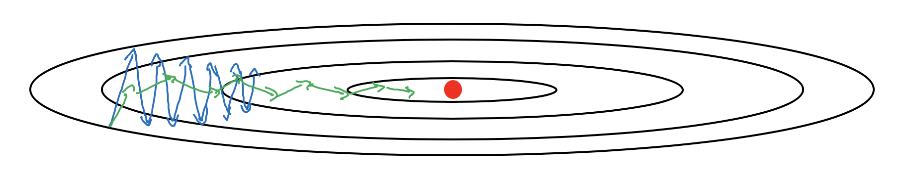

  - On iteration t:

    - Compute gradients <a href="https://www.codecogs.com/eqnedit.php?latex=J'(\theta)" target="_blank"></a> on the current mini-batch
    - Compute exponentially weighted moving averages of gradients <a href="https://www.codecogs.com/eqnedit.php?latex=\overline{J'(\theta)}=\beta_1\&space;\overline{J'(\theta)}&space;&plus;&space;(1-\beta_1)&space;(J'(\theta))" target="_blank"></a>
    - Compute exponentially weighted moving averages of the squares of the gradients <a href="https://www.codecogs.com/eqnedit.php?latex=\widetilde{J'(\theta)}=\beta_2\&space;\widetilde{J'(\theta)}&space;&plus;&space;(1-\beta_2)&space;(J'(\theta))^2" target="_blank"></a>
    - Bias correction <a href="https://www.codecogs.com/eqnedit.php?latex=\overline{J'(\theta)}^{\&space;corrected}&space;=&space;\frac{\overline{J'(\theta)}}{1-\beta_1^t}" target="_blank"></a>
    - Bias correction <a href="https://www.codecogs.com/eqnedit.php?latex=\widetilde{J'(\theta)}^{\&space;corrected}&space;=&space;\frac{\widetilde{J'(\theta)}}{1-\beta_1^t}" target="_blank"></a>
    - Update parameters <a href="https://www.codecogs.com/eqnedit.php?latex=\theta&space;:=&space;\theta&space;-&space;\alpha&space;\&space;\frac{\overline{J'(\theta)}^{\&space;corrected}}{\sqrt{\widetilde{J'(\theta)}^{\&space;corrected}}&plus;\epsilon}" target="_blank"></a>

  - Hyperparameters

    learning rate <a href="https://www.codecogs.com/eqnedit.php?latex=\alpha" target="_blank"></a> : needs to be tuned <br>
    first moment <a href="https://www.codecogs.com/eqnedit.php?latex=\beta_1" target="_blank"></a> : 0.9 (commonly-used value) <br>
    second moment <a href="https://www.codecogs.com/eqnedit.php?latex=\beta_2" target="_blank"></a> : 0.999 (commonly-used value) <br>
    <a href="https://www.codecogs.com/eqnedit.php?latex=\epsilon" target="_blank"></a> : 1e-8 (from the [Adam paper](https://arxiv.org/pdf/1412.6980.pdf))

  - (+) Speeds up learning
  - (+) Relatively low memory requirements (though higher than gradient descent with momentum)
  - (+) Usually works well even with little tuning of hyperparameters (except <a href="https://www.codecogs.com/eqnedit.php?latex=\alpha" target="_blank"></a>)

- #### Learning rate decay

  Slowly reducing the learning rate. Take bigger steps during the initial steps of learning, and take smaller steps as learning approaches to converge. There are many learning rate decay methods:

  - <a href="https://www.codecogs.com/eqnedit.php?latex=\alpha&space;=&space;\frac{1}{1&plus;{decay\_rate}*{epoch\_number}}\&space;\alpha_0" target="_blank"></a>
  - Exponential decay <a href="https://www.codecogs.com/eqnedit.php?latex=\alpha&space;=&space;0.95^{epoch\_number}&space;\alpha_0" target="_blank"></a>
  - <a href="https://www.codecogs.com/eqnedit.php?latex=\alpha&space;=&space;\frac{k}{\sqrt{{epoch\_number}}}\&space;\alpha_0" target="_blank"></a>, or <a href="https://www.codecogs.com/eqnedit.php?latex=\alpha&space;=&space;\frac{k}{\sqrt{t}}\&space;\alpha_0" target="_blank"></a>
  - Discrete staircase
  - Manual decay

- #### The problem of local optima

  In high dimensional space, local minimum very rare to find. It is unlikely to get stuck in a bad local optima, but plateaus (saddle points) can make learning slow. Advanced algorithms like Momentum, RMSprop, and Adam can speed up moving down the plateau and then getting off the plateau.

  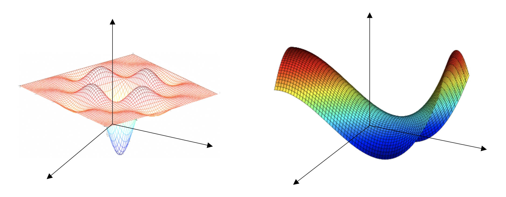

### 2.5. Hyperparameter tuning

- Tuning process

  - Hyperparameters

    Learning rate, <br>
    number of hidden units, mini-batch size, momentum coefficient, <br>
    number of layers, learning rate decay
  - Use random sampling instead of a grid search to search over the space of hyperparameters more efficiently
  - Coarse to fine search

- Using an appropriate scale to pick hyperparameters

  - Linear scale
  - Logarithmic scale

    ```python
    # Sample on the log scale
    r = -4 * np.random.rand()
    alpha = 10 ** r
    ```

    Log scale can be used to sample hyperparameters for exponentially weighted moving averages

- Hyperparameters in practice: Pandas vs. Caviar

  - Re-evaluate hyperparameters occasionally
  - Babysitting one model when not having enough CPUs and GPUs (like a panda) vs. training many models in parallel when having enough resources (like caviar)

### 2.6. Batch normalization

Batch normalization normalizes activations in a network to make training faster.

- Implementing batch norm

  - Given some intermediate values z in a layer of neural network, normalize z by the mean and variance of z across all data points in the currently mini-batch in that layer

    <a href="https://www.codecogs.com/eqnedit.php?latex=z_{norm}&space;=&space;\frac{z-\mu}{\sqrt{\sigma^2&plus;\epsilon}}" target="_blank"></a>, where <a href="https://www.codecogs.com/eqnedit.php?latex=\epsilon" target="_blank"></a> is added for numerical stability

  - New z of that layer become

    <a href="https://www.codecogs.com/eqnedit.php?latex=\widetilde{z}&space;=&space;\gamma&space;z_{norm}&space;&plus;&space;\beta" target="_blank"></a>, where <a href="https://www.codecogs.com/eqnedit.php?latex=\gamma" target="_blank"></a> and <a href="https://www.codecogs.com/eqnedit.php?latex=\beta" target="_blank"></a> are learnable parameters that normalize the mean and variance of these hidden unit z values

  - During training, mean and variance are computed on the mini-batch, whereas during testing, mean and variance are estimated using exponentially weighted moving average across mini-batches during the training process

- Why batch norm works

  - (+) Speeds up learning by normalizing all the input features to take on a similar range of values
  - (+) Makes the weights in later layer of the network more robust to changes to weights in earlier layers of the network

    Batch norm limits the amount to which updating the parameters in the earlier layers can affect the distribution of values that the later layer sees and therefore has to learn on, i.e. less shift-around in the distribution (Covariate Shift). Therefore, batch norm allows each layer of the network to learn more independently of other layers, which has the effect of speeding up of learning in the whole network.

    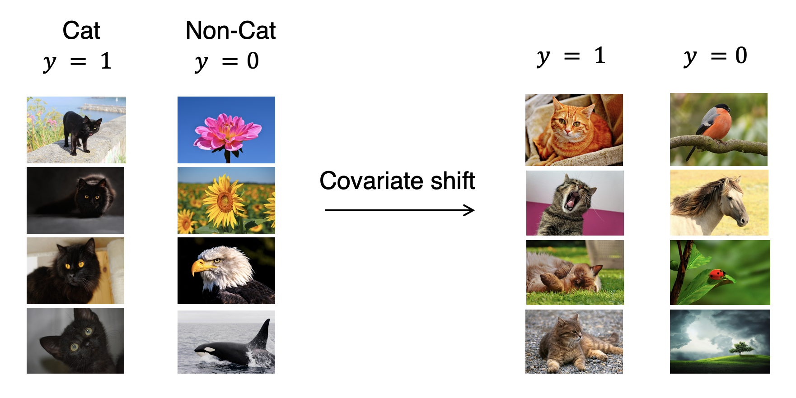

  - (+) Batch norm has a very slight regularization effect
  
    Each mini-batch is scaled by the mean/variance computed on just that mini-batch, which adds some noise to the values z within that minibatch. So similar to dropout, it adds some noise to each hidden layer’s activations, therefore having slight regularization effect.

### 2.7. Deep learning frameworks

- Popular frameworks

  - Caffe/Caffe2
  - CNTK
  - DL4J
  - Keras
  - Lasagne
  - mxnet
  - PaddlePaddle
  - TensorFlow
  - Theano
  - Torch

- Choosing deep learning frameworks

  - Ease of programming (development and deployment)
  - Running speed
  - Truly open (open source with good governance)

- TensorFlow and code example

  Tensorflow is a programming framework used in deep learning. The two main object classes in tensorflow are Tensors and Operators. The backpropagation and optimization is automatically done when running the session on the "optimizer" object.

  

  ```python
  # Dependencies
  import numpy as np
  import tensorflow as tf
  ```

  1. Create Tensors (variables) that are not yet executed/evaluated

      ```python
      # Create Tensors that are not yet evaluated
      coefficients = np.array([[1], [-20], [25]])
      w = tf.Variable([0], dtype=tf.float32, name="w")
      x = tf.placeholder(dtype=tf.float32, shape=[3,1], name="x") # specify values for later
      ```

      ```python
      # Create constants
      epsilon = tf.constant(np.random.randn(3,1), name = "epsilon")
      epsilon = tf.constant(10)
      ```

      ```python
      # Create Xavier initialization for weights
      W1 = tf.get_variable(name="W1", shape=[25,12288], initializer = tf.contrib.layers.xavier_initializer(seed = 1))

      # Create zero initialization for biases
      b1 = tf.get_variable("b1", [25,1], initializer = tf.zeros_initializer())
      ```

      ```python
      # Create array of ones and zeros
      tf.ones(shape)
      tf.zeros(shape)
      ```

  2. Specify operations between those Tensors

      ```python
      # Equivalent syntax to specify operations
      cost = (w-5)**2
      cost = tf.add(tf.add(w**2, tf.multiply(-10, w)), 25)
      cost = x[0][0]*w**2 + x[1][0]*w + x[2][0]
      ```

      ```python
      # Specify cost averaged across samples
      cost1 = tf.reduce_mean(tf.nn.softmax_cross_entropy_with_logits(logits = logits, labels = labels))
      ```

      ```python
      # Specify optimizer
      optimizer = tf.train.GradientDescentOptimizer(learning_rate=0.01).minimize(cost)
      ```

      Examples of operation:

      `tf.matmul(..., ...)` matrix multiplication <br>
      `tf.multiply(..., ...)` element-wise multiplication <br>
      `tf.add(..., ...)` addition <br>
      `tf.sigmoid(...)`, `tf.softmax(...)`, `tf.nn.relu(...)` activations <br>
      `tf.nn.sigmoid_cross_entropy_with_logits(logits = ...,  labels = ...)` compute cost <br>
      `tf.one_hot(labels, depth, axis)` one-hot encoding

  3. Initialize Tensors

      ```python
      # Initialize all the Tensors
      init = tf.global_variables_initializer()
      ```

  4. Create a session to run operations

      ```python
      # Create a session to run operations
      session = tf.Session()

      # Run the initialization
      session.run(init)
      print(session.run(w))

      # Run the session to execute the "optimizer"
      for i in range(1000):
          session.run(optimizer, feed_dict={x:coefficients})
      print(session.run(w))

      # Close the session
      session.close()
      ```

      ```python
      # Alternative syntax
      with tf.Session() as session:
          session.run(init)
          print(session.run(w))
      ```

## 3. Structuring machine learning projects

### 3.1. Orthogonalization

Modifying a component of an algorithm will not create or propagate side effects to other components of the system.

- Analogy in tuning old tv

  

- Chain of objectives in machine learning

  - Fit training set well on cost function

      → Use bigger neural network, or switch to better optimization algorithm

  - Fit dev set well on cost function

      → Implement harder regularization, or gather more training examples. Note that early stopping will reduce dev set error but will increase training set error, thus violate orthoganalization

  - Fit test set well on cost function

      → Use bigger dev set

  - performs well in real world

      → Change dev set or the cost function

### 3.2. Setting up your goal

- #### Single number evaluation metric
  
  Use a single number evaluation metric speeds up the iterative process of improving machine learning model. Sometimes requires averaging e.g. among different metrics, or among geographical locations.

- #### Satisficing and optimizing metric

  Set 1 optimizing metric and others as satisficing metrics

  - **Optimizing metric:** e.g. maximizing accuracy
  - **Satisficing metric(s):** e.g. subject to running time ≤ 100 ms

- #### Train/dev/test distributions

  Randomly shuffle data before splitting train/dev/test sets to make sure dev/test sets have the same distribution. Choose dev/test sets to reflect data you expect to get in the future and that you consider important to do well on.

- #### Size of dev/test sets

  Set the dev/test set sizes to be big enough to give high confidence in the overall performance of the model. For relatively small dataset, 70/30 or 60/20/20 train-dev-test split works well. But for much larger datasets, 98/1/1 or 99.5/0.25/0.25 is more reasonable sometimes.

- #### When to change dev/test sets and metrics

  - Change evaluation metric when it is no longer giving correct rank-order preferences between algorithms. E.g. weight the importance of different classes in the error metric
  - Change dev/test sets and/or metric when model does well on dev/test sets but does no do well on real application.

    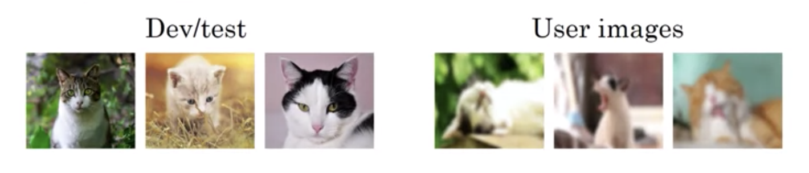

### 3.3. Comparing to human-level performance

- Bayes optimal error

  Bayes optimal error is the very best theoretical function for mapping from x to y.

  

- Humans are quite good at a lot of tasks, especially natural perception tasks. When model worse than humans:

  - Get labeled data from humans
  - Gain insight from manual error analysis: why did a person get this right?
  - Better analysis of bias/variance

- Problems where machine learning significantly surpasses human-level performance

  - Online advertising
  - Product recommendations
  - Logistics (predicting transit time)
  - Loan approvals

- Use human-level error as a proxy for Bayes error. Use human-level error as an anchor to focus on either **avoidable bias** or **variance**.

  

  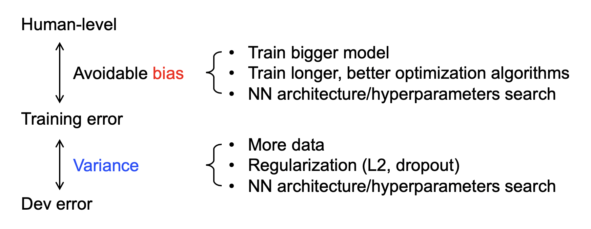

## 4. Building a neural network with keras

### 4.1. Optimizers in Keras

Blog post on algorithms [here](http://ruder.io/optimizing-gradient-descent/index.html#gradientdescentoptimizationalgorithms)

- `SGD`

  Stochastic Gradient Descent uses the following parameters:

  - Learning rate.
  - Momentum (This takes the weighted average of the previous steps, in order to get a bit of momentum and go over bumps, as a way to not get stuck in local minima).
  - Nesterov Momentum (This slows down the gradient when it's close to the solution).

- `Adam`

  Adaptive Moment Estimation uses a more complicated exponential decay that consists of not just considering the average (first moment), but also the variance (second moment) of the previous steps.

- `RMSProp`

  RMS stands for Root Mean Squared Error decreases the learning rate by dividing it by an exponentially decaying average of squared gradients.

### 4.2. Keras script

- #### Sequential model

  ```python
  import numpy as np
  from keras.models import Sequential
  from keras.layers.core import Dense, Dropout, Activation
  from keras import regularizers

  # X has shape (num_rows, num_cols), where the training data are stored
  # as row vectors
  X = np.array([[0, 0], [0, 1], [1, 0], [1, 1]], dtype=np.float32)

  # y must have an output vector for each input vector
  y = np.array([[0], [0], [0], [1]], dtype=np.float32)

  # Create the Sequential model
  model = Sequential()
  ```

- #### Layers

  ```python
  # 1st Layer - Add an input layer of 32 nodes with the same input shape as the training samples in X; add a L2 regularization on weights
  model.add(Dense(32, input_dim=X.shape[1], kernel_regularizer=regularizers.l2(0.01)))

  # Add a softmax activation layer
  model.add(Activation('softmax'))
  model.add(Dropout(.1))

  # 2nd Layer - Add a fully connected output layer
  model.add(Dense(1, kernel_regularizer=regularizers.l2(0.01)))

  # Add a sigmoid activation layer
  model.add(Activation('sigmoid'))
  ```

  Note that `model.add(Dense(128)); model.add(Activation('softmax'))` is computationally equivalent to `model.add(Dense(128, activation="softmax"))`, but it is common to explicitly separate the activation layers because it allows direct access to the outputs of each layer before the activation is applied (which is useful in some model architectures.

- #### Compile the model

  ```python
  model.compile(loss="categorical_crossentropy", optimizer="adam", metrics = ["accuracy"])
  ```

  - Loss function `categorical_crossentropy`: can be used when there are only two classes
  - Optimizer `adam`: a reasonable default when speed is a priority
  - Metrics `accuracy`: metrics we want to evaluate the model with

- #### See the resulting model architecture

  ```python
  model.summary()
  ```

- #### Train the model

  ```python
  history = model.fit(X, y, epochs=1000, batch_size=100, shuffle=True, verbose=0, validation_split=0.2)
  ```

  - The number of training epochs. Keras 1: `nb_epoch`, Keras 2: `epochs`
  - The message level (how much information we want displayed on the screen during training)

- #### Visualize training and validation progress

  ```python
  plt.plot(history.history['val_acc'], label="validation")
  plt.plot(history.history['acc'], label="training")
  plt.ylim(bottom=0)
  plt.legend()
  ```

- #### Evaluate the model

  ```python
  score = model.evaluate()
  print("\nAccuracy: ", score[-1])
  ```

  ```python
  # Evaluate the model using the testing data
  model_loss, model_accuracy = model.evaluate(
      X_test_scaled, y_test_categorical, verbose=2)
  print(f"Loss: {model_loss}, Accuracy: {model_accuracy}")
  ```

- #### Check the predictions

  ```python
  # Checking the predictions
  print("\nPredictions:")
  print(model.predict_proba(X))
  ```

- #### Save the model

  ```python
  # Save the model
  model.save("voice_model_trained.h5")
  ```

  ```python
  # Load the model
  from keras.models import load_model
  voice_model = load_model("voice_model_trained.h5")
  ```

## 5. Deep learning with PyTorch

[PyTorch](https://pytorch.org/) is a framework for building and training neural networks

- Behaves like numpy
- Moves tensors (a generalization of matrices) to GPUs for faster processing
- Automatically calculates gradients (for backpropagation) and another module specifically for building neural networks

### 5.1. Pytorch syntax

- Dependencies

  ```python
  import numpy as np
  import torch
  ```

- Create

  ```python
  x = torch.rand(3, 2) # 3x2 matrix
  y = torch.ones(x.size())
  z = x + y
  ```

- Methods

  Tensors typically have two forms of methods, one method that returns another tensor and another method that performs the operation in place.

  ```python
  # Return a new tensor z + 1, z tensor is unchanged
  z.add(1)

  # Add 1 and update z tensor in-place
  z.add_(1)
  ```

- Reshape

  ```python
  z.size()
  z.resize_(2, 3)
  ```

- Convert between numpy and torch

  ```python
  a = np.random.rand(4,3)
  b = torch.from_numpy(a)
  b.numpy()
  ```

  The memory is shared between the Numpy array and Torch tensor, so if you change the values in-place of one object, the other will change as well.

  ```python
  # Multiply PyTorch Tensor by 2, in place
  b.mul_(2)
  # Numpy array matches new values from Tensor
  a
  ```

### 5.2. Initialize data

- #### Dependencies

  ```python
  %matplotlib inline
  %config InlineBackend.figure_format = 'retina'

  import numpy as np
  import torch
  import matplotlib.pyplot as plt
  from torchvision import datasets, transforms, models
  from torch import nn, optim
  import torch.nn.functional as F
  from collections import OrderedDict
  import time

  import helper
  ```
  
- #### Transform data

  More transforms available from [documentation](http://pytorch.org/docs/master/torchvision/transforms.html)

  - During training, can randomly rotate, mirror, scale, and/or crop images.
  - During testing, use images that aren't altered (except need to normalize, resize, or crop the same way).
  - Normalizing helps keep the weights near zero which in turn makes backpropagation more stable. Subtract by means; divide by standard deviations;

  ```python
  train_transforms = transforms.Compose([
                                # transforms.Resize(255),
                                # transforms.CenterCrop(224),
                                transforms.RandomRotation(30),
                                transforms.RandomResizedCrop(100),
                                transforms.RandomHorizontalFlip(),
                                transforms.ToTensor(),
                                transforms.Normalize([0.5, 0.5, 0.5],
                                                    [0.5, 0.5, 0.5])])
  test_transforms = transforms.Compose([
                                transforms.RandomResizedCrop(100),
                                transforms.ToTensor(),
                                transforms.Normalize([0.5, 0.5, 0.5],
                                                    [0.5, 0.5, 0.5])])
  ```

- #### Load data

  The easiest way to load image data is with `datasets.ImageFolder` from `torchvision` ([documentation](http://pytorch.org/docs/master/torchvision/datasets.html#imagefolder)).

  ```python
  train_data = datasets.ImageFolder('path/to/root_train', transform=train_transforms)
  test_data = datasets.ImageFolder('path/to/root_test', transform=test_transforms)
  ```

  ImageFolder expects the files and directories to be constructed like root/dog/xxx.png, root/cat/123.png.

- #### Data loaders

  The `DataLoader` takes a dataset (such as from `ImageFolder`) and returns batches of images and the corresponding labels. Here `dataloader` is a [generator](https://jeffknupp.com/blog/2013/04/07/improve-your-python-yield-and-generators-explained/). To get data out of it, need to loop through it or convert it to an iterator and call `next()`.

  ```python
  trainloader = torch.utils.data.DataLoader(train_data, batch_size=32, shuffle=True)
  testloader = torch.utils.data.DataLoader(test_data, batch_size=32)
  ```

- #### Make iterator of data

  ```python
  # Looping through it, get a batch on each loop 
  for images, labels in trainloader:
      pass

  # Get one batch
  images, labels = next(iter(trainloader))

  # Visualize
  fig, axes = plt.subplots(figsize=(10,4), ncols=4)
  for ii in range(4):
      ax = axes[ii]
      helper.imshow(images[ii], ax=ax)
  ```

- #### Altogether

  ```python
  # Define a transform to normalize the data
  transform = transforms.Compose([transforms.ToTensor(),
                                transforms.Normalize((0.5, 0.5, 0.5), (0.5, 0.5, 0.5))])
  
  # Download and load the training data
  trainset = datasets.MNIST('MNIST_data/', download=True, train=True, transform=transform)
  trainloader = torch.utils.data.DataLoader(trainset, batch_size=64, shuffle=True)

  # Download and load the test data
  testset = datasets.MNIST('MNIST_data/', download=True, train=False, transform=transform)
  testloader = torch.utils.data.DataLoader(testset, batch_size=64, shuffle=True)

  # Make iterator of data
  dataiter = iter(trainloader)
  images, labels = dataiter.next()
  
  # images is a tensor with size (64, 1, 28, 28). So, 64 images per batch, 1 color channel, and 28x28 images.
  plt.imshow(images[0].numpy().squeeze(), cmap='Greys_r');
  ```

### 5.3. Define layers and operations


Due to [inaccuracies with representing numbers as floating points](https://docs.python.org/3/tutorial/floatingpoint.html), computations with a softmax output can lose accuracy and become unstable. To get around this, use the raw output, called the **logits**, to calculate the loss. Alternatively, use the **log-softmax**, which is a log probability that comes with a [lot of benefits](https://en.wikipedia.org/wiki/Log_probability) (e.g. faster and more accurate).

- #### Build a class with defined layers

  ```python
  class Network(nn.Module):
      def __init__(self):
          super().__init__()
          # Defining the layers, 128, 64, 10 units each
          self.fc1 = nn.Linear(784, 128) # fully connected (fc) layer
          self.fc2 = nn.Linear(128, 64)
          # Output layer, 10 units - one for each digit
          self.fc3 = nn.Linear(64, 10)
          
      def forward(self, x):
          ''' Forward pass through the network, returns the output logits '''
          
          x = self.fc1(x)
          x = F.relu(x)
          x = self.fc2(x)
          x = F.relu(x)
          x = self.fc3(x)
          # x = F.softmax(x, dim=1)
          
          return x

  model = Network()
  model
  ```

- #### Build a class with arbitrary layers

  `nn.ModuleList` works similar as a normal Python list, except that it registers each hidden layer Linear module properly so the model is aware of the layers.

  ```python
  class Network(nn.Module):
      def __init__(self, input_size, output_size, hidden_layers, drop_p=0.5):
          ''' Builds a feedforward network with arbitrary hidden layers.
          
              Arguments
              ---------
              input_size: integer, size of the input
              output_size: integer, size of the output layer
              hidden_layers: list of integers, the sizes of the hidden layers
              drop_p: float between 0 and 1, dropout probability
          '''
          super().__init__()
          
          # Add the first layer, input to a hidden layer
          self.hidden_layers = nn.ModuleList([nn.Linear(input_size, hidden_layers[0])])
          
          # Add a variable number of more hidden layers
          layer_sizes = zip(hidden_layers[:-1], hidden_layers[1:])
          self.hidden_layers.extend([nn.Linear(h1, h2) for h1, h2 in layer_sizes])
          
          # Add the output layer
          self.output = nn.Linear(hidden_layers[-1], output_size)
          
          # Include dropout
          self.dropout = nn.Dropout(p=drop_p) # Has to be turned off during inference
          
      def forward(self, x):
          ''' Forward pass through the network, returns the output logits '''
          
          # Forward through each layer in `hidden_layers`, with ReLU activation and dropout
          for linear in self.hidden_layers:
              x = F.relu(linear(x))
              x = self.dropout(x)
          
          x = self.output(x)
          
          return F.log_softmax(x, dim=1)
  ```

- #### Use the sequential method with defined layers

  ```python
  # Hyperparameters for our network
  input_size = 784
  hidden_sizes = [128, 64]
  output_size = 10

  # Build a feed-forward network
  model = nn.Sequential(nn.Linear(input_size, hidden_sizes[0]),
                        nn.ReLU(),
                        nn.Linear(hidden_sizes[0], hidden_sizes[1]),
                        nn.ReLU(),
                        nn.Linear(hidden_sizes[1], output_size),
                        # nn.Softmax(dim=1)
  )
  print(model)
  ```

- #### Use the sequential method with defined layers by `OrderedDict`

  Each operation must have a different name.

  ```python
  # Hyperparameters for our network
  input_size = 784
  hidden_sizes = [128, 64]
  output_size = 10

  # Build a feed-forward network
  model = nn.Sequential(OrderedDict([
                        ('fc1', nn.Linear(input_size, hidden_sizes[0])),
                        ('relu1', nn.ReLU()),
                        ('fc2', nn.Linear(hidden_sizes[0], hidden_sizes[1])),
                        ('relu2', nn.ReLU()),
                        ('logits', nn.Linear(hidden_sizes[1], output_size)),
                        # ('softmax', nn.Softmax(dim=1))
  ]))
  model
  ```

### 5.4. Define criterion, optimizer, and validation

- #### Define loss function criterion and optimizer

  [Criterion](https://pytorch.org/docs/master/nn.html#loss-functions)
  
  - e.g. `nn.CrossEntropyLoss` for `logits` output
  - e.g. `nn.NLLLoss()` ([negative log loss](http://pytorch.org/docs/master/nn.html#nllloss)) for `log-softmax` output

  [Optimizer](https://pytorch.org/docs/master/optim.html)
  
  - e.g. `optim.SGD`
  - e.g. `optim.Adam`, a variant of stochastic gradient descent which includes momentum and in general trains faster than basic SGD.

  ```python
  model = Network(784, 10, [516, 256], drop_p=0.5)
  criterion = nn.CrossEntropyLoss()
  # criterion = nn.NLLLoss()
  optimizer = optim.SGD(model.parameters(), lr=0.001)
  # optimizer = optim.Adam(model.parameters(), lr=0.001)
  ```

- #### Define a validation function

  ```python
  # Measure the validation loss and accuracy
  def validation(model, testloader, criterion):
      test_loss = 0
      accuracy = 0
      for images, labels in testloader:

          images.resize_(images.shape[0], 784)

          output = model.forward(images)
          test_loss += criterion(output, labels).item()

          ps = torch.exp(output) # get the class probabilities from log-softmax
          equality = (labels.data == ps.max(dim=1)[1])
          accuracy += equality.type(torch.FloatTensor).mean()
      
      return test_loss, accuracy
  ```

### 5.5. Train a neural network

Torch provides a module, `autograd`, for automatically calculating the gradient of tensors. It does this by keeping track of operations performed on tensors. Set `requires_grad` on a tensor. You can do this at creation with the `requires_grad` keyword, or at any time with `x.requires_grad_(True)`.

- #### Initialize weights and biases

  - Automatic initialization

    ```python
    print(model.fc1.weight)
    print(model.fc1.bias)
    ```

  - Custom initialization

    ```python
    # Set biases to all zeros
    model.fc1.bias.data.fill_(0)

    # sample from random normal with standard dev = 0.01
    model.fc1.weight.data.normal_(std=0.01)
    ```

- #### An example forward pass

  ```python
  # Grab some data 
  dataiter = iter(trainloader)
  images, labels = dataiter.next()

  # Resize images into a 1D vector, new shape is (batch size, color channels, image pixels) 
  images.resize_(64, 1, 784)
  # or images.resize_(images.shape[0], 1, 784) to automatically get batch size

  # Forward pass through the network
  img_idx = 0
  ps = model.forward(images[img_idx,:])

  img = images[img_idx]
  helper.view_classify(img.view(1, 28, 28), ps)
  ```

- #### Train

  ```python
  epochs = 3
  print_every = 40
  steps = 0

  for e in range(epochs):
      running_loss = 0
      for images, labels in iter(trainloader):
          steps += 1

          # Flatten MNIST images into a 784 long vector
          images.resize_(images.size()[0], 784)
          
          # Clear the gradients, do this because gradients are accumulated
          optimizer.zero_grad()
          
          # Forward pass to get the output
          output = model.forward(images)

          # Use output to calculate loss
          loss = criterion(output, labels)

          # Backward pass to calculate the gradients
          loss.backward()
          
          # Update weights
          optimizer.step()
          
          running_loss += loss.item()
          
          if steps % print_every == 0:
              print("Epoch: {}/{}... ".format(e+1, epochs),
                    "Loss: {:.4f}".format(running_loss/print_every))
              # print('Updated weights - ', model.fc1.weight)
              
              running_loss = 0
  ```

- #### Train and validation

  ```python
  epochs = 2
  print_every = 40
  steps = 0
  running_loss = 0
  
  for e in range(epochs):

      # Dropout is turned on for training
      model.train()
      
      for images, labels in trainloader:
          steps += 1
          images.resize_(images.size()[0], 784)
          optimizer.zero_grad()
          output = model.forward(images)
          loss = criterion(output, labels)
          loss.backward()
          optimizer.step()
          running_loss += loss.item()
          
          if steps % print_every == 0:
              # Make sure network is in eval mode for inference
              model.eval()
              
              # Turn off gradients for validation, saves memory and computations
              with torch.no_grad():
                  test_loss, accuracy = validation(model, testloader, criterion)
                  
              print("Epoch: {}/{}.. ".format(e+1, epochs),
                    "Training Loss: {:.3f}.. ".format(running_loss/print_every),
                    "Test Loss: {:.3f}.. ".format(test_loss/len(testloader)),
                    "Test Accuracy: {:.3f}".format(accuracy/len(testloader)))
              
              running_loss = 0
              
              # Make sure training is back on
              model.train()
  ```

### 5.6. Inference

- #### Check predictions

  ```python
  model.eval()
  
  dataiter = iter(testloader)
  images, labels = dataiter.next()
  img = images[0]
  img = img.view(1, 784) # Convert 2D image to 1D vector

  # Turn off gradients to speed up this part
  with torch.no_grad():
      output = model.forward(img)

  # If output of the network are logits, need to take softmax for probabilities
  ps = F.softmax(output, dim=1)

  # If output are log-softmax, need to take exponential for probabilities
  ps = torch.exp(output)

  # Plot the image and probabilities
  helper.view_classify(img.view(1, 28, 28), ps)
  ```

### 5.7. Save and load trained networks

Need to save both model architecture and network parameters (`state_dict`)

- #### Build a dictionary, save to file `checkpoint.pth`

  ```python
  checkpoint = {'input_size': 784,
                'output_size': 10,
                'hidden_layers': [each.out_features for each in model.hidden_layers],
                'state_dict': model.state_dict()}

  torch.save(checkpoint, 'checkpoint.pth')
  ```

- #### Load checkpoints

  ```python
  def load_checkpoint(filepath):
      checkpoint = torch.load(filepath)
      model = fc_model.Network(checkpoint['input_size'],
                              checkpoint['output_size'],
                              checkpoint['hidden_layers'])
      model.load_state_dict(checkpoint['state_dict'])
      
      return model

  model = load_checkpoint('checkpoint.pth')
  print(model)
  ```

### 5.8. Transfer learning with CUDA

Transfer learning: use a pre-trained network on images not in the training set.

Pre-trained networks, e.g. networks trained on [ImageNet](http://www.image-net.org/) (available from [`torchvision.models`](http://pytorch.org/docs/0.3.0/torchvision/models.html)), can be used to solved challenging problems in computer vision. ImageNet, a massive dataset with >1 million labeled images in 1000 categories, is used to train deep neural networks using an architecture called [convolutional layers](https://www.youtube.com/watch?v=2-Ol7ZB0MmU). These trained models work astonishingly well as feature detectors for images they weren't trained on. Learn more about convolutional neural networks [here](https://medium.freecodecamp.org/an-intuitive-guide-to-convolutional-neural-networks-260c2de0a050).


- #### Initialize data

  - Most of the pretrained models require the input to be 224x224 images. 
  - Match the normalization used when the models were trained: for the color channels, the means are [0.485, 0.456, 0.406] and the standard deviations are [0.229, 0.224, 0.225]

  ```python
  data_dir = 'Cat_Dog_data'

  # Define transforms for the training data and testing data
  train_transforms = transforms.Compose([transforms.RandomRotation(30),
                                         transforms.RandomResizedCrop(224),
                                         transforms.RandomHorizontalFlip(),
                                         transforms.ToTensor(),
                                         transforms.Normalize([0.485, 0.456, 0.406], 
                                                              [0.229, 0.224, 0.225])])
  test_transforms = transforms.Compose([transforms.Resize(256),
                                        transforms.CenterCrop(224),
                                        transforms.ToTensor(),
                                        transforms.Normalize([0.485, 0.456, 0.406], 
                                                             [0.229, 0.224, 0.225])])

  # Pass transforms in here, then run the next cell to see how the transforms look
  train_data = datasets.ImageFolder(data_dir + '/train', transform=train_transforms)
  test_data = datasets.ImageFolder(data_dir + '/test', transform=test_transforms)

  trainloader = torch.utils.data.DataLoader(train_data, batch_size=64, shuffle=True)
  testloader = torch.utils.data.DataLoader(test_data, batch_size=32)
  ```

- #### Load in a pre-trained model such as [DenseNet](http://pytorch.org/docs/0.3.0/torchvision/models.html#id5)

  ```python
  model = models.densenet121(pretrained=True)
  model
  ```

  This model is built out of two main parts
  - Features: a stack of convolutional layers and overall works as a feature detector that can be fed into a classifier. The features will work perfectly on their own.
  - Classifier: a single fully-connected layer `(classifier): Linear(in_features=1024, out_features=1000)`. This layer was trained on the ImageNet dataset, so it won't work for other specific problem. Need to replace the classifier.

  ```python
  # Freeze parameters so we don't backprop through them
  for param in model.parameters():
      param.requires_grad = False

  classifier = nn.Sequential(OrderedDict([
                            ('fc1', nn.Linear(1024, 500)), # 1024 must match
                            ('relu', nn.ReLU()),
                            ('fc2', nn.Linear(500, 2)),
                            ('output', nn.LogSoftmax(dim=1))
                            ]))
      
  model.classifier = classifier
  ```

- #### Use GPU for really deep neural network

  Deep learning frameworks often use [CUDA](https://developer.nvidia.com/cuda-zone) to efficiently compute the forward and backwards passes on the GPU. In PyTorch:

  - Move model parameters and other tensors to the GPU memory: `model.to('cuda')`.
  - Move back from the GPU: `model.to('cpu')`, which should commonly be set when need to operate on the network output outside of PyTorch.

  ```python
  # At beginning of the script, write device agnostic which will automatically use CUDA if it's enabled
  device = torch.device("cuda:0" if torch.cuda.is_available() else "cpu")

  criterion = nn.NLLLoss()
  optimizer = optim.Adam(model.classifier.parameters(), lr=0.001) # Only train the classifier parameters, feature parameters are frozen

  # Whenever you get a new Tensor or Module, this won't copy if they are already on the desired device
  model.to(device)

  epochs = 4
  print_every = 40
  steps = 0
  running_loss = 0

  for e in range(epochs):
      for images, labels in iter(trainloader):
          
          images, labels = images.to(device), labels.to(device) # Move input and label tensors to the GPU
          
          steps += 1
          optimizer.zero_grad()
          output = model.forward(images)
          loss = criterion(output, labels)
          loss.backward()
          optimizer.step()
          running_loss += loss.item()
          
          # get the class probabilities from log-softmax
          ps = torch.exp(output) 
          equality = (labels.data == ps.max(dim=1)[1])
          train_accuracy += equality.type(torch.FloatTensor).mean()
          
          if steps % print_every == 0:
              
              print("Epoch: {}/{}.. ".format(e+1, epochs),
                "Training Loss: {:.3f}.. ".format(running_loss/print_every))
              running_loss = 0
  ```

  Accurcy on the test set

  ```python
  correct = 0
  total = 0
  with torch.no_grad():
      for data in testloader:
          images, labels = data
          outputs = model(images)
          _, predicted = torch.max(outputs.data, 1)
          total += labels.size(0)
          correct += (predicted == labels).sum().item()

  print('Accuracy of the network on the 10000 test images: %d %%' % (100 * correct / total))
  ```

- Keep GPU server awake

  [workspace_utils.py](Code/deep_learning/workspace_utils.py)

  ```python
  from workspace_utils import keep_awake

  for i in keep_awake(range(5)):  # anything that happens inside this loop will keep the workspace active
      # do iteration with lots of work here
  ```

  ```python
  from workspace_utils import active_session

  with active_session():
      # do long-running work here
  ```