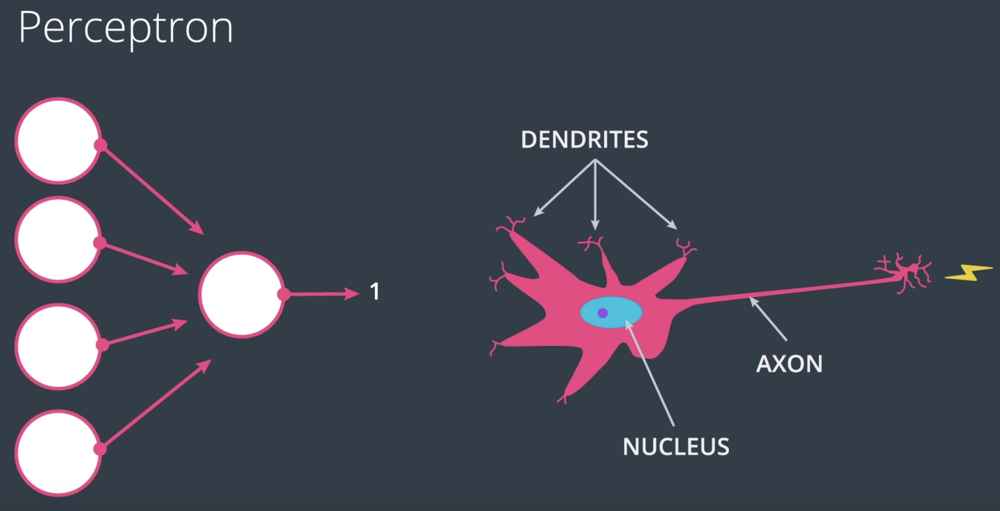
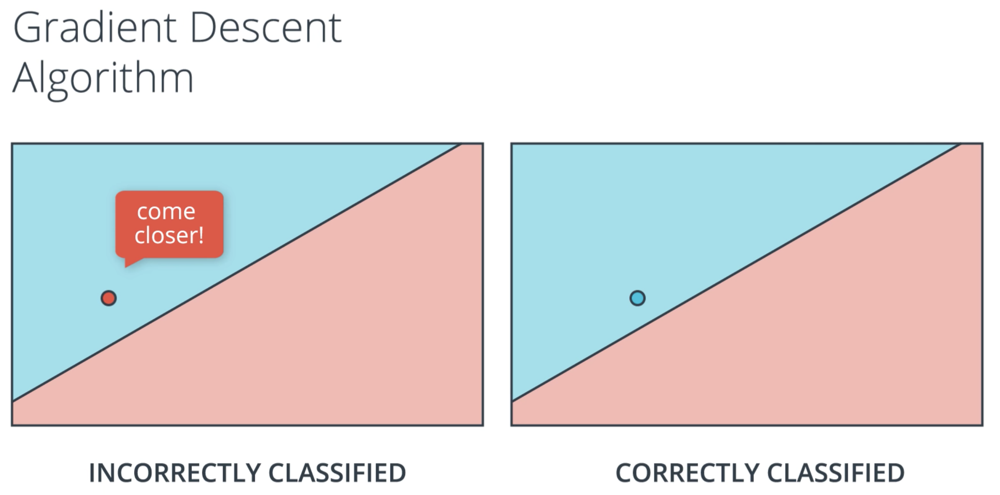
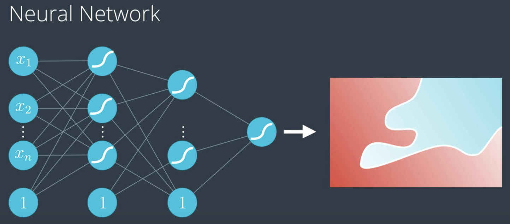
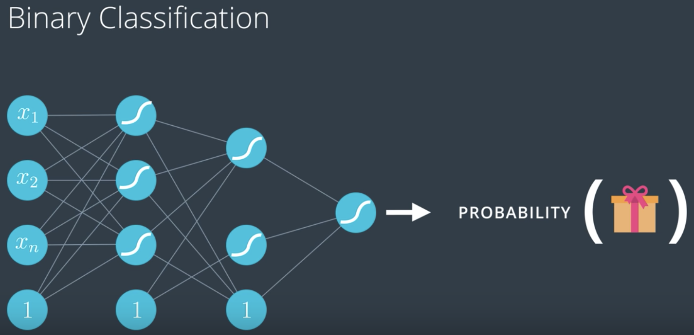
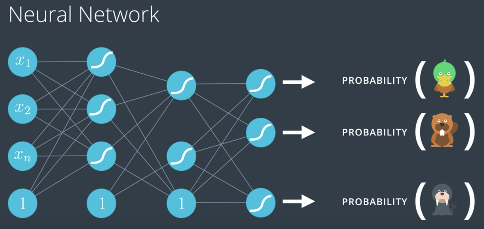
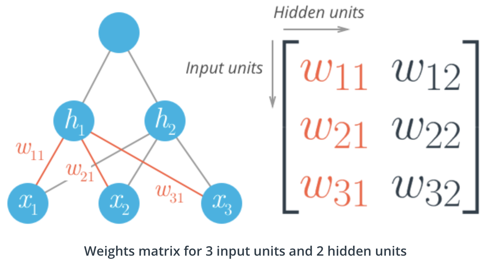
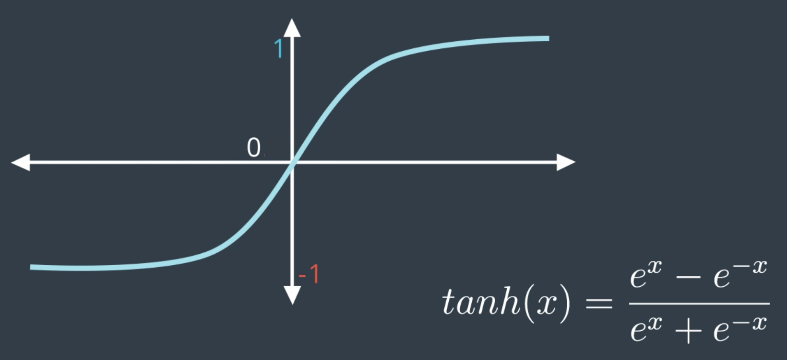
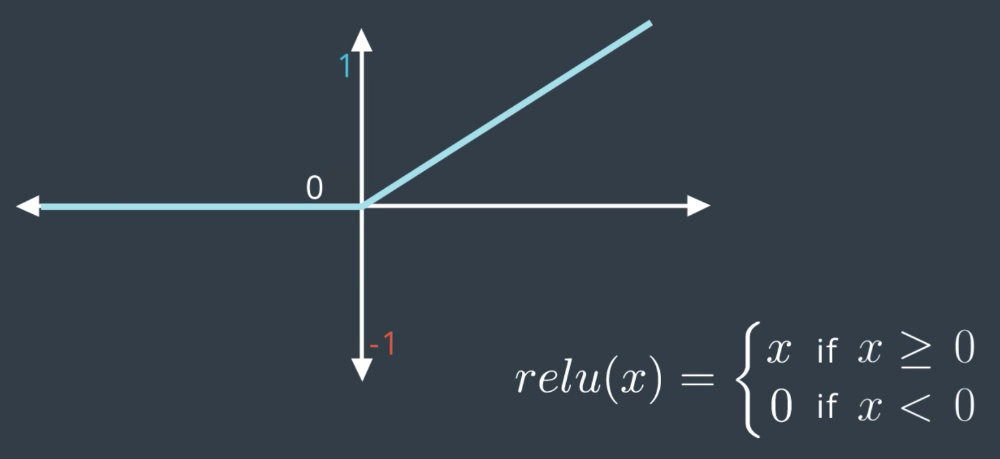
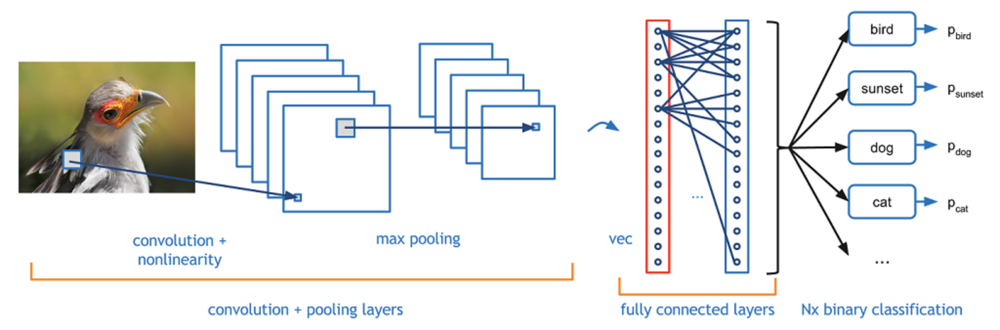

# Deep Learning

<!-- TOC -->

- [Deep Learning](#deep-learning)
  - [1. Intro to Neural Networks](#1-intro-to-neural-networks)
    - [1.1. Decision boundary](#11-decision-boundary)
    - [1.2. Perceptron](#12-perceptron)
    - [1.3. Perceptron trick](#13-perceptron-trick)
    - [1.4. Activation function](#14-activation-function)
    - [1.5. Log-loss error function](#15-log-loss-error-function)
    - [1.6. Minimize the error function via gradient descent](#16-minimize-the-error-function-via-gradient-descent)
    - [1.7. Neural network architechture](#17-neural-network-architechture)
    - [1.8. Mean squared error function](#18-mean-squared-error-function)
    - [1.9. Some useful terminology](#19-some-useful-terminology)
  - [2. Training neural networks](#2-training-neural-networks)
    - [2.1. Resolve overfitting](#21-resolve-overfitting)
    - [2.2. Resolve local minimum](#22-resolve-local-minimum)
    - [2.3. Resolve too small gradient from sigmoid](#23-resolve-too-small-gradient-from-sigmoid)
    - [2.4. Resolve humongous dataset](#24-resolve-humongous-dataset)
  - [3. Building a neural network with keras](#3-building-a-neural-network-with-keras)
    - [3.1. Optimizers in Keras](#31-optimizers-in-keras)
    - [3.2. Keras script](#32-keras-script)
  - [4. Deep learning with PyTorch](#4-deep-learning-with-pytorch)
    - [4.1. Pytorch syntax](#41-pytorch-syntax)
    - [4.2. Initialize data](#42-initialize-data)
    - [4.3. Define layers and operations](#43-define-layers-and-operations)
    - [4.4. Define criterion, optimizer, and validation](#44-define-criterion-optimizer-and-validation)
    - [4.5. Train a neural network](#45-train-a-neural-network)
    - [4.6. Inference](#46-inference)
    - [4.7. Save and load trained networks](#47-save-and-load-trained-networks)
    - [4.8. Transfer learning with CUDA](#48-transfer-learning-with-cuda)

<!-- /TOC -->

## 1. Intro to Neural Networks

### 1.1. Decision boundary

- Linear equation

  WX + b = 0

- Notation

  W: weight <br>
  X: input features <br>
  b: bias <br>
  y: label 0 or 1 <br>
  <a href="https://www.codecogs.com/eqnedit.php?latex=\alpha" target="_blank"></a>: learning rate <br>

### 1.2. Perceptron




### 1.3. Perceptron trick

<a href="https://www.codecogs.com/eqnedit.php?latex=w_1x_1&space;&plus;&space;w_2x_2&space;&plus;&space;b&space;=&space;0" target="_blank"></a> <br>
Point <a href="https://www.codecogs.com/eqnedit.php?latex=(x_p,&space;x_q)" target="_blank"></a> classified incorrecctly <br>

To move the decision boundary closer to the point, for every misclassified point:

- if the incorrect prediction = 1
  
  <a href="https://www.codecogs.com/eqnedit.php?latex=w_1&space;:=&space;w_1&space;-&space;x_p\alpha" target="_blank"></a> <br>
  <a href="https://www.codecogs.com/eqnedit.php?latex=w_2&space;:=&space;w_2&space;-&space;x_q\alpha" target="_blank"></a> <br>
  <a href="https://www.codecogs.com/eqnedit.php?latex=b&space;:=&space;b&space;-&space;\alpha" target="_blank"></a> <br>

- if the incorrect prediction = 0
  
  <a href="https://www.codecogs.com/eqnedit.php?latex=w_1&space;:=&space;w_1&space;&plus;&space;x_p\alpha" target="_blank"></a> <br>
  <a href="https://www.codecogs.com/eqnedit.php?latex=w_2&space;:=&space;w_2&space;&plus;&space;x_q\alpha" target="_blank"></a> <br>
  <a href="https://www.codecogs.com/eqnedit.php?latex=b&space;:=&space;b&space;&plus;&space;\alpha" target="_blank"></a> <br>

### 1.4. Activation function

- Sigmoid function (2 classes)

  <a href="https://www.codecogs.com/eqnedit.php?latex=h_\theta(x)=\frac{1}{1&plus;e^{-\theta^Tx}}" target="_blank"></a>

- Softmax function (≥3 classes)

  <a href="https://www.codecogs.com/eqnedit.php?latex=h^i_\theta(x)=\frac{e^{Zi}}{e^{Z1}&plus;...&plus;e^{Zn}}" target="_blank"></a> for class i = 1,...,n

### 1.5. Log-loss error function

- Maximum likelihood

  <a href="https://www.codecogs.com/eqnedit.php?latex=\prod" target="_blank"></a> of all events's probabilities under the current model

- Cross entropy

  - Binary

    <a href="https://www.codecogs.com/eqnedit.php?latex=cross\_entropy&space;=&space;-\sum_{i=1}^m{y_iln(p_i)&plus;(1-y_i)ln(1-p_i)}" target="_blank"></a>, aka., -ln(maximum likelihood) <br>

    <a href="https://www.codecogs.com/eqnedit.php?latex=m" target="_blank"></a>: number of observations <br>
    <a href="https://www.codecogs.com/eqnedit.php?latex=n" target="_blank"></a>: number of classes <br>
    <a href="https://www.codecogs.com/eqnedit.php?latex=p_i" target="_blank"></a>: probability of the event happening under the current model <br>
    
    Lower entropy means better model <br>
    Goal: minimize the cross entropy

  - Multi-class

    <a href="https://www.codecogs.com/eqnedit.php?latex=cross\_entropy&space;=&space;-\sum_{i=1}^n\sum_{j=1}^m{y_{ij}ln(p_{ij})}" target="_blank"></a>

- Error function of logistic regression

  - Binary

    <a href="https://www.codecogs.com/eqnedit.php?latex=J(\Theta)=-\frac{1}{m}\sum_{i=1}^m[y_{(&space;i)}log(h_\Theta(x_{(i)}))&plus;(1-y_{(i)})log(1-h_\Theta(x_{(i)})]" target="_blank"></a>

  - Multi-class

    <a href="https://www.codecogs.com/eqnedit.php?latex=J(\Theta)=-\frac{1}{m}\sum_{i=1}^m\sum_{j=1}^ny_{(ij)}log(h_\Theta(x_{(ij)}))" target="_blank"></a>

### 1.6. Minimize the error function via gradient descent

- Gradient of the error function

  <a href="https://www.codecogs.com/eqnedit.php?latex=\delta_j^{(l)}" target="_blank"></a>: error of node j in layer l <br>

  - When <a href="https://www.codecogs.com/eqnedit.php?latex=l=L" target="_blank"></a>: <br>
    For each output unit j, <br> 
    <a href="https://www.codecogs.com/eqnedit.php?latex=\delta_j^{(L)}=a_j^{(L)}-y_j=h_\Theta(x)_j-y_j" target="_blank"></a> <br>

  - When <a href="https://www.codecogs.com/eqnedit.php?latex=1<l<L" target="_blank"></a>: <br>
    <a href="https://www.codecogs.com/eqnedit.php?latex=\delta^{(l)}=(\Theta^{(l)})^T\delta^{(l&plus;1)}g'(z^{(l)})" target="_blank"></a> where <a href="https://www.codecogs.com/eqnedit.php?latex=g'(z^{(l)})=a^{(l)}(1-a^{(l)})" target="_blank"></a> <br>

  Gradient ignoring regularization: <br>
  <a href="https://www.codecogs.com/eqnedit.php?latex=\frac{\partial}{\partial&space;\Theta_{ij}^{(l)}}J(\Theta)=a_j^{(l)}\delta_i^{(l&plus;1)}" target="_blank"></a>

- Gradient descent steps

  Repeat until convergence: <br>
      <a href="https://www.codecogs.com/eqnedit.php?latex=\theta_j:=\theta_j-\alpha\frac{\partial}{\partial&space;\theta_j}J(\theta)" target="_blank"></a> <br>
  where <a href="https://www.codecogs.com/eqnedit.php?latex=\alpha" target="_blank"></a> is learning rate; simultaneously update <a href="https://www.codecogs.com/eqnedit.php?latex=\theta_0" target="_blank"></a> and <a href="https://www.codecogs.com/eqnedit.php?latex=\theta_1" target="_blank"></a>

- Gradient descent algorithm

  

  <br>
  <br>

  <br><br>
  (Image credit: [The Clever Machine](https://theclevermachine.wordpress.com/tag/backpropagation/))

### 1.7. Neural network architechture

Neural Networks (Multi-Layer Perceptrons)







- Feedforward

  <a href="https://www.codecogs.com/eqnedit.php?latex=z^{(j&plus;1)}=\Theta^{(j)}a^{(j)}" target="_blank"></a> <br>
  <a href="https://www.codecogs.com/eqnedit.php?latex=a^{(j&plus;1)}=g(z^{(j&plus;1)})" target="_blank"></a>

  - <a href="https://www.codecogs.com/eqnedit.php?latex=a_i^{(j)}" target="_blank"></a>: "activation" of unit i in layer j <br>
  - <a href="https://www.codecogs.com/eqnedit.php?latex=\Theta^{(j)}" target="_blank"></a>: matrix of weights controlling function mapping from layer j to layer j + 1
  - If network has <a href="https://www.codecogs.com/eqnedit.php?latex=s_j" target="_blank"></a> units in layer j and <a href="https://www.codecogs.com/eqnedit.php?latex=s_{j&plus;1}" target="_blank"></a> units in layer j+1, then <a href="https://www.codecogs.com/eqnedit.php?latex=\Theta^{(j)}" target="_blank"></a> will be of dimension <a href="https://www.codecogs.com/eqnedit.php?latex=s_{j&plus;1}" target="_blank"></a> × <a href="https://www.codecogs.com/eqnedit.php?latex=(s_j&plus;1)" target="_blank"></a>.

- Error function of binary logistic regression

  <a href="https://www.codecogs.com/eqnedit.php?latex=J(\Theta)=-\frac{1}{m}\sum_{i=1}^m[y_{i}log(h_\Theta(x_{i}))&plus;(1-y_{i})log(1-h_\Theta(x_{i})]" target="_blank"></a>

- Backpropogation

  - <a href="https://www.codecogs.com/eqnedit.php?latex=\delta_j^{(l)}" target="_blank"></a>: error of node j in layer l
  - Algorithm

    Training set <a href="https://www.codecogs.com/eqnedit.php?latex={(x^{(1)},&space;y^{(1)}),&space;...,&space;(x^{(m)},&space;y^{(m)})}" target="_blank"></a> <br>
    Set <a href="https://www.codecogs.com/eqnedit.php?latex=\Delta_{ij}^{(l)}=0" target="_blank"></a> for all l, i, j <br>

    - For i = 1 to m <br>

        Set <a href="https://www.codecogs.com/eqnedit.php?latex=a^{(1)}=x^{(i)}" target="_blank"></a> <br>
        Perform forward propogation to compute <a href="https://www.codecogs.com/eqnedit.php?latex=a^{(l)}" target="_blank"></a> for l=2,3,...,L <br>

        Use <a href="https://www.codecogs.com/eqnedit.php?latex=y^{(i)}" target="_blank"></a> to compute <a href="https://www.codecogs.com/eqnedit.php?latex=\delta^{(L)}=a^{(L)}-y^{(i)}" target="_blank"></a> <br>
        Compute <a href="https://www.codecogs.com/eqnedit.php?latex=\delta^{(L-1)},&space;\delta^{(L-2)},&space;...,&space;\delta^{(2)}" target="_blank"></a> using <a href="https://www.codecogs.com/eqnedit.php?latex=\delta^{(l)}=(\Theta^{(l)})^T\delta^{(l&plus;1)}&space;a^{(l)}(1-a^{(l)})" target="_blank"></a> <br>
        By convention, error does not include bias units

        <a href="https://www.codecogs.com/eqnedit.php?latex=\Delta_{ij}^{(l)}:=\Delta_{ij}^{(l)}&plus;a_j^{(l)}\delta_i^{(l&plus;1)}" target="_blank"></a> <br>
        aka., <a href="https://www.codecogs.com/eqnedit.php?latex=\Delta^{(l)}:=\Delta^{(l)}&plus;\delta^{(l&plus;1)}(a^{(l)})^T" target="_blank"></a>

    <a href="https://www.codecogs.com/eqnedit.php?latex=D_{ij}^{(l)}:=\frac{1}{m}\Delta_{ij}^{(l)}&plus;\lambda\Theta_{ij}^{(l)}" target="_blank"></a> if j≠0 <br>
    <a href="https://www.codecogs.com/eqnedit.php?latex=D_{ij}^{(l)}:=\frac{1}{m}\Delta_{ij}^{(l)}" target="_blank"></a> if j=0 <br>
    
    <a href="https://www.codecogs.com/eqnedit.php?latex=\frac{\partial}{\partial&space;\Theta_{ij}^{(l)}}J(\Theta)=D_{ij}^{(l)}" target="_blank"></a>

    Update weights: <br>
    <a href="https://www.codecogs.com/eqnedit.php?latex=\theta_{j}^{(l)}:=\theta_{j}^{(l)}-\alpha\frac{\partial}{\partial&space;\theta_j^{(l)}}J(\theta)" target="_blank"></a>

  - Further reading on backpropagation
    - [Yes you should understand backprop](https://medium.com/@karpathy/yes-you-should-understand-backprop-e2f06eab496b)
    - [a lecture from Stanford's CS231n course](https://www.youtube.com/watch?v=59Hbtz7XgjM)

### 1.8. Mean squared error function

- #### Cost function

  <a href="https://www.codecogs.com/eqnedit.php?latex=E=\frac{1}{2}\sum_i(y_{i}-f(\theta&space;x_{i}))^2" target="_blank"></a>

- #### Gradient

  <a href="https://www.codecogs.com/eqnedit.php?latex=\frac{\partial}{\partial&space;\theta_j}E=-(y_{i}-f(\theta&space;x_{i}))\frac{\partial&space;f(\theta&space;x_{i})}{\partial&space;(\theta&space;x_{i})}x_i" target="_blank"></a>

  Update weights: <br>
  <a href="https://www.codecogs.com/eqnedit.php?latex=\theta_{j}:=\theta_{j}-\alpha\frac{\partial}{\partial&space;\theta_j}E" target="_blank"></a>

- #### Gradeint descent

  (i) Initialize weights <a href="https://www.codecogs.com/eqnedit.php?latex=\Theta_{ij}" target="_blank"></a>

  - Near 0
  - All have different starting values
  - A good value for the scale is <a href="https://www.codecogs.com/eqnedit.php?latex=\frac{1}{\sqrt{n}}" target="_blank"></a> where n is the number of input units

  (ii) Set <a href="https://www.codecogs.com/eqnedit.php?latex=\Delta_{ij}^{(l)}=0" target="_blank"></a> <br>
  (iii) For each record in training data:

  - Forward propogation to calculate output unit <br><a href="https://www.codecogs.com/eqnedit.php?latex=a=f(\theta&space;x_{i})" target="_blank"></a>
  - Calculate error term for output unit <br><a href="https://www.codecogs.com/eqnedit.php?latex=\delta^{(L)}=(y_{i}-f(\theta&space;x_{i}))\frac{\partial&space;f(\theta&space;x_{i})}{\partial&space;(\theta&space;x_{i})}" target="_blank"></a>
    - For sigmoid function f <br>
        <a href="https://www.codecogs.com/eqnedit.php?latex=\frac{\partial&space;f(\theta&space;x_{i})}{\partial&space;(\theta&space;x_{i})}=f(\theta&space;x_{i})(1-f(\theta&space;x_{i}))" target="_blank"></a>
  - Compute <a href="https://www.codecogs.com/eqnedit.php?latex=\delta^{(L-1)},&space;\delta^{(L-2)},&space;...,&space;\delta^{(2)}" target="_blank"></a> using <br> <a href="https://www.codecogs.com/eqnedit.php?latex=\delta^{(l)}=(\Theta^{(l)})^T\delta^{(l&plus;1)}a^{(l)}(1-a^{(l)})" target="_blank"></a>
  - Update the weight step <br> <a href="https://www.codecogs.com/eqnedit.php?latex=\Delta_{ij}^{(l)}&space;=&space;\Delta_{ij}^{(l)}&space;&plus;&space;\delta^{(l&plus;1)}(a^{(l)})^T" target="_blank"></a>

  (iv) Update weights <a href="https://www.codecogs.com/eqnedit.php?latex=\theta_{j}:=\theta_{j}&plus;\frac{\alpha}{m}\Delta_{ij}^{(l)}" target="_blank"></a> where m is the number of records

  

### 1.9. Some useful terminology

- **One epoch** = one forward pass and one backward pass of all the training examples
- **Batch size** = the number of training examples in one forward/backward pass. The higher the batch size, the more memory space you'll need.
- **Number of iterations** = number of passes, each pass using [batch size] number of examples. To be clear, one pass = one forward pass + one backward pass.

Example: if you have 1000 training examples, and your batch size is 500, then it will take 2 iterations to complete 1 epoch.

## 2. Training neural networks

### 2.1. Resolve overfitting

- #### Early stopping

  Increase model complexity, use gradient descent to train the model until testing error start to increase.

- #### Regularization

  Penalize large coefficients to resolve overfitting

  - L1: <a href="https://www.codecogs.com/eqnedit.php?latex=\lambda\sum_{j=1}^n|\Theta_j|" target="_blank"></a>, small weights tend to go to 0, good for feature selection
  - L2: <a href="https://www.codecogs.com/eqnedit.php?latex=\lambda\sum_{j=1}^n\Theta_j^2" target="_blank"></a>, maintains all weights small, better for training models

- #### Dropout

  Randomly turn off some of the nodes to train all the nodes in neural networks

### 2.2. Resolve local minimum

- #### Random restart

  Start from different multiple positions to get the best minimum

- #### Momentum

  <a href="https://www.codecogs.com/eqnedit.php?latex=\beta" target="_blank"></a>: momentum <br>
  step: gradient descent step <br>
  <a href="https://www.codecogs.com/eqnedit.php?latex=step(n)&space;=&space;step(n)&space;&plus;&space;\beta&space;step(n-1)&space;&plus;&space;\beta^2step(n-2)&space;&plus;&space;..." target="_blank"></a>

### 2.3. Resolve too small gradient from sigmoid

- #### Use other activation functions

  Hyperbolic tangent function

  

  Rectified linear unit (ReLU)

  

### 2.4. Resolve humongous dataset

- #### Stochastic gradient descent

  Split the data into several batches, run gradient descent on each batch consecutively.

## 3. Building a neural network with keras

### 3.1. Optimizers in Keras

Blog post on algorithms [here](http://ruder.io/optimizing-gradient-descent/index.html#gradientdescentoptimizationalgorithms)

- `SGD`

  Stochastic Gradient Descent uses the following parameters:

  - Learning rate.
  - Momentum (This takes the weighted average of the previous steps, in order to get a bit of momentum and go over bumps, as a way to not get stuck in local minima).
  - Nesterov Momentum (This slows down the gradient when it's close to the solution).

- `Adam`

  Adaptive Moment Estimation uses a more complicated exponential decay that consists of not just considering the average (first moment), but also the variance (second moment) of the previous steps.

- `RMSProp`

  RMS stands for Root Mean Squared Error decreases the learning rate by dividing it by an exponentially decaying average of squared gradients.

### 3.2. Keras script

- #### Sequential model

  ```python
  import numpy as np
  from keras.models import Sequential
  from keras.layers.core import Dense, Dropout, Activation
  from keras import regularizers

  # X has shape (num_rows, num_cols), where the training data are stored
  # as row vectors
  X = np.array([[0, 0], [0, 1], [1, 0], [1, 1]], dtype=np.float32)

  # y must have an output vector for each input vector
  y = np.array([[0], [0], [0], [1]], dtype=np.float32)

  # Create the Sequential model
  model = Sequential()
  ```

- #### Layers

  ```python
  # 1st Layer - Add an input layer of 32 nodes with the same input shape as the training samples in X; add a L2 regularization on weights
  model.add(Dense(32, input_dim=X.shape[1], kernel_regularizer=regularizers.l2(0.01)))

  # Add a softmax activation layer
  model.add(Activation('softmax'))
  model.add(Dropout(.1))

  # 2nd Layer - Add a fully connected output layer
  model.add(Dense(1, kernel_regularizer=regularizers.l2(0.01)))

  # Add a sigmoid activation layer
  model.add(Activation('sigmoid'))
  ```

  Note that `model.add(Dense(128)); model.add(Activation('softmax'))` is computationally equivalent to `model.add(Dense(128, activation="softmax"))`, but it is common to explicitly separate the activation layers because it allows direct access to the outputs of each layer before the activation is applied (which is useful in some model architectures.

- #### Compile the model

  ```python
  model.compile(loss="categorical_crossentropy", optimizer="adam", metrics = ["accuracy"])
  ```

  - Loss function `categorical_crossentropy`: can be used when there are only two classes
  - Optimizer `adam`: a reasonable default when speed is a priority
  - Metrics `accuracy`: metrics we want to evaluate the model with

- #### See the resulting model architecture

  ```python
  model.summary()
  ```

- #### Train the model

  ```python
  history = model.fit(X, y, epochs=1000, batch_size=100, shuffle=True, verbose=0, validation_split=0.2)
  ```

  - The number of training epochs. Keras 1: `nb_epoch`, Keras 2: `epochs`
  - The message level (how much information we want displayed on the screen during training)

- #### Visualize training and validation progress

  ```python
  plt.plot(history.history['val_acc'], label="validation")
  plt.plot(history.history['acc'], label="training")
  plt.ylim(bottom=0)
  plt.legend()
  ```

- #### Evaluate the model

  ```python
  score = model.evaluate()
  print("\nAccuracy: ", score[-1])
  ```

  ```python
  # Evaluate the model using the testing data
  model_loss, model_accuracy = model.evaluate(
      X_test_scaled, y_test_categorical, verbose=2)
  print(f"Loss: {model_loss}, Accuracy: {model_accuracy}")
  ```

- #### Check the predictions

  ```python
  # Checking the predictions
  print("\nPredictions:")
  print(model.predict_proba(X))
  ```

- #### Save the model

  ```python
  # Save the model
  model.save("voice_model_trained.h5")
  ```

  ```python
  # Load the model
  from keras.models import load_model
  voice_model = load_model("voice_model_trained.h5")
  ```

## 4. Deep learning with PyTorch

[PyTorch](https://pytorch.org/) is a framework for building and training neural networks

- Behaves like numpy
- Moves tensors (a generalization of matrices) to GPUs for faster processing
- Automatically calculates gradients (for backpropagation) and another module specifically for building neural networks

### 4.1. Pytorch syntax

- Dependencies

  ```python
  import numpy as np
  import torch
  ```

- Create

  ```python
  x = torch.rand(3, 2) # 3x2 matrix
  y = torch.ones(x.size())
  z = x + y
  ```

- Methods

  Tensors typically have two forms of methods, one method that returns another tensor and another method that performs the operation in place.

  ```python
  # Return a new tensor z + 1, z tensor is unchanged
  z.add(1)

  # Add 1 and update z tensor in-place
  z.add_(1)
  ```

- Reshape

  ```python
  z.size()
  z.resize_(2, 3)
  ```

- Convert between numpy and torch

  ```python
  a = np.random.rand(4,3)
  b = torch.from_numpy(a)
  b.numpy()
  ```

  The memory is shared between the Numpy array and Torch tensor, so if you change the values in-place of one object, the other will change as well.

  ```python
  # Multiply PyTorch Tensor by 2, in place
  b.mul_(2)
  # Numpy array matches new values from Tensor
  a
  ```

### 4.2. Initialize data

- #### Dependencies

  ```python
  %matplotlib inline
  %config InlineBackend.figure_format = 'retina'

  import numpy as np
  import torch
  import matplotlib.pyplot as plt
  from torchvision import datasets, transforms, models
  from torch import nn, optim
  import torch.nn.functional as F
  from collections import OrderedDict
  import time

  import helper
  ```
  
- #### Transform data

  More transforms available from [documentation](http://pytorch.org/docs/master/torchvision/transforms.html)

  - During training, can randomly rotate, mirror, scale, and/or crop images.
  - During testing, use images that aren't altered (except need to normalize, resize, or crop the same way).
  - Normalizing helps keep the weights near zero which in turn makes backpropagation more stable. Subtract by means; divide by standard deviations;

  ```python
  train_transforms = transforms.Compose([
                                # transforms.Resize(255),
                                # transforms.CenterCrop(224),
                                transforms.RandomRotation(30),
                                transforms.RandomResizedCrop(100),
                                transforms.RandomHorizontalFlip(),
                                transforms.ToTensor(),
                                transforms.Normalize([0.5, 0.5, 0.5],
                                                    [0.5, 0.5, 0.5])])
  test_transforms = transforms.Compose([
                                transforms.RandomResizedCrop(100),
                                transforms.ToTensor(),
                                transforms.Normalize([0.5, 0.5, 0.5],
                                                    [0.5, 0.5, 0.5])])
  ```

- #### Load data

  The easiest way to load image data is with `datasets.ImageFolder` from `torchvision` ([documentation](http://pytorch.org/docs/master/torchvision/datasets.html#imagefolder)).

  ```python
  train_data = datasets.ImageFolder('path/to/root_train', transform=train_transforms)
  test_data = datasets.ImageFolder('path/to/root_test', transform=test_transforms)
  ```

  ImageFolder expects the files and directories to be constructed like root/dog/xxx.png, root/cat/123.png.

- #### Data loaders

  The `DataLoader` takes a dataset (such as from `ImageFolder`) and returns batches of images and the corresponding labels. Here `dataloader` is a [generator](https://jeffknupp.com/blog/2013/04/07/improve-your-python-yield-and-generators-explained/). To get data out of it, need to loop through it or convert it to an iterator and call `next()`.

  ```python
  trainloader = torch.utils.data.DataLoader(train_data, batch_size=32, shuffle=True)
  testloader = torch.utils.data.DataLoader(test_data, batch_size=32)
  ```

- #### Make iterator of data

  ```python
  # Looping through it, get a batch on each loop 
  for images, labels in trainloader:
      pass

  # Get one batch
  images, labels = next(iter(trainloader))

  # Visualize
  fig, axes = plt.subplots(figsize=(10,4), ncols=4)
  for ii in range(4):
      ax = axes[ii]
      helper.imshow(images[ii], ax=ax)
  ```

- #### Altogether

  ```python
  # Define a transform to normalize the data
  transform = transforms.Compose([transforms.ToTensor(),
                                transforms.Normalize((0.5, 0.5, 0.5), (0.5, 0.5, 0.5))])
  
  # Download and load the training data
  trainset = datasets.MNIST('MNIST_data/', download=True, train=True, transform=transform)
  trainloader = torch.utils.data.DataLoader(trainset, batch_size=64, shuffle=True)

  # Download and load the test data
  testset = datasets.MNIST('MNIST_data/', download=True, train=False, transform=transform)
  testloader = torch.utils.data.DataLoader(testset, batch_size=64, shuffle=True)

  # Make iterator of data
  dataiter = iter(trainloader)
  images, labels = dataiter.next()
  
  # images is a tensor with size (64, 1, 28, 28). So, 64 images per batch, 1 color channel, and 28x28 images.
  plt.imshow(images[0].numpy().squeeze(), cmap='Greys_r');
  ```

### 4.3. Define layers and operations


Due to [inaccuracies with representing numbers as floating points](https://docs.python.org/3/tutorial/floatingpoint.html), computations with a softmax output can lose accuracy and become unstable. To get around this, use the raw output, called the **logits**, to calculate the loss. Alternatively, use the **log-softmax**, which is a log probability that comes with a [lot of benefits](https://en.wikipedia.org/wiki/Log_probability) (e.g. faster and more accurate).

- #### Build a class with defined layers

  ```python
  class Network(nn.Module):
      def __init__(self):
          super().__init__()
          # Defining the layers, 128, 64, 10 units each
          self.fc1 = nn.Linear(784, 128) # fully connected (fc) layer
          self.fc2 = nn.Linear(128, 64)
          # Output layer, 10 units - one for each digit
          self.fc3 = nn.Linear(64, 10)
          
      def forward(self, x):
          ''' Forward pass through the network, returns the output logits '''
          
          x = self.fc1(x)
          x = F.relu(x)
          x = self.fc2(x)
          x = F.relu(x)
          x = self.fc3(x)
          # x = F.softmax(x, dim=1)
          
          return x

  model = Network()
  model
  ```

- #### Build a class with arbitrary layers

  `nn.ModuleList` works similar as a normal Python list, except that it registers each hidden layer Linear module properly so the model is aware of the layers.

  ```python
  class Network(nn.Module):
      def __init__(self, input_size, output_size, hidden_layers, drop_p=0.5):
          ''' Builds a feedforward network with arbitrary hidden layers.
          
              Arguments
              ---------
              input_size: integer, size of the input
              output_size: integer, size of the output layer
              hidden_layers: list of integers, the sizes of the hidden layers
              drop_p: float between 0 and 1, dropout probability
          '''
          super().__init__()
          
          # Add the first layer, input to a hidden layer
          self.hidden_layers = nn.ModuleList([nn.Linear(input_size, hidden_layers[0])])
          
          # Add a variable number of more hidden layers
          layer_sizes = zip(hidden_layers[:-1], hidden_layers[1:])
          self.hidden_layers.extend([nn.Linear(h1, h2) for h1, h2 in layer_sizes])
          
          # Add the output layer
          self.output = nn.Linear(hidden_layers[-1], output_size)
          
          # Include dropout
          self.dropout = nn.Dropout(p=drop_p) # Has to be turned off during inference
          
      def forward(self, x):
          ''' Forward pass through the network, returns the output logits '''
          
          # Forward through each layer in `hidden_layers`, with ReLU activation and dropout
          for linear in self.hidden_layers:
              x = F.relu(linear(x))
              x = self.dropout(x)
          
          x = self.output(x)
          
          return F.log_softmax(x, dim=1)
  ```

- #### Use the sequential method with defined layers

  ```python
  # Hyperparameters for our network
  input_size = 784
  hidden_sizes = [128, 64]
  output_size = 10

  # Build a feed-forward network
  model = nn.Sequential(nn.Linear(input_size, hidden_sizes[0]),
                        nn.ReLU(),
                        nn.Linear(hidden_sizes[0], hidden_sizes[1]),
                        nn.ReLU(),
                        nn.Linear(hidden_sizes[1], output_size),
                        # nn.Softmax(dim=1)
  )
  print(model)
  ```

- #### Use the sequential method with defined layers by `OrderedDict`

  Each operation must have a different name.

  ```python
  # Hyperparameters for our network
  input_size = 784
  hidden_sizes = [128, 64]
  output_size = 10

  # Build a feed-forward network
  model = nn.Sequential(OrderedDict([
                        ('fc1', nn.Linear(input_size, hidden_sizes[0])),
                        ('relu1', nn.ReLU()),
                        ('fc2', nn.Linear(hidden_sizes[0], hidden_sizes[1])),
                        ('relu2', nn.ReLU()),
                        ('logits', nn.Linear(hidden_sizes[1], output_size)),
                        # ('softmax', nn.Softmax(dim=1))
  ]))
  model
  ```

### 4.4. Define criterion, optimizer, and validation

- #### Define loss function criterion and optimizer

  [Criterion](https://pytorch.org/docs/master/nn.html#loss-functions)
  
  - e.g. `nn.CrossEntropyLoss` for `logits` output
  - e.g. `nn.NLLLoss()` ([negative log loss](http://pytorch.org/docs/master/nn.html#nllloss)) for `log-softmax` output

  [Optimizer](https://pytorch.org/docs/master/optim.html)
  
  - e.g. `optim.SGD`
  - e.g. `optim.Adam`, a variant of stochastic gradient descent which includes momentum and in general trains faster than basic SGD.

  ```python
  model = Network(784, 10, [516, 256], drop_p=0.5)
  criterion = nn.CrossEntropyLoss()
  # criterion = nn.NLLLoss()
  optimizer = optim.SGD(model.parameters(), lr=0.001)
  # optimizer = optim.Adam(model.parameters(), lr=0.001)
  ```

- #### Define a validation function

  ```python
  # Measure the validation loss and accuracy
  def validation(model, testloader, criterion):
      test_loss = 0
      accuracy = 0
      for images, labels in testloader:

          images.resize_(images.shape[0], 784)

          output = model.forward(images)
          test_loss += criterion(output, labels).item()

          ps = torch.exp(output) # get the class probabilities from log-softmax
          equality = (labels.data == ps.max(dim=1)[1])
          accuracy += equality.type(torch.FloatTensor).mean()
      
      return test_loss, accuracy
  ```

### 4.5. Train a neural network

Torch provides a module, `autograd`, for automatically calculating the gradient of tensors. It does this by keeping track of operations performed on tensors. Set `requires_grad` on a tensor. You can do this at creation with the `requires_grad` keyword, or at any time with `x.requires_grad_(True)`.

- #### Initialize weights and biases

  - Automatic initialization

    ```python
    print(model.fc1.weight)
    print(model.fc1.bias)
    ```

  - Custom initialization

    ```python
    # Set biases to all zeros
    model.fc1.bias.data.fill_(0)

    # sample from random normal with standard dev = 0.01
    model.fc1.weight.data.normal_(std=0.01)
    ```

- #### An example forward pass

  ```python
  # Grab some data 
  dataiter = iter(trainloader)
  images, labels = dataiter.next()

  # Resize images into a 1D vector, new shape is (batch size, color channels, image pixels) 
  images.resize_(64, 1, 784)
  # or images.resize_(images.shape[0], 1, 784) to automatically get batch size

  # Forward pass through the network
  img_idx = 0
  ps = model.forward(images[img_idx,:])

  img = images[img_idx]
  helper.view_classify(img.view(1, 28, 28), ps)
  ```

- #### Train

  ```python
  epochs = 3
  print_every = 40
  steps = 0

  for e in range(epochs):
      running_loss = 0
      for images, labels in iter(trainloader):
          steps += 1

          # Flatten MNIST images into a 784 long vector
          images.resize_(images.size()[0], 784)
          
          # Clear the gradients, do this because gradients are accumulated
          optimizer.zero_grad()
          
          # Forward pass to get the output
          output = model.forward(images)

          # Use output to calculate loss
          loss = criterion(output, labels)

          # Backward pass to calculate the gradients
          loss.backward()
          
          # Update weights
          optimizer.step()
          
          running_loss += loss.item()
          
          if steps % print_every == 0:
              print("Epoch: {}/{}... ".format(e+1, epochs),
                    "Loss: {:.4f}".format(running_loss/print_every))
              # print('Updated weights - ', model.fc1.weight)
              
              running_loss = 0
  ```

- #### Train and validation

  ```python
  epochs = 2
  print_every = 40
  steps = 0
  running_loss = 0
  
  for e in range(epochs):

      # Dropout is turned on for training
      model.train()
      
      for images, labels in trainloader:
          steps += 1
          images.resize_(images.size()[0], 784)
          optimizer.zero_grad()
          output = model.forward(images)
          loss = criterion(output, labels)
          loss.backward()
          optimizer.step()
          running_loss += loss.item()
          
          if steps % print_every == 0:
              # Make sure network is in eval mode for inference
              model.eval()
              
              # Turn off gradients for validation, saves memory and computations
              with torch.no_grad():
                  test_loss, accuracy = validation(model, testloader, criterion)
                  
              print("Epoch: {}/{}.. ".format(e+1, epochs),
                    "Training Loss: {:.3f}.. ".format(running_loss/print_every),
                    "Test Loss: {:.3f}.. ".format(test_loss/len(testloader)),
                    "Test Accuracy: {:.3f}".format(accuracy/len(testloader)))
              
              running_loss = 0
              
              # Make sure training is back on
              model.train()
  ```

### 4.6. Inference

- #### Check predictions

  ```python
  model.eval()
  
  dataiter = iter(testloader)
  images, labels = dataiter.next()
  img = images[0]
  img = img.view(1, 784) # Convert 2D image to 1D vector

  # Turn off gradients to speed up this part
  with torch.no_grad():
      output = model.forward(img)

  # If output of the network are logits, need to take softmax for probabilities
  ps = F.softmax(output, dim=1)

  # If output are log-softmax, need to take exponential for probabilities
  ps = torch.exp(output)

  # Plot the image and probabilities
  helper.view_classify(img.view(1, 28, 28), ps)
  ```

### 4.7. Save and load trained networks

Need to save both model architecture and network parameters (`state_dict`)

- #### Build a dictionary, save to file `checkpoint.pth`

  ```python
  checkpoint = {'input_size': 784,
                'output_size': 10,
                'hidden_layers': [each.out_features for each in model.hidden_layers],
                'state_dict': model.state_dict()}

  torch.save(checkpoint, 'checkpoint.pth')
  ```

- #### Load checkpoints

  ```python
  def load_checkpoint(filepath):
      checkpoint = torch.load(filepath)
      model = fc_model.Network(checkpoint['input_size'],
                              checkpoint['output_size'],
                              checkpoint['hidden_layers'])
      model.load_state_dict(checkpoint['state_dict'])
      
      return model

  model = load_checkpoint('checkpoint.pth')
  print(model)
  ```

### 4.8. Transfer learning with CUDA

Transfer learning: use a pre-trained network on images not in the training set.

Pre-trained networks, e.g. networks trained on [ImageNet](http://www.image-net.org/) (available from [`torchvision.models`](http://pytorch.org/docs/0.3.0/torchvision/models.html)), can be used to solved challenging problems in computer vision. ImageNet, a massive dataset with >1 million labeled images in 1000 categories, is used to train deep neural networks using an architecture called [convolutional layers](https://www.youtube.com/watch?v=2-Ol7ZB0MmU). These trained models work astonishingly well as feature detectors for images they weren't trained on. Learn more about convolutional neural networks [here](https://medium.freecodecamp.org/an-intuitive-guide-to-convolutional-neural-networks-260c2de0a050).



- #### Initialize data

  - Most of the pretrained models require the input to be 224x224 images. 
  - Match the normalization used when the models were trained: for the color channels, the means are [0.485, 0.456, 0.406] and the standard deviations are [0.229, 0.224, 0.225]

  ```python
  data_dir = 'Cat_Dog_data'

  # Define transforms for the training data and testing data
  train_transforms = transforms.Compose([transforms.RandomRotation(30),
                                         transforms.RandomResizedCrop(224),
                                         transforms.RandomHorizontalFlip(),
                                         transforms.ToTensor(),
                                         transforms.Normalize([0.485, 0.456, 0.406], 
                                                              [0.229, 0.224, 0.225])])
  test_transforms = transforms.Compose([transforms.Resize(256),
                                        transforms.CenterCrop(224),
                                        transforms.ToTensor(),
                                        transforms.Normalize([0.485, 0.456, 0.406], 
                                                             [0.229, 0.224, 0.225])])

  # Pass transforms in here, then run the next cell to see how the transforms look
  train_data = datasets.ImageFolder(data_dir + '/train', transform=train_transforms)
  test_data = datasets.ImageFolder(data_dir + '/test', transform=test_transforms)

  trainloader = torch.utils.data.DataLoader(train_data, batch_size=64, shuffle=True)
  testloader = torch.utils.data.DataLoader(test_data, batch_size=32)
  ```

- #### Load in a pre-trained model such as [DenseNet](http://pytorch.org/docs/0.3.0/torchvision/models.html#id5)

  ```python
  model = models.densenet121(pretrained=True)
  model
  ```

  This model is built out of two main parts
  - Features: a stack of convolutional layers and overall works as a feature detector that can be fed into a classifier. The features will work perfectly on their own.
  - Classifier: a single fully-connected layer `(classifier): Linear(in_features=1024, out_features=1000)`. This layer was trained on the ImageNet dataset, so it won't work for other specific problem. Need to replace the classifier.

  ```python
  # Freeze parameters so we don't backprop through them
  for param in model.parameters():
      param.requires_grad = False

  classifier = nn.Sequential(OrderedDict([
                            ('fc1', nn.Linear(1024, 500)), # 1024 must match
                            ('relu', nn.ReLU()),
                            ('fc2', nn.Linear(500, 2)),
                            ('output', nn.LogSoftmax(dim=1))
                            ]))
      
  model.classifier = classifier
  ```

- #### Use GPU for really deep neural network

  Deep learning frameworks often use [CUDA](https://developer.nvidia.com/cuda-zone) to efficiently compute the forward and backwards passes on the GPU. In PyTorch:

  - Move model parameters and other tensors to the GPU memory: `model.to('cuda')`.
  - Move back from the GPU: `model.to('cpu')`, which should commonly be set when need to operate on the network output outside of PyTorch.

  ```python
  # At beginning of the script, write device agnostic which will automatically use CUDA if it's enabled
  device = torch.device("cuda:0" if torch.cuda.is_available() else "cpu")

  criterion = nn.NLLLoss()
  optimizer = optim.Adam(model.classifier.parameters(), lr=0.001) # Only train the classifier parameters, feature parameters are frozen

  # Whenever you get a new Tensor or Module, this won't copy if they are already on the desired device
  model.to(device)

  epochs = 4
  print_every = 40
  steps = 0
  running_loss = 0

  for e in range(epochs):
      for images, labels in iter(trainloader):
          
          images, labels = images.to(device), labels.to(device) # Move input and label tensors to the GPU
          
          steps += 1
          optimizer.zero_grad()
          output = model.forward(images)
          loss = criterion(output, labels)
          loss.backward()
          optimizer.step()
          running_loss += loss.item()
          
          # get the class probabilities from log-softmax
          ps = torch.exp(output) 
          equality = (labels.data == ps.max(dim=1)[1])
          train_accuracy += equality.type(torch.FloatTensor).mean()
          
          if steps % print_every == 0:
              
              print("Epoch: {}/{}.. ".format(e+1, epochs),
                "Training Loss: {:.3f}.. ".format(running_loss/print_every))
              running_loss = 0
  ```

  Accurcy on the test set

  ```python
  correct = 0
  total = 0
  with torch.no_grad():
      for data in testloader:
          images, labels = data
          outputs = model(images)
          _, predicted = torch.max(outputs.data, 1)
          total += labels.size(0)
          correct += (predicted == labels).sum().item()

  print('Accuracy of the network on the 10000 test images: %d %%' % (100 * correct / total))
  ```

- Keep GPU server awake

  [workspace_utils.py](Code/deep_learning/workspace_utils.py)

  ```python
  from workspace_utils import keep_awake

  for i in keep_awake(range(5)):  # anything that happens inside this loop will keep the workspace active
      # do iteration with lots of work here
  ```

  ```python
  from workspace_utils import active_session

  with active_session():
      # do long-running work here
  ```