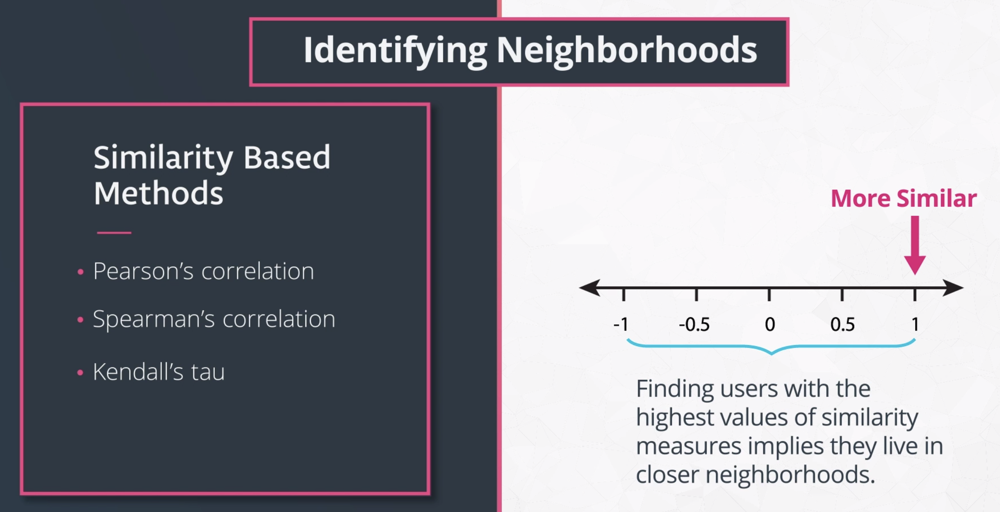
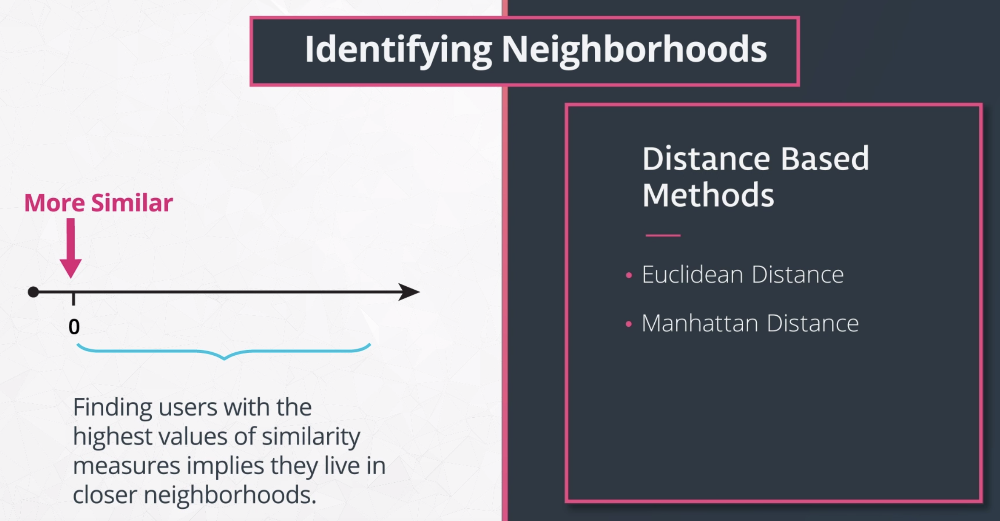
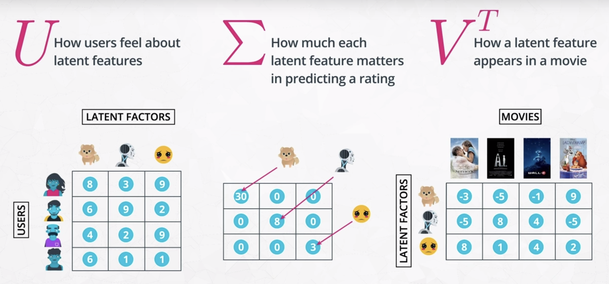
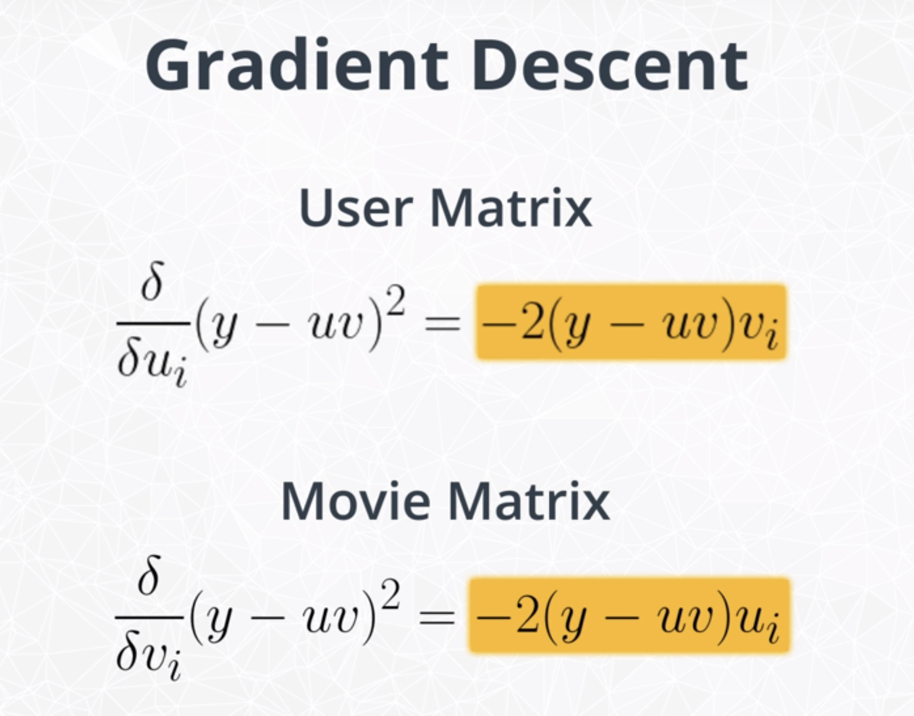
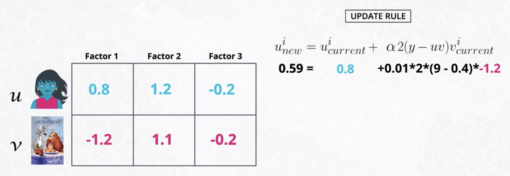

# Recommendation Engines

Three main braches of recommenders

- Knowledge Based Recommendations
- Collaborative Filtering Based Recommendations
  - Model Based Collaborative Filtering
  - Neighborhood Based Collaborative Filtering
- Content Based Recommendations

Often blended techniques of all three types are used in practice to provide the the best recommendation for a particular circumstance.

- [Recommendation Engines](#recommendation-engines)
  - [1. Knowledge based recommendation](#1-knowledge-based-recommendation)
  - [2. Collaborative filtering based recommendation - Neighborhood based](#2-collaborative-filtering-based-recommendation---neighborhood-based)
    - [2.1. Similarity based methods](#21-similarity-based-methods)
    - [2.2. Distance based methods](#22-distance-based-methods)
    - [2.3. Making recommendations](#23-making-recommendations)
  - [3. Collaborative filtering based recommendation - Model based](#3-collaborative-filtering-based-recommendation---model-based)
    - [3.1. Latent factors](#31-latent-factors)
    - [3.2. The original Singular Value Decomposition (SVD)](#32-the-original-singular-value-decomposition-svd)
    - [3.3. FunkSVD](#33-funksvd)
    - [3.4. The Cold Start Problem](#34-the-cold-start-problem)
  - [4. Content Based Recommendation](#4-content-based-recommendation)
  - [5. Applications](#5-applications)
    - [5.1. Example recommendation applications](#51-example-recommendation-applications)
    - [5.2. Choosing the rating scale](#52-choosing-the-rating-scale)
    - [5.3. Business goals of recommendations](#53-business-goals-of-recommendations)
    - [5.4. Validating recommendations](#54-validating-recommendations)

## 1. Knowledge based recommendation

**Knowledge based recommendation:** recommendation system in which knowledge about the item or user preferences are used to make a recommendation. Knowledge based recommendations frequently are implemented using filters, and are extremely common amongst luxury based goods. Often a rank based algorithm is provided along with knowledge based recommendations to bring the most popular items in particular categories to the user's attention.

**Rank based recommendation:** recommendation system based on higest ratings, most purchases, most listened to, etc.

## 2. Collaborative filtering based recommendation - Neighborhood based

**Collaborative filtering:** a method of making recommendations based on the interactions between users and items.
  
**Neighborhood based collaborative filtering** is used to identify items or users that are "neighbors" with one another.

It is worth noting that two vectors could be similar by similarity metrics while being incredibly, incredibly different by distance metrics. Understanding your specific situation will assist in understanding whether your metric is appropriate.

### 2.1. Similarity based methods

- **Pearson's correlation coefficient**

    Pearson's correlation coefficient is a measure related to the strength and direction of a *linear* relationship. If we have two vectors x and y, we can compare their individual elements in the following way to calculate Pearson's correlation coefficient:

    

    where

    

- **Spearman's correlation coefficient**

    Spearman's correlation is what is known as a [non-parametric](https://en.wikipedia.org/wiki/Nonparametric_statistics) statistic, which is a statistic whose distribution doesn't depend on parameters. (Statistics that follow normal distributions or binomial distributions are examples of parametric statistics.) Frequently non-parametric statistics are based on the ranks of data rather than the original values collected. If we map each of our data to ranked data values:

      
    

    Here, we let the **r** indicate these are ranked values (this is not raising any value to the power of r). Then we compute Spearman's correlation coefficient as:

    

    where

    

- **Kendall's Tau**

    Kendall's tau is quite similar to Spearman's correlation coefficient. Both of these measures are non-parametric measures of a relationship. Specifically both Spearman and Kendall's coefficients are calculated based on ranking data and not the raw data.

    Similar to both of the previous measures, Kendall's Tau is always between -1 and 1, where -1 suggests a strong, negative relationship between two variables and 1 suggests a strong, positive relationship between two variables.

    Though Spearman's and Kendall's measures are very similar, there are statistical advantages to choosing Kendall's measure in that Kendall's Tau has smaller variability when using larger sample sizes.  However Spearman's measure is more computationally efficient, as Kendall's Tau is O(n^2) and Spearman's correlation is O(nLog(n)). You can find more on this topic in [this thread](https://www.researchgate.net/post/Does_Spearmans_rho_have_any_advantage_over_Kendalls_tau).

    We want to map our data to ranks:

      
    

    Then we calculate Kendall's Tau as:

    

    Where $sgn$ takes the the sign associated with the difference in the ranked values.  An alternative way to write 

    

    is in the following way:

    <a href="https://www.codecogs.com/eqnedit.php?latex=$$&space;\begin{cases}&space;-1&space;&&space;x^r_i&space;<&space;x^r_j&space;\\&space;0&space;&&space;x^r_i&space;=&space;x^r_j&space;\\&space;1&space;&&space;x^r_i&space;>&space;x^r_j&space;\end{cases}&space;$$" target="_blank">&space;x^r_j&space;\end{cases}&space;$$" title="$$ \begin{cases} -1 & x^r_i < x^r_j \\ 0 & x^r_i = x^r_j \\ 1 & x^r_i > x^r_j \end{cases} $$" /></a>

    Therefore the possible results of 

    

    are only 1, -1, or 0, which are summed to give an idea of the proportion of times the ranks of **x** and **y** are pointed in the right direction.

### 2.2. Distance based methods

  
[This is a great article](http://dataaspirant.com/2015/04/11/five-most-popular-similarity-measures-implementation-in-python/) on some popular distance metrics.

Note: It is important to have all data be in the same scale. E.g., if some measures are on a 5 point scale, while others are on a 100 point scale.

- **Euclidean Distance**

    Euclidean distance can be considered as straight-line distance between two vectors. For two vectors **x** and **y**, we can compute this as:

    

- Manhattan Distance

    Different from euclidean distance, Manhattan distance is a 'manhattan block' distance from one vector to another.  Therefore, you can imagine this distance as a way to compute the distance between two points when you are not able to go through buildings.

    Specifically, this distance is computed as:

    

      
    The blue line gives the Manhattan distance, while the green line gives the Euclidean distance between two points.

### 2.3. Making recommendations

- User-based collaborative filtering

    In this type of recommendation, users related to the user you would like to make recommendations for are used to create a recommendation.

    - A simple method

        1. Find movies of neighbors, remove movies that the user has already seen.
        2. Find movies whose ratings are high.
        3. Recommend movies to each user where both 1 and 2 above hold.

    - Other methods for making recommendations using collaborative filtering are based on weighting of the neighbors' ratings based on the 'closeness' of the neighbors.

    - Learn more

        [Domino Data Lab Paper](https://blog.dominodatalab.com/recommender-systems-collaborative-filtering/)  
        [Semantic Scholar Paper On Weighted Ratings](https://pdfs.semanticscholar.org/3e9e/bcd9503ef7375c7bb334511804d1e45127e9.pdf)

- Item-based collaborative filtering

    In this type of recommendation, first find the items that are most related to each other item (based on similar ratings). Then you can use the ratings of an individual on those similar items to understand if a user will like the new item.

## 3. Collaborative filtering based recommendation - Model based

### 3.1. Latent factors

- **Latent factors**

    When performing SVD, we create a matrix of users by items, with user ratings for each item scattered throughout the matrix. Using SVD on this matrix, we can find **latent features** related to the users and items.

    

    Latent factor is a feature that isn't observed in the data, but can be inferred based on the relationships that occur.

- **Variability captured by latent features**

    The sigma matrix can actually tell us how much of the variability in the user-item matrix is captured by each latent feature. The total amount of variability to be explained is the sum of the squared diagonal elements. The amount of variability explained by the first componenet is the square of the first value in the diagonal. The amount of variability explained by the second componenet is the square of the second value in the diagonal.

### 3.2. The original Singular Value Decomposition (SVD)

- **SVD algorithm**

    If we let A be our user-item matrix, we can write the decomposition of that matrix in the following way.

    

    

    Consider reducing the number of latent features

    - If we keep all k latent features it is likely that latent features with smaller values in the sigma matrix will explain variability that is probably due to noise and not signal.
    - Furthermore, if we use these "noisey" latent features to assist in re-constructing the original user-movie matrix it will likely lead to worse ratings than if we only have latent features associated with signal.

- **SVD closed form solution**

    The most straightforward explanation of the closed form solution of SVD can be found at [this MIT link](http://web.mit.edu/be.400/www/SVD/Singular_Value_Decomposition.htm). As put in the paper -

    > "Calculating the SVD consists of finding the eigenvalues and eigenvectors of AA' and A'A. The eigenvectors of A'A make up the columns of V, the eigenvectors of AA' make up the columns of U. Also, the singular values in Σ are square roots of eigenvalues from AA' or A'A. The singular values are the diagonal entries of the Σ matrix and are arranged in descending order. The singular values are always real numbers. If the matrix A is a real matrix, then U and V are also real."

- **(-) SVD in NumPy will not work when our matrix has missing values**

### 3.3. FunkSVD

- Gradient descent

    To deal with missing values, use gradient descent to find the SVD matrices.

    

    

- Pros and cons

    - (+) Predict ratings for all user-item pairs
    - (+) Regression metrics to measure how well predictions match actual videos
    - (-) The cold start problem - use content-based or knowledge-based recommendations

### 3.4. The Cold Start Problem

The cold start problem is the problem that new users and new items to a platform don't have any ratings. Because these users and items don't have any ratings, it is impossible to use collaborative filtering methods to make recommendations.

Therefore, other methods such as rank-based and content-based recommenders are the only way to get started with making recommendations for these individuals.

## 4. Content Based Recommendation

**Content based recommendation:** recommendation system based on information about the users or items. This method of making recommendations is particularly useful when we do not have a lot of user-item connections available in our dataset.

- **Matrix multiplication**

    One of the fastest ways to find out how similar items are to one another (when our matrix isn't totally sparse like it was in the earlier section) is by simply using matrix multiplication. An explanation is available [here by 3blue1brown](https://www.youtube.com/watch?v=LyGKycYT2v0) and another quick explanation is provided [in the post here](https://math.stackexchange.com/questions/689022/how-does-the-dot-product-determine-similarity).

    We can pull out the content related variables from the dataset. Then we can obtain a matrix of how similar movies are to one another by taking the dot product of this matrix with itself.  Notice below that the dot product where our 1 values overlap gives a value of 2 indicating higher similarity.  In the second dot product, the 1 values don't match up.  This leads to a dot product of 0 indicating lower similarity.

    

    We can perform the dot product on a matrix of movies with content characteristics to provide a movie by movie matrix where each cell is an indication of how similar two movies are to one another.  In the below image, you can see that movies 1 and 8 are most similar, movies 2 and 8 are most similar, and movies 3 and 9 are most similar for this subset of the data.  The diagonal elements of the matrix will contain the similarity of a movie with itself, which will be the largest possible similarity (and will also be the number of 1's in the movie row within the orginal movie content matrix).

    

## 5. Applications

### 5.1. Example recommendation applications

- [AirBnB uses embeddings in their recommendation](https://medium.com/airbnb-engineering/listing-embeddings-for-similar-listing-recommendations-and-real-time-personalization-in-search-601172f7603e)
- [Location-based recommemdation with collaborative filtering](https://link.springer.com/referenceworkentry/10.1007%2F978-3-319-17885-1_1580)
- [Deep learning use cases for recommendation systems](https://ebaytech.berlin/deep-learning-for-recommender-systems-48c786a20e1as)

### 5.2. Choosing the rating scale

- Some ideas to keep in mind

  - Do you need to ask questions of your user or can you collect data about their interactions with items?
  - If you need to ask questions, how many do you ask?
  - How do you word the questions?
  - And finally, what type of scale should you use?

- [An overview of types of ratings and when to use them](https://conversionxl.com/blog/survey-response-scales/)

### 5.3. Business goals of recommendations

In general, recommendations are important because they are often central to driving revenue for a company. There are ultimately 4 goals to keep in mind when performing recommendations:

- Relevance - How relevant are the recommendations?
- Novelty - How surprising are the recommendations in general?
- Serendipity - How surprising are the relevant recommendations?
- Diversity - How dissimilar are the recommendations?

[In this article](https://gab41.lab41.org/recommender-systems-its-not-all-about-the-accuracy-562c7dceeaff), Lab41 shows how they worked to quantify these metrics.

### 5.4. Validating recommendations

- Online Testing

    Deploy the recommender and just watch the metrics carefully. It is common in practice to set up online recommendations to have an "old" version of recommended items, which is compared to a new page that uses a new recommendation strategy. A/B test is critical to watching your metrics in online learning, and ultimately, choosing a recommendation strategy that works best for your products and customers.

- Offline Testing

    In many cases, a company might not let you simply deploy your recommendations out into the real world any time you feel like it. Testing out your recommendations in a training-testing environment prior to deploying them is called offline testing. Frequently the training-testing split is based on time, where events earlier in time are in the training data, and events later in time are in a testing dataset.

    Predict how much each user would like each item using a predicted rating. Then we can compare this predicted rating to the actual rating any individual gives to an item in the future.

- User Groups

    Ask user groups give feedback on items you would recommend for them. Obtaining good user groups that are representative of your customers can be a challenge on its own. This is especially true when you have a lot of products and a very large consumer base.