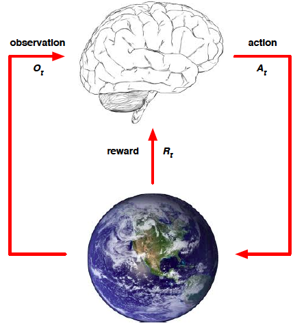
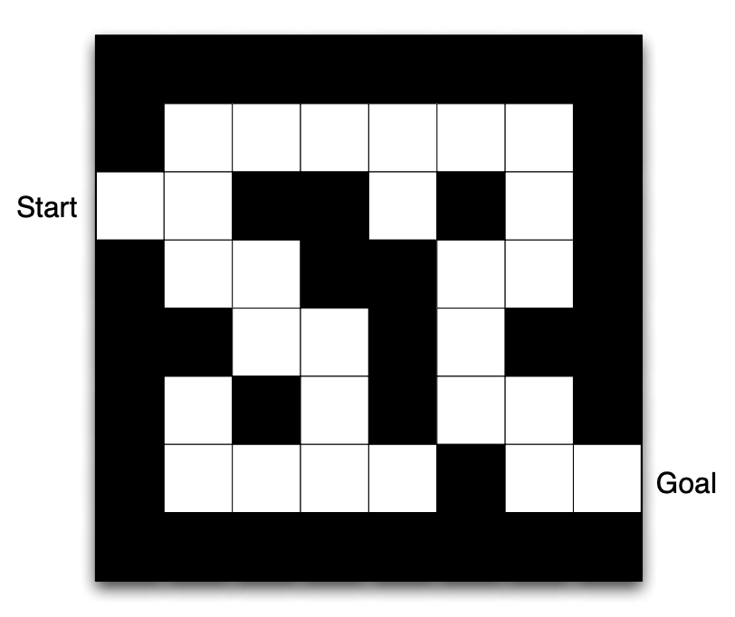
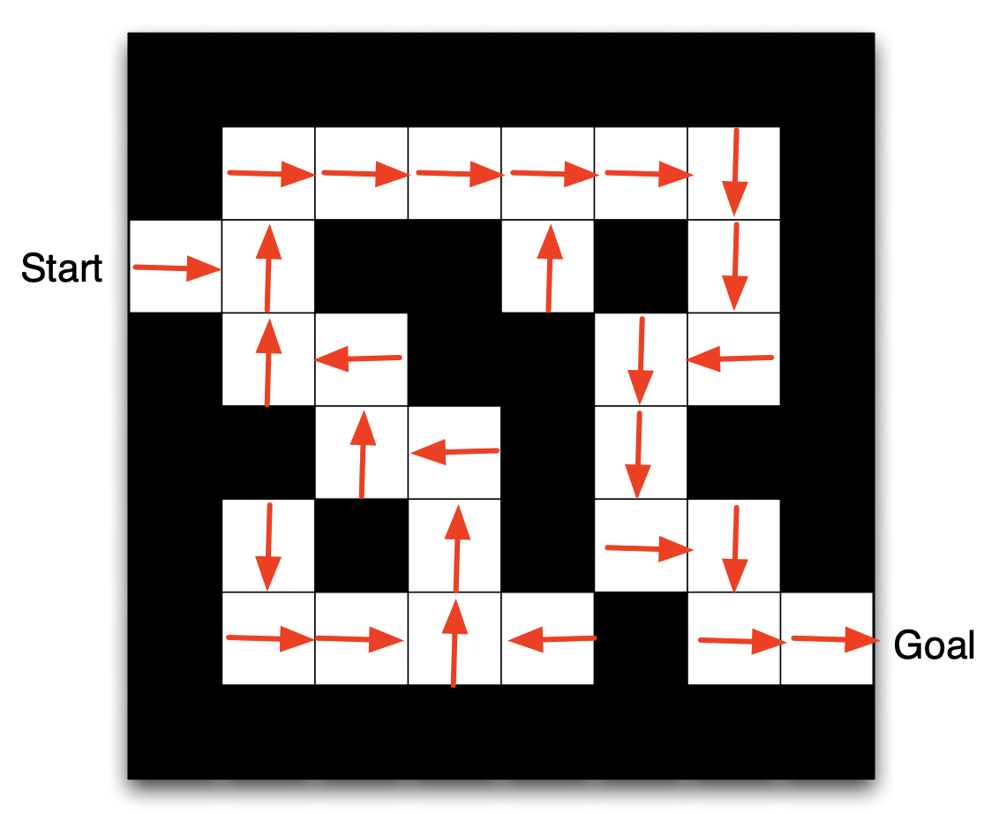
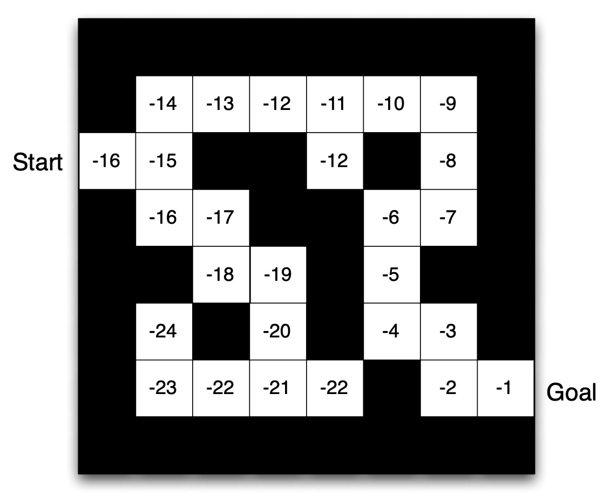
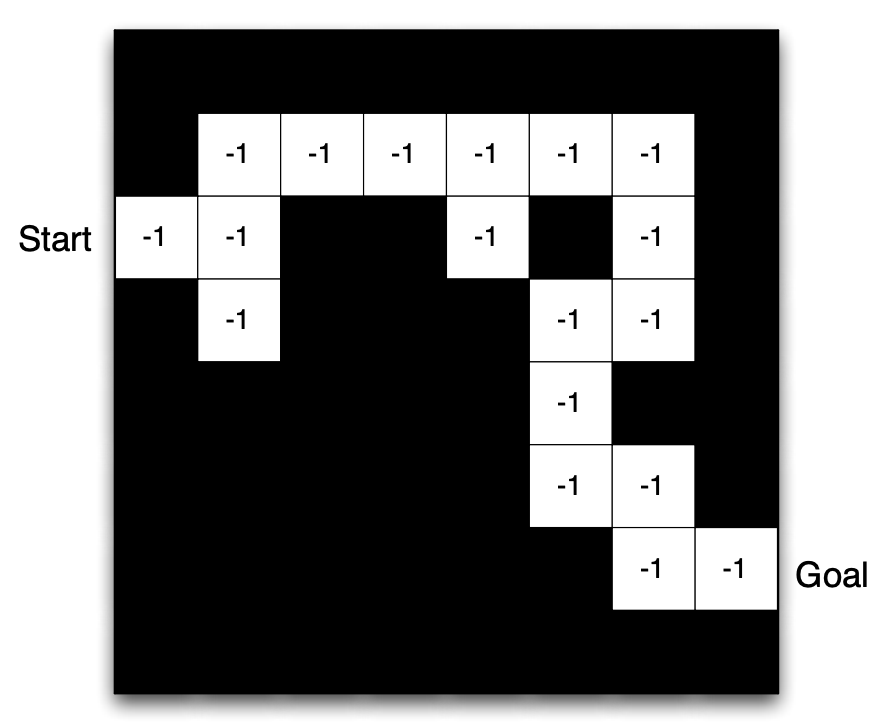
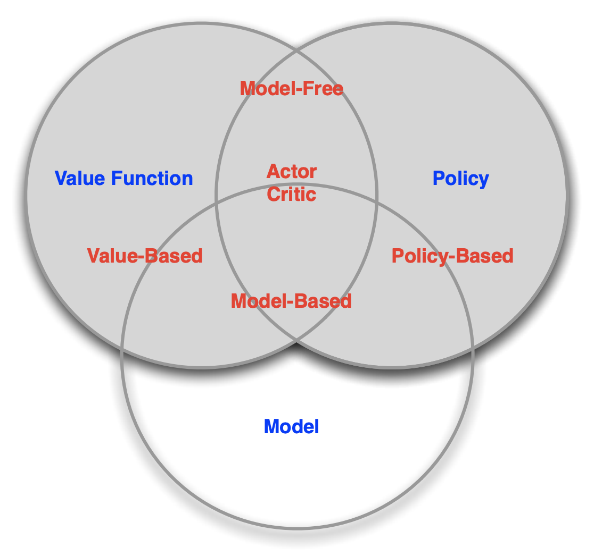
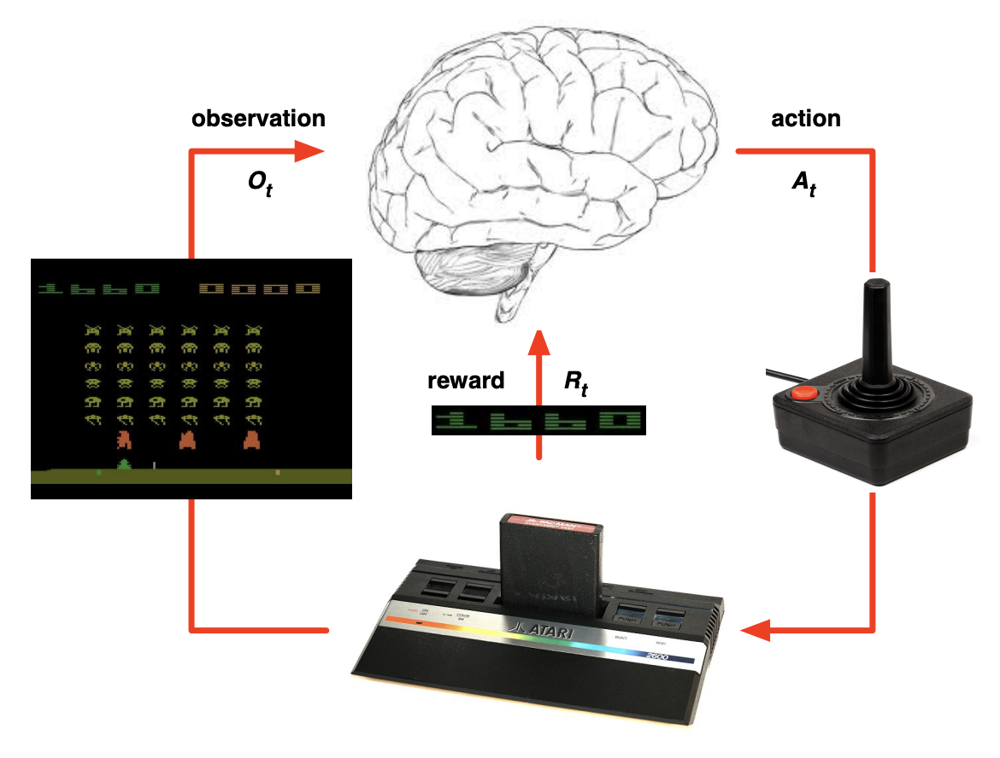
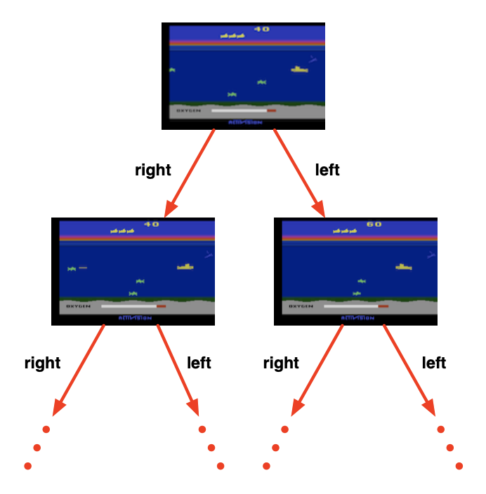
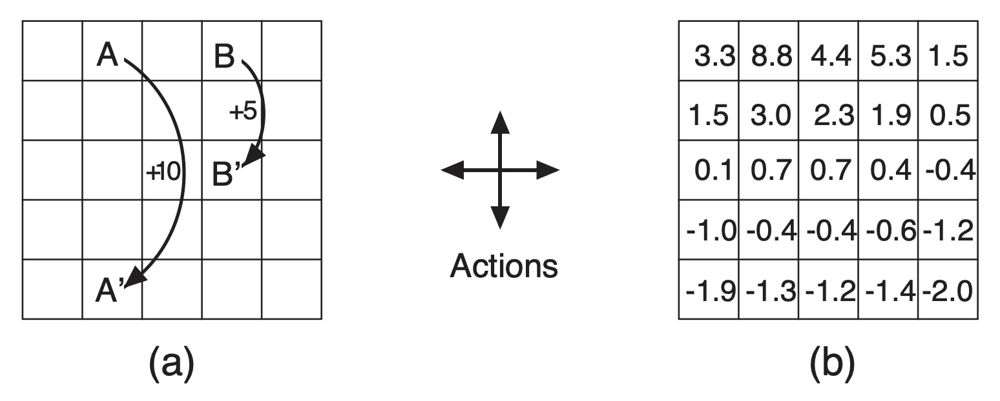
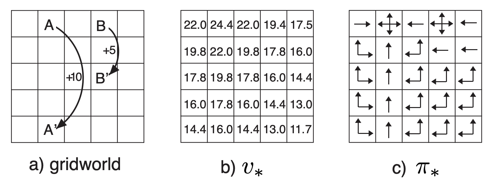

# Introduction to Reinforcement Learning

Credit: [David Silver lecture](https://www.davidsilver.uk/teaching/); [Spark+AI Summit conference slides](https://brookewenig.com/RL.html#/1)

- [Introduction to Reinforcement Learning](#introduction-to-reinforcement-learning)
  - [1. About Reinforcement Learning](#1-about-reinforcement-learning)
  - [2. The Reinforcement Learning Problem](#2-the-reinforcement-learning-problem)
    - [2.1. Rewards](#21-rewards)
    - [2.2. Agent and Environment](#22-agent-and-environment)
    - [2.3. State](#23-state)
    - [2.4. Fully vs. partially observable environments](#24-fully-vs-partially-observable-environments)
  - [3. Inside an RL agent](#3-inside-an-rl-agent)
    - [3.1. Major components of an RL agent](#31-major-components-of-an-rl-agent)
    - [3.2. Maze example](#32-maze-example)
    - [3.3. Categorizing RL agents](#33-categorizing-rl-agents)
  - [4. Problems with Reinforcement Learning](#4-problems-with-reinforcement-learning)
    - [4.1. Learning and planning](#41-learning-and-planning)
    - [4.2. Exploration and exploitation](#42-exploration-and-exploitation)
    - [4.3. Prediction and control](#43-prediction-and-control)
  - [5. Additional Resources](#5-additional-resources)

## 1. About Reinforcement Learning

- Many faces of reinforcement learning

  

  - Reinforcement learning is essentially the science of decision making, trying to understand the optimal way of making decisions
  - E.g. Engineering -> Optimial Control: How to optimize the sequence of actions to get the best result
  - E.g. Neuroscience -> Reward System: Neural transmission of dopamine, the reward system, is believed to be what let human brain to make decisions
  - E.g. Economics -> Bounded Rationality: How and why people make decisions to optimize their utility

- Characteristics of Reinforcement Learning

  What makes reinforcement learning different from other machine
learning paradigms?

  - There is no supervisor, only a reward signal
  - Feedback is delayed, not instantaneous
  - Sequential processes, so time matters (non i.i.d.)
  - Agent’s actions affect the subsequent data it receives

- Examples of Reinforcement Learning

  - Fly stunt manoeuvres in a helicopter (e.g. https://www.youtube.com/watch?v=VCdxqn0fcnE)
  - Defeat the world champion at Backgammon
  - Manage an investment portfolio
  - Control a power station
  - Make a humanoid robot walk
  - Play many different Atari games better than humans (e.g. https://www.youtube.com/watch?v=V1eYniJ0Rnk)

## 2. The Reinforcement Learning Problem

### 2.1. Rewards

- Rewards
  - A reward  is a scalar feedback signal
  - Indicates how well agent is doing at step 
  - The agent’s job is to maximise cumulative reward

- Reinforcement learning is based on the **reward hypothesis**

  All goals can be described by the maximization of expected
cumulative reward

- Example of rewards
  - Fly stunt manoeuvres in a helicopter
    - \+ reward for following desired trajectory
    - − reward for crashing
  - Defeat the world champion at Backgammon
    - +/− reward for winning/losing a game
  - Manage an investment portfolio
    - \+ reward for each $ in bank
  - Control a power station
    - \+ reward for producing power
    - − reward for exceeding safety thresholds
  - Make a humanoid robot walk
    - \+ reward for forward motion
    - − reward for falling over
  - Play many different Atari games better than humans
    - +/− reward for increasing/decreasing score

- Sequential decision making
  - Goal: select actions to maximise total future reward
  - Actions may have long term consequences
  - Reward may be delayed
  - It may be better to sacrifice immediate reward to gain more long-term reward
  - Examples:
    - A financial investment (may take months to mature)
    - Refuelling a helicopter (might prevent a crash in several hours)
    - Blocking opponent moves (might help winning chances many
moves from now)

### 2.2. Agent and Environment

- At each step t the agent:

  - Receives observation .
  - Takes an action , i.e. decision made by an agent (algorithm).
  - Receives scalar reward . See it as a feedback signal. Indicates how good agent is doing.

- At each step t the environment:

  - Receives an action , i.e. decision made by an agent (algorithm)
  - Emits observation : response to agent's action.
  - Emits reward:  is a scalar value. See it as a feedback signal. Indicates how good agent is doing

### 2.3. State

- History and state

  - **History** is the sequence of observations, actions, rewards, i.e., all observable variables up to time t
    - 
  - What happens next depends on history
    - The agent selects actions
    - The environment selects observations/rewards
  - **State** is the information used to determine what happens next. State is a function of the history and is a concise summary of history
  - 

- Environment state

  - **Environment state** (): the state representation of environment. This is the information that environment uses to pick the next observation/reward
  - Most of the time environment state is not visible
  - Even if environment state is visible, it may contain irrelevant information

- Agent state
  - **Agent state** (): the state representation of agent. This is the information that agent uses to pick the next action. This is the information used by reinforcement learning algorithms
  - Can be any function of history 

- Information state - a mathematical definition of state
  - **Information state** contains all useful information from history. The state is Markov if future is independent of the past given the present. When state is Markov, we only care about the last state
    - A state  is Markov if and only if 
  - The environment state  is Markov
  - The history  is Markov

### 2.4. Fully vs. partially observable environments

- Fully observable environments

  **Full observability**: agent directly observes environment state 
  
  - Agent state = environment state = information state
  - Formally, this is a Markov decision process (MDP)

- Partially observable environments

  **Partial observability**: agent indirectly observes environment

  - Examples
    - A robot with camera vision isn’t told its absolute location
    - A trading agent only observes current prices
    - A poker playing agent only observes public cards
  - Agent state ≠ environment state
  - Formally, this is a partially observable Markov decision process (POMDP)
  - Agent must construct its own state representation  by
    - Remembering the complete history (naive way): 
    - Building **beliefs** of environment state: 
    - Recurrent neural network:  based on a combination of the agent state from the last time step with latest observations

## 3. Inside an RL agent

### 3.1. Major components of an RL agent

An RL agent may include one or more of these components:

- **Policy**: Agent’s behavior function. It is a map from state to action.

  - Deterministic policy: 
  - Stochastic policy: 

- **Value function**: How good is each state and/or action. It is a prediction of all future rewards given the current state.

  - Used to evaluate the goodness/badness of states, and therefore to select between actions
  - , where  is the discount rate for finding present value of a future value

- **Model**: Agent’s representation of the environment that predicts what the environment will do next

  -  predicts the next state: 
  -  predicts the next immediate reward: 
  - Agent may have an internal model of the environment
  - The model may be imperfect
  - Dynamics: how actions change the state

### 3.2. Maze example

- Problem definition

  - Rewards: -1 per time-step
  - Actions: N, E, S, W
  - States: Agent’s location

- Policy

  

  - Grid layout represents what the agent would choose to do if it were in any of these states
  - Arrows represent a deterministic policy  for each state 

- Value function

  

  - Numbers represent value  of each state 

- Model

  

  - Grid layout represents transition model 
  - Numbers represent immediate reward  from each state  (same for all )

### 3.3. Categorizing RL agents

- Value Based
  - No Policy (Implicit)
  - Value Function
- Policy Based
  - Policy
  - No Value Function
- Actor Critic
  - Policy
  - Value Function
- Model Free
  - Policy and/or Value Function
  - No Model (without trying to figure out how the environment works)
- Model Based
  - Policy and/or Value Function
  - Model

## 4. Problems with Reinforcement Learning

### 4.1. Learning and planning

Two fundamental problems in sequential decision making

- **Reinforcement Learning**

  - The environment is initially unknown
  - The agent interacts with the environment
  - The agent improves its policy

  Atari example:

  

  - Rules of the game are unknown
  - Learn directly from interactive game-play
  - Pick actions on joystick, see pixels and scores

- **Planning**

  - A model of the environment is known
  - The agent performs computations with its model (without any external interaction)
  - The agent improves its policy, a.k.a. deliberation, reasoning, introspection, pondering, thought, search

  Atari example:

  

  - Rules of the game are known
  - Can query emulator. Perfect model inside agent’s brain
  - If I take action a from state s:
    - what would the next state be?
    - what would the score be?
  - Plan ahead to find optimal policy. E.g. tree search

### 4.2. Exploration and exploitation

Reinforcement learning is like trial-and-error learning. The agent should discover a good policy from its experiences of the environment without losing too much reward along the way

- **Exploration** finds more information about the environment

- **Exploitation** exploits known information to maximise reward

- It is usually important to explore as well as exploit

- Examples
  - Restaurant Selection
    - Exploitation: Go to your favourite restaurant
    - Exploration: Try a new restaurant
  - Online Banner Advertisements
    - Exploitation: Show the most successful advertisement
    - Exploration: Show a different advertisement
  - Oil Drilling
    - Exploitation: Drill at the best known location
    - Exploration: Drill at a new location
  - Game Playing
    - Exploitation: Play the move you believe is best
    - Exploration: Play an experimental move

### 4.3. Prediction and control

- **Prediction** problem: Given a policy, evaluate the future (value function)

- **Control** problem: Find the best policy by optimizing the future (value function) over all possible policies

- Gridworld example

  - Prediction

    

    What is the value function for the uniform random policy?

  - Control

    

    What is the optimal value function over all possible policies?
    What is the optimal policy?

## 5. Additional Resources

- An Introduction to Reinforcement Learning, Sutton and
Barto, 1998
- [RL4RealLife](https://sites.google.com/view/RL4RealLife#h.p_sN6dlEzqEI7u)
- [Reinforcement learning in marketing](https://www.topbots.com/reinforcement-learning-in-marketing/)
- [Lyft marketing automation](https://eng.lyft.com/lyft-marketing-automation-b43b7b7537cc)
- [How reinforcement learning boosts marketing performance](https://www.thedigitalenterprise.com/articles/data-analytics-dashboards/deeper-data-how-reinforcement-learning-boosts-marketing-performance/)
- [How dynamic pricing uses machine learning to increase revenue](https://sweetpricing.com/blog/2017/02/machine-learning/)

