# Sequence Models

- [Sequence Models](#sequence-models)
  - [1. Recurrent neural networks (RNN)](#1-recurrent-neural-networks-rnn)
    - [1.1. Motivation](#11-motivation)
    - [1.2. RNN model structure](#12-rnn-model-structure)
    - [1.3. Different types of RNNs](#13-different-types-of-rnns)
    - [1.4. Language model and sequence generation](#14-language-model-and-sequence-generation)
    - [1.5. GRU and LSTM to resolve vanishing gradients of RNN](#15-gru-and-lstm-to-resolve-vanishing-gradients-of-rnn)
    - [1.6. BRNN and deep RNN to build more powerful models](#16-brnn-and-deep-rnn-to-build-more-powerful-models)
  - [2. Natural language processing & word embeddings](#2-natural-language-processing--word-embeddings)
    - [2.1. Intro to word embeddings](#21-intro-to-word-embeddings)
    - [2.2. Learning word embeddings: Word2vec and GloVe](#22-learning-word-embeddings-word2vec-and-glove)
    - [2.3. Applications using word embeddings](#23-applications-using-word-embeddings)
  - [3. Sequence models & attention mechanism](#3-sequence-models--attention-mechanism)
    - [3.1. Various sequence to sequence architectures](#31-various-sequence-to-sequence-architectures)
    - [3.2. Beam search algorithm](#32-beam-search-algorithm)
    - [3.3. Bleu score](#33-bleu-score)
    - [3.4. Attention model](#34-attention-model)
    - [3.5. Speech recognition - audio data](#35-speech-recognition---audio-data)

## 1. Recurrent neural networks (RNN)

### 1.1. Motivation

- Examples of sequence data

  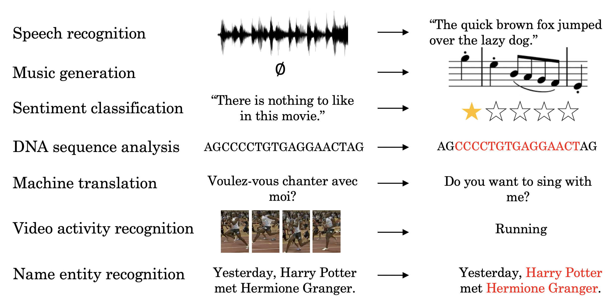

- Notation

  - Motivating example

    x: Harry Potter and Hermione Granger invented a new spell.  
    y: 1, 1, 0, 1, 1, 0, 0, 0, 0

    - : t-th element in the sequence of training example
    - : the length of the input sequence, variable across different training examples
    - : the length of the output sequence, not necessarily the same as 

  - Representing words

    - Represent  by a one-hot vector that spans the entire list of vocabulary
    - Use `<UNK>` (unknown word) to represent words not in the vocabulary
    - Represent sentence ends by adding an extra token called `<EOS>` (end of sentence)

### 1.2. RNN model structure

- Problems of a standard network

  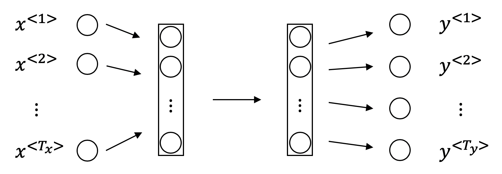

  - (-) Inputs, outputs can be different lengths in different examples.
  - (-) Doesn’t share features learned across different positions of text.

- RNN structure

    The recurrent neural network scans through the data from left to right. The parameters it uses for each time step are shared.

  - When 

    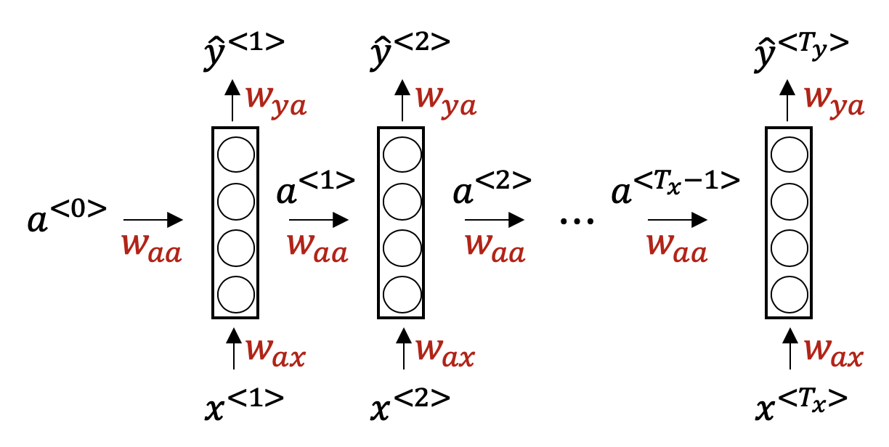, or equivalently, 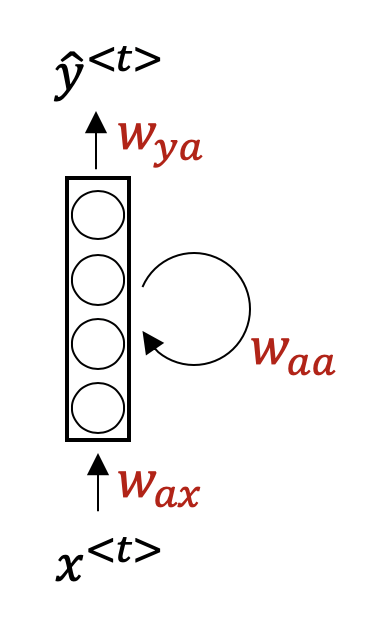

  - (-) Only uses the information that is earlier in the sequence to make a prediction. E.g., when predicting y2, it doesn't use information about the words X3, X4, X5 and so on.
    - Can be resolved using Bidirectional RNN (BRNN)

- Forward propogation

  - By convention, initialize 

  - Activation
  
    , where the activation function is usually `tanh` or `ReLU`

  - Output
  
    , where the activation function is usually sigmoid

- Simplified RNN notation

  - Activation: , where  stacks  and 
  - Output: 

- Loss function

  - Loss at a single prediction at a single time step

    <a href="https://www.codecogs.com/eqnedit.php?latex=E^{\left&space;\langle&space;t&space;\right&space;\rangle}(\hat{y}^{\left&space;\langle&space;t&space;\right&space;\rangle},&space;y^{\left&space;\langle&space;t&space;\right&space;\rangle})&space;=&space;-y^{\left&space;\langle&space;t&space;\right&space;\rangle}&space;log\&space;\hat{y}^{\left&space;\langle&space;t&space;\right&space;\rangle}&space;-&space;(1-y^{\left&space;\langle&space;t&space;\right&space;\rangle})&space;log(1-\hat{y}^{\left&space;\langle&space;t&space;\right&space;\rangle})" target="_blank"></a>

  - Overall loss of the entire sequence

    

- Backpropagation through time

  - Overall backprop

    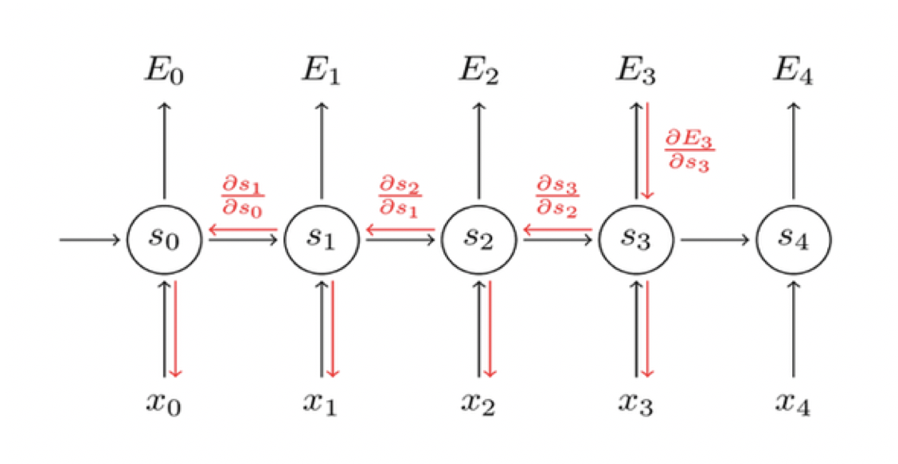

  - RNN cell backprop

    

### 1.3. Different types of RNNs

- #### Many-to-many, Tx = Ty

  

  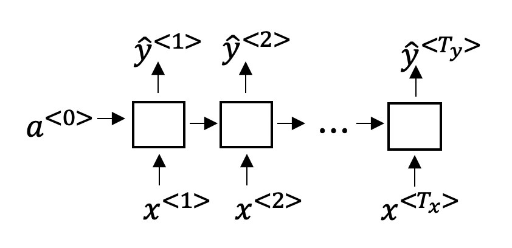

- #### Many-to-one

  x = text, y = 0/1 or 1,...,5

  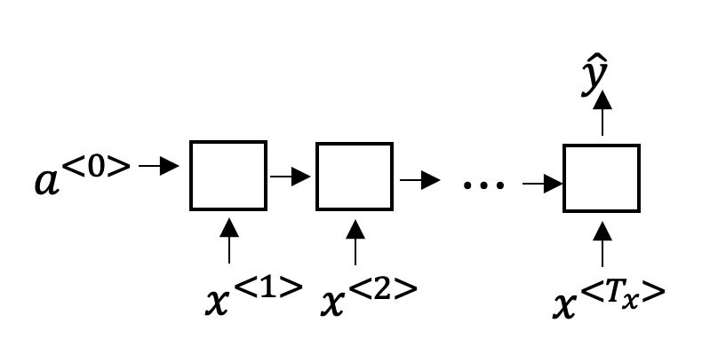 e.g. sentiment classification

- #### One-to-many

  

  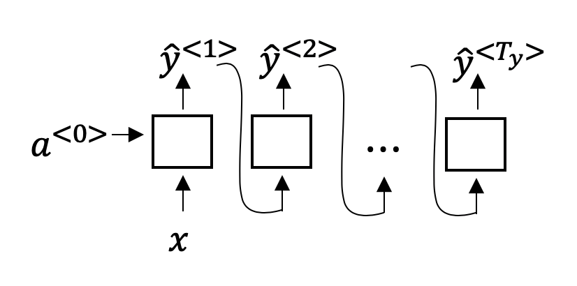 e.g. music generation

- #### Many-to-many, Tx ≠ Ty

  

  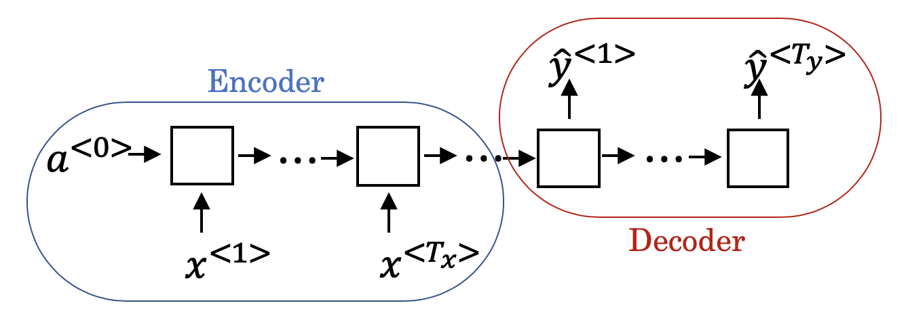 e.g. machine translation

### 1.4. Language model and sequence generation

- Tokenize input text

  Training set: large corpus of English text

  - E.g. y = Cats average 15 hours of sleep a day. \<EOS> (end of sentence)
  - E.g. The Egyptian \<UNK> (unknown word) is a bread of cat. \<EOS>

- Model training

  

  Each step in the RNN looks at some set of preceding words, and given these words, what is the probability of the next word. The RNN learns to predict one word at a time going from left to right.

  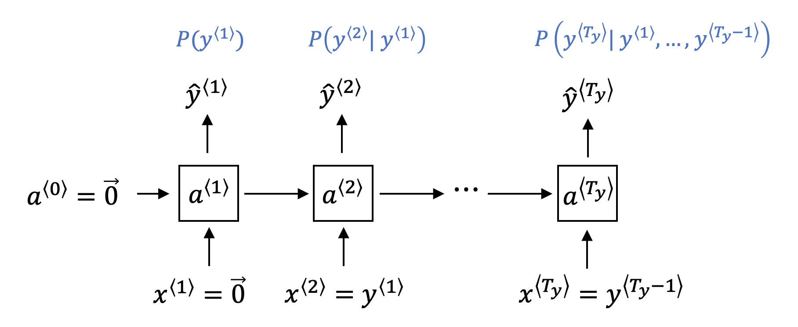

  - Activation

    

  - Output

    

  - Individual error

    

  - Overall cost function

    

- Sampling novel sequences

  To generate a randomly chosen sentence from the RNN language model, randomly sample according to this softmax distribution at each time step.

  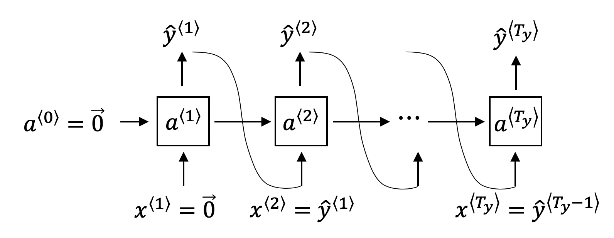

- Character level vs. word level language model

  Word level vocabulary = [a, aaron, ..., zulu, \<UNK>]  
  Character level vocabulary = [a, ..., z, 0, ..., 9, A, ..., Z, ., ..., ;]

  - (+) Character level language model doesn't have to worry about unknown word.
  - (-) Character level language model ends up with much longer sequences. Not as good as word level language models at capturing long range dependencies between how the the earlier parts of the sentence also affect the later part of the sentence.
  - (-) Character level language model is more computationally expensive to train.

### 1.5. GRU and LSTM to resolve vanishing gradients of RNN

- #### Weaknesses of basic RNN

  - (-) Vanishing gradient problem: Language can have very long-term dependencies, where a word much earlier can affect what needs to come much later in the sentence. But the basic RNN is not very good at capturing very long-term dependencies, given that the model has many local influences.
    - Hard to resolve.

  - (-) Exploding gradient problem: exponentially large gradients can cause the parameters to blow up.
    - Easy to observe: `NaN`.
    - One solution is to apply gradient clipping, i.e., when the gradient vector is bigger than some threshold, re-scale some of the gradient vectors so that it is not too big.

- #### Gated Recurrent Unit (GRU)

  (+) Captures long range connections and resolves the vanishing gradient problems  
  (+) Simpler model than LSTM, more computationally efficient

  - Notation

    - c = memory cell, determines whether the subject of the sentence is e.g. singular or plural
    -  = candidate to replace 
    -  = relevance, how relevant is  to computing the next candidate 
    -  = gate, where u stands for update gate. Determines whether to update c

  - RNN unit

    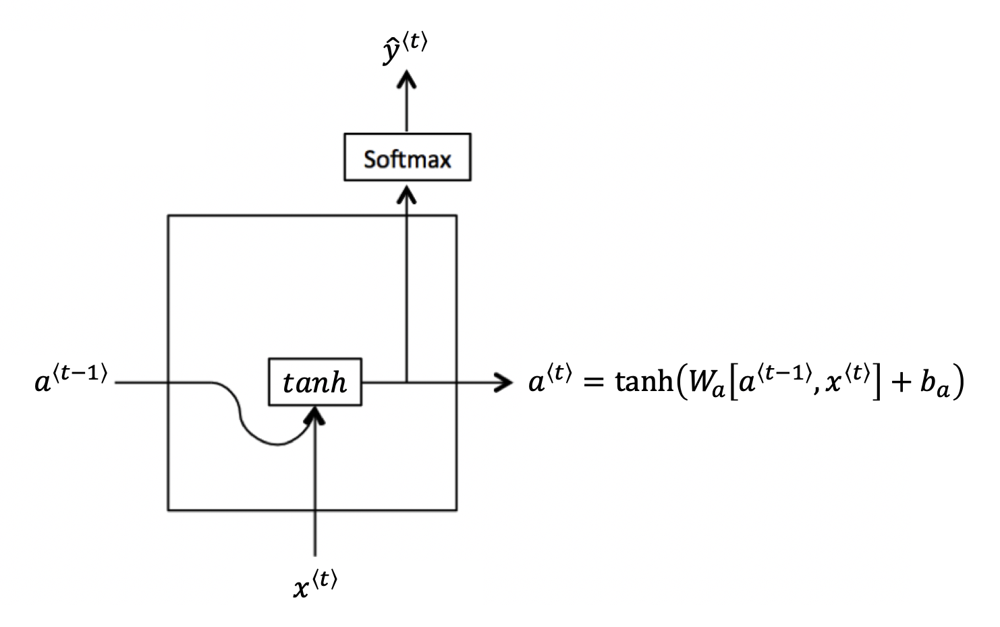

  - GRU unit

    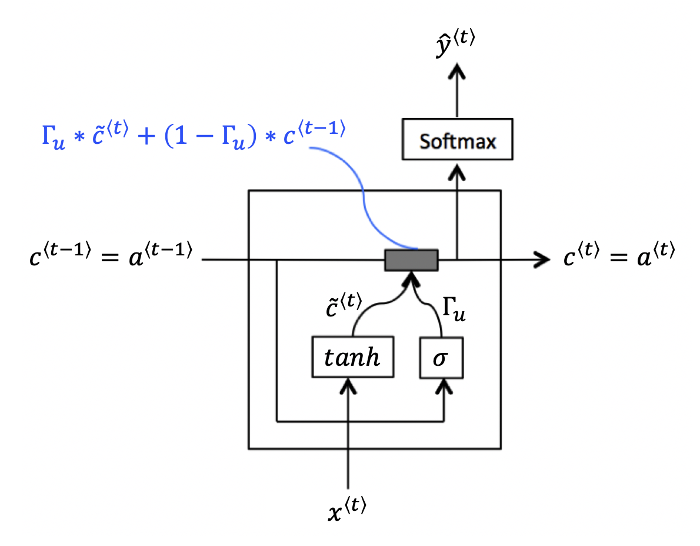

    [Cho et al., 2014. On the properties of neural machine translation: Encoder-decoder approaches], [Chung et al., 2014. Empirical Evaluation of Gated Recurrent Neural Networks on Sequence Modeling]

  - Steps

    - At every time-step, Initialize the memory cell

      

    - Calculate the candidate new value  for the memory cell

      

      , where * represents element-wise multiplication

    - Calculate gate to decide whether to update the memory cell

      

      Gate is very good at maintaining the value for the cell. Because gate can be very close to zero and one, it doesn't suffer much from vanishing gradient problem.

    - Update the memory cell

      , where * represents element-wise multiplication

    - Equalize hidden state a and memory cell c

      

- #### Long Short Term Memory (LSTM)

  (+) Can be more powerful than GRU to learn very long range connections in a sequence

  - Notation

    -  = update gate
    -  = forget gate
    -  = output gate
    -  is different from 

  - LSTM vs. GRU steps

    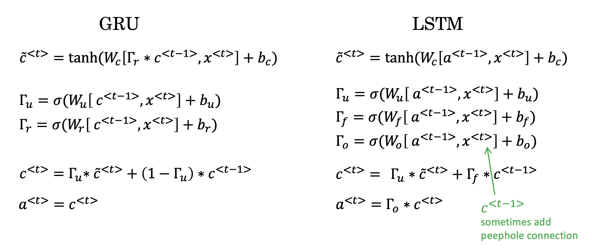
    , where * represents element-wise multiplication

  - LSTM unit

    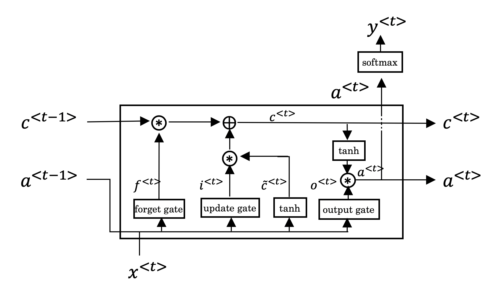

    [Hochreiter & Schmidhuber 1997. Long short-term memory]

### 1.6. BRNN and deep RNN to build more powerful models

- #### Bidirectional RNN (BRNN)

  - BRNN model structure

    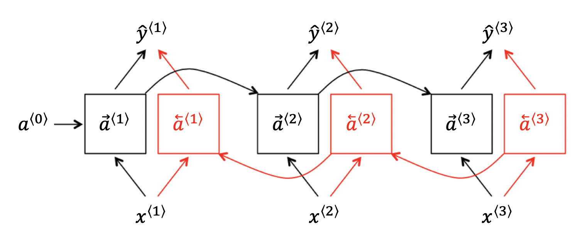

    

    BRNN commonly used with LSTM units, although is compatible with either RNN, GRU, or LSTM units.

  - Pros and cons

    - (+) Anywhere in the sequence, can make predictions using information from both earlier and later in the sequence.
    - (-) Need the entire sequence of data before making predictions anywhere.
      - The standard BRNN not effective for real-time speech recognition.
      - Very effective for lots of NLP applications where the entire sentence is available all at the same time.

- #### Deep RNNs

  - Example of deep RNN with 3 hidden layers

    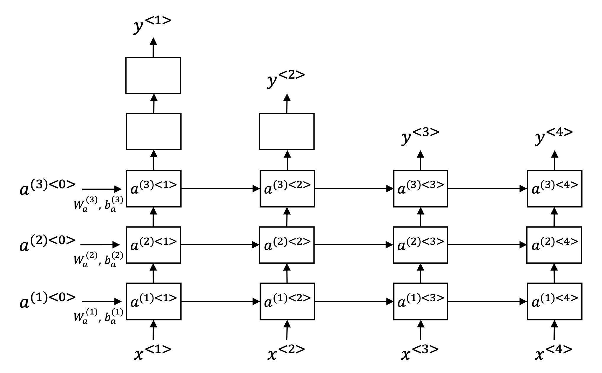

    RNNs generally don’t have a lot of hidden layers (3 is a lot), because of the temporal dimensions.

## 2. Natural language processing & word embeddings

### 2.1. Intro to word embeddings

- #### Word representation

  - One-hot representation

    E.g. V = [a, aaron, ..., zulu, \<UNK>]

    Use  to represent the one-hot vector of the 5391st word in the vocabulary.

    - (-) Treats each word as a thing by itself, and does not allow an algorithm to easily generalize across words

  - Featurized representation: word embedding

    Each word can be represented by a high-dimensional vector of features (e.g. gender, royal, age, food, cost, alive, verb, etc.). Use  to represent the featurized vector of the 5391st word in the vocabulary.

    Featurization from an embedding algorithm is not necessarily interpretable.

  - Visualizing word embeddings

    t-SNE maps high dimensional data (e.g. 300D) into a 2D space. The mapping is highly non-linear.

    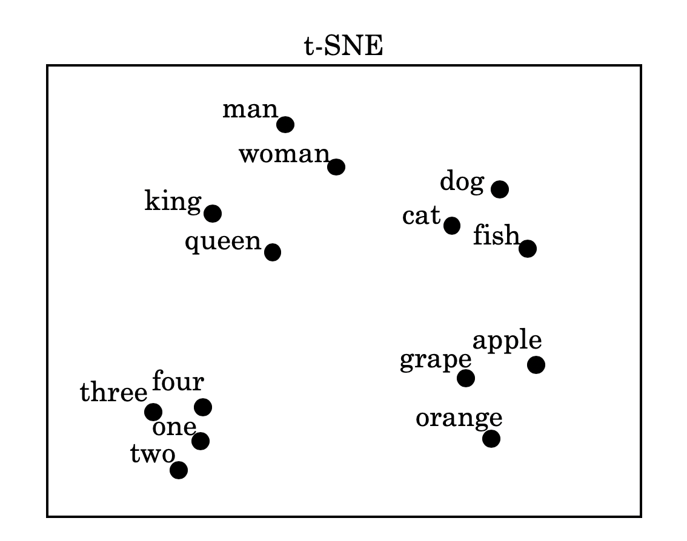

    [van der Maaten and Hinton., 2008. Visualizing data using t-SNE]

- #### Using word embeddings with tranfer learning

  1. Learn word embeddings from large text corpus. (1-100B words). (Or download pre-trained embedding online.)  

  2. Transfer embedding to new task with smaller training set. (say, 100k words)

      - (+) Can now use relatively lower dimensional feature vectors compared to one-hot vector

  3. Optional: Continue to fine tune the word embeddings with new data, if training set is relatively large.

- #### Relations to face encoding

  - Word embedding learns a fixed encoding (vector e) for each of the words in the vocabulary, whereas face recognition can encode unseen images.
  - "Encoding" and "embedding" are used somewhat interchangeably.

- #### Properties of word embeddings

  - Analogies using word vectors

    (+) Word embedding can help with analogy reasoning. Research reported 30% to 75% accuracy on analogy.

    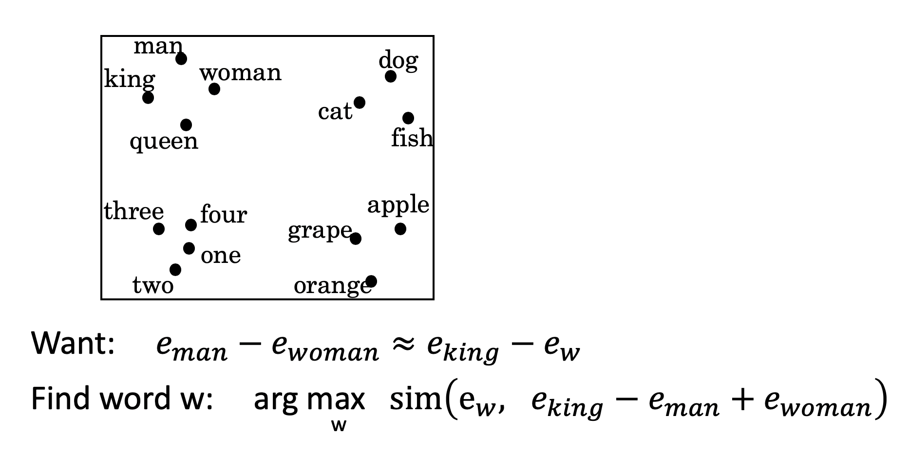

    [Mikolov et. al., 2013, Linguistic regularities in continuous space word representations]

  - Cosine similarity

    

    -  is the dot product (or inner product) of two vectors
    -  is the norm (or length) of the vector
    -  is the angle between the two vectors

    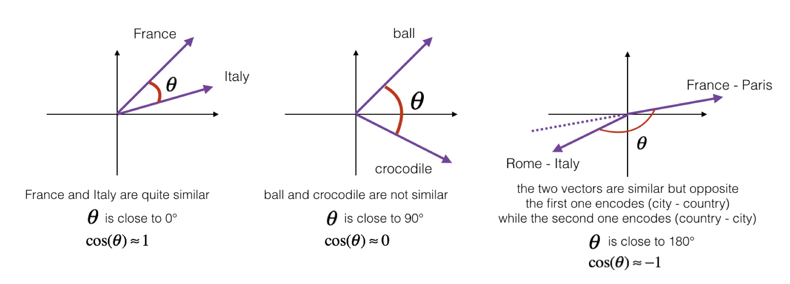

- #### Embedding matrix

  - Notation

    - E = embedding matrix

      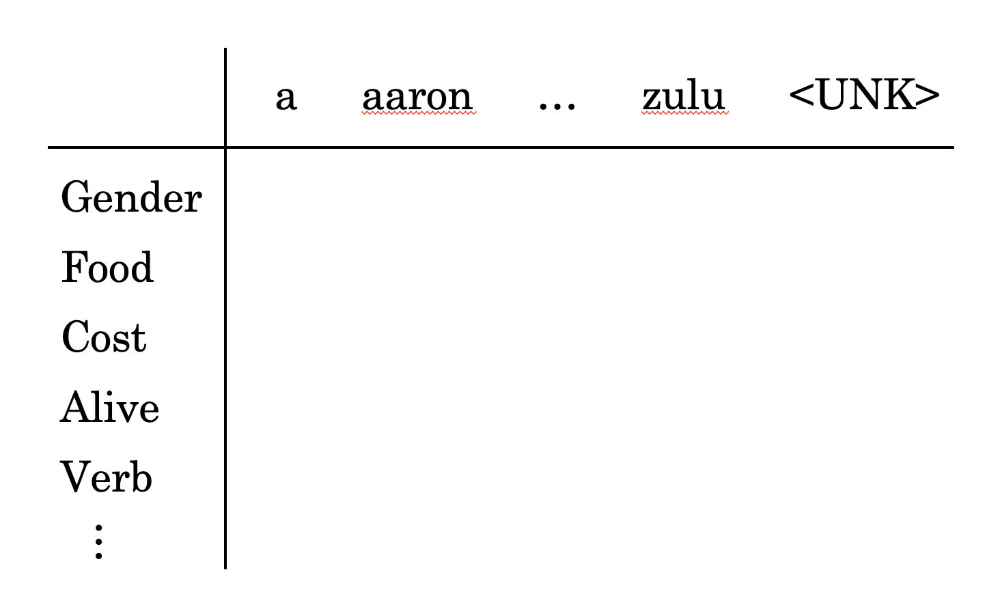

    -  = one-hot vector of word j

    -  = embedding vector of word j

    - 

  - Goal: learn the embedding matrix

  - Embedding lookup

    In practice, use specialized function to look up an embedding, rather than using matrix-vector multiplication.

### 2.2. Learning word embeddings: Word2vec and GloVe

- #### Learning word embeddings

  - Neural language model

    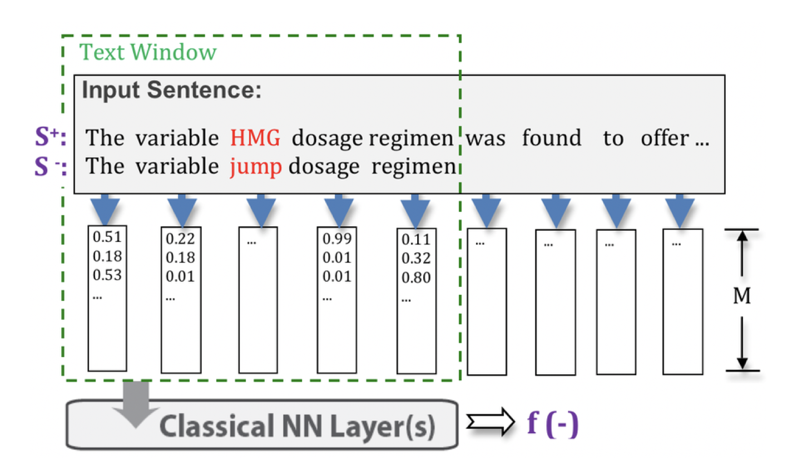

    [Bengio et. al., 2003, A neural probabilistic language model]

  - Other context/target pairs

    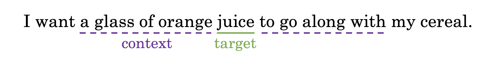

    Context:

    - Last 4 words
    - 4 words on left & right
    - Last 1 word
    - Nearby 1 word

- #### Word2Vec

  - Notation

    - c = context
    - t = targe
    -  = one-hot vector of softmax output
    -  = parameter associated with output t
    - Vocab size = 10000 for example

  - Skip-grams model

    Come up with a few context-target pairs to create supervised learning problem. Takes as input one context word, tries to predict some word skipping a few words before or after the context word.

    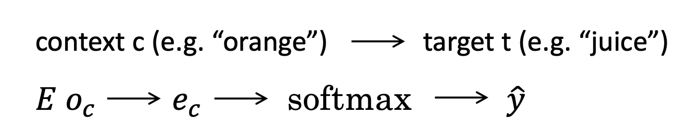

    [Mikolov et. al., 2013. Efficient estimation of word representations in vector space]

    - Softmax: 
    - Cost: 

  - Problems with softmax classification

    (-) Softmax step in the skip-grams model is very expensive to calculate because needing to sum over the entire vocabulary size into the denominator.

    Solutions:

    - Hierarchical softmax classifier (tree)
    - Negative sampling that modifies the training objective to make it run more efficiently

  - Sampling the context c

    There are different heuristics to use in order to balance out the common words (e.g. the, of, and) vs. the less common words.

  - CBow vs. skip-grams

    CBow, the continuous backwards model, takes the surrounding contexts from the middle word, and uses the surrounding words to try to predict the middle word.

- #### Negative sampling

  - Generating training set

    - Pick a context word and a target word, give that a label of 1 or 0. This is one record of the training data.
    - Create a supervised learning problem where the learning algorithm inputs the pair of words (x), and predicts the target label (y) as output.
    - The number of training pairs (k) for each context word is 5 to 20 for smaller data sets, or 2 to 5 for larger data sets.

  - Model

    Turns 10000-way softmax in the skip into 10000 binary classification problem. On every iteration, we're only going to train k + 1 of the binary classifiers (k negative examples and 1 positive examples).

    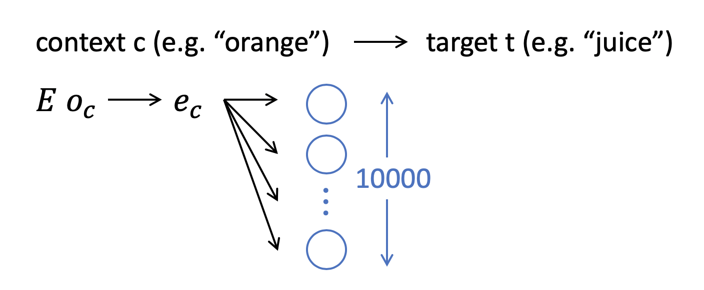

    [Mikolov et. al., 2013. Distributed representation of words and phrases and their compositionality]

    - Sigmoid: 

  - Negative sampling advantages

    (+) The computation cost is much lower, because updating k + 1 binary classifiers on every iteration is cheaper than updating a 10000-way softmax classifier.

  - Choosing negative examples

    Between sampling according to the empirical frequencies and according to a uniform distribution.

    , where f is empirical frequencies observed in English text

- #### GloVe word vectors

  - GloVe (global vectors for word representation)

    Define context and target as whether or not the two words appear in close proximity (e.g. within ±10 words to each other).  is a count that captures how often word i (target t) appears in context of j (context c), i.e. how often they occur close to each other.

    [Pennington et. al., 2014. GloVe: Global vectors for word representation]

  - Model

    Minimize , where

     = weighting function that assigns

    -  if 
    - Heuristic choice of weighting that neither gives commonly-occuring words too much weight nor gives the infrequent words too little weight

     and  in this particular formulation play symmetric roles

    - Initialize  and  both uniformly, use gradient descent to minimize the objective, and finally take the average for every word

      

### 2.3. Applications using word embeddings

- #### Sentiment classification

  Challenge: there might not be a huge labeled training set.

  Solution: word embeddings enables to build good sentiment classifiers even with only modest-size label training sets.

  - Sentiment classification problem

    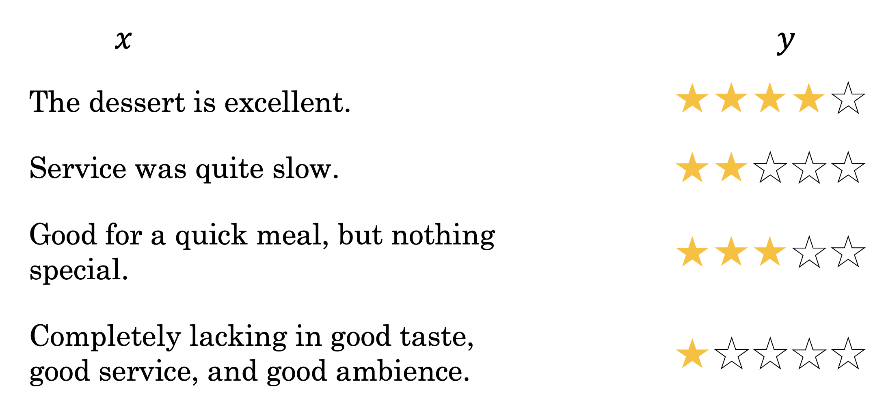

  - Simple sentiment classification model

    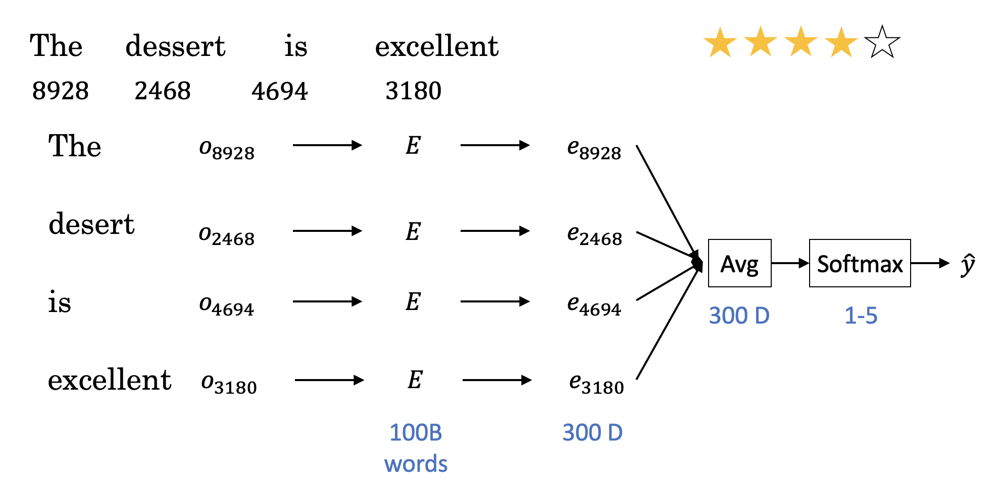

    - (+) By using the average operation, this particular algorithm works for reviews that are either short or long.
    - (-) Ignores word order. E.g. by averaging words meaning, incorrectly classifies "Completely lacking in good taste, good service, and good ambience."

  - RNN for sentiment classification

    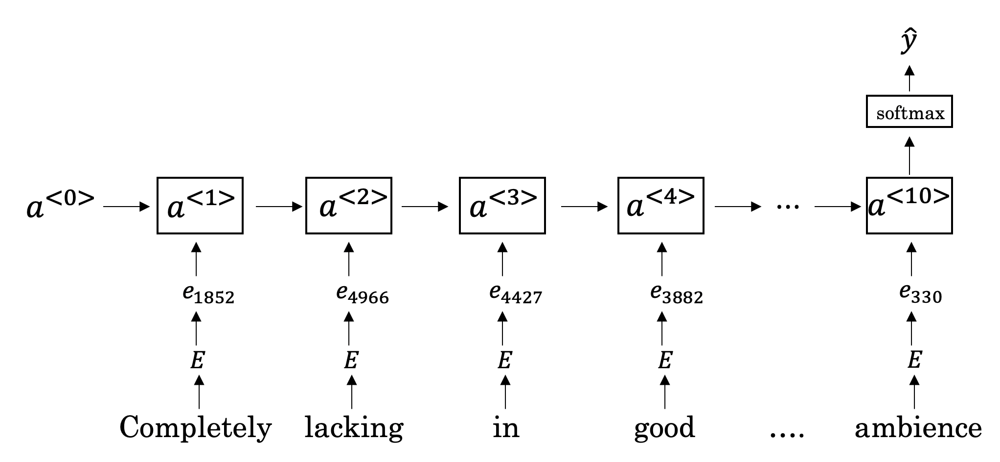

    - (+) Takes word sequence into account
    - (+) Word embeddings can be trained from a much larger data set, so the model will do a better job generalizing to new words not seens in the training set

- #### Debiasing word embeddings

  Word embeddings can reflect gender, ethnicity, age, sexual orientation, and other biases of the text used to train the model. Because AI algorithms are increasingly trusted to make extremely important decisions, we want to eliminate undesirable forms of bias.

  [Bolukbasi et. al., 2016. Man is to computer programmer as woman is to homemaker? Debiasing word embeddings]

  1. Identify bias direction.

      Take average of , , ..., to calculate the direction of bias

      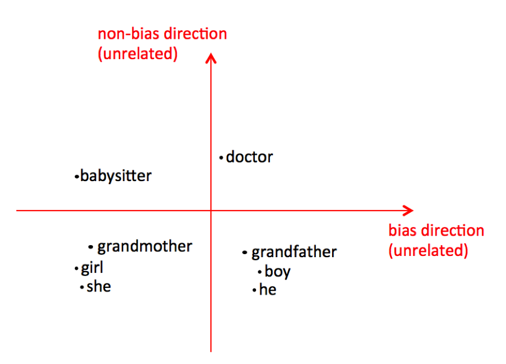

  2. Neutralize: For every word that is not definitional, project to get rid of bias.

      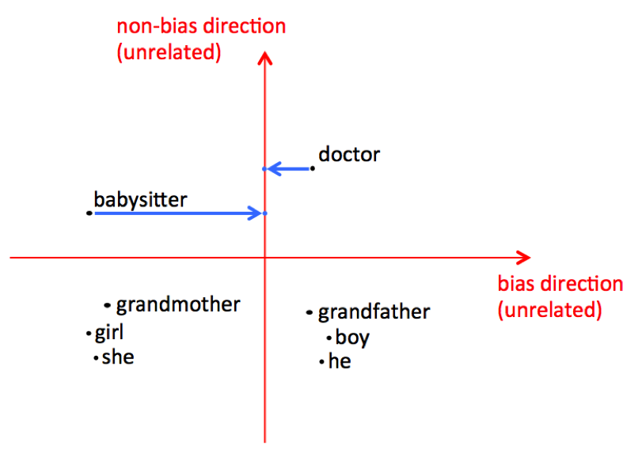

  3. Equalize pairs: Equalize pairs of words that you might want to have differ only through the e.g. gender property

      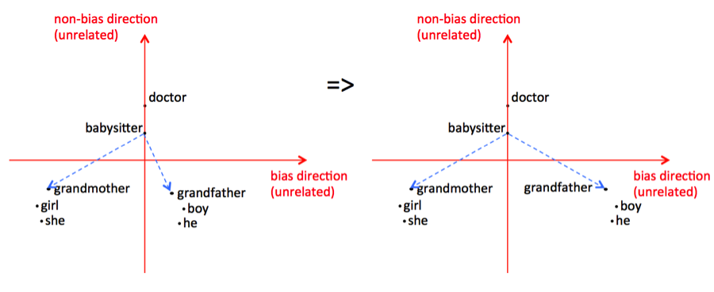

## 3. Sequence models & attention mechanism

### 3.1. Various sequence to sequence architectures

- #### Basic models

  - Machine translation

    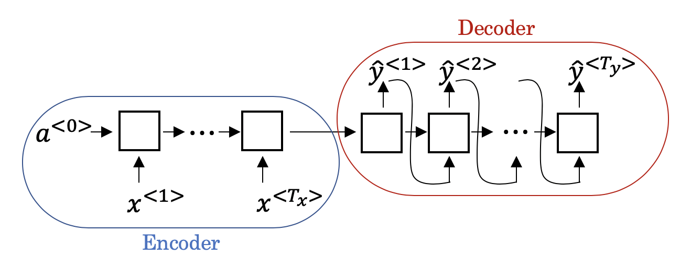

    [Sutskever et al., 2014. Sequence to sequence learning with neural networks]  
    [Cho et al., 2014. Learning phrase representations using RNN encoder-decoder for statistical machine translation]

  - Image captioning

    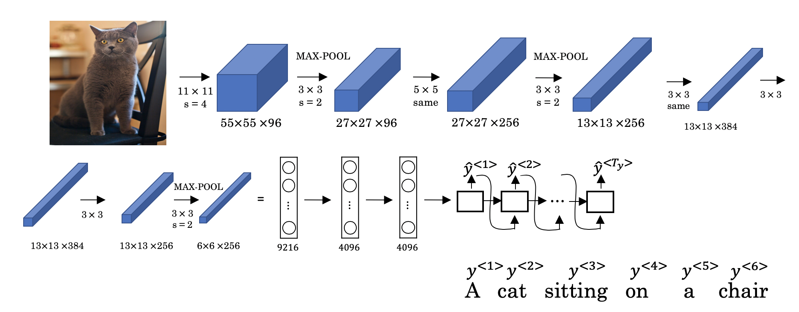

    [Mao et. al., 2014. Deep captioning with multimodal recurrent neural networks]  
    [Vinyals et. al., 2014. Show and tell: Neural image caption generator]  
    [Karpathy and Li, 2015. Deep visual-semantic alignments for generating image descriptions]

- #### Picking the most likely sentence

  - Machine translation as building a **conditional language model**

    - Language model

      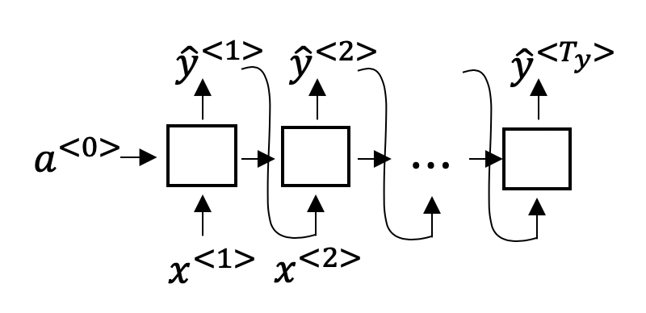

      Outputs 

    - Machine translation

      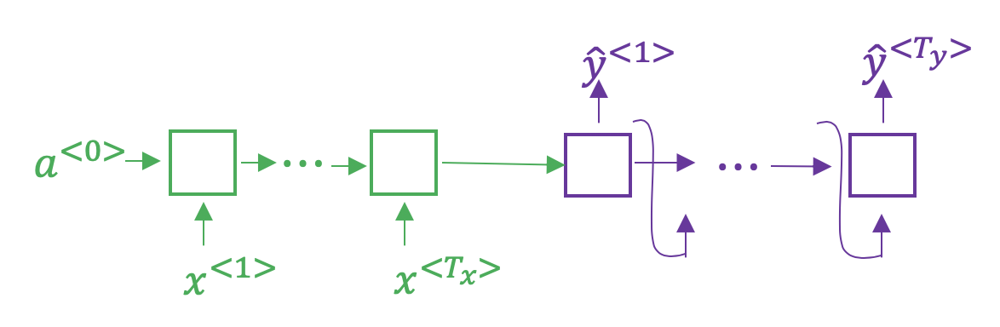

      Outputs 

  - Finding the most likely translation

    Should not sample output sentence at random. Instead, find the output sentence that maximize the conditional probability:

    

  - Greedy search vs. approximate search

    Greedy search not a good way to find the most likely translation

    - (-) Not always optimal to compare the conditional probability of one word at a time
    - (-) Possible combination of words is exponentially large

    Approximate search algorithm

    - (-) Not always able to pick the output sentence that maximizes the conditional probability
    - (+) Does a good enough job

### 3.2. Beam search algorithm

- #### Beam search

  Beam search can consider multiple alternatives rather than just one possibility. It runs faster than exact search algorithms, but is not guaranteed to find exact maximum for .

  - Notation

    - B = beam width, e.g. B = 3 considers 3 most likely possible choices at each step during decoding. When B = 1, beam search becomes greedy search.

  - Step 1

    Find B = 3 most likely possible choices of  that maximize 

    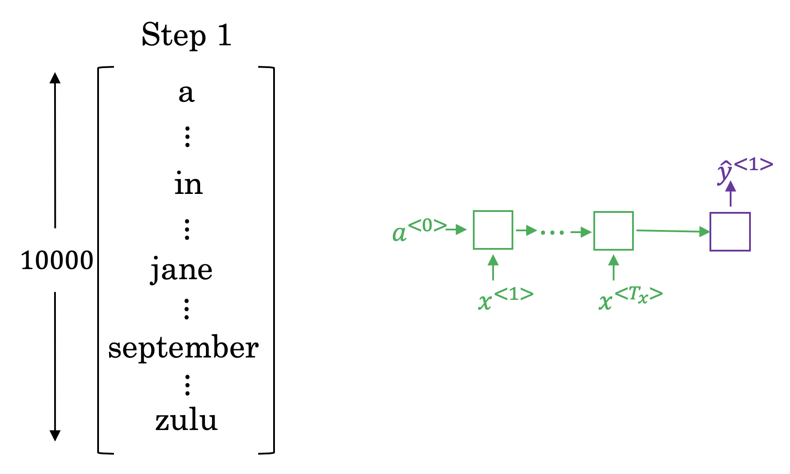

  - Step 2

    Find B = 3 most likely possible choices of  that maximize . Then, find B = 3 most likely possible choices of  that maximize 

    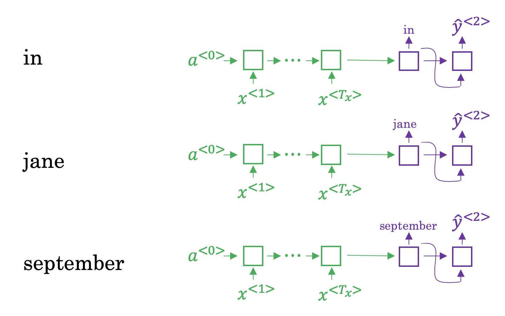

  - Step 3

    Find B = 3 most likely possible choices of  that maximize . Then, find B = 3 most likely possible choices of  that maximize <a href="https://www.codecogs.com/eqnedit.php?latex=p(\hat{y}^{\left&space;\langle&space;1&space;\right&space;\rangle},&space;\hat{y}^{\left&space;\langle&space;2&space;\right&space;\rangle},&space;\hat{y}^{\left&space;\langle&space;3&space;\right&space;\rangle}|x)=p(\hat{y}^{\left&space;\langle&space;1&space;\right&space;\rangle},&space;\hat{y}^{\left&space;\langle&space;2&space;\right&space;\rangle}|x)\&space;p(\hat{y}^{\left&space;\langle&space;3&space;\right&space;\rangle}|x,&space;\hat{y}^{\left&space;\langle&space;1&space;\right&space;\rangle},&space;\hat{y}^{\left&space;\langle&space;2&space;\right&space;\rangle})" target="_blank"></a>

    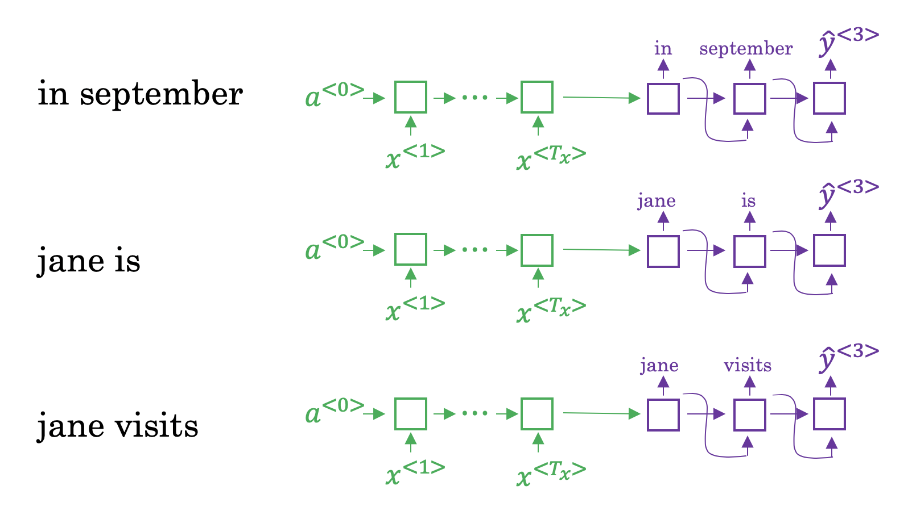

- #### Refinements to beam search

  - Problem with beam search

    

    A product of many small numbers can result in numerical underflow, meaning that it's too small for the floating part representation in the computer to store accurately.

  - Length normalization

    In practice, instead of maximizing the product, maximize the logs of the product:

    

    - (+) More numerically stable algorithm that is less prone to numerical underflow.
    - (+) Normalizing it by the number of words in the translation reduces the penalty for outputting longer translations.  is a hyperparameter that ranges between 0 (no normalization) and 1 (full normalization).

  - Beam width B

    Commonly-used B ranges from 10 to 100.

    - (+) Larger B: more possibilities to consider leads to better results.
    - (-) Larger B: slower and more computationally expensive, because of storing a lot more possibilities around.

- #### Error analysis in beam search

  - Compare  vs. , where  is the desired result, and  is the model result that is less desirable.

    - <a href="https://www.codecogs.com/eqnedit.php?latex=p(y^*|x)&space;>&space;p(\hat{y}|x)" target="_blank">&space;p(\hat{y}|x)" title="p(y^*|x) > p(\hat{y}|x)" /></a>

      Beam search chose , but  attains higher .

      Conclusion: beam search is at fault.

    - 

       is a better translation than , but RNN predicted .

      Conclusion: RNN model is at fault.

  - Use error analysis to figure out what fraction of errors are due to beam search vs. RNN model

    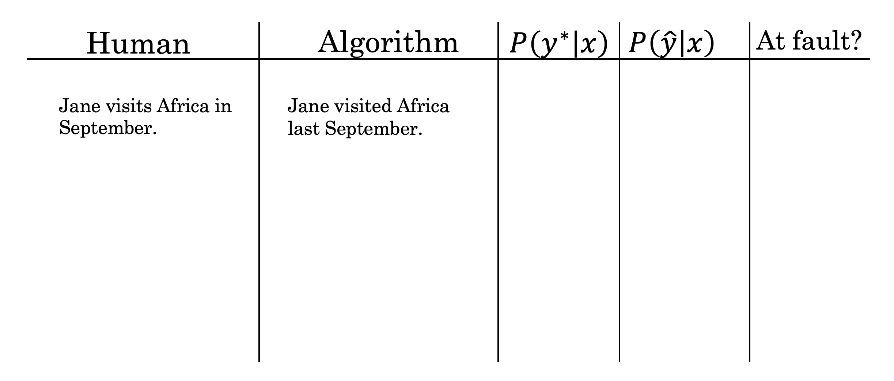

### 3.3. Bleu score

- Problem in evaluating machine translation

  Evaluate a machine translation system if there are multiple equally good answers

- Evaluating machine translation

  Given a machine generated translation, Bleu (Bilingual evaluation understudy) score automatically computes a score that measures how good the machine translation is.

  [Papineni et. al., 2002. Bleu: A method for automatic evaluation of machine translation]

- Notation

  - Clip = give the algorithm credit only up to the maximum number of times that that the n-gram appears in either Reference 1 or Reference 2.
  -  = machine translation output
  -  = Bleu score on n-gram only
  - BP = brevity penalty, penalizes translation systems that output translations that are too short

- Bleu score on n-grams

  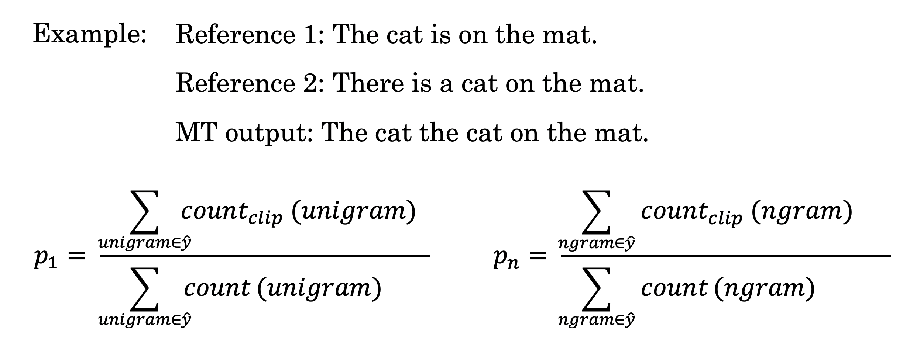

- Combined Bleu score

  , where
  
  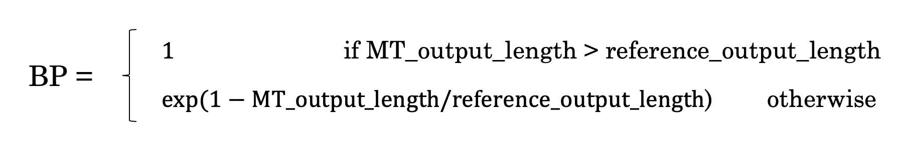

- Advantage of Bleu score

  - (+) BLEU score gives a pretty good single real number evaluation metric, so it accelerated the progress of the entire field of machine translation.

### 3.4. Attention model

- #### The problem with long sequences

  In machine translation, difficult for the network to memorize a super long sentence.

  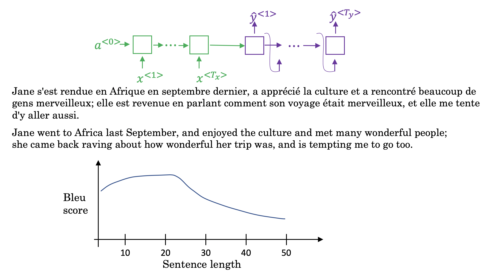

- #### Attention model

  - t' = time step in the input sentence

  - t = time step in the generated translation

  -  = attention weight, i.e. amount of attention  should pay to 

    

  -  concatenated feature vectors from the original sentence

  - c = context that the decoding model pays attention to

    

  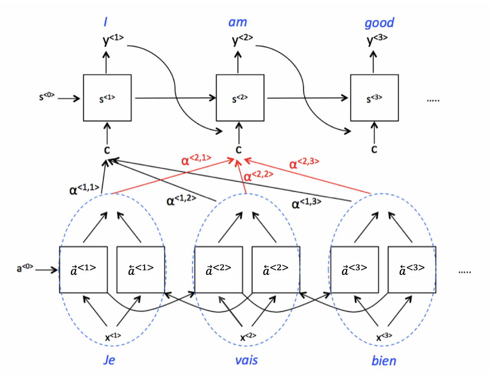

  [Bahdanau et. al., 2014. Neural machine translation by jointly learning to align and translate]  
  [Xu et. al., 2015. Show, attend and tell: Neural image caption generation with visual attention]

- #### Computing attention

  
  
  -  can be learnt by training a small neural network where the inputs are represented by the hidden state activation in the previous time step  and the features from the current time step .

    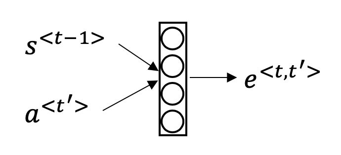

    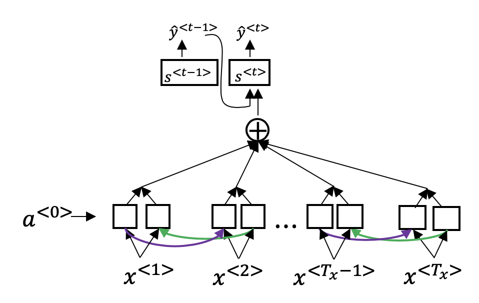

  - The algorithm runs in quadratic cost. If we have  words as input and  for the output, the total number of attention parameters is .

- #### Visualization of attention

  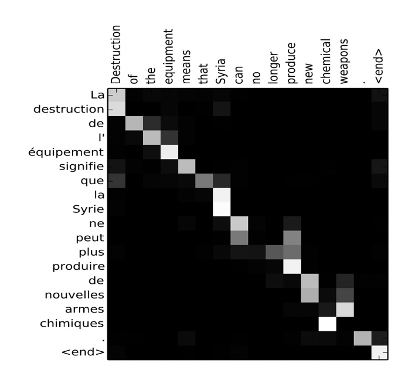

### 3.5. Speech recognition - audio data

- #### Speech recognition problem

  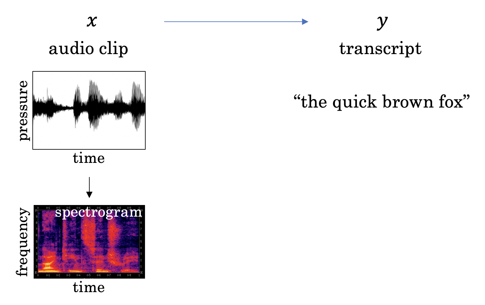

  - Note that phonemes (hand-engineered) representation is no longer necessary, because there are much larger datasets available.
  - Using a spectrogram and optionally a 1D conv layer is a common pre-processing step prior to passing audio data to an RNN, GRU or LSTM.

- #### Attention model for speech recognition

  

- #### CTC cost for speech recognition

  CTC (Connectionist temporal classification) basic rule: collapse repeated characters not separated by “blank”

  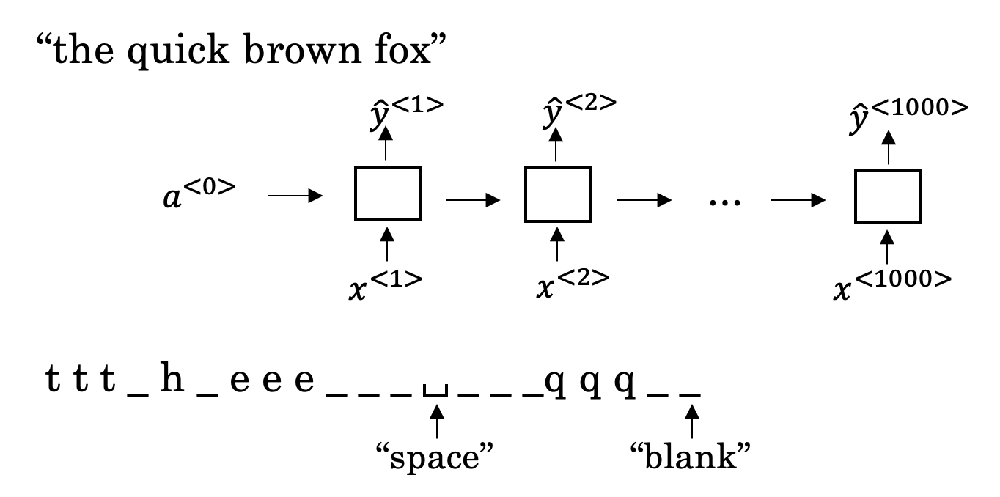

  [Graves et al., 2006. Connectionist Temporal Classification: Labeling unsegmented sequence data with recurrent neural networks]

- #### Trigger word detection

  - Trigger word applications

    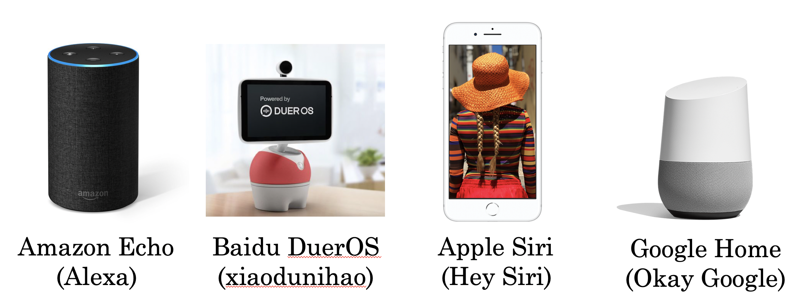

  - Trigger word detection algorithm

    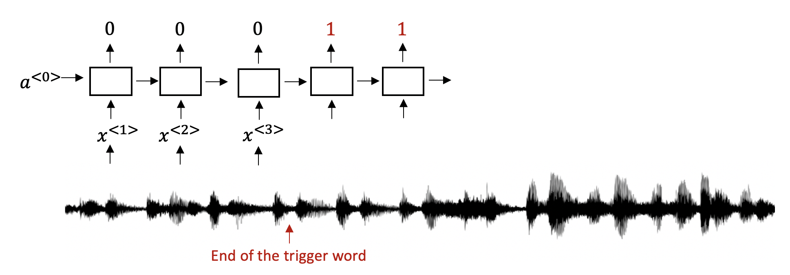
