# Supervised learning

<!-- TOC -->

- [Supervised learning](#supervised-learning)
  - [An Example Pipeline](#an-example-pipeline)
    - [I. Exploring the data](#i-exploring-the-data)
    - [II. Preparing the data](#ii-preparing-the-data)
    - [III. Evaluate model performance](#iii-evaluate-model-performance)
    - [IV. Improving results](#iv-improving-results)
    - [V. Feature importance](#v-feature-importance)
  - [1. Linear regression](#1-linear-regression)
    - [1.1 Gradient descent](#11-gradient-descent)
    - [1.2. Analytic solution](#12-analytic-solution)
    - [1.3. Regularization](#13-regularization)
    - [1.4. Linear Regression in sklearn](#14-linear-regression-in-sklearn)
    - [1.5. Warnings](#15-warnings)
  - [2. Perceptron Algorithm](#2-perceptron-algorithm)
    - [2.1. Decision boundary](#21-decision-boundary)
    - [2.2. Perceptron](#22-perceptron)
    - [2.3. Perceptron trick](#23-perceptron-trick)
  - [3. Decision trees](#3-decision-trees)
    - [3.1. Entropy](#31-entropy)
    - [3.2. Information gain](#32-information-gain)
    - [3.3. Hyperparameters](#33-hyperparameters)
    - [3.4. Decision trees in sklearn](#34-decision-trees-in-sklearn)
  - [4. Naive Bayes](#4-naive-bayes)
    - [4.1. Bayes theorem](#41-bayes-theorem)
    - [4.2. Naive assumption](#42-naive-assumption)
    - [4.3. Text learning with sklearn](#43-text-learning-with-sklearn)
    - [4.4. Naive Bayes advantages](#44-naive-bayes-advantages)
  - [5. Support Vector Machine](#5-support-vector-machine)
    - [5.1. Error function](#51-error-function)
    - [5.2. Kernel trick](#52-kernel-trick)
    - [5.3. Support vector machine in sklearn](#53-support-vector-machine-in-sklearn)
  - [6. Ensemble methods](#6-ensemble-methods)
    - [6.1. Bias and variance](#61-bias-and-variance)
    - [6.2. Ensemble techniques](#62-ensemble-techniques)
    - [6.3. Adaboost](#63-adaboost)
    - [6.4. Adaboost in sklearn](#64-adaboost-in-sklearn)
  - [7. Model evaluation metrics](#7-model-evaluation-metrics)
    - [7.1. Testing the model](#71-testing-the-model)
    - [7.2. Evaluation matrix](#72-evaluation-matrix)
    - [7.3. Classification metrics](#73-classification-metrics)
    - [7.4. Regression metrics](#74-regression-metrics)
  - [8. Training and tuning](#8-training-and-tuning)
    - [8.1. Detect overfitting and underfitting with learning curves](#81-detect-overfitting-and-underfitting-with-learning-curves)
    - [8.2. Model selection and validation with cross validation](#82-model-selection-and-validation-with-cross-validation)

<!-- /TOC -->

## An Example Pipeline

### I. Exploring the data

- #### Check if classes are imbalanced

  Useful articles on handling imbalanced datasets: [Quora](https://www.quora.com/In-classification-how-do-you-handle-an-unbalanced-training-set), [blog](https://blog.dominodatalab.com/imbalanced-datasets/), [KDnuggets](https://www.kdnuggets.com/2017/06/7-techniques-handle-imbalanced-data.html)

- #### Get some initial statistics

  e.g., `data.describe()`

- #### Exploratory analysis

  e.g., `factorplot` <br>
  e.g., `sns.pairplot(diabetes, hue="Outcome")` <br>
  e.g., `sns.heatmap(diabetes.corr(), annot=True, cmap="YlGnBu")` <br>
  e.g., `diabetes.hist()`

### II. Preparing the data

- #### Strategies for working with missing values

  - Remove the rows or columns holding the missing values 
    
    Associated with mechanical failures <br> 
    columns that you are interested in predicting

  - Impute the missing values

    Diluting the power of the feature to predict well by reducing the variability of the feature. <br>
    Impute with mean or use KNN to impute values based on features that are most similar.

  - Build models that work around them, and only use the information provided.

- #### Transform skewed continuous features

  - Reasons for transformation

    Reduce skewness: ideal for many statistical models<br>
    Equal spread (**homoscedasticity**): stabilize the variance in each dataset<br>
    Produce linear and additive relationships: easier to handle and interpret

  - Box-Cox transformation

    $$
    f(x) = \left\{
            \begin{array}{ll}
                \frac{x^\lambda-1}{\lambda} & \quad \lambda \neq 0 \\
                \log{x} & \quad \lambda=0
            \end{array}
        \right.
    $$

    For highly skewed features, it is common practice to apply a logarithmic transformation. Note: The logarithm of 0 is undefined.

  - Measure of Normality

    Normal probability plot: The quantiles of the data and the quantiles of the idealized normally distributed data.

    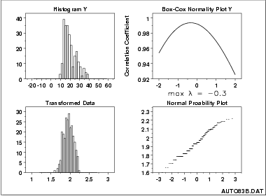

- #### Feature scaling

  - Reasons for feature scaling

    Should do feature scaling when the scale of a feature is irrelevant or misleading. <br>
    Many algorithms (e.g. SVM, K-nearest neighbors, logistic regression, PCA) considers Euclidean distance to be meaningful. <br>
    Gradient descent converges much faster with feature scaling than without it.

  - e.g., [`MinMaxScaler`](http://scikit-learn.org/stable/modules/generated/sklearn.preprocessing.MinMaxScaler.html), [`StandardScaler`](https://scikit-learn.org/stable/modules/generated/sklearn.preprocessing.StandardScaler.html#sklearn.preprocessing.StandardScaler), [`MaxAbsScaler`](https://scikit-learn.org/stable/modules/generated/sklearn.preprocessing.MaxAbsScaler.html#sklearn.preprocessing.MaxAbsScaler)

- #### Convert categorical features

  One popular way to convert categorical variables is by using the **one-hot encoding** scheme. One-hot encoding creates a "*dummy*" variable for each possible category of each non-numeric feature. e.g., [`pandas.get_dummies()`](http://pandas.pydata.org/pandas-docs/stable/generated/pandas.get_dummies.html?highlight=get_dummies#pandas.get_dummies). Rule of thumb: 10 rows for each column added.

  This [reference](https://www.kdnuggets.com/2015/12/beyond-one-hot-exploration-categorical-variables.html) provides 7 different encoding strategies. <br>
  Another article on [various ways in which we can handle categorical variable](http://pbpython.com/categorical-encoding.html)

- #### Shuffle and split data

  Randomize rows and split data into test vs. training

### III. Evaluate model performance

- #### Define metrics

  e.g., **F-beta score**

  Useful article to understand more about [choosing the right metric for classification problems](https://towardsdatascience.com/beyond-accuracy-precision-and-recall-3da06bea9f6c).

- #### Examine naive predictor performance

  The purpose of generating a naive predictor is simply to show what a base model without any intelligence would look like. In the real world, the base model would be either the results of a previous model or could be based on a research paper upon which you are looking to improve. When there is no benchmark model set, getting a result better than random choice is a place you could start from.

- #### Choose machine learning models

  Try simple methods first as a benchmark, then move on to non-linear classifiers and ensemble methods. Some ideas to think about and look for in the data/model regarding which to choose:

  - The predictive power of the model
  - The runtime of the model and how it will scale to much more data
  - The interpretability of the model
  - How often we will need to run the model and/or if it supports online learning.
  - How many categorical features / numerical?
  - Distribution of target variable? Linear data?
  - Non-linear data?
  - Outliers?
  - Missing data? (amount of data)
  
  [Flow chart from Sklearn](http://scikit-learn.org/stable/tutorial/machine_learning_map/index.html) <br>
  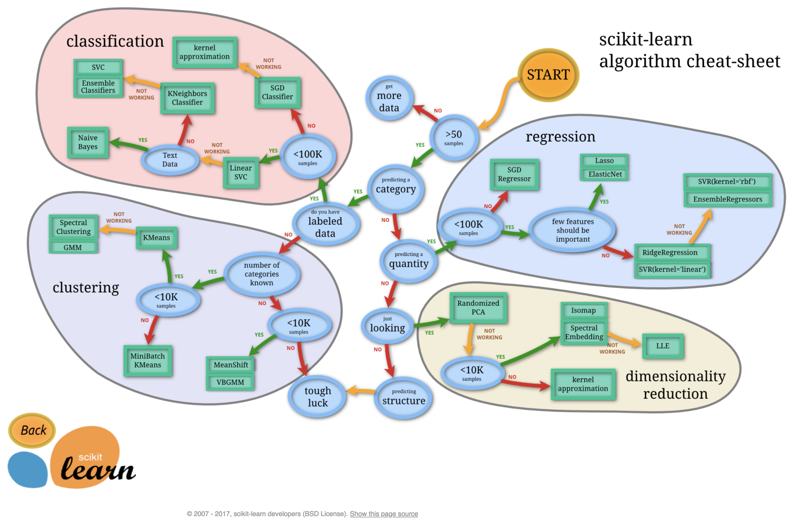

  [Flow chart from Azure](https://docs.microsoft.com/en-us/azure/machine-learning/studio/algorithm-cheat-sheet) <br>
  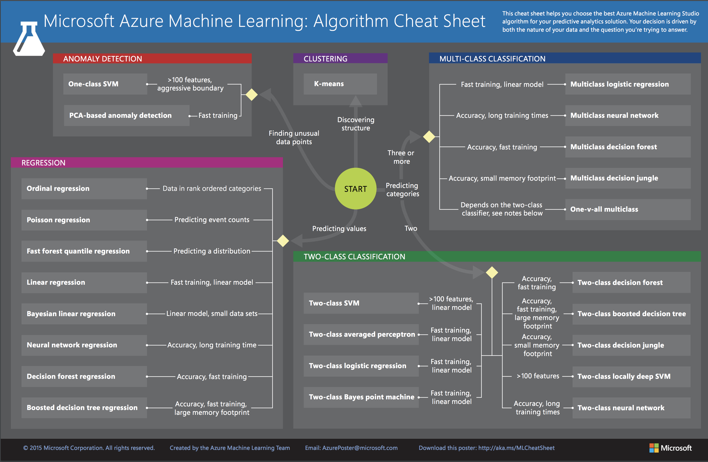

  [Visual intuition of ML techniques](http://arogozhnikov.github.io/2016/04/28/demonstrations-for-ml-courses.html)

  [Comparison of decision boundary of major classifiers](http://scikit-learn.org/stable/auto_examples/classification/plot_classifier_comparison.html)

  [**Comprehensive SAS article on model selection**](https://blogs.sas.com/content/subconsciousmusings/2017/04/12/machine-learning-algorithm-use/)

  [**Great Quora thread comparing common ML models**](https://www.quora.com/What-are-the-advantages-of-different-classification-algorithms)

- #### Create a training and predicting pipeline

  Quickly and effectively train models using various sizes of training data and perform predictions on the testing data.

  Learn more about [pipelines in scikit-learn from the API documentation](http://scikit-learn.org/stable/modules/generated/sklearn.pipeline.Pipeline.html)

### IV. Improving results

- #### Make sure the labels are evenly split between the validation sets

  e.g., [sklearn.model_selection.StratifiedShuffleSplit](http://scikit-learn.org/stable/modules/generated/sklearn.model_selection.StratifiedShuffleSplit.html)

  ```python
  from sklearn.model_selection import StratifiedShuffleSplit
  cv = StratifiedShuffleSplit(...)
  grid_obj = GridSearchCV(elf, parameters, scoring=scorer, cv=cv)
  ```

- #### Tune hyperparameters

  Perform a grid search optimization for the model over the entire training set

- #### Examine F-beta score and confusion matrix on test set

  ```python
  from sklearn.metrics import confusion_matrix
  import seaborn as sns
  %matplotlib inline
  pred = best_clf.predict(X_test)
  sns.heatmap(confusion_matrix(y_test, pred), annot = True, fmt = '')
  ```

### V. Feature importance

- #### Feature selection is a very important step

  - It enables the algorithm to train faster
  - It reduces the complexity of a model and makes it easier to interpret
  - It improves the accuracy of a model if the right subset is chosen
  - Good feature set contains features that are highly correlated with the class, yet uncorrelated with each other. In general, feature reduction is a great way to [fight the curse of dimensionality](https://medium.freecodecamp.org/the-curse-of-dimensionality-how-we-can-save-big-data-from-itself-d9fa0f872335)

- #### More features not always better

  - As number of features increases, training time increases exponentially.
  - Models often suffer from overfitting with more no of features.

  ["Sometimes Less is better!"](https://www.analyticsvidhya.com/blog/2016/10/exclusive-interview-ama-with-data-scientist-rohan-rao-analytics-vidhya-rank-4/)

- #### Methods for implementing feature selection

  - [SelectBest](http://scikit-learn.org/stable/modules/generated/sklearn.feature_selection.SelectKBest.html)
  - [SelectPercentile](http://scikit-learn.org/stable/modules/generated/sklearn.feature_selection.SelectPercentile.html)
  - [Recursive Feature Elimination to find the best subset of features](http://scikit-learn.org/stable/modules/generated/sklearn.feature_selection.RFE.html)

## 1. Linear regression

### 1.1 Gradient descent

#### Absolute trick

- Notation

  line: $y=w_1x+w_2$ <br>
  point: (p, q) <br>
  $\alpha$: learning rate <br>

- if point is above the line

  $y=(w_1+p\alpha)x+(w_2+\alpha)$

- if point is below the line

  $y=(w_1-p\alpha)x+(w_2-\alpha)$

#### Square trick

- Notation

  q': $y(x=p)$

- Equation

  $y=(w_1-p\alpha(q-q'))x+(w_2-\alpha(q-q'))$

#### Mean absolute error

$Error=\frac{1}{m}\sum_{i=1}^m|y-y'|$

#### Mean squared error

$Error=\frac{1}{2m}\sum_{i=1}^m(y-y')^2$

#### Gradient step

$w_i→w_i-\alpha\frac{\partial}{\partial{w_i}}Error$ <br>
  
- Mean square error

  $\frac{\partial}{\partial{w_1}}Error=-(y-y')x$ <br>
  $\frac{\partial}{\partial{w_1=2}}Error=-(y-y')$

- Mean absolute error

  $\frac{\partial}{\partial{w_1}}Error=±x$ <br>
  $\frac{\partial}{\partial{w_1=2}}Error=±1$

Minimizing the mean squre error is exactly the same as the square trick; minimizing the absolute error is exactly the same as the absolute trick.

#### Mini-batch gradient descent

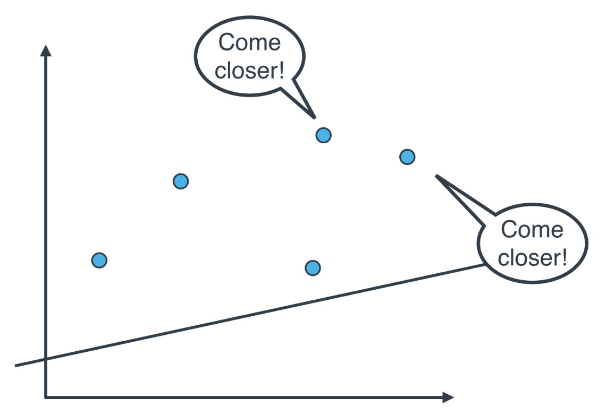

### 1.2. Analytic solution

$W=(X^TX)^{-1}X^Ty$

### 1.3. Regularization

Punish too many features to avoid overfitting

- L1 Regularization
- L2 Regularization

### 1.4. Linear Regression in sklearn

```python
from sklearn.linear_model import LinearRegression

model = LinearRegression()
model.fit(x_values, y_values)
print(model.predict([ [127], [248] ]))
```

### 1.5. Warnings

- Linear Regression Works Best When the Data is Linear
- Linear Regression is Sensitive to Outliers

## 2. Perceptron Algorithm

Classification problem

### 2.1. Decision boundary

- Linear equation

  WX + b = 0

- Notation

  W: weight <br>
  X: input features <br>
  b: bias <br>
  y: label 0 or 1 <br>
  $\alpha$: learning rate <br>

### 2.2. Perceptron

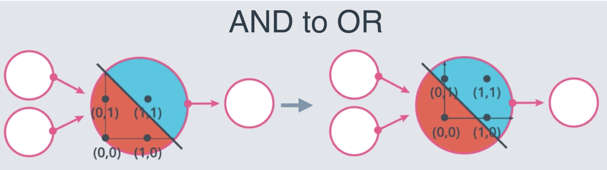

### 2.3. Perceptron trick

$w_1x_1 + w_2x_2 + b = 0$ <br>
Point (xp, xq) classified incorrecctly <br>

To move the decision boundary closer to the point, for every misclassified point:

- if the incorrect prediction = 1
  
  $w_1 := w_1 - x_p\alpha$ <br>
  $w_2 := w_2 - x_q\alpha$ <br>
  $b := b - \alpha$ <br>

- if the incorrect prediction = 0
  
  $w_1 := w_1 + x_p\alpha$ <br>
  $w_2 := w_2 + x_q\alpha$ <br>
  $b := b + \alpha$ <br>

## 3. Decision trees

### 3.1. Entropy

$entropy = -\sum_i (p_i) log_2(p_i)$ <br>
$p_i$: fraction of examples in class i

### 3.2. Information gain

information gain = entropy(parent) - weighted average of entropy(children) <br>
Decision tree algorithm maximizes information gain

### 3.3. Hyperparameters

- Maximum Depth

  `max_depth`: The maximum number of levels in the tree.

- Minimum number of samples per leaf

  `min_samples_leaf`: The minimum number of samples allowed in a leaf.

  - int: minimum number
  - float: minimum percentage

- Minimum number of samples per split

  `min_samples_split`: The minimum number of samples required to split an internal node.

  - int: minimum number
  - float: minimum percentage

- Maximum number of features

  `max_features` : The number of features to consider when looking for the best split.
  to speed up calculations

### 3.4. Decision trees in sklearn

```python
from sklearn.tree import DecisionTreeClassifier
from sklearn.metrics import accuracy_score

model = DecisionTreeClassifier()
model.fit(x_values, y_values)
y_pred = model.predict([ [0.2, 0.8], [0.5, 0.4] ])
acc = accuracy_score(y, y_pred)
```

## 4. Naive Bayes

### 4.1. Bayes theorem

$P(A|R)=\frac{P(A)P(R|A)}{P(A)P(R|A)+P(B)P(R|B)}$

### 4.2. Naive assumption

Considers each feature to be independent of each other

### 4.3. Text learning with sklearn

- multinomial Naive Bayes: classification with discrete features
- Gaussian Naive Bayes: continuous data as it assumes that the input data has a Gaussian(normal) distribution

  ```python
  from sklearn.feature_extraction.text import CountVectorizer

  count_vect = CountVectorizer()

  # Fit the training data and then return the matrix
  training_data = count_vect.fit_transform(email_list)

  # Transform testing data and return the matrix. Note we are not fitting the testing data into the CountVectorizer()
  testing_data = count_vect.transform(email_list_test)
  ```

  ```python
  from sklearn.naive_bayes import MultinomialNB
  clf = MultinomialNB()
  clf.fit(training_data, y_train)
  predictions = clf.predict(testing_data)
  ```

### 4.4. Naive Bayes advantages

- (+) ability to handle an extremely large number of features
- (+) performs well even with the presence of irrelevant features and is relatively unaffected by them
- (+) its relative simplicity
- (+) rarely ever overfits the data
- (+) model training and prediction times are very fast for the amount of data it can handle

## 5. Support Vector Machine

### 5.1. Error function

Error = classification error + margin error

- Notation

  $y=WX+b$

- Classification error

  $\sum{|y-y_{pred}|}$ for all misclassified points

- Margin error

  margin = $\frac{2}{|W|}$ <br>
  margin error = $|W|^2$

- C parameter

  Error = C*classification error + margin error

  Large C: focus on correctly classifying points <br>
  Small C: focus on a larger margin

  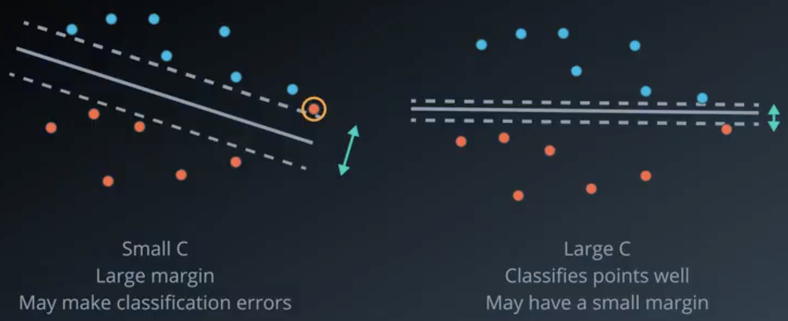

### 5.2. Kernel trick

- Linear kernel

  x, y

- Polynomial kernel

  x, y, $x^2$, $xy$, $y^2$, etc.

- RBF (radial basis functions) kernel

  $\gamma$ parameter

  Large $\gamma$: skinny mountains, tends to overfit <br>
  Small $\gamma$: wide mountains, tends to underfit

  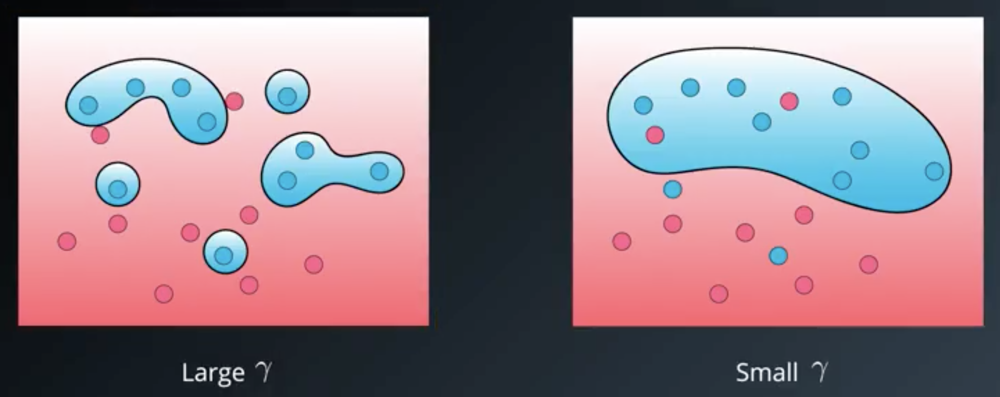

### 5.3. Support vector machine in sklearn

```python
from sklearn.svm import SVC
model = SVC(kernel='poly', degree=4, C=0.1)
model.fit(x_values, y_values)
model.predict([ [0.2, 0.8], [0.5, 0.4] ])
```

#### Hyperparameters

- `C`: The C parameter.
- `kernel`: The kernel. The most common ones are 'linear', 'poly', and 'rbf'.
- `degree`: If the kernel is polynomial, this is the maximum degree of the monomials in the kernel.
- `gamma` : If the kernel is rbf, this is the gamma parameter.

## 6. Ensemble methods

[Documentation](http://scikit-learn.org/stable/modules/ensemble.html)

- Bagging: bootstrap aggregating
- Boosting

weaker learners -> strong learner

### 6.1. Bias and variance

- **Bias**: When a model has high bias, this means that means it doesn't do a good job of bending to the data. e.g. linear regression

  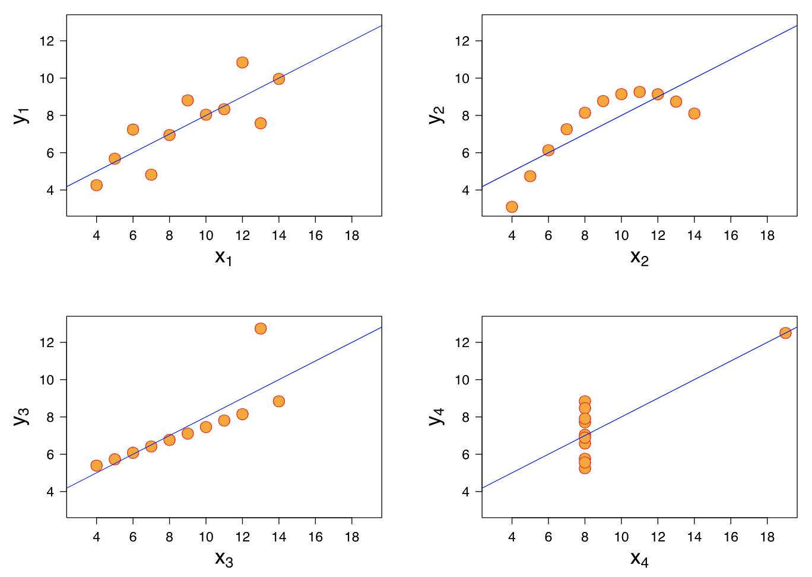

- **Variance**: When a model has high variance, this means that it changes drastically to meet the needs of every point in our dataset. e.g. decision trees with no early stopping parameters

  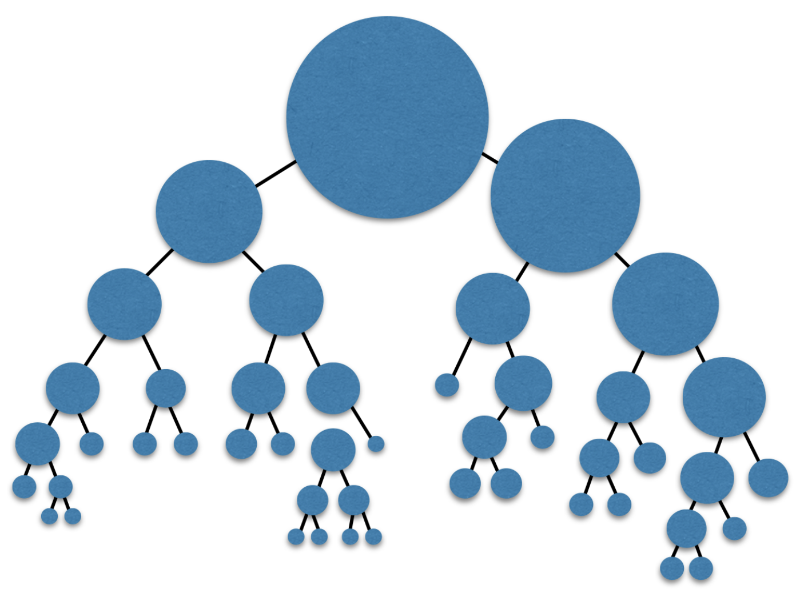

### 6.2. Ensemble techniques

#### To optimize bias and variance

Introduce randomness into high variance algorithms before they are ensembled together

1. **Bootstrap the data** - that is, sampling the data with replacement and fitting your algorithm and fitting your algorithm to the sampled data. passed through a learner (bagging).

2. **Subset the features** - in each split of a decision tree or with each algorithm used in an ensemble method, only a subset of the total possible features are used.

#### Some ensemble methods

- [BaggingClassifier](http://scikit-learn.org/stable/modules/generated/sklearn.ensemble.BaggingClassifier.html#sklearn.ensemble.BaggingClassifier)
- [RandomForestClassifier](http://scikit-learn.org/stable/modules/generated/sklearn.ensemble.RandomForestClassifier.html#sklearn.ensemble.RandomForestClassifier)
- [AdaBoostClassifier](http://scikit-learn.org/stable/modules/generated/sklearn.ensemble.AdaBoostClassifier.html#sklearn.ensemble.AdaBoostClassifier)

### 6.3. Adaboost

**Ensemble learners** together in a way that allows those that perform best in certain areas to create the largest impact (boosting).

1. Punish misclassified points more, such that sum of data weights are half-half between correct and incorrect; then get a new model that fits the newly weighted data best

2. Combine models

    $weight=ln(\frac{accuracy}{1-accuracy})=ln(\frac{correct}{incorrect})$

### 6.4. Adaboost in sklearn

```python
from sklearn.ensemble import AdaBoostClassifier
model = AdaBoostClassifier() #decision tree model
model.fit(x_train, y_train)
model.predict(x_test)
```

#### Hyperparameters

- **base_estimator**: The model utilized for the weak learners (Warning: Don't forget to import the model that you decide to use for the weak learner).
- **n_estimators**: The maximum number of weak learners used.

```python
from sklearn.tree import DecisionTreeClassifier
model = AdaBoostClassifier(base_estimator = DecisionTreeClassifier(max_depth=2), n_estimators = 4)
```

#### Common process to perform machine learning

1. **Import** the model.
2. **Instantiate** the model with the hyperparameters of interest.
3. **Fit** the model to the training data.
4. **Predict** on the test data.
5. **Score** the model by comparing the predictions to the actual values.

## 7. Model evaluation metrics

### 7.1. Testing the model

#### Never use testing data for training

```python
from sklearn.model_selection import train_test_split
X_train, X_test, y_train, y_test = train_test_split(features, outcomes, test_size=0.2, random_state=42)
```

### 7.2. Evaluation matrix

- **Type 1 Error** (Error of the first kind, or False Positive): In the medical example, this is when we misdiagnose a healthy patient as sick.
- **Type 2 Error** (Error of the second kind, or False Negative): In the medical example, this is when we misdiagnose a sick patient as healthy.

  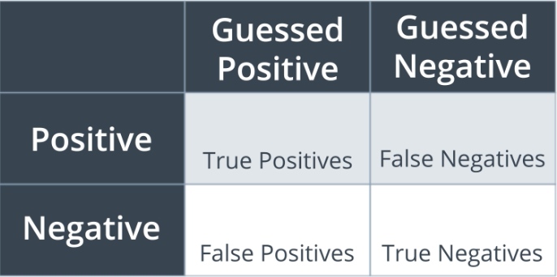

  ```python
  from sklearn.metrics import confusion_matrix

  # Confusion matrix based on model prediction
  labels = np.unique(y_pred)
  confusion_mat = confusion_matrix(y_test, y_pred, labels=labels)
  accuracy = (y_pred == y_test).mean()

  # Display confusion matrix with labels
  print("Labels:", labels)
  print("Confusion Matrix:\n", confusion_mat)
  print("Accuracy:", accuracy)
  ```

### 7.3. Classification metrics

- **Accuracy**

  Measures how often the classifier makes the correct prediction. It’s the ratio of the number of correct predictions to the total number of predictions.

  Not to use when there are imbalanced classes.

- **Precision**

  `[True Positives/(True Positives + False Positives)]`

  Use when we want to make sure the positive cases are all caught even if that means we identify some negatives as positives. <br>
  E.g. in spam detection, false positive not okay, need a high precision model.


- **Recall(sensitivity)**

  `[True Positives/(True Positives + False Negatives)]`

  Use if we identify something as positive, we want to be sure it is truly positive. <br>
  E.g. in medical model, false negative not okay, need a high recall model.

- **$F_\beta$ score**

  Weighted average (e.g. harmonic mean for $F_1$) of the precision and recall scores. This score can range from 0 to 1, with 1 being the best possible F1 score.

  - $F_1$ score = $\frac{2 * (Precision * Recall)} {(Precision + Recall)}$
  - $F_\beta$ score = $\frac{(1+\beta^2)(Precision * Recall)} {\beta^2(Precision + Recall)}$ where $\beta$ between 0 and ∞

  ```python
  from sklearn.metrics import accuracy_score, precision_score, recall_score, f1_score, fbeta_score
  print('Accuracy score: ', format(accuracy_score(y_test, y_pred)))
  print('Precision score: ', format(precision_score(y_test, y_pred))
  print('Recall score: ', format(recall_score(y_test, y_pred))
  print('F1 score: ', format(f1_score(y_test, y_pred))
  print('F_beta score: ', format(fbeta_score(y_test, y_pred, average='binary', beta=0.5)))
  ```

- **ROC (Receiver Operating Characteristic) curve**

  - true positive rate = (true positive) / (all positive)
  - false positive rate = (false positive) / (all negative)

  Area under the curve of (true positive rate, false positive rate) points. <br>
  The more that the area -> 1, the better the model is.

  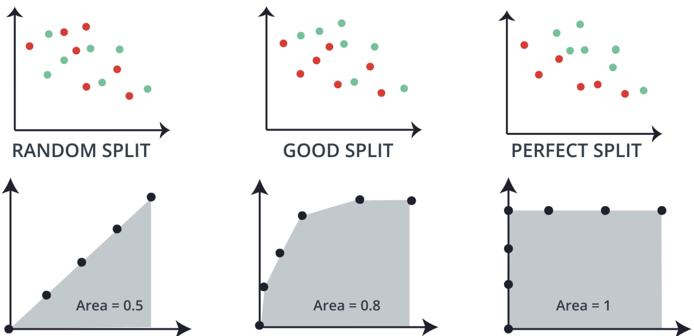

### 7.4. Regression metrics

- Mean absolute error

- Mean squared error

- R2 score

  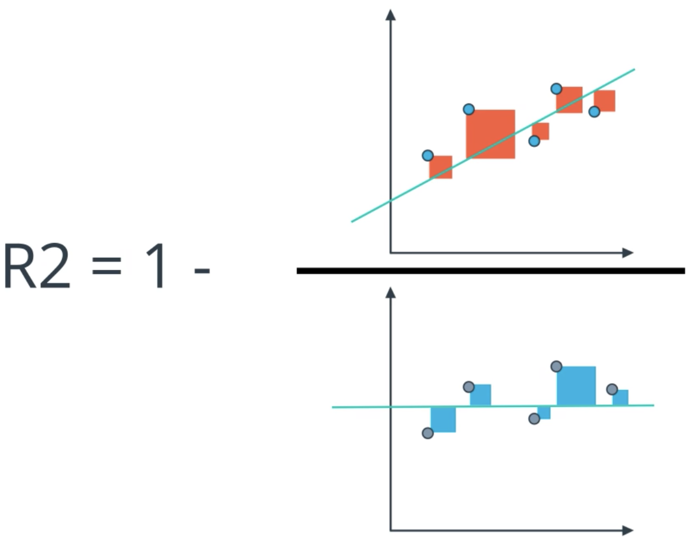


  ```python
  from sklearn.metrics import mean_absolute_error, mean_squared_error, r2_score
  from sklearn.linear_model import LinearRegression

  classifier = LinearRegression()
  classifier.fit(X, y)
  y_pred = classifier.predict(X)

  error1 = mean_absolute_error(y, y_pred)
  error2 = mean_squared_error(y, y_pred)
  r2 = r2_score(y, y_pred)
  ```

## 8. Training and tuning

### 8.1. Detect overfitting and underfitting with learning curves

- #### Types of errors

  - Overfitting (high variance): Overcomplicate the problem
  - Underfitting (high bias): Oversimplify the problem

- #### Learning curves

  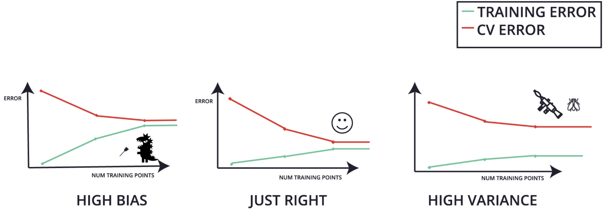

  ```python
  import numpy as np
  from sklearn.model_selection import learning_curve

  train_sizes, train_scores, test_scores = learning_curve(
    estimator, X, y, cv=None, n_jobs=1, train_sizes=np.linspace(.1, 1.0, num_trainings)) # defaults to 3-Fold Cross-Validation

  train_scores_mean = np.mean(train_scores, axis=1)
  train_scores_std = np.std(train_scores, axis=1)
  test_scores_mean = np.mean(test_scores, axis=1)
  test_scores_std = np.std(test_scores, axis=1)
  ```

  - `estimator`, is the actual classifier we're using for the data, e.g., `LogisticRegression()` or `GradientBoostingClassifier()`.
  - `X` and `y` is our data, split into features and labels.
  - `train_sizes` are the sizes of the chunks of data used to draw each point in the curve.
  - `train_scores` are the training scores for the algorithm trained on each chunk of data.
  - `test_scores` are the testing scores for the algorithm trained on each chunk of data.

  Note error is the opposite from score

### 8.2. Model selection and validation with cross validation

- #### Model selection: cross validation

  Split data into training, cross validation, and testing

  1. Use training set to train different models
  2. Estimate the performance on validation set

      **Model complexity graph**: error vs. model complexity

      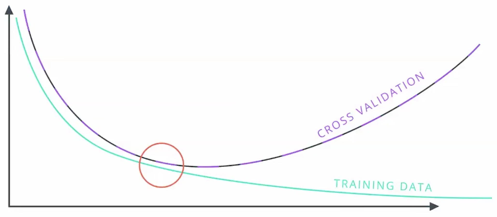

  3. Select the model with optimal performance (e.g. highest F1 score) on validation set

      **Grid search cross validation**

      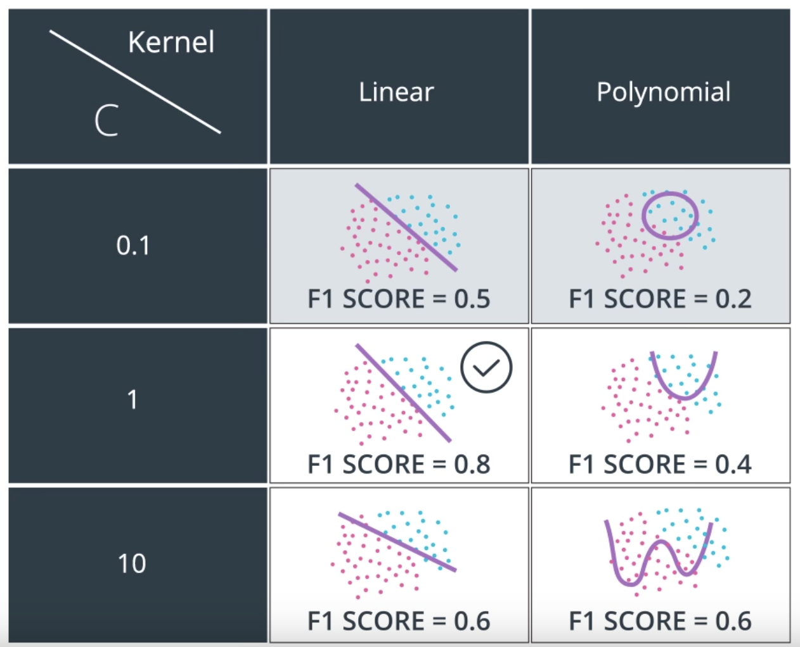

      ```python
      #1. Import GridSearchCV
      from sklearn.model_selection import GridSearchCV

      #2. Select the parameters
      parameters = {'kernel':['poly', 'rbf'],
                    'C':[0.1, 1, 10]}

      #3. Create a scorer
      from sklearn.metrics import make_scorer, f1_score
      scorer = make_scorer(f1_score)

      #4. Create a GridSearch Object with the parameters, and the scorer. Use this object to fit the data.
      clf = = RandomForestClassifier()
      grid_obj = GridSearchCV(clf, parameters, scoring=scorer) # Create the object
      grid_fit = grid_obj.fit(X, y) # Fit the data

      #5. Get the best estimator
      best_clf = grid_fit.best_estimator_

      #6. Find the features that are most important
      importances = best_clf.feature_importances_
      ```

      It can often be difficult (and extremely time consuming) to test all the possible hyperparameter combinations to find the best models.  Therefore, it is often useful to set up a randomized search. In practice, randomized searches across hyperparameters have shown to be more time saving, while still optimizing quite well. The documentation for using randomized search in sklearn can be found [here](http://scikit-learn.org/stable/auto_examples/model_selection/plot_randomized_search.html#sphx-glr-auto-examples-model-selection-plot-randomized-search-py) and [here](http://scikit-learn.org/stable/modules/generated/sklearn.model_selection.RandomizedSearchCV.html).

      ```python
      from sklearn.model_selection import RandomizedSearchCV
      
      # Run a randomized search over the hyperparameters
      random_search = RandomizedSearchCV(clf_rf, param_distributions=param_dist)

      # Fit the model on the training data
      random_search.fit(X_train, y_train)

      # Make predictions on the test data
      rf_preds = random_search.best_estimator_.predict(X_test)
      ```
  
  4. Test the model on testing set

- #### Model performance estimation: K-fold cross validation

  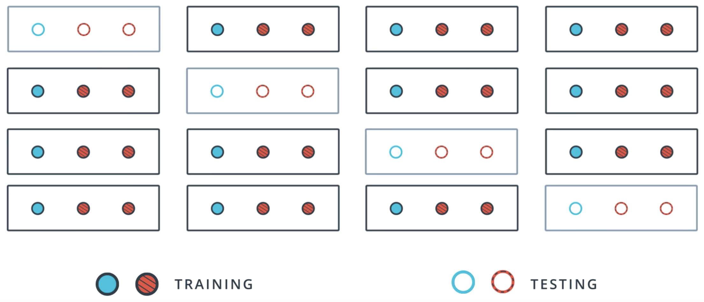

  ```python
  from sklearn.model_selection import KFold

  kf = KFold(3, random_state=None, shuffle=True) #size of data, size of testing set; randomize;

  for train_index, test_index in kf.split(X):
      print("TRAIN:", train_index, "TEST:", test_index)
      X_train, X_test = X[train_index], X[test_index]
      y_train, y_test = y[train_index], y[test_index]
  ```

