# Unsupervised learning

<!-- TOC -->

- [Unsupervised learning](#unsupervised-learning)
  - [1. Intro](#1-intro)
    - [1.1. What is unsupervised learning](#11-what-is-unsupervised-learning)
    - [1.2. Types of Unsupervised Learning](#12-types-of-unsupervised-learning)
    - [1.3. Cluster analysis process](#13-cluster-analysis-process)
  - [2. K-means Clustering](#2-k-means-clustering)
    - [2.1. K-means applications](#21-k-means-applications)
    - [2.2. Choosing k](#22-choosing-k)
    - [2.3. Scikit learn K-means](#23-scikit-learn-k-means)
    - [2.4. K-means algorithm](#24-k-means-algorithm)
    - [2.5. K-means concerns](#25-k-means-concerns)
    - [2.6. Random initialization](#26-random-initialization)
    - [2.7. Feature scaling](#27-feature-scaling)
    - [2.8. Dealing with sparse dataset](#28-dealing-with-sparse-dataset)
  - [3. Hierarchical and Density Based Clustering](#3-hierarchical-and-density-based-clustering)
    - [3.1. Hierarchical clustering algorithm](#31-hierarchical-clustering-algorithm)
    - [3.2. Distance measure in hierarchical clustering](#32-distance-measure-in-hierarchical-clustering)
    - [3.3. Hierarchical clustering with scikit learn](#33-hierarchical-clustering-with-scikit-learn)
    - [3.4. Hierarchical clustering advantages and disadvantages](#34-hierarchical-clustering-advantages-and-disadvantages)
    - [3.5. Density clustering (DBSCAN) algorithm](#35-density-clustering-dbscan-algorithm)
    - [3.6. DBSCAN with scikit learn](#36-dbscan-with-scikit-learn)
    - [3.7. DBSCAN advantages and disadvantages](#37-dbscan-advantages-and-disadvantages)
  - [4. Gaussian Mixture Model (GMM) Clustering and Cluster Validation](#4-gaussian-mixture-model-gmm-clustering-and-cluster-validation)
    - [4.1. GMM algorithm: expectation-maximization](#41-gmm-algorithm-expectation-maximization)
    - [4.2. GMM with scikit learn](#42-gmm-with-scikit-learn)
    - [4.3. GMM advantages and disadvantages](#43-gmm-advantages-and-disadvantages)
    - [4.4. GMM applications](#44-gmm-applications)
  - [5. Cluster validation](#5-cluster-validation)
    - [5.1. Visualization](#51-visualization)
    - [5.2. Cluster validation indices](#52-cluster-validation-indices)
  - [5. Principal Component Analysis (PCA)](#5-principal-component-analysis-pca)
    - [5.1. How PCA works](#51-how-pca-works)
    - [5.2. PCA with scikit learn](#52-pca-with-scikit-learn)
    - [5.3. PCA interpretation](#53-pca-interpretation)
    - [5.4. PCA applications](#54-pca-applications)
  - [6. Random Projection and Independent Component Analysis (ICA)](#6-random-projection-and-independent-component-analysis-ica)
    - [6.1. Random projection](#61-random-projection)
    - [6.2. Random projection with sklearn](#62-random-projection-with-sklearn)
    - [6.3. ICA](#63-ica)
    - [6.4. FastICA algorithm](#64-fastica-algorithm)
    - [6.5. ICA with sklearn](#65-ica-with-sklearn)
    - [6.6. ICA applications](#66-ica-applications)

<!-- /TOC -->

## 1. Intro

### 1.1. What is unsupervised learning

Unsupervised learning is about understanding how to group data when we either:

1. Do not have a label to predict. An example of this is using an algorithm to look at brain scans to find areas that may raise concern. You don't have labels on the images to understand what areas might raise reason for concern, but you can understand which areas are most similar or different from one another.

2. Are not trying to predict a label, but rather group our data together for some other reason! One example of this is when you have tons of data, and you would like to condense it down to a fewer number of features to be used.

### 1.2. Types of Unsupervised Learning

- **Clustering** - which groups data together based on similarities
  - K-means clustering
  - Hierarchical clustering
  - Density clustering (DBSCAN)
  - Gaussian mixture model clustering
- **Dimensionality Reduction** - which condenses a large number of features into a (usually much) smaller set of features.

  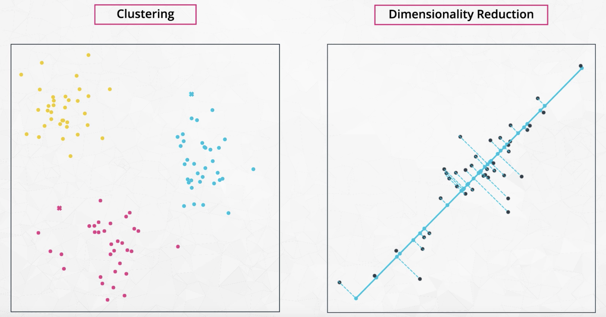

### 1.3. Cluster analysis process

1. Feature selection and extraction
    - Choose distinguishing features from a set of candidates
    - Transform data to generate novel and useful features, e.g. PCA
2. Clustering algorithm selection and tuning
    - Choose a proximity measure
      - Most times: Euclidean distance
      - Word-embedding documents: cosine distance
      - Gene expression type data: Pearson correlation
3. Clustering validation
    - Visualizing clusters
    - Scoring (index)
4. Results interpretation
    - Needs domain expertise

## 2. K-means Clustering

### 2.1. K-means applications

K-means can group together

- Books of similar genres or written by the same authors.
- Similar movies.
- Similar music.
- Similar groups of customers.

Product, movie, music and other types of recommender systems

- Use k-means to cluster users according to their ratings.
- Based on this, when one user did not have a rating for a certain movie, we averaged the ratings of all the other users in the cluster, and that was our guess to how this one user would like the movie.

### 2.2. Choosing k

`k`: the number of clusters

- Visual inspection
- Prior knowledge
- Elbow method

  At some point, adding new clusters will no longer create a substantial decrease in the average distance. This point is known as the **elbow**.

  **Scree plot**: <br>
  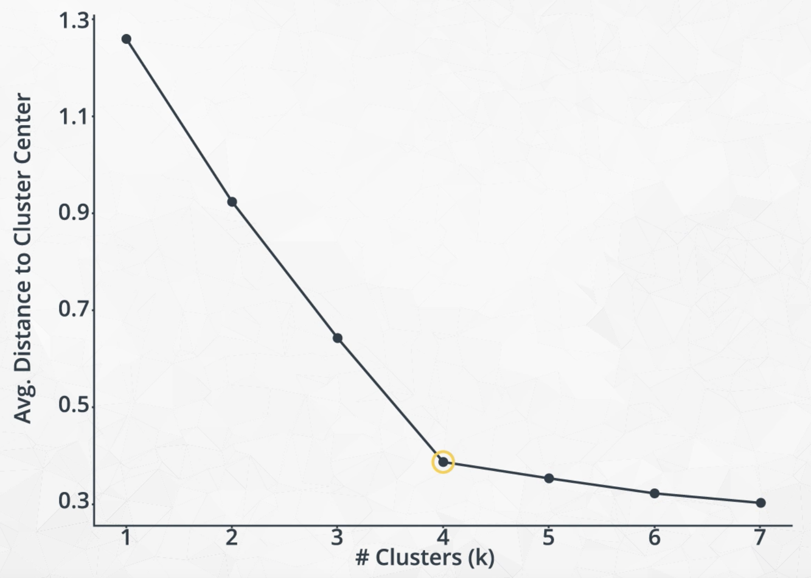


### 2.3. Scikit learn K-means

[Documentation](http://scikit-learn.org/stable/modules/generated/sklearn.cluster.KMeans.html)

1. Instantiate kmeans

    ```python
    from sklearn.cluster import KMeans
    import numpy as np
    kmeans = KMeans(n_clusters=k)
    ```

2. Fit model to the data

    ```python
    model = kmeans.fit(data)
    ```

3. Predict the labels for the data

    ```python
    predictions = model.predict(data)

    # Plot
    plt.scatter(df['m1_rating'], df['m2_rating'], c=predictions, s=20, cmap='Accent')
    ```

4. Evaluation

    - Score

      ```python
      score = np.abs(model.score(data)) # the SSE score for the kmeans model fit to the data
      ```

    - Mean square error

      ```python
      from sklearn.metrics import mean_squared_error
      cluster_centers = model.cluster_centers_
      errors = [mean_squared_error(row, cluster_centers[cluster]) for row, cluster in zip(data, predictions)]
      sse = sum(errors)
      ```

    - Silhouette

      ```python
      from sklearn.metrics import silhouette_samples, silhouette_score
      silhouette_avg = silhouette_score(data, predictions)
      ```

### 2.4. K-means algorithm

1. Randomly place k centroids amongst your data.
2. Then within a loop until convergence perform the following two steps:
    - Assign each point to the closest centroid.
    - Move the centroid to the center of the points assigned to it.

The [blog by Naftali Harris](https://www.naftaliharris.com/blog/visualizing-k-means-clustering/) shows how K-means works

### 2.5. K-means concerns

- (-) Can end up with different groupings depending on the starting points of centroids.
- (-) Can end up different clusters depending on the scaling of the features in the dataset.
- (+/-) Good at classifying spherical clusters, not good at non-spherical clusters.

### 2.6. Random initialization

- With random starting points, the best set of clusters has the smallest average distance from each point to its corresponding centroid.

### 2.7. Feature scaling

A comparison of scaling methods [here](http://scikit-learn.org/stable/auto_examples/preprocessing/plot_all_scaling.html#sphx-glr-auto-examples-preprocessing-plot-all-scaling-py)

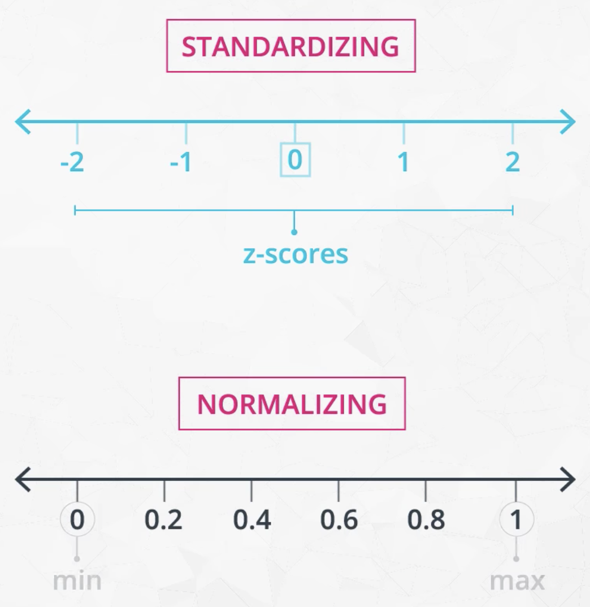

- **Normalizing (Max-Min Scaling)**: moves variables between 0 and 1

  ```python
  from sklearn import preprocessing as p
  
  # fit and transform the data
  df_mm = p.MinMaxScaler().fit_transform(df)
  ```

- **Standardizing (Z-Score Scaling)**: creates variables with a mean of 0 and standard deviation of 1

  ```python
  # Fit and transform the data
  df_ss = p.StandardScaler().fit_transform(df)

  # Create a dataframe
  df_ss = pd.DataFrame(df_ss) #create a dataframe
  df_ss.columns = ['height', 'weight'] #add column names again

  # Visualize scaled data
  plt.scatter(df_ss['height'], df_ss['weight']); # create a plot
  ```

- **Normalizer**: rescales the vector for each sample to have unit norm

  ```python
  from sklearn import preprocessing
  normalized_X = preprocessing.normalize(X)
  ```

### 2.8. Dealing with sparse dataset

- Convert pandas dataframe into SparseDataFrame
- Convert SparseDataFrame into [sparse csr matrix](https://docs.scipy.org/doc/scipy-0.19.0/reference/generated/scipy.sparse.csr_matrix.html)

  ```python
  from scipy.sparse import csr_matrix
  sparse_ratings = csr_matrix(pd.SparseDataFrame(most_rated_movies_1k).to_coo())
  ```

## 3. Hierarchical and Density Based Clustering

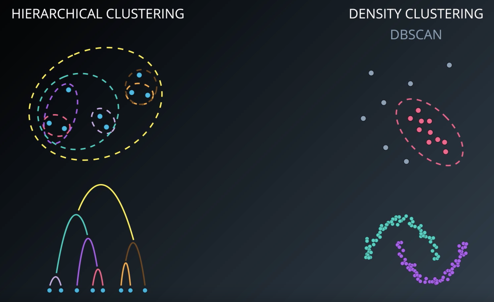

Using density based 'closeness' measures. This can be used in traffic classification, as well as in anomaly detection (finding points that aren't like others in your dataset).

### 3.1. Hierarchical clustering algorithm

- Initially treat each point as a different cluster
- Group nearest 2 clusters as a new cluster, repeatedly
- Generate **linkage dendrograms** based on distance between 2 clusters

  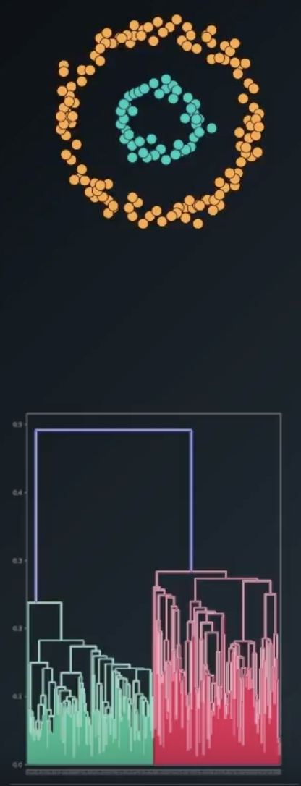

### 3.2. Distance measure in hierarchical clustering

- **Single-link** looks at 2 closest points between 2 clusters
  - (-) one cluster can eat up the entire dataset
  - (-) can result in elongated shapes that are not necessarily compact or circular
- **Complete-link** looks at 2 furthest points between 2 clusters.
- **Average link** looks at average distance between points of 2 clusters.
- **Ward's method** minimizes the variance in the clusters after merging

  
  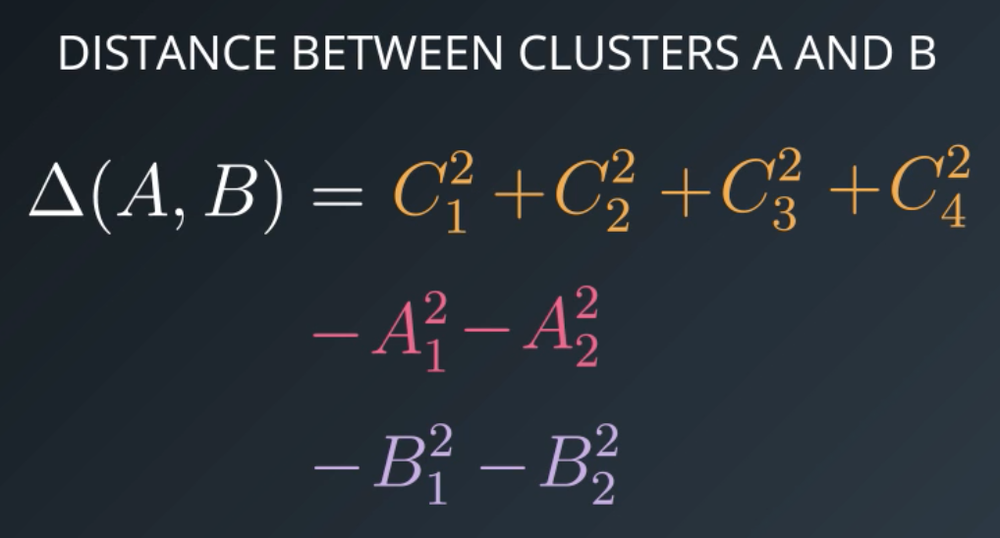

### 3.3. Hierarchical clustering with scikit learn

- #### Implementation

  ```python
  from sklearn import cluster
  clust = cluster.AgglomerativeClustering(n_clusters=3, linkage='ward')
  pred = clust.fit_predict(data)
  ```

- #### Dendrogram

  ```python
  from scipy.cluster.hierarchy import dendrogram, ward, single

  # Perform clustering
  linkage_matrix = ward(data)

  # Plot dendrogram
  dendrogram(linkage_matrix)
  plt.show()
  ```

  Alternatively,

  ```python
  from scipy.cluster.hierarchy import dendrogram, linkage
  
  # Perform clustering
  linkage_type = 'ward'
  linkage_matrix = linkage(normalized_X, linkage_type)

  # Plot dendrogram
  dendrogram(linkage_matrix)
  plt.show()
  ```

- #### Visualize clusters with Seaborn's `clustermap`

  ```python
  import seaborn as sns

  # Plot a matrix dataset as a hierarchically-clustered heatmap
  sns.clustermap(normalized_X, figsize=(12,18), method=linkage_type, cmap='viridis')
  plt.show()
  ```

- #### Compare how well 2 clustering match

  `adjusted_rand_score` which is an *external cluster validation index* which results in a score between -1 and 1, where 1 means two clusterings are identical of how they grouped the samples in a dataset (regardless of what label is assigned to each cluster).

  ```python
  from sklearn.metrics import adjusted_rand_score
  adjusted_rand_score(target, pred)
  ```

### 3.4. Hierarchical clustering advantages and disadvantages

- (+) Resulting hierarchical representation can be very informative
- (+) Provides an additional ability to visualize
- (+) Powerful when dataset contains real hierarchical relationships, e.g. evolutionary biology
- (-) Sensitive to noise and outliers
- (-) Computationally intensive $O(N^2)$

### 3.5. Density clustering (DBSCAN) algorithm

Density-based spatial clustering of applications with noise (DBSCAN)

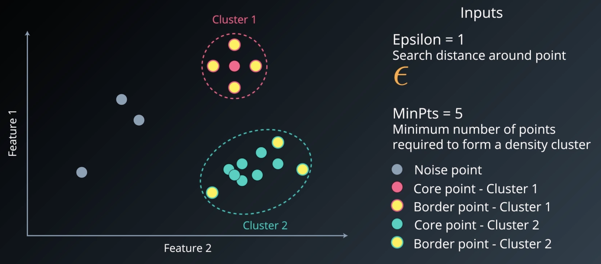

[Visualizing DBSCAN Clustering](https://www.naftaliharris.com/blog/visualizing-dbscan-clustering/)

[Paper on network traffic classification](https://pages.cpsc.ucalgary.ca/~mahanti/papers/clustering.pdf) <br>
[Paper on temperature anomaly detection](https://ieeexplore.ieee.org/abstract/document/5946052/)

### 3.6. DBSCAN with scikit learn

- Implementation

  ```python
  from sklearn import cluster

  # Specify DBSCAN parameters
  db = cluster.DBSCAN(eps = 0.5, min_samples = 5)
  db.fit(X)
  ```

- Cluster labels for each point in the data

  ```python
  db.labels_ # -1 represents noise
  ```

- Heuristics for experimenting with DBSCAN's parameters

  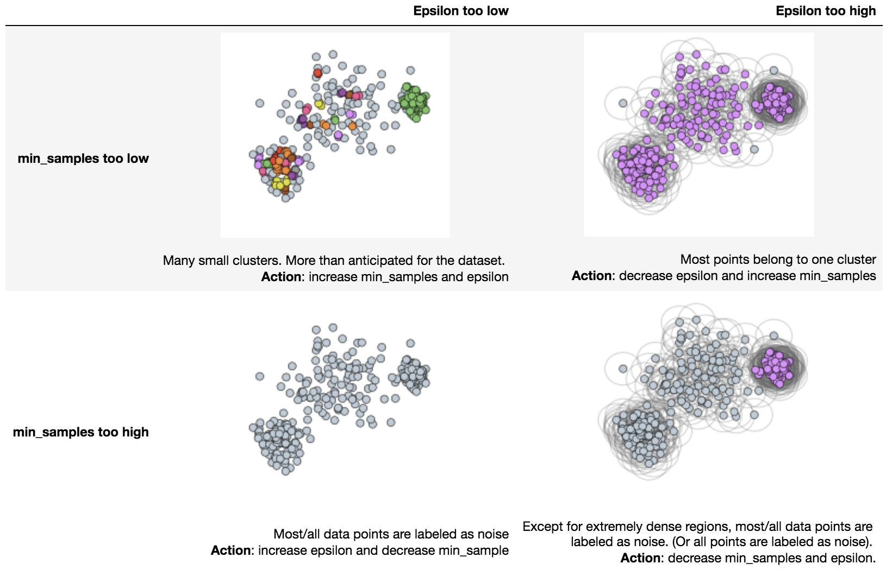

### 3.7. DBSCAN advantages and disadvantages

- (+) Powerful to deal with noise and outliers
- (+) No need to specify the number of clusters
- (+) Flexibility in the shape and size of the clusters
- (-) Border points that are reachable from two clusters are assigned to whoever find them first, not guaranteed to return the exact same clustering (most data do not face this issue)
- (-) Faces difficulty finding clusters of varying densities (can use HDBSCAN in this case)

## 4. Gaussian Mixture Model (GMM) Clustering and Cluster Validation

Assume each cluster follows a statistical distribution

### 4.1. GMM algorithm: expectation-maximization

1. Initialize k Gaussian distributions
    - Often using results of k-means clustering
2. Soft-cluster data - **"expectation"**
    - Calculate the probability that each point belongs to each cluster, aka., memberships <br>
      $E[Z_{iA}]=\frac{N(X_i|\mu_A, \sigma^2_A)}{N(X_i|\mu_A, \sigma^2_A) + N(X_i|\mu_B, \sigma^2_B)}$
3. Re-estimate the Gaussians based on soft clustering - **"maximization"**
    - Update Gaussian parameters using weighted averages of each membership <br>
      $\mu_A^{new}=\frac{\sum_{i=1}^N E[Z_{iA}]X_i}{\sum_{i=1}^N E[Z_{iA}]}$ <br>
      $\sigma_A^2=\frac{\sum_{i=1}^N E[Z_{iA}](X_i-\mu_A^{new})^2}{\sum_{i=1}^N E[Z_{iA}]}$
4. Evaluate log-likelihood to check for convergence, repeat from step 2 until converged
    - $ln(p(X|\mu, \sigma^2))=\sum_{i=1}^Nln(\sum_{k=1}^K \pi_kN(X_i|\mu_k, \sigma_k^2))$ higher value implies better clustering

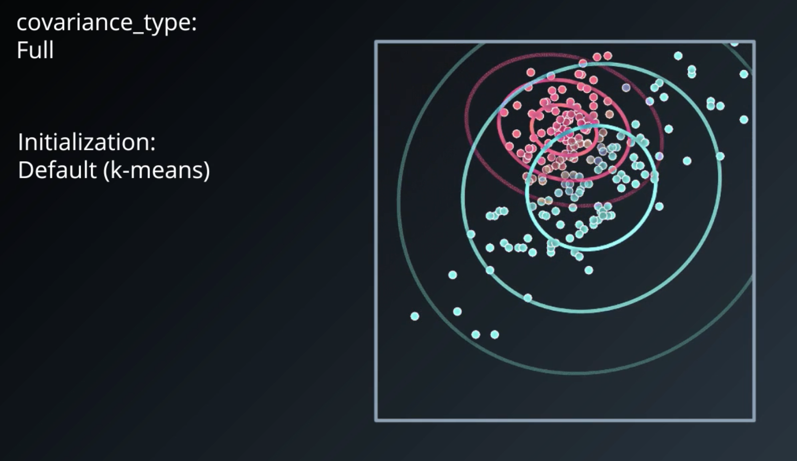

### 4.2. GMM with scikit learn

- Implementation

  ```python
  from sklearn import mixture
  gmm = mixture.GaussianMixture(n_components = 3)
  gmm.fit(X)
  clustering = gmm.predict(X)
  ```

### 4.3. GMM advantages and disadvantages

- (+) Soft-clustering (sample membership of multiple clusters)
- (+) Cluster shape flexibility
- (-) Sensitive to initialization values
- (-) Possible to converge to a local optimum
- (-) Slow convergence rate

### 4.4. GMM applications

- [Nonparametric discovery of human routines from sensor data](http://citeseerx.ist.psu.edu/viewdoc/download?doi=10.1.1.681.3152&rep=rep1&type=pdf)
- [Application of the Gaussian mixture model in pulsar astronomy](https://arxiv.org/abs/1205.6221)
- [Speaker Verification Using Adapted Gaussian Mixture Models](http://citeseerx.ist.psu.edu/viewdoc/download?doi=10.1.1.117.338&rep=rep1&type=pdf)
- [Adaptive background mixture models for real-time tracking](http://www.ai.mit.edu/projects/vsam/Publications/stauffer_cvpr98_track.pdf)

## 5. Cluster validation

Objectives

- Compactness: elements of a cluster are the most similar to each other
- Separability: the clusters are the most distinct from each other

### 5.1. Visualization

- [PairGrid](https://seaborn.pydata.org/generated/seaborn.PairGrid.html), plots every pair of features against each other in a subplot
- [t-SNE](http://scikit-learn.org/stable/modules/generated/sklearn.manifold.TSNE.html)
- [project into a lower number number dimensions using PCA](http://scikit-learn.org/stable/auto_examples/decomposition/plot_pca_iris.html#sphx-glr-auto-examples-decomposition-plot-pca-iris-py)

### 5.2. Cluster validation indices

- **External indices**, if data already labeled
- **Internal indices**, if data not labeled
- **Relative indices**, which of two clustering structure is better, most internal indices can be used here

#### 5.1.1. External validation indices

- Overview

  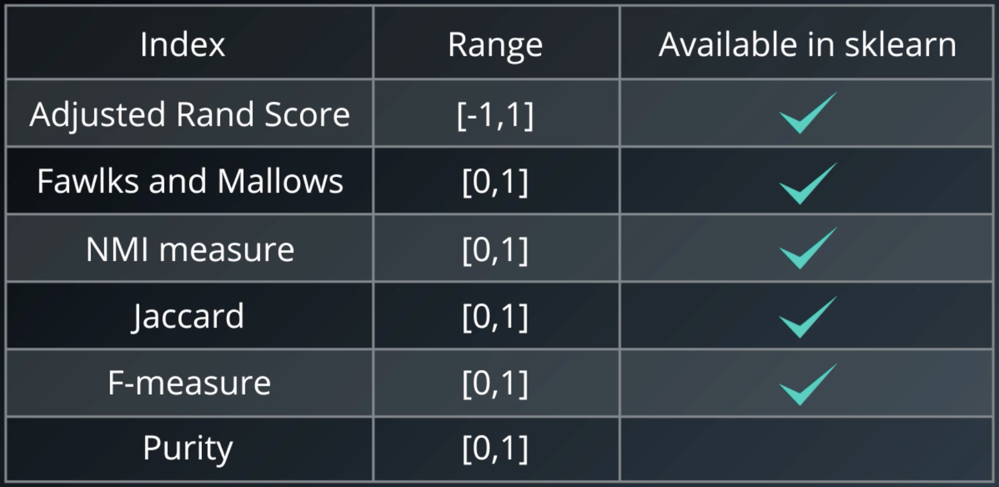

- Adjusted rand index

  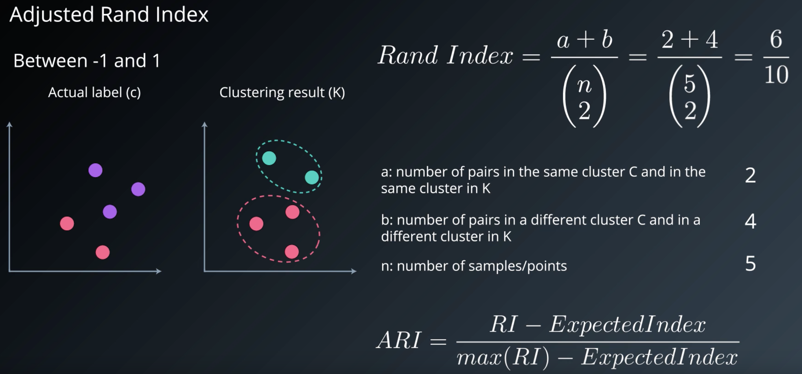 <br>
  [Details of the Adjusted Rand index](http://faculty.washington.edu/kayee/pca/supp.pdf)

  ```python
  from sklearn.metrics.cluster import adjusted_rand_score
  adjusted_rand_score(labels_true, labels_pred)
  ```

#### 5.1.2. Internal validation indices

- Overview

  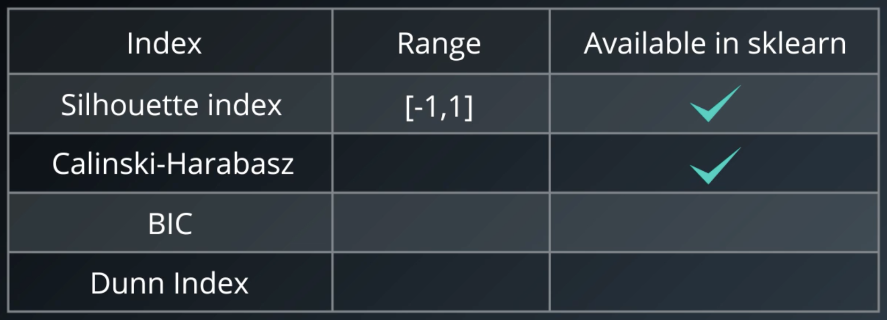

- Silhouette index

  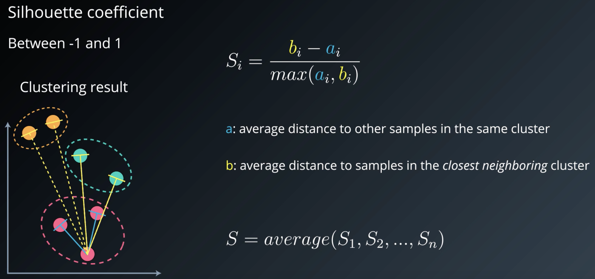 <br>
  
  - (+) Can be used to find K <br>
  - (+) Can be used to compare different clustering algorithm results
  - (-) Silhouette does not work well for DBSCAN because it does not have a concept of noise
  - (-) Not built to reward carving out dataset, e.g. concentric circles

- Within groups sum of squares

- Density-Based Clustering Validation

  - [Density-Based Clustering Validation](http://citeseerx.ist.psu.edu/viewdoc/download;jsessionid=83C3BD5E078B1444CB26E243975507E1?doi=10.1.1.707.9034&rep=rep1&type=pdf)
  - Works for DBSCAN

## 5. Principal Component Analysis (PCA)

### 5.1. How PCA works

Combine the features in some way to maximize the amount of information we retain. Explanation in layman term ([here](https://stats.stackexchange.com/questions/2691/making-sense-of-principal-component-analysis-eigenvectors-eigenvalues)).


- Terminology
  - **Latent features** are new features that encompasses many original features in the dataset.
  - **Principal components** are linear combinations of the original features in a dataset that aim to retain the most information in the original data.
  - You can think of a principal component in the same way that you think about a latent feature.
  - An **eigenvalue** is the same as the amount of variability captured by a principal component, and an **eigenvector** is the principal component itself. ([intro to math of PCA](http://www.cs.otago.ac.nz/cosc453/student_tutorials/principal_components.pdf), [PCA example in python](https://sebastianraschka.com/Articles/2015_pca_in_3_steps.html), [PCA example in sklearn](http://scikit-learn.org/stable/auto_examples/applications/plot_face_recognition.html#sphx-glr-auto-examples-applications-plot-face-recognition-py))

- Properties of principal components
  - They retain the most amount of information in the dataset
  - They created components are orthogonal to one another

### 5.2. PCA with scikit learn

- Implementation

  ```python
  from sklearn.decomposition import PCA
  X = StandardScaler().fit_transform(data)
  pca = PCA(n_components) # the pca object created after fitting the data
  X_pca = pca.fit_transform(X) # the transformed X matrix with new number of components
  ```

  [Helper functions of fit_random_forest_classifier, do_pca, plot_components](Code/unsupervised_learning/pca_helper_functions.py)

### 5.3. PCA interpretation

- Plot % of variance explained by each component

  ```python
  def scree_plot(pca):
      '''
      Creates a scree plot associated with the principal components 
      
      INPUT: pca - the result of instantian of PCA in scikit learn
              
      OUTPUT:
              None
      '''
      num_components = len(pca.explained_variance_ratio_)
      ind = np.arange(num_components)
      vals = pca.explained_variance_ratio_
  
      plt.figure(figsize=(10, 6))
      ax = plt.subplot(111)
      cumvals = np.cumsum(vals)
      ax.bar(ind, vals)
      ax.plot(ind, cumvals)
      for i in range(num_components):
          ax.annotate(r"%s%%" % ((str(vals[i]*100)[:4])), (ind[i]+0.2, vals[i]), va="bottom", ha="center", fontsize=12)
  
      ax.xaxis.set_tick_params(width=0)
      ax.yaxis.set_tick_params(width=2, length=12)
  
      ax.set_xlabel("Principal Component")
      ax.set_ylabel("Variance Explained (%)")
      plt.title('Explained Variance Per Principal Component')
      
  scree_plot(pca)
  ```

  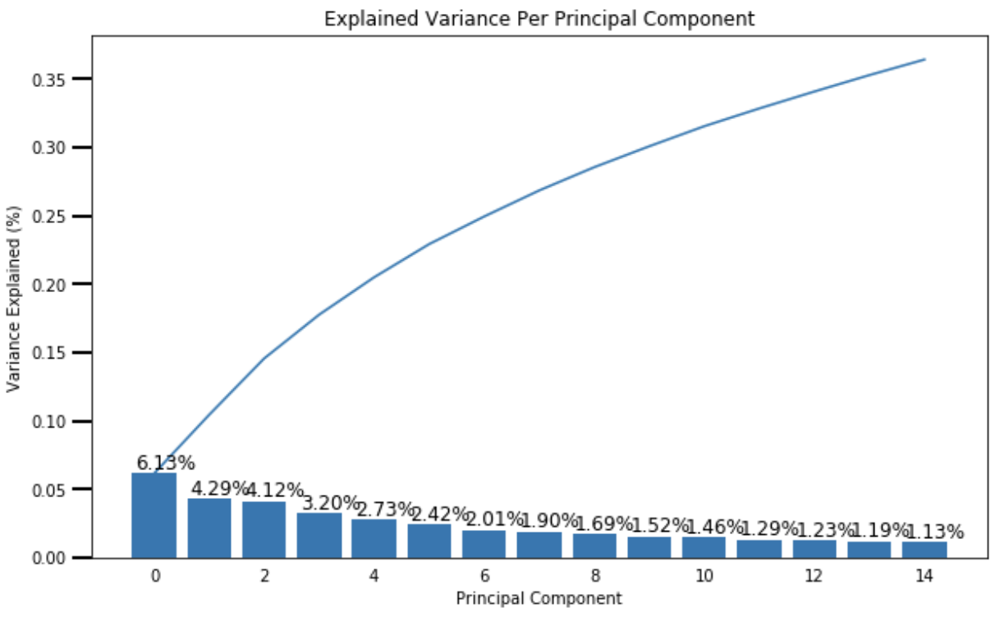

- Plot each component

  ```python
  def plot_component(pca, comp):
    '''
    Plots an image associated with each component to understand how the weighting 
    of the components 
    INPUT: 
          pca - pca object created from PCA in sklearn
          comp - int - the component you want to see starting at 0
    OUTPUT
          None
    '''
    if comp <= len(pca.components_):
        mat_data = np.asmatrix(pca.components_[comp]).reshape(28,28)  #reshape images
        plt.imshow(mat_data); #plot the data
        plt.xticks([]) #removes numbered labels on x-axis
        plt.yticks([]) #removes numbered labels on y-axis   
    else:
        print('That is not the right input, please read the docstring before continuing.')

  #Plot the first component
  plot_component(pca, 0)
  ```

  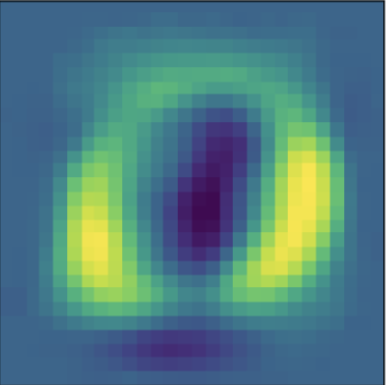

### 5.4. PCA applications

- Reduce dimensionality (e.g., [for microarray data](https://www.ncbi.nlm.nih.gov/pmc/articles/PMC2669932/), [for anomaly detection](https://arxiv.org/pdf/1801.01571.pdf), [for time series data](http://citeseerx.ist.psu.edu/viewdoc/download?doi=10.1.1.853.2380&rep=rep1&type=pdf))
- Find latent features that encapsulate other features into a single factor

## 6. Random Projection and Independent Component Analysis (ICA)

ICA can pull apart audio related to a piano, cello, and television that has been overlaid in the same file.

### 6.1. Random projection

A computationally simple method of dimensionality reduction (e.g. image and text data), while still preserving the similarities of data vectors to a high degree.

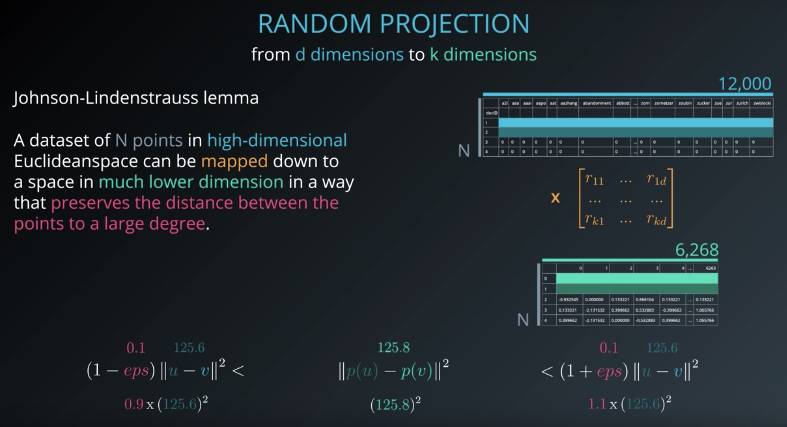
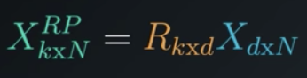

### 6.2. Random projection with sklearn

- Implementation

  ```python
  from sklearn import random_projection
  transformer = random_projection.SparseRandomProjection() # memory efficient and fast computation
  X_new = transformer.fit_transform(X)
  ```

### 6.3. ICA

- ICA assumes features are mixtures of independent sources, tries to isolate independent sources in the data.
- ICA solves "blind source isolation".

### 6.4. FastICA algorithm

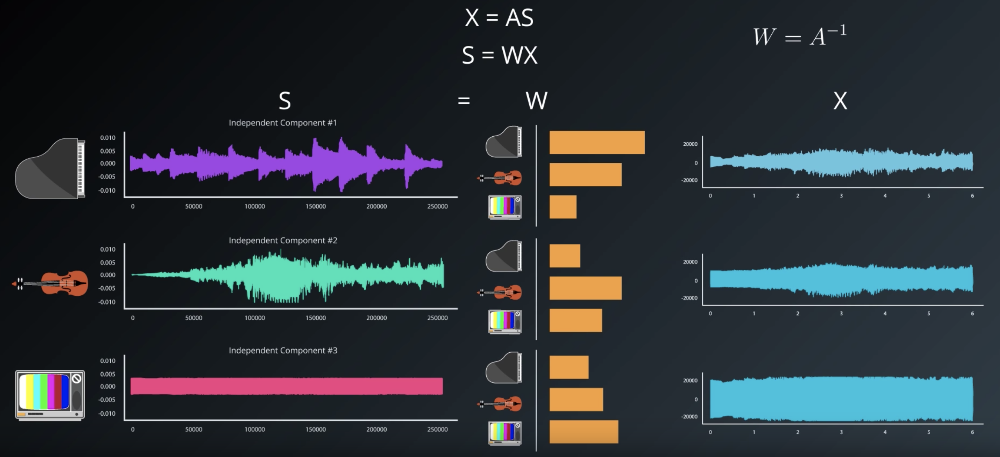 <br>
Paper: [Independent component analysis: algorithms and applications](http://citeseerx.ist.psu.edu/viewdoc/download?doi=10.1.1.322.679&rep=rep1&type=pdf)

Assumptions:

- Components are statistically independent
- Components have non-Gaussian distributions
- For ICA to be able to unmix the observations dataset, the number of observations has to be equal to, or more than the original independent sources

Steps
1. Center, whiten X
2. Choose initial random weight matrix W
3. Estimate W, containing vectors <br>
  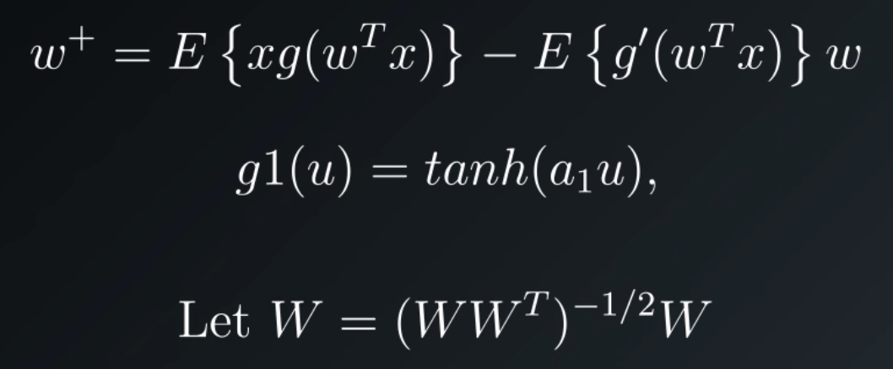 <br>
4. Decorrelate W
5. Repeat from step 3 until converged

### 6.5. ICA with sklearn

- Implementation

  ```python
  from sklearn.decomposition import FastICA
  
  # Each signal variable is an array, e.g. audio waveform
  X = list(zip(signal_1, signal_2, signal_3))

  ica = FastICA(n_components = 3)

  # components now contains independent components retrieved from ICA
  components = ica.fit_transform(X)
  ```

### 6.6. ICA applications

- Transform EEG medical scan data to do blind source separation ([paper](http://papers.nips.cc/paper/1091-independent-component-analysis-of-electroencephalographic-data.pdf))
- Stock data over time ([paper](https://pdfs.semanticscholar.org/a34b/e08a20eba7523600203a32abb026a8dd85a3.pdf))
- Cash flow of different retial stores