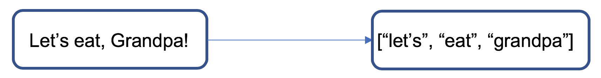
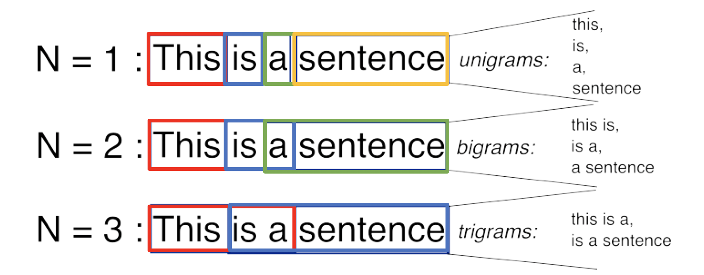
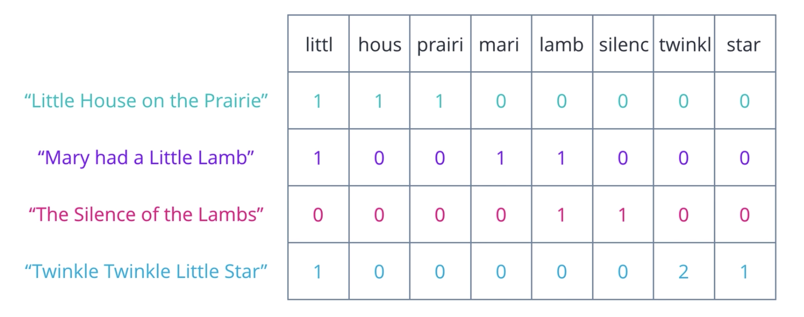
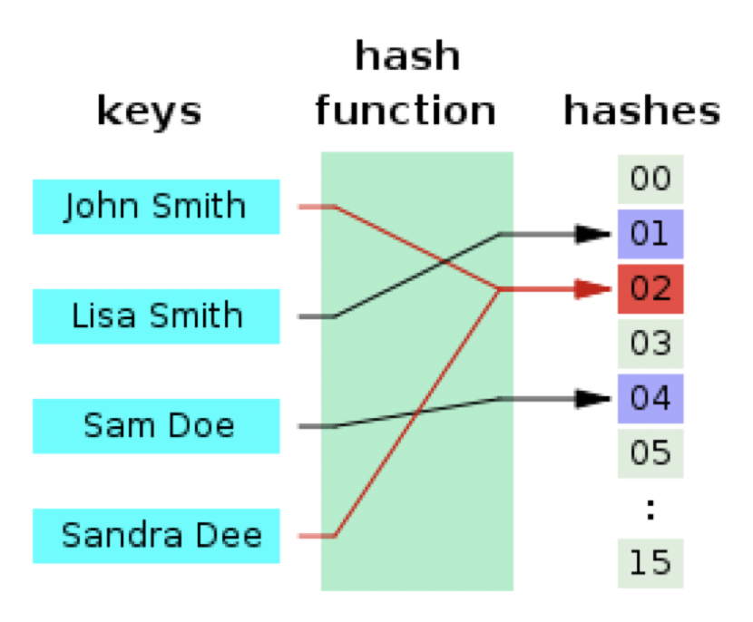
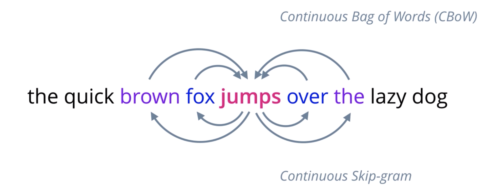
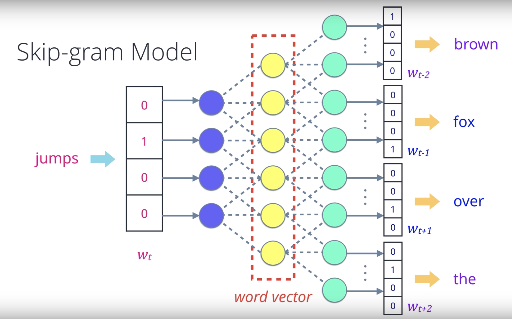
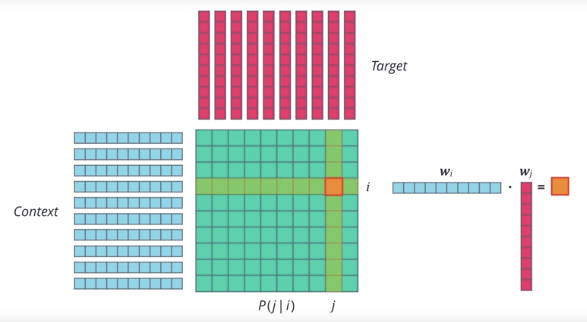
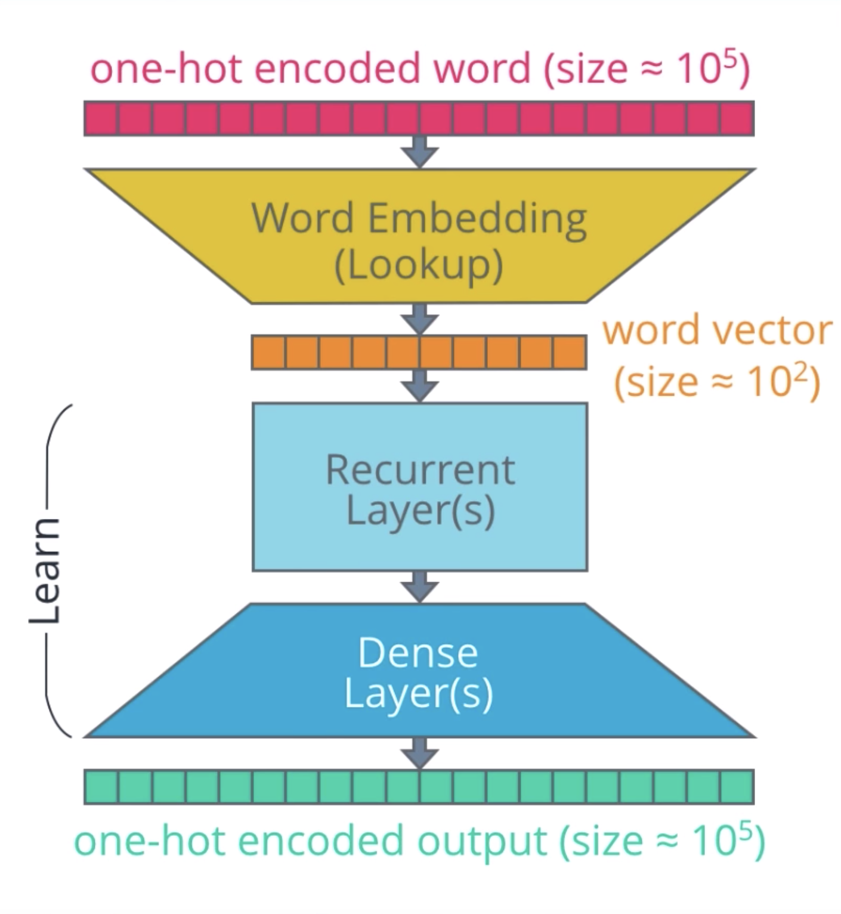
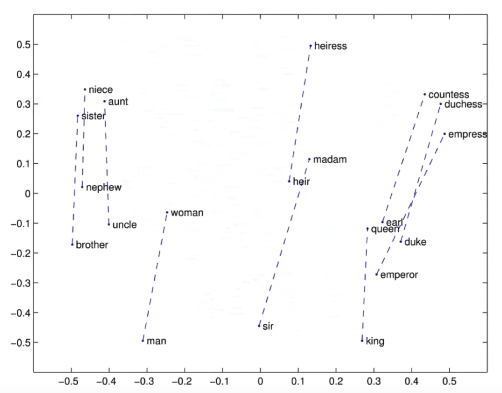

# Natural language processing (NLP)

<!-- TOC -->

- [Natural language processing (NLP)](#natural-language-processing-nlp)
  - [1. Text Processing](#1-text-processing)
    - [1.1. Text cleaning](#11-text-cleaning)
    - [1.2. Normalization, tokenization, and stop words removal](#12-normalization-tokenization-and-stop-words-removal)
    - [1.3. Part of speech tagging, named entity recognition, and conference resolution](#13-part-of-speech-tagging-named-entity-recognition-and-conference-resolution)
    - [1.4. Stemming and Lemmatization](#14-stemming-and-lemmatization)
  - [2. Feature Extraction](#2-feature-extraction)
    - [2.1. Bag of Words](#21-bag-of-words)
    - [2.2. TF-IDF](#22-tf-idf)
    - [2.3. Word Embeddings](#23-word-embeddings)
  - [3. Modeling](#3-modeling)

<!-- /TOC -->

## 1. Text Processing

Take raw input text, clean it, normalize it, and convert it into a form that is suitable for feature extraction. The goal is to (1) extract plain text that is free of any source specific markup or constructs that are not relevant to your task, and (2) to reduce complexity.

### 1.1. Text cleaning

- **Encoding check**

    Check encoding in order to work with and display everything, and to avoid losing some information as we move and analyze the data.

    ```python
    # Use chardet if cannot find encoding from formal means
    import chardet
    string_one = "What kind of funny business is this? 🤨"
    encoded_one = string_one.encode("utf-32")

    # Detect encoding
    print(chardet.detect(encoded_one)) # returns {'encoding': 'UTF-32', 'confidence': 1.0, 'language': ''}

    # Then decode
    encoded_one.decode("utf-32")
    ```

- **Foreign language detection**
  
    Know the language of each document, because the algorithms of quantitative approaches may not work with mixed-language corpora and we might not realize the results are rubbish for a long time.

    ```python
    # A library by Google
    import langdetect

    # Detect language
    langdetect.detect(string_one) # returns the ISO 639 code for the language
    ```

- **Cleaning non-text entity**

    Remove irrelevant items, such as HTML tags, url, metadata.

    ```python
    # Example to fetch html data
    import requests
    from bs4 import BeautifulSoup

    # Fetch web page
    response = requests.get("https://www.udacity.com/courses/all")

    # Use BeautifulSoup to remove HTML tags
    soup = BeautifulSoup(response.text, 'lxml')

    # Find all course summaries
    summaries = soup.find_all('div', class_="course-summary-card")

    # Extract course title
    courses = []
    for summary in summaries:
        courses.append(summary.select_one("h4").text)
    ```

### 1.2. Normalization, tokenization, and stop words removal

- **Normalization**

    Convert to all lowercase and remove punctuation.

    ```python
    import re
    text = "Are the human people the ones who started the war? Is AI a bad thing?"

    # Normalize text
    text = re.sub(r"[^a-zA-Z0-9]", " ", text.lower())
    ```

- **Tokenization**

    Split text into words or tokens.

    

    **N-grams** is a group of n words appearing in sequence from a text.

    

    ```python
    # NLTK
    import nltk
    nltk.download('punkt')

    # Tokenize text
    words = nltk.word_tokenize(text)
    ```

    ```python
    # Spacy
    !{sys.executable} -m pip install spacy
    !{sys.executable} -m pip install https://github.com/huggingface/neuralcoref-models/releases/download/en_coref_md-3.0.0/en_coref_md-3.0.0.tar.gz
    import spacy

    # Load the trained model of the English language
    nlp = spacy.load('en_coref_md')

    # Perform neural net magics
    doc = nlp(text)

    # Tokenize text
    words = [token for token in doc]
    ```

- **Stop Word Removal**

    Remove words that are too common. **Stop words** are words that are useful for grammar and syntax, but don’t contain any important content.

    ```python
    # NLTK
    import nltk
    nltk.download('stopwords')

    # Remove stop words
    words = [word for word in words if word not in stopwords.words("english")]
    ```

    ```python
    # Spacy
    import spacy

    # Load the trained model of the English language
    nlp = spacy.load('en_coref_md')

    # Remove stop words
    stoplisted = [token for token in doc if token.text not in nlp.Defaults.stop_words]
    ```

### 1.3. Part of speech tagging, named entity recognition, and conference resolution

- **Part of Speech Tagging**
  
    Identify different parts of speech.

    ```python
    # NLTK
    from nltk import pos_tag
    text = "I always lie down to tell a lie."

    # Tag parts of speech
    pos_tag(word_tokenize(text))
    ```

    Outputs [('I', 'PRP'), ('always', 'RB'), ...]

    ```python
    # Spacy
    # Keep only nouns and verbs
    noun_verbs = [token.text for token in stoplisted if token.pos_ == "NOUN" or token.pos_ == "VERB"]
    ```

- **Named Entity Recognition**

    Identify named entities.

    ```python
    from nltk import ne_chunk
    text = "Antonio joined Udacity Inc. in California."

    # Recognize named entities in a tagged sentence
    ne_chunk(pos_tag(word_tokenize(text))) # need to tokenize and tag beforehand
    ```

    Outputs (S (PERSON Antonio/NNP) joined/VBD (ORGANIZATION Udacity/NNP Inc./NNP) ...)

- **Conference resolution**
  
    Identify the original reference of pronouns (she, he, it, that, her, him, etc).

    ```python
    # Spacy
    import spacy

    # Load the trained model of the English language
    nlp = spacy.load('en_coref_md')

    # Perform neural net magic
    test_doc = nlp(u"My brother lives in a basement apartment. He really loves it.")

    # Print the original reference of pronouns
    print("The coreferences are {}".format(test_doc._.coref_clusters))
    print("The new sentence is \"{}\"".format(test_doc._.coref_resolved))
    ```

### 1.4. Stemming and Lemmatization

- **Stemming and Lemmatization**
  
    Convert words into their dictionary forms. A **lemma** is the core stem of a concept and/or word. **Lemmatization** is the process of stripping a word down to its root word so that different forms of the word are identified as having the same significance in text analysis.

    ```python
    # NLTK
    from nltk.stem.porter import PorterStemmer
    from nltk.stem.wordnet import WordNetLemmatizer

    # Reduce words to their stems
    stemmed = [PorterStemmer().stem(w) for w in words]

    # Reduce words to their root forms
    lemmed = [WordNetLemmatizer().lemmatize(w) for w in words]

    # Lemmatize verbs by specifying pos
    lemmed = [WordNetLemmatizer().lemmatize(w, pos='v') for w in lemmed]
    ```

    ```python
    # Spacy
    import spacy

    # Load the trained model of the English language
    nlp = spacy.load('en_coref_md')

    # Perform neural net magics
    doc = nlp(text)

    # Put in the lemmas, except for pronoun because they don't really have lemmas
    resolved_doc = [token.lemma_  if token.lemma_ != "-PRON-" else token for token in doc]
    ```

## 2. Feature Extraction

Extract and produce feature representations that are appropriate for the type of NLP task you are trying to accomplish and the type of model you are planning to use.

Feature extraction depends on the goal

- Graphic model: symbolic nodes with relationship between them, e.g., WordNet
- Statistic model at document level: spam detection or sentiment analysis, use a per document representation, e.g., bag-of-words or doc2vec
- Statistic model at word or phrase level: text generation or machine translation, use a word level representation, e.g., word2vec or glove

### 2.1. Bag of Words

- **Bag of words**

    Document-term matrix<br>
    

    To compare similarity between 2 documents

    - Initialize a collection of documents

        ```python
        import re
        import nltk
        from nltk.corpus import stopwords
        from nltk.stem.wordnet import WordNetLemmatizer
        from nltk.tokenize import word_tokenize

        nltk.download('punkt')
        nltk.download('stopwords')
        nltk.download('wordnet')

        corpus = ["The first time you see The Second Renaissance it may look boring.",
                "Look at it at least twice and definitely watch part 2.",
                "It will change your view of the matrix.",
                "Are the human people the ones who started the war?",
                "Is AI a bad thing ?"]

        stop_words = stopwords.words("english")
        lemmatizer = WordNetLemmatizer()
        ```

    - Define tokenizer

        ```python
        def tokenize(text):
            # normalize case and remove punctuation
            text = re.sub(r"[^a-zA-Z0-9]", " ", text.lower())
            
            # tokenize text
            tokens = word_tokenize(text)
            
            # lemmatize andremove stop words
            tokens = [lemmatizer.lemmatize(word) for word in tokens if word not in stop_words]

            return tokens
        ```

    - Use defined tokenizer

        ```python
        from sklearn.feature_extraction.text import CountVectorizer

        # initialize count vectorizer object
        vect = CountVectorizer(tokenizer=tokenize)

        # get counts of each token (word) in text data
        X = vect.fit_transform(corpus)

        # convert sparse matrix to numpy array to view
        X.toarray() # outputs array([[0, 1, ...], ..., [...]]

        # view token vocabulary and counts
        vect.vocabulary_ # outputs {'first': 6, 'time': 20, ...}
        ```

- **Dot product**

    - Formula: <br>
        <a href="https://www.codecogs.com/eqnedit.php?latex=a\cdot&space;b&space;=&space;\sum&space;a_0b_0&space;&plus;&space;a_1b_1&space;&plus;&space;..." target="_blank"></a>
    - Higher value means more similar
    - (-) Only captures the portion of overlap and not affected by other values that are not in common, so very different pairs can have same value as identical pairs.
    - (-) Treats every word as being equally important

- **Cosine similarity**

    - Formula: <br>
        <a href="https://www.codecogs.com/eqnedit.php?latex=cos(\theta)&space;=&space;\frac{a\cdot&space;b}{\left&space;\|&space;a&space;\right&space;\|\cdot&space;\left&space;\|&space;b&space;\right&space;\|}" target="_blank"></a>
    - Values ranges between -1 (dissimilar) and 1 (most similar)
    - (-) Treats every word as being equally important

### 2.2. TF-IDF

Term Frequency – Inverse Document Frequency (TF-IDF) is a measure intended to reflect the relative importance of a word in a document.

- **TF (Term Frequency)**
  
    - Commonly used definition: The count of the term *t* in a document *d*, divided by the total number of terms in the document
        
        <a href="https://www.codecogs.com/eqnedit.php?latex=\frac{count(t,&space;d)}{|d|}" target="_blank"></a>

        TF uses a “bag of words” approach, where each document is represented by a “bag of words” where grammar and word order are disregarded but multiplicity is kept.

    - `CountVectorizer`: Convert a collection of text to vectors of token counts
    - `HashingTF`: Hashing is the process of transforming data of arbitrary size to a fixed size. Each word is input in a hash function to give it a number. The same words result in the same hash ID. Each hash is counted returning the term frequency for each word

        

- **IDF (Inverse Document Frequency)**
  
    - Commonly used definition: Logarithm of the total number of the total number of documents in the colection *D* divided by the number of documents where *t* is present.

        <a href="https://www.codecogs.com/eqnedit.php?latex=log&space;\frac{|D|}{|{d\in&space;D&space;:&space;t\in&space;d}|}" target="_blank"></a>, aka.,

        <a href="https://www.codecogs.com/eqnedit.php?latex=log&space;\frac{total\&space;number\&space;of\&space;documents}{number\&space;of\&space;documents\&space;containing\&space;target\&space;word}" target="_blank"></a>

        the more documents that include the term the the lower the IDF score

    - `IDFModel`: Scales each column based on feature vectors which decreases weights on words found in multiple documents

- **TF-IDF**

    - The product of TF and IDF

        <a href="https://www.codecogs.com/eqnedit.php?latex=tf(t,&space;d)\cdot&space;idf(t,&space;D)" target="_blank"></a>

    - TF-IDF using bag of words results

        ```python
        from sklearn.feature_extraction.text import TfidfTransformer

        # initialize tf-idf transformer object
        transformer = TfidfTransformer(smooth_idf=False)

        # use counts from count vectorizer results to compute tf-idf values
        tfidf = transformer.fit_transform(X)

        # convert sparse matrix to numpy array to view
        tfidf.toarray()
        ```

    - TF-IDF

        ```python
        from sklearn.feature_extraction.text import TfidfVectorizer

        # initialize tf-idf vectorizer object
        vectorizer = TfidfVectorizer()

        # compute bag of word counts and tf-idf values
        X = vectorizer.fit_transform(corpus)

        # convert sparse matrix to numpy array to view
        X.toarray()
        ```

### 2.3. Word Embeddings

To control the size of the word representation, find an embedding for each word in some vector space and exhibit some desired properties. Embedding can be used for different purposes, e.g., find synonyms and analogies, identify concepts along which words are clustered, classifying words as +, -, or neutral.

- **Word2Vec**

    Word2vec is a combination of two techniques. Both of these are shallow neural networks which map word(s) to the target variable which is also a word(s). Both of these techniques learn weights which act as word vector representations.

    

    - Continuous bag of words (CBOW)

        CBOW predicts the probability of a word given a context. A context may be a single word or a group of words.

    - Skip-gram model

        Skip-gram model predicts the context given a word.

        

    - Word2Vec properties

        - (+) Robust, distributed representation
        - (+) Vector size independent of vocab
        - (+) Train one, store in lookup table
        - (+) Deep learning ready

- **GloVe**

    Global vectors for word representation (GloVe) learns vector representations for words by doing dimensionality reduction on the co-occurrence counts matrix. A large matrix of (context x words) co-occurrence information was constructed, i.e. for each "word" (the column), the probability to see this word in some "context" (the rows) in a large corpus.

    

    - (+) Compared to Word2Vec, easier to parallelize the implementation which means it's easier to train over more data.

- **Embeddings for deep learning**

    Can use embedding lookup (transfer learning)

    

- **t-SNE for visualizing word embedding**

    t-distributed stochastic neighbor embedding (t-SNE) is a dimensionality reduction technique to map higher dimensional vectors into lower dimensional space, while maintaining relative distances between objects.s

    

## 3. Modeling

Design a statistical or machine learning model, fit its parameters to training data, use an optimization procedure, and then use it to make predictions about unseen data.
