# **Python visualization**

    %matplotlib inline
    import matplotlib.pyplot as plt
    import matplotlib as mpl
    import matplotlib.cm as cm

 

# 1. Create a fully-customizable figure
* ### Change the baseline font
        mpl.rcParams['font.family'] = 'sans-serif'
        mpl.rcParams['font.sans-serif'] = ['Arial']

* ### Create the figure
        fig = plt.figure(figsize = (5, 4))
        ax = fig.add_subplot(1, 1, 1)
        ax.plot([1, 2, 3, 4], [1, 4, 9, 16], color = 'steelblue', linewidth = 3, marker = 'o', markersize = 10, label = "Quadratic") # add a label to the dataset that will go into a legend

* ### Label axes
        font_size = 15
        ax.set_xlabel("x", fontsize = font_size) # or LaTeX: "$x$"
        ax.set_ylabel("f(x)", fontsize = font_size) # or LaTeX: "$f(x)$"

* ### Display legend
        ax.legend(loc='best', frameon=False, fontsize = font_size, markerscale = 1.2) 

* ### Add a figure label
        ax.text(1, 25, "(A)", fontsize = font_size)

* ### Turn off the spines
        for axis in ['bottom','left']:
            ax.spines[axis].set_linewidth(2)
            ax.spines[axis].set_position(("axes", -0.01))
        for axis in ['top','right']:
            ax.spines[axis].set_visible(False)

* ### Also need to turn off the ticks on the axes that we turned off
        ax.yaxis.set_ticks_position('left')
        ax.xaxis.set_ticks_position('bottom')

* ### Change the y-scale to log
        ax.set_yscale('log')

* ### Set axes ranges
        ax.set_ylim(1, 20)

* ### Set tick label size
        plt.tick_params(labelsize=14)

* ### Add title of figure
        fig.suptitle('Overall title', fontsize=font_size)
        ax.set_title('Axis title', fontsize=font_size)

* ### Save the figure
        plt.savefig('quadratic_logscale_half_frame.png', bbox_inches="tight", dpi = 300)

    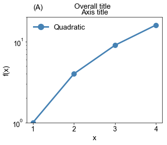

# 2. Quick plots
* ### Change the default plot style
        with plt.style.context('ggplot'):
            fig = plt.figure( figsize = (6, 4) )
            ax = fig.add_subplot(1,1,1, facecolor = 'orange') # change background color
            
            # We should add a label to our dataset that will go into a legend
            ax.plot(x, y, label = "Quadratic", color = 'steelblue', linewidth = 3)
            
            # Now we can label the axes. Always label your axes! Who knows what is in the graph otherwise
            ax.set_xlabel("$x$", fontsize = font_size)
            ax.set_ylabel("$f(x)$", fontsize = font_size)
            
            ### Set tick label size
            plt.tick_params(labelsize=14)

            # Display legend
            ax.legend(loc='best', frameon=False, fontsize = font_size-1)
    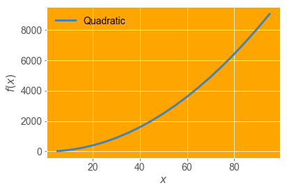

# 3. Different plot types
* ### Documentation
    * `Matplotlib` enables us to make `scatter`, `bar`, `histogram`, `heatmaps`, `box plots`, and `violin` plots. 

    * Simple examples of all of these types at the Matplotlib Gallery [page](http://matplotlib.org/gallery.html).

* ### Histogram
        fig = plt.figure( figsize = (6, 4.5))
        ax = fig.add_subplot(1, 1, 1)

        ax.hist(gpas, bins = 20, color = 'steelblue') # or bins = [0, 2, 3, 4]
        ax.set_xlabel('GPA', fontsize = font_size)
        ax.set_ylabel('Count', fontsize = font_size)
        plt.tick_params(labelsize=12)
    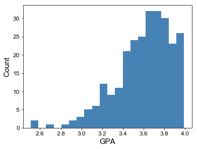

* ### Histogram as pdf
        fig = plt.figure( figsize = (6, 4.5))
        ax = fig.add_subplot(1, 1, 1)

        ax.hist(gpas, bins = 20, normed = True, color = 'steelblue')
        ax.set_xlabel('GPA', fontsize = font_size)
        ax.set_ylabel('pdf', fontsize = font_size)
        plt.tick_params(labelsize=12)
    

* ### Bar charts
        locations = ['bar', 'grocery store', 'rent', 'clothing', 'solo cups']
        young_spending = [100, 5, 80, 5, 60]
        old_spending = [10, 100, 75, 55, 10]

        fig = plt.figure( figsize = (6, 4))
        ax = plt.subplot(1, 1, 1)

        #For a bar chart we need to create a dummy set of x-data.
        #It's easiest to just use the `range()` function on the number of groups
        num_categories = len(locations)
        x_positions = range(num_categories)
        offset = 0.3 # offset so the bars don't stack on each other

        #Now we can add the 18-24yo
        ax.bar(x_positions, young_spending, offset, label='18-24yo', color='steelblue')

        #Then the 25-29yo
        old_xpos = [x_pos + offset +.01 for x_pos in x_positions]
        ax.bar(old_xpos, old_spending, offset, label='25-29yo', color='limegreen')

        #Label it
        ax.set_ylabel('Spending (\$)')
        plt.legend(loc = 'best', fontsize = font_size)

        #Axis labels
        ax.set_xticks([x_pos + offset for x_pos in x_positions])
        ax.set_xticklabels( [label.capitalize() for label in locations], rotation=90, fontsize = font_size)
        ax.set_ylabel('pdf', fontsize = font_size)
        plt.tick_params(labelsize=font_size)
    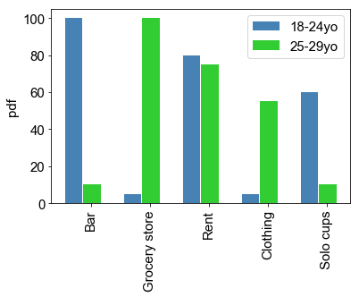

* ### Scatter plot
    * Show market size with marker size  
* 
        market_size = [200, 100, 400, 20, 50]

        fig = plt.figure(figsize = (5,5))
        ax = fig.add_subplot(1, 1, 1)

        #We add in the x-data points and then the y-data points
        ax.scatter(young_spending, old_spending, s=market_size, color='orange') # or s=5

        #Labels....
        ax.set_xlabel('18-24yo Spending (\$)', fontsize = font_size)
        ax.set_ylabel('25-29yo Spending (\$)', fontsize = font_size)
        plt.tick_params(labelsize=font_size-2)
    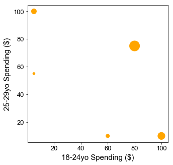

    * Show market size with marker color. Mainly three types of color maps: 
        * Sequential  
        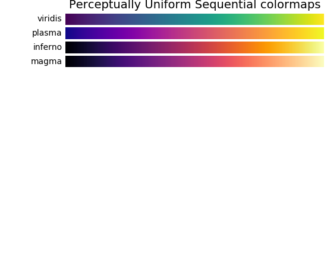
        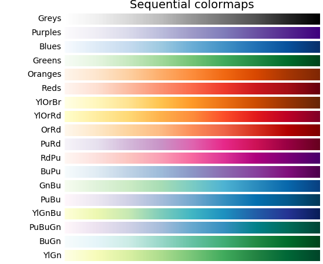
        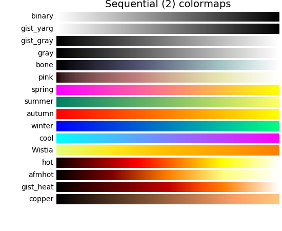
        * Diverging  
        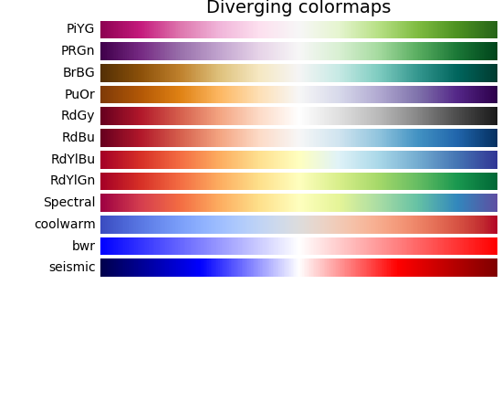
        * Qualitative  
        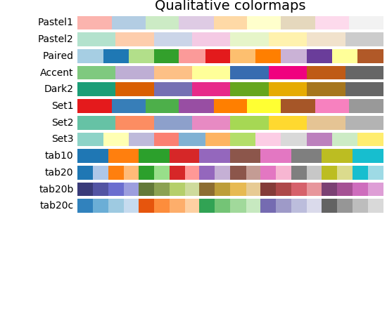
* 
        #We get our colormap here
        cm = plt.cm.get_cmap('PuBu')

        #Figure code
        fig = plt.figure(figsize = (5,5))
        ax = fig.add_subplot(1, 1, 1)

        #We add in the x-data points and then the y-data points
        #The scatter function returns itself, we put it into a variable and then feed it into the colorbar function
        sc = ax.scatter(young_spending, old_spending, s=100, c=market_size, cmap=cm, vmin=0, vmax=1000)

        #Labels....
        ax.set_xlabel('18-24yo Spending (\$)', fontsize = font_size)
        ax.set_ylabel('25-29yo Spending (\$)', fontsize = font_size)
        plt.tick_params(labelsize=font_size-2)

        #loop to label data points
        offset = 3
        for index in range(len(locations)):
            print( locations[index], young_spending[index], old_spending[index] )
            plt.text(young_spending[index] + offset, old_spending[index] + offset, \
                    locations[index].capitalize())
            
        #plt.text(60, 60, 'Grocery', fontsize = 32)

        #Adding a colorbar
        cbar = plt.colorbar(sc)

        #You need to add a label to the color bar too
        cbar.set_label('Market Size (\$Millions)', fontsize = font_size)
    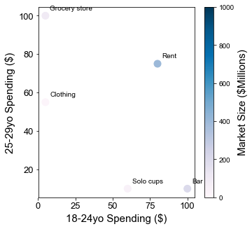

