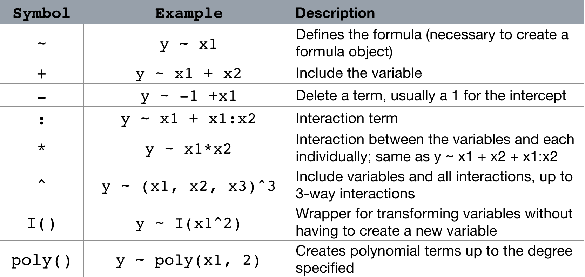
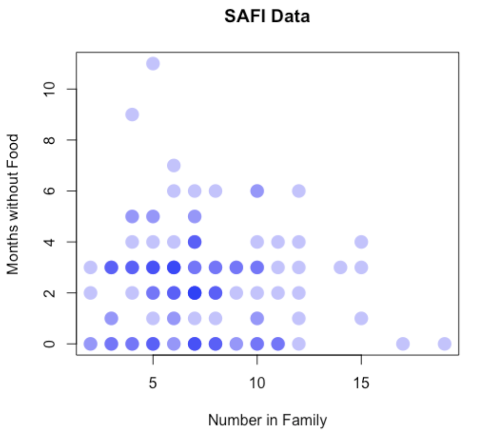
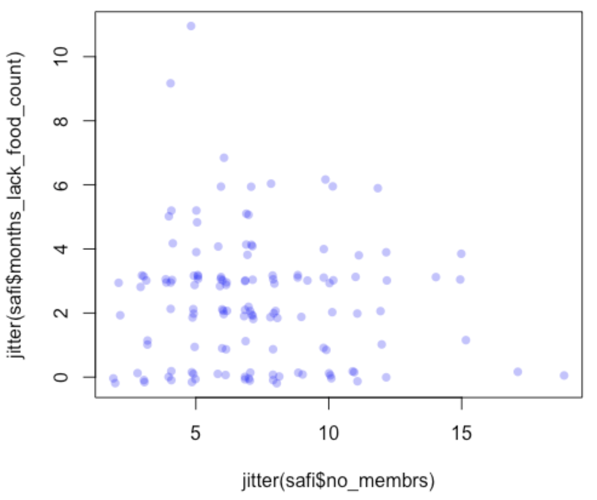
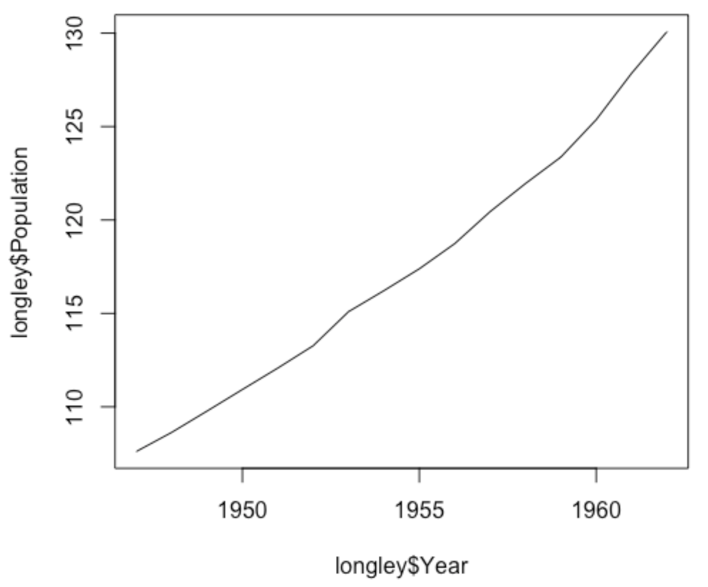
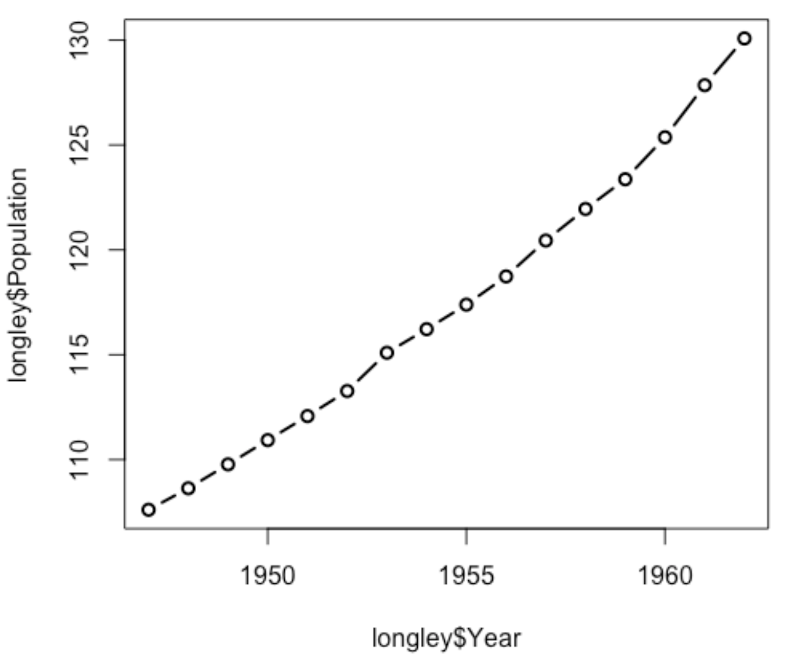
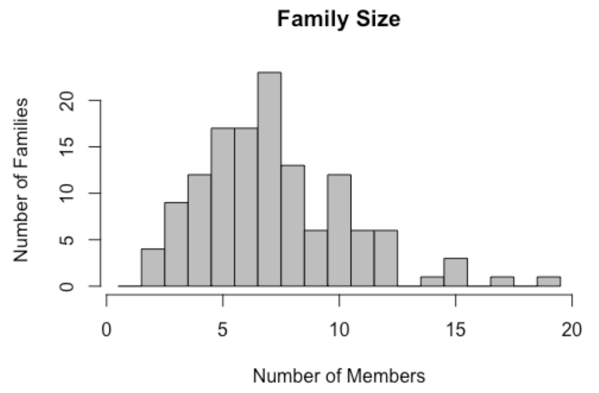
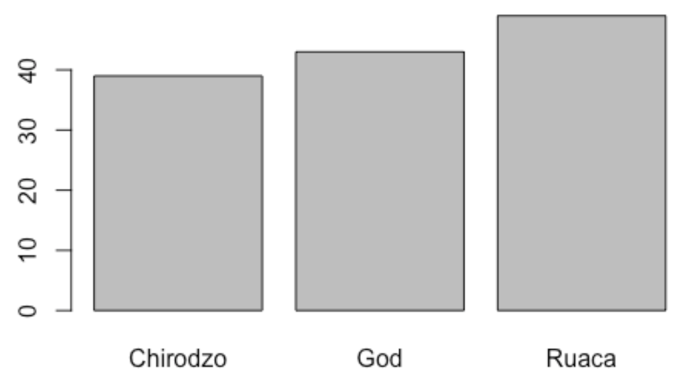
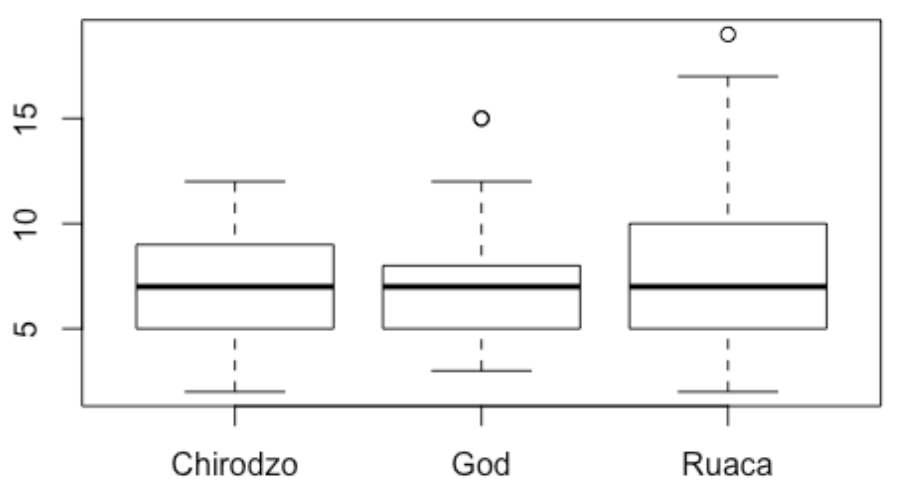

# R notes

Notes taken from R workshop held by Christina Maimone

RStudio is an IDE <br>
IDE: integrated development environment

* Assign operator: `<-`

* Install packages

    `install.packages("tidyverse")` <br>
    `install.packages(c("tidyverse", "car"))`

<!-- TOC -->

- [R notes](#r-notes)
    - [1. Data types](#1-data-types)
    - [2. Data structures](#2-data-structures)
    - [3. File I/O](#3-file-io)
    - [4. Data manipulation functions](#4-data-manipulation-functions)
    - [5. Statistics](#5-statistics)
    - [6. Visualization](#6-visualization)
    - [7. Functions, Loops, and Conditionals](#7-functions-loops-and-conditionals)

<!-- /TOC -->

## 1. Data types

Use `typeof()` to check type

* logical (`TRUE`, `FALSE`)
* integer
* numeric or double
* complex
* character (use `paste()` to concatenate)
* vectors

    Only have one type of data <br>
    Cannot be nested

    * Assignment

        `x <- 1:5` <br>
        `x <- c(1, 2, 3)` <br>
        named vector: `names(x) <- c('first', 'second', 'third')`

    * Operations

        element-wise: `x + 1`, `x * x` <br>
        add element: `x <- c(x, 10, 11)`

    * Indexing

        `x[1]`, `x[1:3]`, `x[c(3,2,1)]` <br>
        `x[-1]` all excluding the first one <br>
        `x[x < 'c']` <br>
        `x["first"]`, `x["third", "first"]`

    * Finding values in a vector

        `"b" %in% x` --- TRUE <br>
        `match(c('b', 'd', 'k'), x)` --- 2, 4, NA <br>
        `which(x == 'b')` --- 2, gives index positions <br>
        `which.max(x)` --- gives index position, but only the first

    * Vector length

        `length(x)`

* Missing data `NA`

    `counts <- c(1, 2, NA)` <br>
    `is.na(counts)` <br>
    `mean(counts, na.rm=True)` <br>

    `animals <- c("cow", "pig", "pig", NA)` <br>
    `table(animals, useNA="ifany")` table of value counts

* Other special values

    `NULL`, `NaN`, `Inf`

* Factors

    Categorical, stored as integer, values restricted to `levels` <br>
    [demo](demo/factors.R)

    Convert back <br/>
    `as.character(as.numeric(...))`

    Convert to <br>
    `factor(..., ordered=TRUE, levels=c('never', 'sometimes', 'always'))`

## 2. Data structures

* Matrix

    `%*%` multiplication <br>
    `t()` transpose <br>
    `solve()` inverse <br>
    https://www.statmethods.net/advstats/matrix.html

* List

    Dataframe is a type of list

    * Create a list

        ```r
        mylist <- list(title = "Research Bazaar", 
               numbers = 1:10, data = TRUE )
        ```

        ```r
        mylist <- list("Research Bazaar", 
               1:10, TRUE )
        ```

    * Indexing

        `mylist$numbers` <br>
        `mylist[2]` returns list <br>
        `mylist[[2]]` returns vector <br>
        `mylist[[2]][3]` <br>

* Data Frames

    * Create a dataframe

        ```r
        x <- data.frame(month=month.name,
                index=1:12,
                days=c(31,28,31,30,31,30,31,31,30,31,30,31))
        ```

    * Data Frame information

        `str(df)` general information <br>
        `summary(df)` simple statistics <br>
        `names(df)` column names <br>
        `dim(df)` <br>
        `ncol(df)` <br>
        `head(df)` <br>
        `tail(df)` <br>
        `View(df)`

    * Data Frame indexing and slicing

        df[row, column] <br>
        `df[nrow(df):1,]` everything, with rows in reverse order <br>
        `df[df[,1] < 5,]` rows where the value in the first column is less than 5 <br>
        `iris$Species` Species column, as a vector <br>
        `df[, c('Species')]` <br>
        `df[df$Species %in% c("setosa", "virginica"),] `

    * Modify dataframe

        * Modify column names

            `names(df) <- c("col1","col2", "col3","col4","col5")` 

        * Add columns

            `cbind(iris, index=c(1:nrow(iris)))` <br>
            `safi$small_family <- safi$no_membrs < 4` 
        
            `safi <- cbind(safi, small_family = safi$no_membrs < 4)` <br>
            `cbind` can be used with multiple columns or even data frames (need same number of rows)

        * Drop columns

            `safi <- safi[,-match("instanceID", names(safi))]` data without column `instanceID` <br>
            `safi <- safi[, !names(safi) %in% c("instanceID","affect_conflicts")]` data without columns `instanceID` and `affect_conflicts`

        * Recode variables

            ```r
            library(car)
            africa$country <- recode(africa$country, 
                "'Congo, Dem. Rep.'='DRC'; 'Congo, Rep.'='Congo'") 
            ```

    * Subset

        Subset for selecting rows or columns

        ```r
        subset(data.frame, 
            subset=condition for rows to keep,
            select=columns to keep)
        ```
        ```r
        subset(safi, 
            subset=village=="God",
            select=c(village, years_liv, rooms))
        ```

        `subset(safi, select=-instanceID)`

## 3. File I/O

* Read csv

    ```r
    read.csv(file, header = TRUE, sep = ",", quote = "\"",
            dec = ".", fill = TRUE, comment.char = "", stringAsFactors=FALSE)
    ```

    Consider using `readr` package that creates a `tibble`, which is a modified data frame

    There are packages to read all kinds of data files

* Write csv

    ```r
    write.csv(mtcars, 
          file="output/mtcars.csv", 
          row.names=FALSE)
    ```

## 4. Data manipulation functions

* Date

    `as.Date()` defaults to year, month, date

    * "%Y-%m-%d" or "%Y/%m/%d"
    * Can specify other patterns

    `lubridate` package

    * ymd(20101215), ymd_hms(), dmy(), dmy_hms(), mdy("4/1/17"),...
    * Get and set components from `Date`: `year()`, `month()`, `wday()`, `mday()`, `hour()`,…

        `bday <- dmy("14/10/1979")` <br>
        `month(bday)` <br>
        `wday(bday, label = TRUE)` <br>

* Sorting

    * Sort
    
        `x <- c(3,6,2,3)` <br>
        `sort(x)` <br>
        `sort(x, decreasing=TRUE)` <br>

    * Order

        `order(x)` gives index positions <br>
        `x[order(x)]` <br>
        `order(x, decreasing=TRUE)` <br>

    Applied in dataframe: <br>
    `df[order(safi$no_membrs, safi$years_liv), c("no_membrs", "village", "years_liv")]`

* Table

    `animals <- c("cow", "pig", "pig", NA)` <br>
    `table(animals, useNA="ifany")` table of value counts

    `tmp <- table(safi$village, safi$respondent_wall_type)` <br>
    `tmp["God", "muddaub"]` query from the table

    `prop.table(table(safi$village, safi$respondent_wall_type), 1)`

* Aggregating

    Group by

    `aggregate(africa$pop_2017, by=list(africa$region), FUN=mean, na.rm=TRUE)` <br>
    `aggregate(africa$pop_2017, by=list(region=africa$region), FUN=mean, na.rm=TRUE)` name the output column name

* Apply

    * apply(X, MARGIN, FUN, ...)

        MARGIN=1 applies function over each row<br>
        MARGIN=2 applies function over each column

        `apply(africa[,-1:-2], 2, mean, na.rm=TRUE)` <br>
        `apply(month_indicators, 1, sum)`

    * tapply(X, INDEX, FUN = NULL, …)

        `tapply` is very similar to aggregate <br>
        `tapply(africa$pop_2017, africa$region, mean)`

## 5. Statistics

* Basic statistics

    mean(x) <br>
    median(x) <br>
    cor(x, y)
    * cor(africa[,-1:-2])
    * cor(africa[,-1:-2], use="pairwise")

    var(x) <br>
    sd(x) <br>

* T-test

    Welch Two Sample t-test

    ```r
    t1 <- t.test(safi$months_lack_food_count[safi$village == "Chirodzo"],
                safi$months_lack_food_count[safi$village == "Ruaca"])
    ```

    `names(t1)` lists everything can get back from the test

    * `t1$statistic`
    * `t1$p.value`

* Linear Regression

    General format: <br>
    lm(y ~ x1 + x2, data=data_frame_name)

    * Intercept (constant) term gets added
    * Don't need to quote or prefix column names
    * Add -1 to formula if don't need the intercept

    ```r
    africa <- read.csv("data/africadata.csv")
    reg1 <- lm(road ~ pop_2017 + gdp_2017, data=africa)
    summary(reg1)
    ```

    `names(reg1)` lists everything can get back from the regression <br>
    `names(summary(reg1))` lists everything can get back from the regression summary

    Prediction: <br>
    `predict(reg1, africa)`

    

* Other regression models

    * function glm: generalized linear models

        logit, probit
        poisson

    * packages nlme and lme4: non-linear mixed effects models

        random and fixed effects, hierarchical

    * Other specialized packages

    Refer to UCLA webpage

## 6. Visualization

* Base R

    No package required <br>
    Different functions for different types of plots

    * Scatter plot

        ```r
        plot(y=safi$months_lack_food_count, x=safi$no_membrs,
            xlab="Number in Family", ylab="Months without Food",
            main="SAFI Data", pch=16, col="red", cex=3,
            col=rgb(.1, 0, 1, alpha=.3)) 
        # pch: point character
        # cex: character size
        ```

        

    * Jittering Points: adds random noise to data

        ```r
        plot(y=jitter(safi$months_lack_food_count), 
            x=jitter(safi$no_membrs),
            col=rgb(.1, 0, 1, alpha=.3), pch=16)
        ```

        

    
    * Identifying Points
    
        ```r
        plot(y=safi$months_lack_food_count, x=safi$no_membrs) # make the plot
        identify(y=safi$months_lack_food_count, x=safi$no_membrs, 
                labels=safi$key_ID) # click on the points of interests in the plot
        # then labels will show in the plot
        ```
    
    * Line Plot

        ```r
        plot(x=longley$Year, y=longley$Population, type="l")
        ```

        

        ```r
        plot(x=longley$Year, y=longley$Population, lwd=2, type="b")
        # lwd: line width
        ```

        
    
    * Histogram

        ```r
        hist(safi$no_membrs, breaks=1:20-.5, col="gray",
            main="Family Size", xlab="Number of Members",
            ylab="Number of Families")
        # breaks: defines the bins, e.g., breaks=20
        ```

        

    * Bar plot

        `barplot(table(safi$village))`

        

    * Boxplot

        `boxplot(no_membrs~village, data=safi)` groups by `village`

        

* ggplot2

    Great for showing groups <br>
    Attractive defaults <br>
    Consistent procedure for all plots

* Other systems, specialized packages

## 7. Functions, Loops, and Conditionals

* Functions

    Syntax:

    ```r
    my_function <- function(x) {
        do something
        return()
    }
    ```
    
    Example:

    ```r
    increment <- function(a, step=1) {
        a_new <- a+step
        return(a_new)
    }
    ```

    Store and load the function in the working environment
    
    `source("my_functions.r")`

* If-Else statements

    Syntax:

    ```r
    if (condition) {
        do_something
    } else if (other_condition){
        do_something_else
    } else {
        do_default
    }
    ```

    Example:

    ```r
    if (age >= 21) {
        print("Cheers")
    } else if (age >= 18) {
        print("Please vote")
    } else {
        print("Not old enough")
    }
    ```

* Vectorized if-else statement: do many comparisons at once 

    Syntax:

    `ifelse(condition, value if TRUE, value if FALSE)`

    Example:

    ```r
    ages <- c(19, 22, 24, 20, 18, 17, 23, 24)
    status <- ifelse(ages >= 18, "adult", "minor") # returns a vector
    ```

* For loop

    Syntax:

    ```r
    for (variable in vector) {
        do something
    }
    ```

    Example 1:

    ```r
    price <- c(3, 5, 2, 4, 10)
    total <- 0
    for (p1 in price) {
        total <-  total + p1
    }
    ```

    Example 2:

    ```r
    output_vector <- c()
    for (i in 1:5) {
        for (j in c('a', 'b', 'c', 'd', 'e')) {
            temp_output <- paste(i, j)
            output_vector <- c(output_vector, temp_output)
        }
    }
    ```

* While loop

    Syntax:

    ```r
    while (condition is TRUE) {
        do something
    }
    ```

    Example:

    ```r
    z <- 1
    while(z > 0.1){
        z <- runif(1)
        print(z)
    }
    ```