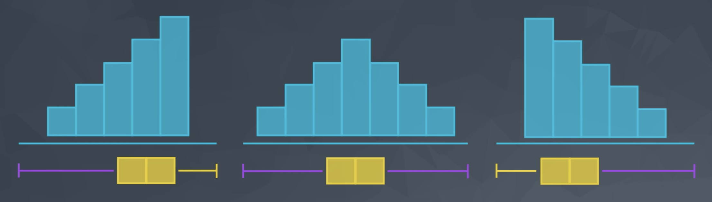
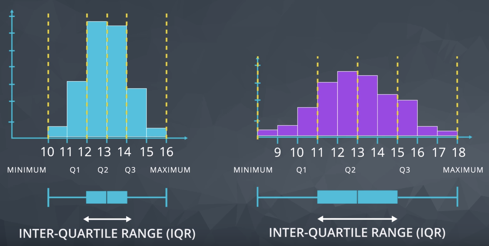

# Descriptive statistics

Descriptive statistics is about describing our collected data.

- [Descriptive statistics](#descriptive-statistics)
  - [1. Data types](#1-data-types)
    - [1.1. Data types](#11-data-types)
    - [1.2. Notation recap](#12-notation-recap)
  - [2. Analyzing quantitative data](#2-analyzing-quantitative-data)
    - [2.1. Measures of center](#21-measures-of-center)
    - [2.2. Measures of Spread](#22-measures-of-spread)
    - [2.3. The Shape of the data](#23-the-shape-of-the-data)
    - [2.4. Outliers](#24-outliers)
    - [2.5. Visualization](#25-visualization)
  - [3. Analyzing categorical data](#3-analyzing-categorical-data)
    - [3.1. The counts or proportion of individuals that fall into each group](#31-the-counts-or-proportion-of-individuals-that-fall-into-each-group)

## 1. Data types

### 1.1. Data types

* **Quantitative** data take on numeric values that allow us to perform mathematical operations (like the number of dogs).

  * **Continuous** data can be split into smaller and smaller units, and still a smaller unit exists. An example of this is the age of the dog - we can measure the units of the age in years, months, days, hours, seconds, but there are still smaller units that could be associated with the age.

  * **Discrete** data only takes on countable values. The number of dogs we interact with is an example of a discrete data type.

* **Categorical** data are used to label a group or set of items (like dog breeds - Collies, Labs, Poodles, etc.).

  * **Categorical Ordinal** data take on a ranked ordering (like a ranked interaction on a scale from Very Poor to Very Good with the dogs).

  * **Categorical Nominal** data do not have an order or ranking (like the breeds of the dog).

### 1.2. Notation recap

|Notation	| English	| Example|
|---|---|---|
|<a href="https://www.codecogs.com/eqnedit.php?latex=X" target="_blank"></a>|A random variable	|Time spent on website|
|<a href="https://www.codecogs.com/eqnedit.php?latex=x_1" target="_blank"></a>|First observed value of the random variable X|15 mins|
|<a href="https://www.codecogs.com/eqnedit.php?latex=\sum_{i=1}^n&space;x_i$" target="_blank"></a>|Sum values beginning at the first observation and ending at the last	|5 + 2 + 3|
|<a href="https://www.codecogs.com/eqnedit.php?latex=\frac{1}{n}\sum_{i=1}^n&space;x_i$" target="_blank"></a>|Sum values beginning at the first observation and ending at the last and divide by the number of observations (the mean)	|(5 + 2 + 3)/3|
|<a href="https://www.codecogs.com/eqnedit.php?latex=\overline{x}" target="_blank"></a>|Exactly the same as the above - the mean of our data|(5 + 2 + 3)/3|

## 2. Analyzing quantitative data

* Center
* Spread
* Shape
* Outlier

### 2.1. Measures of center

* Mean
* Median
* Mode

|   | pros | cons |
|---|---|---|
|mean| use all numbers, easy to understand |susceptible to outliers|
|median| robust to outliers | only reflects 1-2 values of the dataset|
|mode|good for nominal or categorical data, or multiple clusters|less meaningful in small dataset|

```python
from stats import mean, median, mode, multi_mode
```

### 2.2. Measures of Spread

* The 5 number summary
  * Minimum: The smallest number in the dataset.
  * Q1: The value such that 25% of the data fall below.
  * Q2: The value such that 50% of the data fall below.
  * Q3: The value such that 75% of the data fall below.
  * Maximum: The largest value in the dataset.
* Range
  * Range = Maximum - Minimum
* Interquartile range (IQR)
  * IQR = 3rd quartile - 1st quartile
  * IQR is an automatic way to identify outliers
    * lower outliers: Q1 - 1.5 * IQR
    * upper outliers: Q3 + 1.5 * IQR
* Variance: the average squared difference of each observation from the mean
  * (-) Susceptible to outliers
* Standard deviation: the average distance of each observation from the mean
  * (-) Susceptible to outliers
* Z-score: how far one value is from the mean
    * (-) Susceptible to outliers
* Important notes
  * The variance is used to compare the spread of two different groups. A set of data with higher variance is more spread out than a dataset with lower variance. Be careful though, there might just be an outlier (or outliers) that is increasing the variance, when most of the data are actually very close.
  * When comparing the spread between two datasets, the units of each must be the same.
  * When data are related to money or the economy, higher variance (or standard deviation) is associated with higher risk.
  * The standard deviation is used more often in practice than the variance, because it shares the units of the original dataset.

### 2.3. The Shape of the data

* Right-skewed
* Left-skewed
* Symmetric (frequently normally distributed)
* Bi-modal



|Shape|	Mean vs. Median|	Real World Applications|
|---|---|---|
|Symmetric (Normal)|	Mean equals Median|	Height, Weight, Errors, Precipitation|
|Right-skewed|	Mean greater than Median|	Amount of drug remaining in a blood stream, Time between phone calls at a call center, Time until light bulb dies|
|Left-skewed|	Mean less than Median|	Grades as a percentage in many universities, Age of death, Asset price changes|

### 2.4. Outliers

* Common techniques
  * Noting they exist and the impact on summary statistics.
  * If typo - remove or fix
  * Understanding why they exist, and the impact on questions we are trying to answer about our data.
  * Reporting the 5 number summary values is often a better indication than measures like the mean and standard deviation when we have outliers.
  * Be careful in reporting. Know how to ask the right questions.
* Outliers advice
  * Plot your data to identify if you have outliers.
  * Handle outliers accordingly via the methods above.
  * If no outliers and your data follow a normal distribution - use the mean and standard deviation to describe your dataset, and report that the data are normally distributed.

### 2.5. Visualization

* Histogram: the most common visual for quantitative data
* Boxplot: useful for quickly comparing the spread of 2 datasets
  * `plt.boxplot(arr, showmeans=True)`
  * Median, IQR, whisker show data excluding outliers, outliers plotted as individual points



## 3. Analyzing categorical data

### 3.1. The counts or proportion of individuals that fall into each group

* When analyzing categorical variables, we commonly just look at the count or percent of a group that falls into each level of a category. 