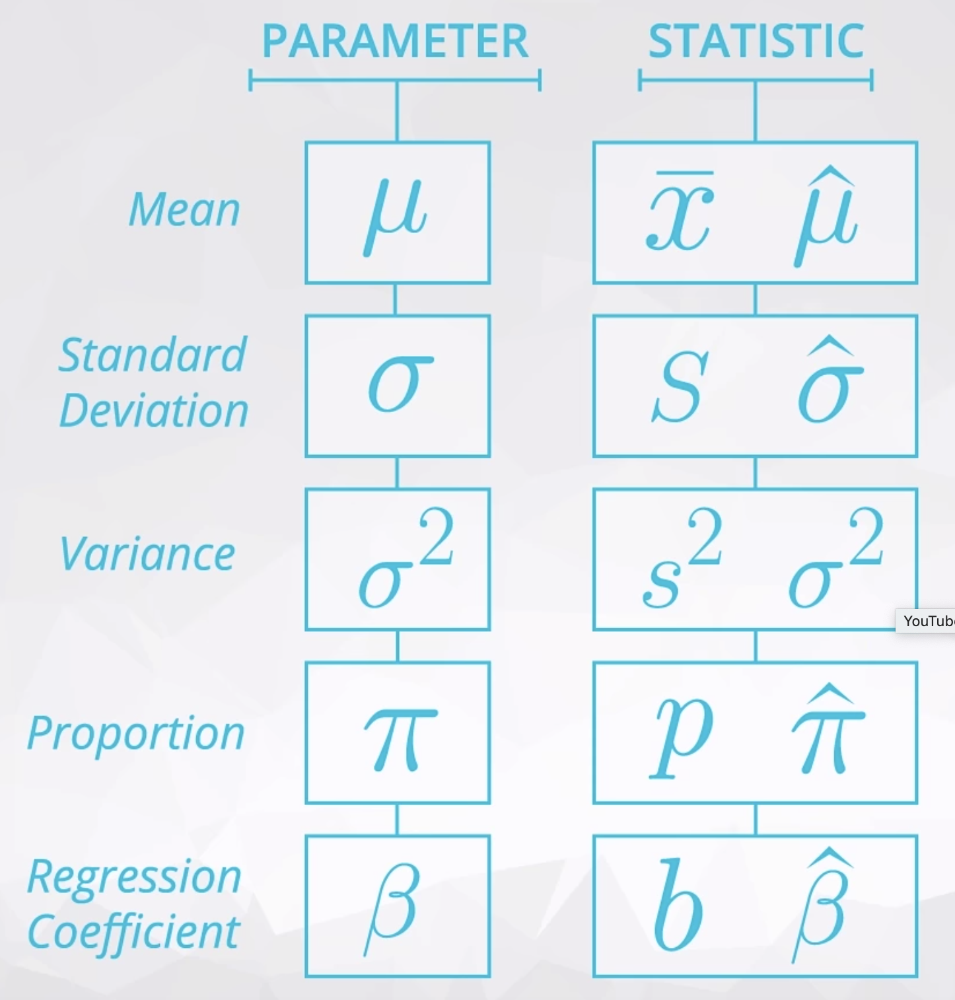
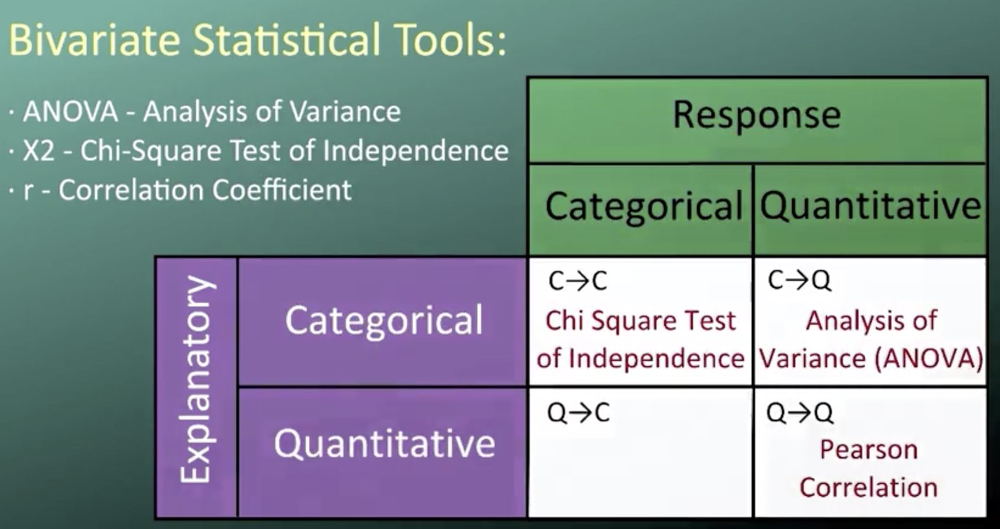
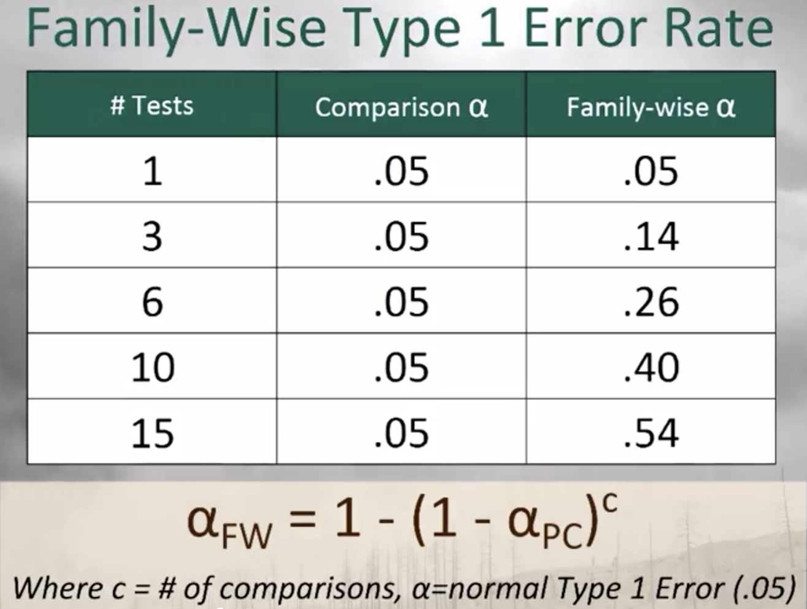
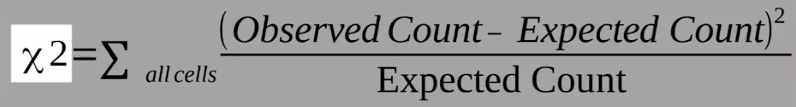
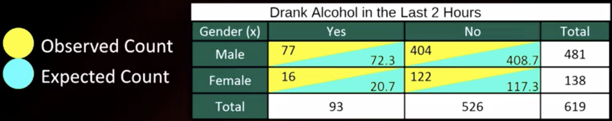
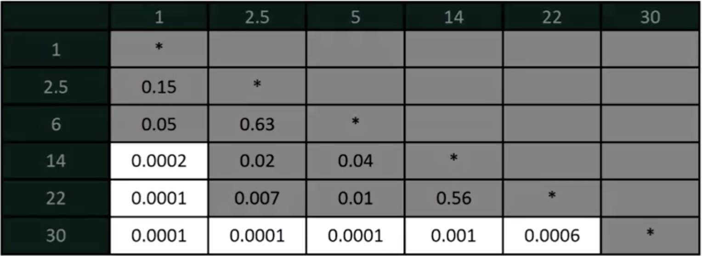

# Inferential statistics

Inferential Statistics is about using our collected data to draw conclusions to a larger population.

<!-- TOC -->

- [Inferential statistics](#inferential-statistics)
  - [1. Terminology and sampling distributions](#1-terminology-and-sampling-distributions)
    - [1.1. Terminology](#11-terminology)
    - [1.2. Law of Large Numbers](#12-law-of-large-numbers)
    - [1.3. Central Limit Theorem](#13-central-limit-theorem)
    - [1.4. Common methods to estimate parameters from observations](#14-common-methods-to-estimate-parameters-from-observations)
    - [1.5. Bootstrapping](#15-bootstrapping)
  - [2. Confidence interval and hypothesis testing](#2-confidence-interval-and-hypothesis-testing)
    - [2.1. Confidence interval](#21-confidence-interval)
    - [2.2. Standard error of the mean - a measure of confidence](#22-standard-error-of-the-mean---a-measure-of-confidence)
    - [2.3. Hypothesis testing](#23-hypothesis-testing)
    - [2.4. Statistical vs. practical significance](#24-statistical-vs-practical-significance)
  - [3. Bivariate statistical tools](#3-bivariate-statistical-tools)
    - [3.1. Analysis of Variance (ANOVA)](#31-analysis-of-variance-anova)
    - [3.2. Chi-Square test of independence](#32-chi-square-test-of-independence)
    - [3.3. Pearson Correlation](#33-pearson-correlation)
    - [3.4. Moderation](#34-moderation)
  - [4. The Student's t-test](#4-the-students-t-test)
    - [4.1. One Sample T-Test](#41-one-sample-t-test)
    - [4.2. Independent T-Test](#42-independent-t-test)

<!-- /TOC -->

## 1. Terminology and sampling distributions

### 1.1. Terminology

* **Population:** the entire group of interest
* **Sample:** subset of the population
* **Parameter:** a number that describes the population, typically unknown
* **Statistic:** a number that is computed from a sample
* **Sampling variability:** the statistics of different samples of a population will differ somewhat
* Sample skewness + fundamental randomness
* **Sampling distribution** is the distribution of a statistic across an infinite number of samples



### 1.2. Law of Large Numbers

As our sample size increases, the sample mean gets closer to the population mean.

### 1.3. Central Limit Theorem

As long as adequately large samples and adequately large number of samples are used from a population, the distribution of the sample mean will be normally distributed.

- The Central Limit Theorem actually applies for these well known statistics:

  - Sample means (<a href="https://www.codecogs.com/eqnedit.php?latex=\bar{x}" target="_blank"></a>)
  - Sample proportions (<a href="https://www.codecogs.com/eqnedit.php?latex=p" target="_blank"></a>)
  - Difference in sample means (<a href="https://www.codecogs.com/eqnedit.php?latex=\bar{x}_1&space;-&space;\bar{x}_2" target="_blank"></a>)
  - Difference in sample proportions (<a href="https://www.codecogs.com/eqnedit.php?latex=p_1&space;-&space;p_2" target="_blank"></a>)
- And it applies for additional statistics, but it doesn't apply for all statistics!

### 1.4. Common methods to estimate parameters from observations

* [Maximum Likelihood Estimation](https://en.wikipedia.org/wiki/Maximum_likelihood_estimation)
* [Method of Moments Estimation](https://en.wikipedia.org/wiki/Method_of_moments_(statistics))
* [Bayesian Estimation](https://en.wikipedia.org/wiki/Bayes_estimator)

### 1.5. Bootstrapping

Bootstrapping is sampling with replacement. No more data needed to gain a better understanding of the parameter.

## 2. Confidence interval and hypothesis testing

### 2.1. Confidence interval

- Interpretation

    We are 95% confident that the [population mean] falls between [the bounds that you find].

- Code

    ```python
    boot_means = []
    for _ in range(10000):
        boot_sample = coffee_red.sample(200, replace=True)
        boot_means.append(boot_sample.loc[boot_sample['drinks_coffee']==True, 'height'].mean())

    np.percentile(boot_means, 2.5), np.percentile(boot_means, 97.5) # 68.06, 68.97
    ```

    We are 95% confident that the mean height of all coffee drinkers is between 68.06 and 68.97.

### 2.2. Standard error of the mean - a measure of confidence

* SE = s/sqrt(n)
* s: standard deviation of sample
* n: sample size

    ```python
    from scipy.stats import sem
    plt.errorbar(x_axis, means, yerr = standard_errors, fmt='o')
    ```

    comparing error bars could infer whether samples were drawn from the same population

### 2.3. Hypothesis testing

**Hypothesis testing:** Assessing evidence provided by the data in favor of or against each hypothesis about the population. To learn more about the traditional methods, see the documentation here on the [Stat Trek site](https://stattrek.com/hypothesis-test/hypothesis-testing.aspx) on the corresponding hypothesis tests.

1. Specify the null ($H_0$) and alternative ($H_a$) hypothesis
2. Choose a sample
3. Assess the evidence
    * A result is **statistically significant** if it is unlikely to have occurred by chance.
    * Significance level of a test: $\alpha=0.05$
    * **p-value** is also called **type one error rate** = the probability we would be wrong in rejecting null hypothesis
    * Probability value **p-value < 0.05**: more than 95% likely that the association of interest would be present following repeated samples drawn from the population (aka., sampling distribution). <br>
    
4. Draw conclusions
   * If p-value < $\alpha$: the data provide significant evidence against the null hypothesis, so we reject the null hypothesis and accept the alternative hypothesis.
   * If p-value > $\alpha$: the data do not provide enough evidence to reject the null hypothesis; the data do not provide enough evidence to accept the alternative hypothesis.

### 2.4. Statistical vs. practical significance

- Using confidence intervals and hypothesis testing, you are able to provide **statistical significance** in making decisions.

- However, it is also important to take into consideration **practical significance** in making decisions. Practical significance takes into consideration other factors of your situation that might not be considered directly in the results of your hypothesis test or confidence interval. Constraints like **space, time, or money** are important in business decisions. However, they might not be accounted for directly in a statistical test.

## 3. Bivariate statistical tools

### 3.1. Analysis of Variance (ANOVA)

Examine differences in the mean response variable for each category of our explanatory variable. E.g. Are any of the treatments significantly different than the rest?

* Hypothesis

    $H_0$: $\mu_1=\mu_2=\mu_3=\mu_4$ <br>
    $H_a$: not all the $\mu$ are equal

* ANOVA F test
  
    Are the differences among the sample means due to true differences among the population means or merely due to sampling variability?

    **F statistic:** $F=\frac{variation\ among\ sample\ means}{variation\ within\ groups}$

* Code

    * Explanatory variable with 2 levels

        ```python
        import statsmodels.formula.api as smf
        
        # using ols function for calculating the F-statistic and associated p value
        # C(...) indicates categorical variable
        # dataset has no missing values
        model1 = smf.ols(formula='NUMCIGMO_EST ~ C(MAJORDEPLIFE)', data=sub1)
        results1 = model1.fit()
        print (results1.summary())
        ```

        Alternative syntax

        ```python
        import scipy.stats as stats

        # Perform the ANOVA
        stats.f_oneway(group1, group2, group3, group4, group5)
        ```

    * Explanatory variable with >2 levels

        ```python
        model2 = smf.ols(formula='NUMCIGMO_EST ~ C(ETHRACE2A)', data=sub3).fit()
        print (model2.summary())
        ```

        A significant ANOVA does not tell which groups are different from the others

    * Post hoc test when explanatory variable has >2 levels

        Cannot compare each pair one-by-one due to the increase in the Type 1 error rate called the family-wise error rate, the error rate for the group of pair comparison.

        

        Use one of the post hoc tests that are designed to evaluate the difference between pairs of means while protecting against inflation of Type 1 errors:
        
        * Sidak
        * Holm T test
        * Fisher's Least Significant Difference Test
        * Tukey's Honestly Significant Difference Test
        * Scheffe test
        * Newman-Keuls test
        * Dunnett's Multiple Comparison Test
        * Duncan Multiple Range Test
        * Bonferroni Procedure
  
        ```python
        import statsmodels.stats.multicomp as multi
        mc1 = multi.MultiComparison(sub3['NUMCIGMO_EST'], sub3['ETHRACE2A'])
        res1 = mc1.tukeyhsd()
        print(res1.summary())
        ```

* Example application

    [Blog post](https://www.tumblr.com/blog/rfbds)

### 3.2. Chi-Square test of independence

Which of the 2 categorical variables plays the role of the explanatory variable and then calculating the conditional percentages separately.

Whether there is a significant difference between the expected frequencies and the observed frequencies in one or more categories.

* Hypothesis

    $H_0$:
    
    * There is no difference in the drunk driving rate between males and females.
    * There is no relationship between the 2 categorical variables - they are independent.
    * Proportion of male drunk drivers = proportion of female drunk drivers.
  
    $H_a$:
    
    * There is a difference in the drunk driving rate between males and females.
    * There is a relationship between the 2 categorical variables - they are not independent.
    * Proportion of male drunk drivers ≠ proportion of female drunk drivers.

* $\chi^2$ test of independence

    
    
    

    The p-value of the $\chi^2$ test of independence is the probability of getting counts like those observed, assuming that the 2 variables are not related.

* Code

    * Chi Square test of independence

        Test

        ```python
        import scipy.stats
        import seaborn
        import matplotlib.pyplot as plt

        # contingency table of observed counts
        ct1=pandas.crosstab(sub2['TAB12MDX'], sub2['USFREQMO']) # response, explanatory
        print (ct1)

        # column percentages
        colsum=ct1.sum(axis=0)
        colpct=ct1/colsum
        print(colpct)

        # chi-square
        print ('chi-square value, p value, expected counts')
        cs1= scipy.stats.chi2_contingency(ct1)
        print (cs1)
        ```

        Visualize

        ```python
        # set variable types 
        sub2["USFREQMO"] = sub2["USFREQMO"].astype('category')
        
        # new code for setting variables to numeric:
        sub2['TAB12MDX'] = pandas.to_numeric(sub2['TAB12MDX'], errors='coerce')
        
        # graph percent with nicotine dependence within each smoking frequency group 
        seaborn.factorplot(x="USFREQMO", y="TAB12MDX", data=sub2, kind="bar", ci=None)
        plt.xlabel('Days smoked per month')
        plt.ylabel('Proportion Nicotine Dependent')
        ```

        Alternative syntax

        ```python
        import scipy.stats as stats

        # The degree of freedom is assumed 2
        # With a p-value of 0.05, the confidence level is 1.00-0.05 = 0.95.
        critical_value = stats.chi2.ppf(q = 0.95, df = 2)

        # Run the chi square test with stats.chisquare()
        stats.chisquare(df['observed'], df['expected'])
        ```

    * Post hoc test when explanatory variable has >2 levels
        
        Bonferroni Adjusted p-value = $\frac{0.05}{\#\ comparisons}$ <br>
        Run $\chi^2$ test of independence for each paired comparison

        

        ```python
        recode2 = {1: 1, 2.5: 2.5}
        sub2['COMP1v2']= sub2['USFREQMO'].map(recode2)

        # contingency table of observed counts
        ct2=pandas.crosstab(sub2['TAB12MDX'], sub2['COMP1v2'])
        print (ct2)

        # column percentages
        colsum=ct2.sum(axis=0)
        colpct=ct2/colsum
        print(colpct)

        print ('chi-square value, p value, expected counts')
        cs2= scipy.stats.chi2_contingency(ct2)
        print (cs2)

        recode3 = {1: 1, 6: 6}
        sub2['COMP1v6']= sub2['USFREQMO'].map(recode3)

        # contingency table of observed counts
        ct3=pandas.crosstab(sub2['TAB12MDX'], sub2['COMP1v6'])
        print (ct3)

        # column percentages
        colsum=ct3.sum(axis=0)
        colpct=ct3/colsum
        print(colpct)

        print ('chi-square value, p value, expected counts')
        cs3= scipy.stats.chi2_contingency(ct3)
        print (cs3)
        ```

- Example application

    [Blog post](https://www.tumblr.com/blog/rccma)

### 3.3. Pearson Correlation

Pearson correlation coefficient (r) measures a linear relationship between two quantitative variables.

Correlation ignores any other type of relationship no matter how strong.

* $r$: Pearson correlation coefficient
* $r^2$: R Squared or Coefficient of Determination

    The fraction of the variability of 1 variable that can be predicted by the other. Aka., if we know x, we can predict $r^2$ of the variability we will see in y.

* Code

    Pearson correlation coefficient

    ```python
    import pandas
    import numpy
    import seaborn
    import scipy
    import matplotlib.pyplot as plt

    # Print r and the corresponding p-value
    print ('association between urbanrate and internetuserate')
    print (scipy.stats.pearsonr(data_clean['urbanrate'], data_clean['internetuserate']))

    print ('association between incomeperperson and internetuserate')
    print (scipy.stats.pearsonr(data_clean['incomeperperson'], data_clean['internetuserate']))
    ```

    Visualize

    ```python
    scat1 = seaborn.regplot(x="urbanrate", y="internetuserate", fit_reg=True, data=data)
    plt.xlabel('Urban Rate')
    plt.ylabel('Internet Use Rate')
    plt.title('Scatterplot for the Association Between Urban Rate and Internet Use Rate')

    scat2 = seaborn.regplot(x="incomeperperson", y="internetuserate", fit_reg=True, data=data)
    plt.xlabel('Income per Person')
    plt.ylabel('Internet Use Rate')
    plt.title('Scatterplot for the Association Between Income per Person and Internet Use Rate')
    ```

* Example application

    [Blog post](https://www.tumblr.com/blog/scfbid)

### 3.4. Moderation

Moderating variable (or moderator) is a third variable that affects the direction and or strength of the relation between the explanatory and response variable.

* Testing moderation in the context of ANOVA

    Is our explanatory variable associated with our response variable, for each population subgroup or each level of our third variable?

    ```python
    sub2=data[(data['Exercise']=='Cardio')]
    sub3=data[(data['Exercise']=='Weights')]

    print ('association between diet and weight loss for those using Cardio exercise')
    model2 = smf.ols(formula='WeightLoss ~ C(Diet)', data=sub2).fit()
    print (model2.summary())

    print ('association between diet and weight loss for those using Weights exercise')
    model3 = smf.ols(formula='WeightLoss ~ C(Diet)', data=sub3).fit()
    print (model3.summary())

    print ("means for WeightLoss by Diet A vs. B  for CARDIO")
    m3= sub2.groupby('Diet').mean()
    print (m3)
    print ("Means for WeightLoss by Diet A vs. B for WEIGHTS")
    m4 = sub3.groupby('Diet').mean()
    print (m4)
    ```

* Testing moderation in the context of Chi Square

    Is explanatory variable related to response variable, for each level of our third variable?

    ```python
    sub3=sub2[(sub2['MAJORDEPLIFE']== 0)]
    sub4=sub2[(sub2['MAJORDEPLIFE']== 1)]

    print ('association between smoking quantity and nicotine dependence for those W/O deperession')
    # contingency table of observed counts
    ct2=pandas.crosstab(sub3['TAB12MDX'], sub3['USQUAN'])
    print (ct2)

    # column percentages
    colsum=ct1.sum(axis=0)
    colpct=ct1/colsum
    print(colpct)

    # chi-square
    print ('chi-square value, p value, expected counts')
    cs2= scipy.stats.chi2_contingency(ct2)
    print (cs2)

    print ('association between smoking quantity and nicotine dependence for those WITH depression')
    # contingency table of observed counts
    ct3=pandas.crosstab(sub4['TAB12MDX'], sub4['USQUAN'])
    print (ct3)

    # column percentages
    colsum=ct1.sum(axis=0)
    colpct=ct1/colsum
    print(colpct)

    # chi-square
    print ('chi-square value, p value, expected counts')
    cs3= scipy.stats.chi2_contingency(ct3)
    print (cs3)

    # Visualize
    seaborn.factorplot(x="USQUAN", y="TAB12MDX", data=sub4, kind="point", ci=None)
    plt.xlabel('number of cigarettes smoked per day')
    plt.ylabel('Proportion Nicotine Dependent')
    plt.title('association between smoking quantity and nicotine dependence for those WITH depression')

    seaborn.factorplot(x="USQUAN", y="TAB12MDX", data=sub3, kind="point", ci=None)
    plt.xlabel('number of cigarettes smoked per day')
    plt.ylabel('Proportion Nicotine Dependent')
    plt.title('association between smoking quantity and nicotine dependence for those WITHOUT depression')
    ```

* Testing moderation in the context of correlation

    ```python
    sub1=data_clean[(data_clean['incomegrp']== 1)]
    sub2=data_clean[(data_clean['incomegrp']== 2)]

    print('association between urbanrate and internetuserate for LOW income countries')
    print(scipy.stats.pearsonr(sub1['urbanrate'], sub1['internetuserate']))
    print()
    print('association between urbanrate and internetuserate for MIDDLE income countries')
    print(scipy.stats.pearsonr(sub2['urbanrate'], sub2['internetuserate']))

    scat1 = seaborn.regplot(x="urbanrate", y="internetuserate", data=sub1)
    plt.xlabel('Urban Rate')
    plt.ylabel('Internet Use Rate')
    plt.title('Scatterplot for the Association Between Urban Rate and Internet Use Rate for LOW income countries')
    print(scat1)
    scat2 = seaborn.regplot(x="urbanrate", y="internetuserate", fit_reg=False, data=sub2)
    plt.xlabel('Urban Rate')
    plt.ylabel('Internet Use Rate')
    plt.title('Scatterplot for the Association Between Urban Rate and Internet Use Rate for MIDDLE income countries')
    print(scat2)
    ```

## 4. The Student's t-test

### 4.1. One Sample T-Test

Compare sample mean to the population mean

* Assumptions

  * Data is normally distributed
  * Data is independent
  * Data is randomly sampled

* Code

    ```python
    import scipy.stats as stats
    stats.ttest_1samp(sample, population.mean())
    ```

### 4.2. Independent T-Test

Compare the means of 2 independent populations, i.e., how likely that two samples represent the same underlying population

* Assumptions

    * Data is normally distributed
    * Data is independent
    * Data is homogenous (The standard deviations are roughly equal)

* Code

    ```python
    import scipy.stats as stats

    # Note: Setting equal_var=False performs Welch's t-test which does 
    # not assume equal population variance
    stats.ttest_ind(population1, population2, equal_var=False)
    ```

