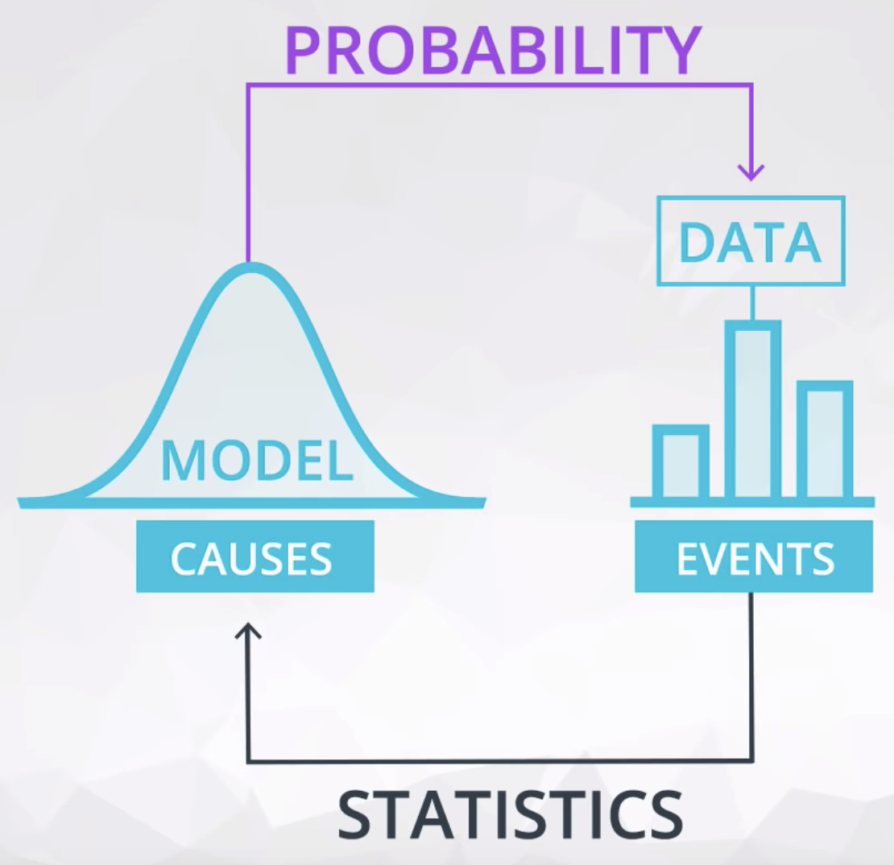
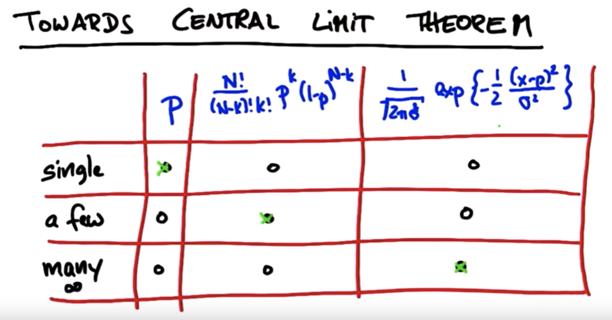

# Probability

- [Probability](#probability)
  - [1. Probability basics](#1-probability-basics)
  - [2. Binomial distribution](#2-binomial-distribution)
  - [3. Conditional probability](#3-conditional-probability)
  - [4. Bayes Rule](#4-bayes-rule)

## 1. Probability basics

- Probability of event (**P**)
- Probability of opposite event (**1-P**)
- Probability of composite event (**P\*P...\*P**, if independent)

## 2. Binomial distribution

## 3. Conditional probability

We can formulate conditional probabilities for any two events in the following way:

​

## 4. Bayes Rule

​