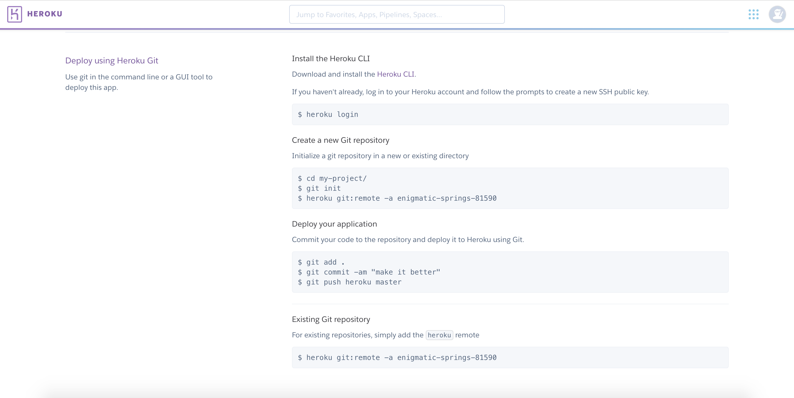
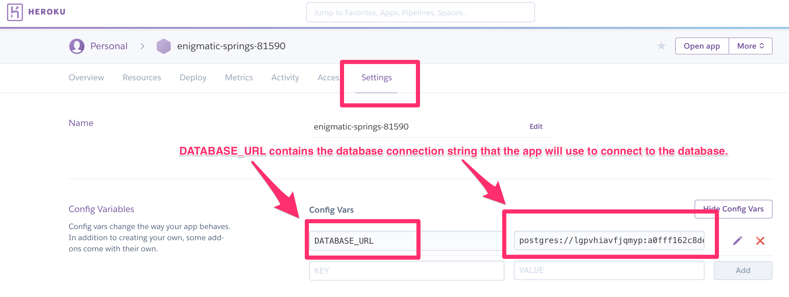

# Deploy an app on Heroku

<!-- TOC -->autoauto- [Deploy an app on Heroku](#deploy-an-app-on-heroku)auto    - [Part 1: Configuration Files](#part-1-configuration-files)auto        - [1.1. Create a new conda environment](#11-create-a-new-conda-environment)auto        - [1.2. Test running app locally](#12-test-running-app-locally)auto        - [1.3. Configure requirements.txt, Procfile](#13-configure-requirementstxt-procfile)auto    - [Part 2: Creating the Heroku App](#part-2-creating-the-heroku-app)auto    - [Part 3: Preparing the Database](#part-3-preparing-the-database)autoauto<!-- /TOC -->

#### Steps

1. Prepare the application with additional configuration files (`Procfile` and `requirements.txt`)
2. Create the Heroku application
3. Prepare the Heroku database

#### File structure

- `initdb.py` to run later
- `requirements.txt` to install dependencies on Heroku
- `run.sh` to test running the app locally
- `Procfile` to run app on Heroku
- `pet_pals/`
  - `__init__.py` Makes the directory importable
  - `app.py`
  - ...

## Part 1: Configuration Files

### 1.1. Create a new conda environment

* Start by creating a new conda environment just for this app. All of our project dependencies will be installed in this environment. Note: This should only contain python 3.6 and not anaconda.

    ```sh
    conda create -n pet_pals_env python=3.6
    ```

* Make sure to activate this new environment before proceeding.

    ```sh
    source activate pet_pals_env
    ```

* Next, we install `gunicorn` with `pip install gunicorn`. Explain that gunicorn is a high performance web server that can run their Flask app in a production environment.

* Because this app will use Postgres, we also install `psycopg2` with `pip install psycopg2`.

* Make sure to install any other dependencies that are required by the application. This may be `Pandas`, `flask-sqlalchemy`, or any other Python package that is required to run the app. **Test the app locally to make sure that it works!**

  ```
  pip install gunicorn
  pip install psycopg2
  pip install flask
  pip install flask-sqlalchemy
  pip install pandas
  ```

### 1.2. Test running app locally

* Test the app by first initializing the database:

  ```sh
  python initdb.py
  ```

* Run the app using the following (`run.sh`):

  ```
  FLASK_APP=pet_pals/app.py flask run
  ```

### 1.3. Configure requirements.txt, Procfile

* Now that all of the project dependencies are installed, we need to generate the `requirements.txt` file. This file is a list of the Python packages required to run the app, we run `pip freeze > requirements.txt`. Heroku will use this file to install all of the app's dependencies.

* The final configuration file that we need is `Procfile`. This file is used by Heroku to run the app.

  ```
  touch Procfile
  ```

* Open `Procfile` in vscode and add the following line:

  ```
  web: gunicorn pet_pals.app:app
  ```

* Note that `pet_pals` is the name of the folder that contains your app as a python package (i.e. the name of the folder with the `__init__.py` file in it).

## Part 2: Creating the Heroku App

* On Heroku, go to the `Deploy` section of your app's homepage, and follow the steps to deploy the app.

  

## Part 3: Preparing the Database

* After creating a new app on Heroku, navigate to `Resources`:

  

  * Under `Add-ons`, add `Heroku Postgres`. Make sure to use the free version.

* Click on the add on, then navigate to settings and click on `Reveal Config Variables`.

* The connection string to the database should now be available:

  

* Heroku will automatically assign this URI string to the `DATABASE_URL` environment variable that is used within `app.py`. The code that is already in `app.py` will be able to use that environment variable to connect to the Heroku database.

  ```python
  # DATABASE_URL will contain the database connection string:
  app.config['SQLALCHEMY_DATABASE_URI'] = os.environ.get('DATABASE_URL', '')
  # Connects to the database using the app config
  db = SQLAlchemy(app)
  ```

* After adding the database, the final step is to initialize the database. To do this, we use the heroku cli. From the terminal, type the following:

  ```
  heroku run initdb.py
  ```

* Your database is now initialized, and you can open the application using `heroku open` from the terminal.
