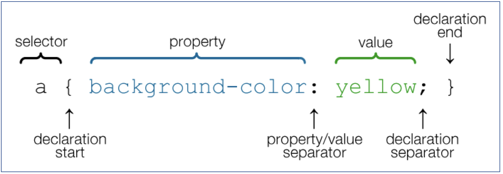
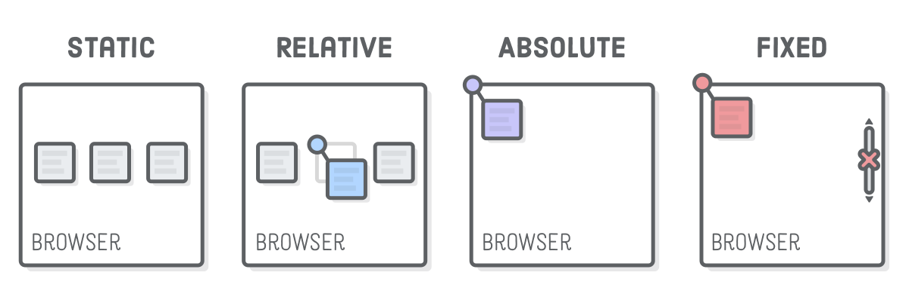
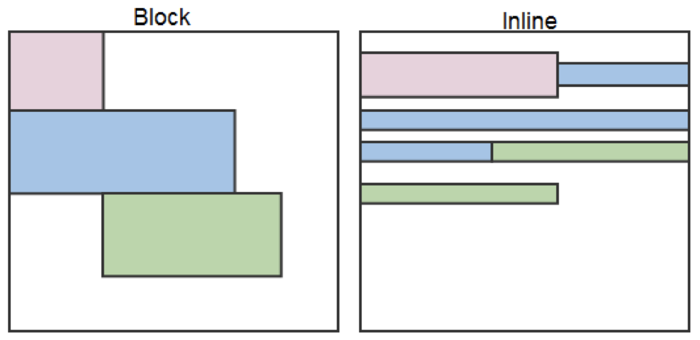
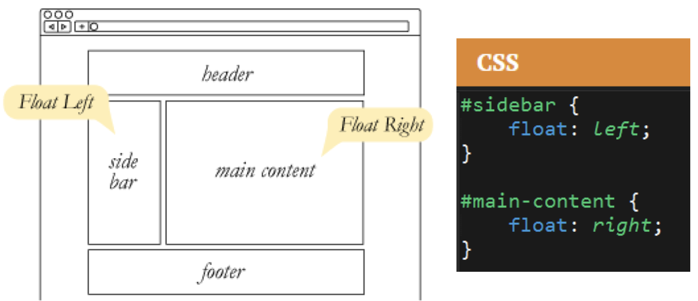
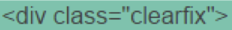
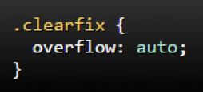

# HTML and CSS

Front end web technologies:

- HTML: Content and basic structure
- CSS: Styling / appearance
- Javascript: Interactivity, programming logic, responsible for web page's behavior
- Altogether, [D3 gallery](https://github.com/d3/d3/wiki/Gallery)

A sample [HTML file](html_css/index.html) <br>
A sample [CSS file](html_css/style.css)

<!-- TOC -->

- [HTML and CSS](#html-and-css)
    - [1. HTML (HyperText Markup Language)](#1-html-hypertext-markup-language)
        - [1.1. Basic structure](#11-basic-structure)
        - [1.2. Additional resources](#12-additional-resources)
        - [1.3. Github Pages](#13-github-pages)
    - [2. CSS (cascading style sheet)](#2-css-cascading-style-sheet)
        - [2.1. Basic structure](#21-basic-structure)
        - [2.2. Key CSS attributes](#22-key-css-attributes)
        - [2.3. Box Model](#23-box-model)
        - [2.4. CSS Positioning](#24-css-positioning)
        - [2.5. Flow](#25-flow)
        - [2.6. CSS media queries](#26-css-media-queries)
        - [2.7. CSS Bootstrap](#27-css-bootstrap)

<!-- /TOC -->

## 1. HTML (HyperText Markup Language)

### 1.1. Basic structure

- *Most* HTML elements follow the format of:

    - Opening tag
    - Content
    - Closing tag

    e.g. `<h1>Header 1</h1>`

- Some HTML tags have attributes they are commonly paired with.

    e.g. `<a href="www.google.com">Link</a>`

- While most elements have an opening and closing tag, a few are self closing. These are known as void elements.

    e.g. ``

### 1.2. Additional resources

- [W3 validator](https://validator.w3.org/#validate_by_input)
- [Flowchart](http://html5doctor.com/downloads/h5d-sectioning-flowchart.pdf)

### 1.3. Github Pages

- GitHub Pages Personal Bio Deploy Guide

    1. Create a new repository that is named _username_.github.io
    2. Navigate into a folder and clone the repository into it
    3. Add an HTML file named index.html and code out a basic webpage (or use a previous page)
    4. Add, commit, and push your changes into the repository
    5. Navigate to _username_.github.io and you will find that your new web page has gone live!

- GitHub Pages Project Webpage Deploy Guide

    1. Create a new repository on your GitHub account. You can name this repository whatever you would like.
    2. Once inside of the repository, create a new file and name it index.html
    3. Add your HTML into this file, save it, and then navigate into your repository's Settings tab.
    4. Scroll down to the GitHub Pages section and then, in the section labeled Source, select that you would like to use the master branch as your source.
    5. Navigate to _username_.github.io/_repositoryname_ and you will find that your new web page has gone live!

## 2. CSS (cascading style sheet)

### 2.1. Basic structure



- Selector types

    - tag selector
    - class selector
    - id selector

### 2.2. Key CSS attributes

Font / Color:

- **color**: Sets color of text.
- **font-size**: Sets size of the font.
- **font-style**: Sets italics.
- **font-weight**: Sets bold.

Alignment / Spacing:

- **Padding-top(bottom/left/right)**: Adds space between element and its own border.
- **margin-top (bottom/left/right)**: Adds space between element and surrounding elements.
- **float**: Forces elements to the sides, centers, or tops.

Background: 

- **background-color**: sets background color.
- **background-image**: sets background image.

### 2.3. Box Model


### 2.4. CSS Positioning



- **position: static** (default)
- **position: relative**: relative to the original position
- **position: absolute**: relative to the nearest positioned ancestor
- **position: fixed**: with exact coordinates to the browser window
- **layering with z-index**: higher value shows to the front when overlapping
- **hide things**: `display: none` or `visibility: hidden`

### 2.5. Flow

- By default, every HTML element displayed in the browser is governed by a concept called flow. This means that HTML elements force their adjacent elements to flow around them. 

    

- By using float CSS properties, we can command our website to display multiple HTML elements adjacently. 

    

- Float can overflow the outside of its container. Solve with "the clearfix hack"

    
    

- `Float` → use `flexbox` instead

### 2.6. CSS media queries

- Example

    ```css
    /* Here we define some styles that will ONLY be applied at screen sizes below 480 pixels */
    @media (max-width: 480px) {
        .box-1 {
            background: purple;
        }
    }
    ```

* A reference for media query syntax can be found at [MDN Docs](https://developer.mozilla.org/en-US/docs/Web/CSS/Media_Queries/Using_media_queries)

### 2.7. CSS Bootstrap

- Example

    ```html
    ...
    <head>
        ...
        <!-- Bootstrap CDN -->
        <link rel="stylesheet" href="https://maxcdn.bootstrapcdn.com/bootstrap/3.3.6/css/bootstrap.min.css">
    </head>
    <body>
        ...
        <!-- Creates the Overall Grid -->
        <div class="container">
            <!-- Row 1 -->
            <div class="row">
                <div class="col-md-6" style="border: 2px solid blueviolet;">
                    <p>paragraph 1</p>
                </div>
                <div class="col-md-6" style="border: 2px solid blueviolet;">
                    <p>paragraph 2</p>
                </div>
            </div>
        </div>
        ...
    </body>
    ```

* More about the grid system here: <http://getbootstrap.com/css/#grid>
* Bootstrap [components](https://getbootstrap.com/docs/3.3/components/)
* Bootstrap [documentation](https://getbootstrap.com/docs/3.3/css/)