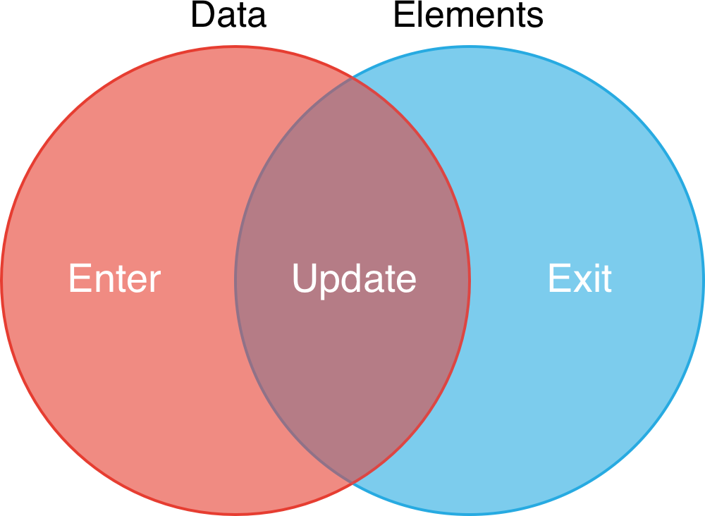
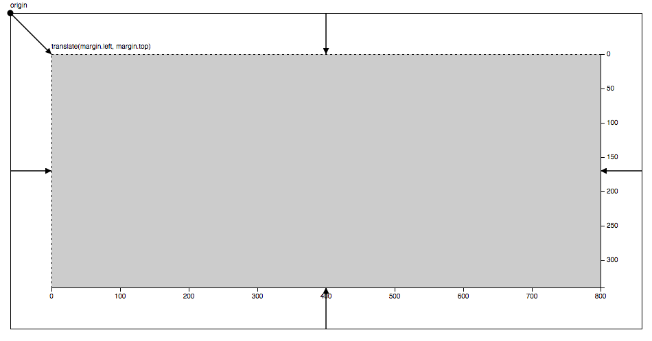
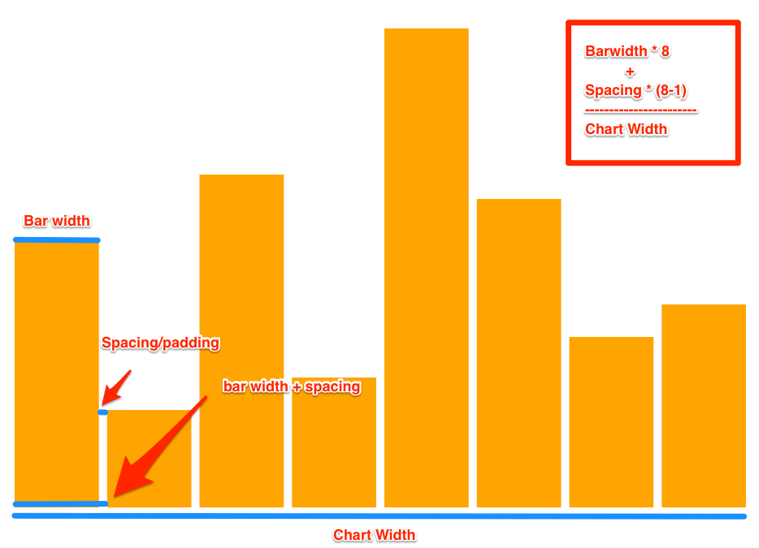
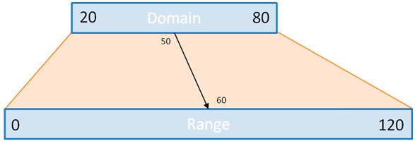
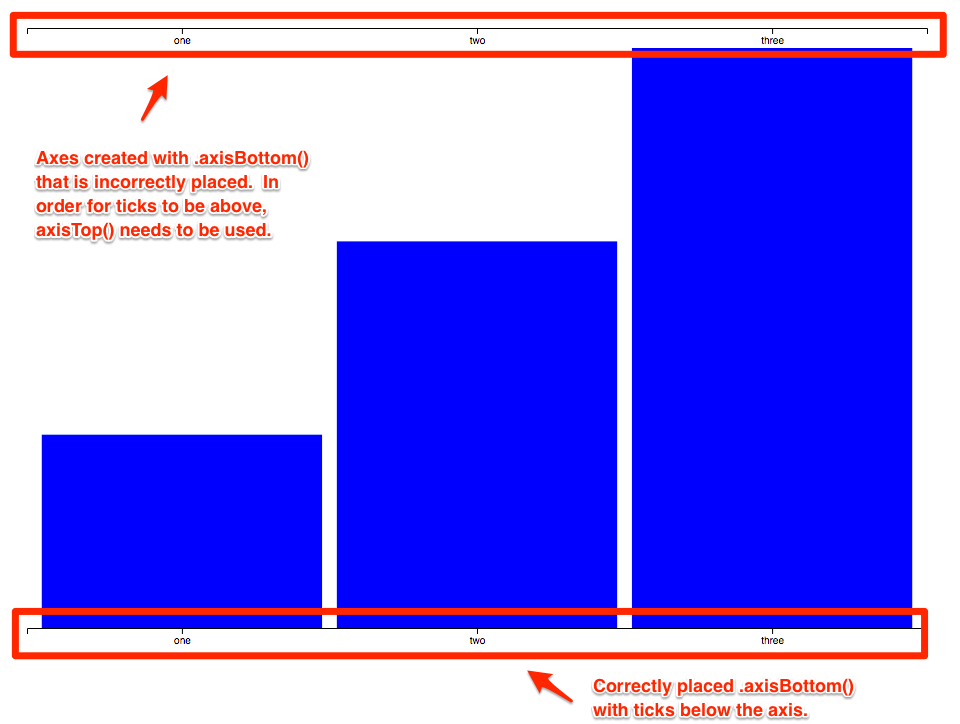

# D3.js

<!-- TOC -->

- [D3.js](#d3js)
  - [1. D3 Basic DOM manipulation](#1-d3-basic-dom-manipulation)
    - [1.1. Select element](#11-select-element)
    - [1.2. Element's text](#12-elements-text)
    - [1.3. Element's HTML](#13-elements-html)
    - [1.4. Element's attribute](#14-elements-attribute)
    - [1.5. Chaining](#15-chaining)
    - [1.6. Element's style](#16-elements-style)
    - [1.7. Add element](#17-add-element)
    - [1.8. Delete element](#18-delete-element)
    - [1.9. Add table entries dynamically](#19-add-table-entries-dynamically)
  - [2. Events](#2-events)
    - [2.1. Events listener: button click](#21-events-listener-button-click)
    - [2.2. Events listener: text entering](#22-events-listener-text-entering)
    - [2.3. This](#23-this)
    - [2.4. Event listener: text entering with button](#24-event-listener-text-entering-with-button)
    - [2.5. Promise](#25-promise)
  - [3. Binding data](#3-binding-data)
    - [3.1. Binding, update, enter, merge, and exit](#31-binding-update-enter-merge-and-exit)
    - [3.2. Data binding with complex data](#32-data-binding-with-complex-data)
  - [4. Loading data](#4-loading-data)
    - [4.1. Load data from csv](#41-load-data-from-csv)
  - [5. Scalable vector graphics (SVG)](#5-scalable-vector-graphics-svg)
    - [5.1. SVG dimensions](#51-svg-dimensions)
    - [5.2. Transform](#52-transform)
    - [5.3. Create shapes](#53-create-shapes)
    - [5.4. Scales](#54-scales)
    - [5.5. Axes](#55-axes)
    - [5.6. Bar chart template](#56-bar-chart-template)
    - [5.7. Line chart template](#57-line-chart-template)
    - [5.8. Multi-line with axes](#58-multi-line-with-axes)
  - [6. Event listener with SVG](#6-event-listener-with-svg)
    - [6.1. Window resize](#61-window-resize)
    - [6.2. Event listener with transition](#62-event-listener-with-transition)
    - [6.3. Event listener with tooltip](#63-event-listener-with-tooltip)
    - [6.4. Scatter plot with tooltip template](#64-scatter-plot-with-tooltip-template)

<!-- /TOC -->

```html
<!DOCTYPE html>
<html lang="en">

<head>
    <meta charset="UTF-8">
    <meta name="viewport" content="width=device-width, initial-scale=1.0">
    <meta http-equiv="X-UA-Compatible" content="ie=edge">
    <title>Document</title>
    <!-- Bootstrap CSS -->
    <link rel="stylesheet" href="https://maxcdn.bootstrapcdn.com/bootstrap/3.3.7/css/bootstrap.min.css">
    <!-- D3 JS -->
    <script src="https://cdnjs.cloudflare.com/ajax/libs/d3/4.13.0/d3.min.js"></script>
    <!-- D3 Tip JS -->
    <script src="https://cdnjs.cloudflare.com/ajax/libs/d3-tip/0.7.1/d3-tip.min.js"></script>
</head>

<body>
    ...
    <script src="demo.js"></script>
    <script src="static/js/index.js"></script>
    <svg width="1000" height="1000" xmlns="http://www.w3.org/2000/svg">
    </svg>
</body>

</html>
```

## 1. D3 Basic DOM manipulation

D3.js is a JavaScript library for producing dynamic, interactive data visualizations in web browsers. <br>
Check out some D3 layouts [here](https://github.com/d3/d3-3.x-api-reference/blob/master/Layouts.md).

### 1.1. Select element

- Select one

  ```js
  d3.select(".text1") // class selector
  d3.select("#text1") // id selector
  ```

- Select all

  ```js
  d3.selectAll("li") // tag selector
  ```

- Select an element's child element using `>`

  ```js
  var myLinkAnchor = d3.select(".my-link>a"); // <a href="...">...</a>
  ```

### 1.2. Element's text

- Select text

  ```js
  var text1 = d3.select(".text1").text();
  ```

- Modify text

  ```js
  d3.select("#text1").text("Hey, I changed this!");
  ```

### 1.3. Element's HTML

- Capture the HTML of a selection

  ```js
  var myLink = d3.select(".my-link").html(); // <a href="...">...</a>
  ```

- Modify the HTML of a selection

  ```js
  d3.select(".giphy-me").html("");
  ```

### 1.4. Element's attribute

- Select an attribute

  ```js
  var myLinkAnchorAttribute = myLinkAnchor.attr("href"); // "http://...."
  ```

- Modify an attribute

  ```js
  myLinkAnchor.attr("href", "https://python.org");
  ```

### 1.5. Chaining

- Use chaining to join methods

  ```js
  d3.select(".my-link>a")
    .attr("href", "https://nytimes.org")
    .text("Now this is a link to the NYT!!");
  ```

### 1.6. Element's style

- Modify style

  ```js
  d3.selectAll("li").style("color", "blue");
  ```

### 1.7. Add element

- Append a new list element

  ```js
  var li1 = d3.select("ul").append("li");
  li1.text("A new item has been added!");
  ```

### 1.8. Delete element

- Delete all child elements

  ```js
  d3.select("ul").html("");
  ```

### 1.9. Add table entries dynamically

- Add table entries dynamically

  ```js
  // Get a reference to the table body
  var tbody = d3.select("tbody");

  // for each object in an array
  data.forEach((weatherReport) => {

      // add a new row
      var row = tbody.append("tr");

      // for each key value pair in an object
      Object.entries(weatherReport).forEach(([key, value]) => {

          // add a new cell
          var cell = row.append("td");
          cell.text(value);

      });
  });
  ```

## 2. Events

Trigger changes when an event happens

### 2.1. Events listener: button click

- HTML

  ```html
  <button id="click-me">Click Me!</button>
  ```

- JS

  ```js
  var button = d3.select("#click-me");

  // Trigger changes when button is clicked
  button.on("click", function() {
      d3.select(".giphy-me").html("");
      console.log("Hi, a button was clicked!");
      console.log(d3.event.target);
  });
  ```

### 2.2. Events listener: text entering

- HTML

  ```html
  <input id="input-field" type="text">
  ```

- JS
  
  ```js
  var inputField = d3.select("#input-field");

  // Trigger a change event when new text is entered
  inputField.on("change", function() {
      var newText = d3.event.target.value;
      console.log(newText);
  });
  ```

### 2.3. This

A special pointer in JS.

- HTML:

  ```html
  <body>
    <button id="button">Click Me</button>
    <button id="button">Click Me 2</button>
    <ul>
      <li>Item 1</li>
      <li>Item 2</li>
      <li>Item 3</li>
    </ul>
    <script src="https://d3js.org/d3.v4.min.js"></script>
    <script src="app.js"></script>
  </body>
  ```

- JS:

  ```js
  d3.selectAll("button").on("click", function() {
      // `this` will console log the `button` element
      console.log(this); // d3.event.target, target of the event
  });

  d3.selectAll("li").on("click", function() {
      // you can select the element just like any other selection
      var listItem = d3.select(this);
      listItem.style("color", "blue");

      var listItemText = listItem.text();
      console.log(listItemText);
  });
  ```

### 2.4. Event listener: text entering with button

Trigger changes when button is clicked after form entry

- HTML:

  ```html
  <body>
    <div class="container">
      <div class="row">
        <div class="col-md-12">
          <form>
            <div class="form-group">
              <label for="example-form">Enter some text</label>
              <input class="form-control" id="example-form-input" name="example-form" type="text">
            </div>
            <button id="submit" type="submit" class="btn btn-default">Submit</button>
          </form>
        </div>
      </div>
      <div class="row">
        <div class="col-md-12">
          <h1>Form Data:
            <span></span>
          </h1>
        </div>
      </div>
    </div>
  </body>
  <script src="index.js"></script>
  ```

- JS:

  ```js
  // Select the submit button
  var submit = d3.select("#submit");

  submit.on("click", function() {

      // Prevent the page from refreshing
      d3.event.preventDefault();

      // Select the input element and get the raw HTML node
      var inputElement = d3.select("#example-form-input");

      // Get the value property of the input element
      var inputValue = inputElement.property("value");

      console.log(inputValue);

      // Set the span tag in the h1 element to the text that was entered in the form
      d3.select("h1>span").text(inputValue);
  });
  ```

### 2.5. Promise

JavaScript: asynchronous programming, e.g. can click when something is still loading

- Fetch json data from url

  ```js
  const url = "https://api.spacexdata.com/v2/launchpads";

  // Fetch the JSON data and console log it
  d3.json(url).then(function(data) {
    console.log(data);
  });

  // Promise Pending
  const dataPromise = d3.json(url);
  console.log("Data Promise: ", dataPromise);
  ```

- Error handling when fetching data from url

  ```js
  Plotly.d3.json(url1, function(err1, response1) {

    if (err1) return console.warn(err1);

    Plotly.d3.json(url2, function(err2, response2) {
      if (err2) return console.warn(err2);

      // Grab values from the response json object, etc.
      var name1 = response1.dataset.name;
      var name2 = response2.dataset.name;
      ...
    });
  });
  ```

## 3. Binding data

Associate data with some HTML elements



### 3.1. Binding, update, enter, merge, and exit

- Binding data to HTML elements

  ```js
  // Access elements' data, returns an array of undefined items
  d3.select("ul").selectAll("li").data();

  // Assign data to elements in the selector object
  var arr = [50, 55, 53];
  d3.select("ul").selectAll("li").data(arr);
  d3.select("ul").selectAll("li").data();
  ```

- Update

  ```js
  // Update existing elements
  var arr = [50, 55, 53];
  d3.select("ul")
      .selectAll("li")
      .data(arr)
      .text(function(d) {
        return d;
      });
  ```

- Enter

  ```js
  // Create new elements
  // Update only new elements
  var arr = [50, 55, 53, 56, 68];
  d3.select("ul")
      .selectAll("li")
      .data(arr)
      .enter()
      .append("li")
      .text(function(d) {
        return d;
      });
  ```

- Merge

  ```js
  // Update existing and new elements
  var austinTemps = [76, 59, 59, 73, 71];
  var selection = d3.select("#content").selectAll(".temps")
      .data(austinTemps);

  selection.enter()
      .append("div")
      .classed("temps", true)
      .merge(selection)
      .style("height", function(d) {
        return d + "px";
      });
  ```

- Exit

  ```js
  // Remove items
  var arr = [50, 55];
  d3.select("ul")
      .selectAll("li")
      .data(arr)
      .exit()
      .remove();
  ```

- Altogether

  ```js
  // Enter - Update - Exit Pattern Function
  // https://bl.ocks.org/mbostock/3808218
  function update(data) {

    // Binding data
    var selection = d3.select("#content").selectAll(".temps")
          .data(austinTemps);

    // Update all
    selection.enter()
          .append("div")
          .classed("temps", true)
          .merge(selection)
          .style("height", function(d) {
            return d + "px";
          });

    // Remove extra
    selection.exit().remove();
  }
  ```

### 3.2. Data binding with complex data

- Dynamically render images

  ```js
  var complexData = [{title: "javascript", url: "..."},
                     {title: "python", url: "..."},
                     {title: "css", url: "..."}];

  d3.select(".img-gallery").selectAll("div")
    .data(complexData)
    .enter() // creates placeholder for new data
    .append("div") // appends a div to placeholder
    .classed("col-md-4 thumbnail", true) // sets the class of the new div
    .html(d => ``); // sets the html in the div to an image tag with the link
  ```

## 4. Loading data

Have to use a server to read data from local, cannot read csv from client's local. In terminal, type `python -m http.server`

### 4.1. Load data from csv

- Load data from csv

  ```js
  d3.csv("./hours-of-tv-watched.csv", function(error, tvData) { // Can also use `then`
    
    // Log an error if one exists
    if (error) return console.warn(error);

    // Print the data
    console.log(tvData);

    // Cast the hours value to a number for each piece of tvData
    tvData.forEach(function(data) {
      data.hours = +data.hours; // + recast to a number
      console.log("Name:", data.name);
      console.log("Hours:", data.hours);
    });
  });
  ```

- Cast data

  See D3 documentation for [local.format](https://github.com/d3/d3-time-format/blob/master/README.md#locale_format) to better understand the `d3.timeParse` method.

  ```js
  // Configure a parseTime function which will return a new Date object from a string
  var parseTime = d3.timeParse("%Y");

  // Format the date and cast the force value to a number
  forceData.forEach(function(data) {
    data.date = parseTime(data.date);
    data.force = +data.force;
  });
  ```

## 5. Scalable vector graphics (SVG)

SVG shapes reference [here](https://developer.mozilla.org/en-US/docs/Web/SVG/Tutorial/Basic_Shapes) <br>
[An article on data-joins with D3](https://bost.ocks.org/mike/join/), written by D3 creator, Mike Bostock.

- SVG element in HTML

  ```html
  <!-- reference point is the upper left -->
  <svg width="100" height="150">
      <rect x="0" , y="0" , width="50" , height="50" fill="green" />
      <circle cx="25" cy="75" r="25" fill="purple" />
      <line x1="5" y1="100" x2="40" y2="140" stroke="gray" stroke-width="5" />
  </svg>

  <svg width="1000" height="1000">
    <!-- Path HTML -->
    <path d="M200,200 600,600 600,800" style="stroke:black; stroke-width:3; fill: none;"></path> <!--coordinates of path-->
  </svg>

  <svg width="1000" height="1000" xmlns="http://www.w3.org/2000/svg">
  </svg>
  ```

### 5.1. SVG dimensions

- Define SVG dimensions

  ```js
  // Setting the dimensions for the SVG container
  var svgHeight = 660;
  var svgWidth = 960;

  // Define the chart's margins as an object
  var chartMargin = {
    top: 30,
    right: 30,
    bottom: 30,
    left: 30
  };

  // Define dimensions of the chart area
  var chartWidth = svgWidth - chartMargin.left - chartMargin.right;
  var chartHeight = svgHeight - chartMargin.top - chartMargin.bottom;

  // Select body, append SVG area to it, and set the dimensions
  var svg = d3 // can also define as $svg
    .select("body")
    .append("svg")
    .attr("height", svgHeight)
    .attr("width", svgWidth);
  ```

### 5.2. Transform

- Transform

  ```js
  // Append a group to the SVG area and shift ('translate') it to the right and down to adhere to the margins set in the "chartMargin" object.
  var chartGroup = svg.append("g")
    .attr("transform", `translate(${chartMargin.left}, ${chartMargin.top})`);
  ```

  `<g>` elements effectively shift the new origin of the document

  

### 5.3. Create shapes

- Create circles

  ```js
  var $circles = chartGroup.selectAll("circle");
  var rValues = [40, 25, 10];

  $circles.data(rValues)
      .enter()
      .append("circle")
      .attr("cx", 50)
      .attr("cy", 50)
      .attr("r", function(d) {
        return d;
      })
      .attr("stroke", "black")
      .attr("stroke-width", 5)
      .attr("fill", "red");
  ```

- Create bars

  ```js
  var barSpacing = 10; // desired space between each bar
  var scaleY = 10; // 10x scale on rect height

  // Create a 'barWidth' variable so that the bar chart spans the entire chartWidth.
  var barWidth = (chartWidth - (barSpacing * (tvData.length - 1))) / tvData.length;

  // Create code to build the bar chart using the tvData.
  chartGroup.selectAll(".bar")
    .data(tvData)
    .enter()
    .append("rect")
    .classed("bar", true) // or .attr("class", "bar")
    .attr("width", d => barWidth)
    .attr("height", d => d.hours * scaleY)
    .attr("x", (d, i) => i * (barWidth + barSpacing))
    .attr("y", d => chartHeight - d.hours * scaleY);
  ```

- Create lines

  D3 Line Generator [documentation](http://d3indepth.com/shapes/#line-generator)

  ```js
  // Generating with D3 and Array of points
  var coordinates = [
    [100, 120],
    [200, 250],
    [300, 160],
    [400, 200]
  ];

  var lineGenerator = d3.line()
  console.log("Drawing commands:", lineGenerator(dataArray));
  
  var svg = d3.select("svg");
  svg.append("path")
    .attr("fill", "none")
    .attr("stroke", "blue")
    .attr("stroke-width", 5)
    .attr("d", lineGenerator(coordinates))
  ```

### 5.4. Scales

Checkout this reference material on [D3 Scales](http://d3indepth.com/scales/).

- Max, Min, Extent

  ```js
  var dataArr = [10, 20, 2000];

  console.log("min value ", d3.min(dataArr));
  console.log("max value ", d3.max(dataArr));
  console.log("min and max values ", d3.extent(dataArr));
  ```

- `scaleBand` for text data

  ```js
  var students = ["Han", "Sarah", "Matt", "Ruchi"];

  // scale x to chart width
  var xScale = d3.scaleBand()
    .domain(students) // data range
    .range([0, chartWidth]) // svg dimension
    .padding(0.05);

  console.log(`Han's x-coordinate: ${xScale("Han")}`);
  console.log(`Each band is ${xScale.bandwidth()} pixels wide.`);
  ```

- `scaleLinear` for numerical data

  ```js
  var testScores = [90, 85, 75, 90];

  // scale y to chart height
  var yScale = d3.scaleLinear()
    .domain([0, d3.max(testScores)]) // or .domain(d3.extent(testScores))
                                     // for array of objects, d3.max(tvData, d => d.hours)
    .range([chartHeight, 0]);

  console.log(`The height of Han's bar: ${yScale(testScores[0])}`);
  ```

- `scaleTime` for time series

  ```js
  var precipitation = [
    {'year': 2011, 'rainfall': 25},
    {'year': 2012, 'rainfall': 30},
    {'year': 2013, 'rainfall': 35}
  ];

  // d3.scaleTime() scales time
  var timeScale = d3.scaleTime()
    .domain(d3.extent(precipitation, (d)=> d.year))
    .range([0,1000]);

  console.log(timeScale(2011));
  ```

  Basic chart padding <br>
  

  Scaling <br>
  

### 5.5. Axes

For axis creation with D3, see the [d3-axis documentation](https://github.com/d3/d3-axis).

- Create axes with bar chart

  ```js
  // create axes
  var yAxis = d3.axisLeft(yScale);
  var xAxis = d3.axisBottom(xScale); // only affects where the ticks are

  // set x to the bottom of the chart
  chartGroup.append("g")
    .attr("transform", `translate(0, ${chartHeight})`)
    .call(xAxis);

  // set y to the y axis
  // This syntax allows us to call the axis function and pass in the selector without breaking the chaining
  chartGroup.append("g")
    .call(yAxis);

  /* Note: The above code is equivalent to this:
      var g = chartGroup.append("g");
      yAxis(g);
  */

  // Data
  var dataArray = [1, 2, 3];
  var dataCategories = ["one", "two", "three"];
  
  // Append Data to chartGroup
  chartGroup.selectAll(".bar")
    .data(dataArray)
    .enter()
    .append("rect")
    .classed("bar", true)
    .attr("x", (d, i) => xScale(dataCategories[i]))
    .attr("y", d => yScale(d))
    .attr("width", xScale.bandwidth())
    .attr("height", d => chartHeight - yScale(d));
  ```

- Create axes with line chart

  ```js
  var dataArray = [
    {x: 5, y: 1},
    {x: 10, y: 5},
    {x: 20, y: 3},
    {x: 25, y: 10}
  ];

  var xScale = d3.scaleLinear()
    .domain([0, d3.max(dataArray, d => d.x)])
    .range([0, 500])

  var yScale = d3.scaleLinear()
    .domain([0, d3.max(dataArray, d => d.y)])
    .range([500, 0])

  var lineGenerator = d3.line()
    .x(d => xScale(d.x))
    .y(d => yScale(d.y));

  console.log("Drawing commands:", lineGenerator(dataArray));

  var svg = d3.select("svg");

  svg.append("path")
    .attr("fill", "none")
    .attr("stroke", "orange")
    .attr("stroke-width", 5)
    .attr("d", lineGenerator(dataArray));
  ```

  X-axis by default appears at the top; you need to shift it below with a "transform" attribute

  

### 5.6. Bar chart template

- [Bar chart JS](resources/d3_bar/app.js)

### 5.7. Line chart template

- [Line chart JS](resources/d3_line/app.js)

### 5.8. Multi-line with axes

- Step 1: Set up our chart

  ```js
  var svgWidth = 960;
  var svgHeight = 500;

  var margin = {
    top: 20,
    right: 40,
    bottom: 60,
    left: 50
  };

  var width = svgWidth - margin.left - margin.right;
  var height = svgHeight - margin.top - margin.bottom;
  ```

- Step 2: Create an SVG wrapper, append an SVG group that will hold our chart, and shift the latter by left and top margins.

  ```js
  var svg = d3
    .select("body")
    .append("svg")
    .attr("width", svgWidth)
    .attr("height", svgHeight);

  var chartGroup = svg.append("g")
    .attr("transform", `translate(${margin.left}, ${margin.top})`);
  ```

- Step 3: Import data from the mojoData.csv file

  ```js
  d3.csv("mojoData.csv", function(error, mojoData) {
    if (error) throw error;
  ```

- Step 4: Parse the data, format the data and convert to numerical and date values

  ```js
    var parseTime = d3.timeParse("%d-%b");

    // Format the data
    mojoData.forEach(function(data) {
      data.date = parseTime(data.date);
      data.morning = +data.morning;
      data.evening = +data.evening;
    });
  ```

- Step 5: Create Scales

  ```js
    var xTimeScale = d3.scaleTime()
      .domain(d3.extent(mojoData, d => d.date))
      .range([0, width]);

    var yLinearScale1 = d3.scaleLinear()
      .domain([0, d3.max(mojoData, d => d.morning)])
      .range([height, 0]);

    var yLinearScale2 = d3.scaleLinear()
      .domain([0, d3.max(mojoData, d => d.evening)])
      .range([height, 0]);
  ```

- Step 6: Create Axes

  ```js
    var bottomAxis = d3.axisBottom(xTimeScale).tickFormat(d3.timeFormat("%d-%b"));
    var leftAxis = d3.axisLeft(yLinearScale1);
    var rightAxis = d3.axisRight(yLinearScale2);
  ```

- Step 7: Append the axes to the chartGroup - ADD STYLING

  ```js
    // Add bottomAxis
    chartGroup.append("g")
      .attr("transform", `translate(0, ${height})`)
      .call(bottomAxis);

    // CHANGE THE TEXT TO THE CORRECT COLOR
    chartGroup.append("g")
      .attr("stroke", "green") // NEW!
      .call(leftAxis);

    // CHANGE THE TEXT TO THE CORRECT COLOR
    chartGroup.append("g")
      .attr("transform", `translate(${width}, 0)`)
      .attr("stroke", "orange") // NEW!
      .call(rightAxis);
  ```

- Step 8: Set up two line generators and append two SVG paths

  ```js
    // Line generators for each line
    var line1 = d3
      .line()
      .x(d => xTimeScale(d.date))
      .y(d => yLinearScale1(d.morning));

    var line2 = d3
      .line()
      .x(d => xTimeScale(d.date))
      .y(d => yLinearScale2(d.evening));

    // Append a path for line1
    chartGroup.append("path")
      .data([mojoData])
      .attr("d", line1)
      .classed("line green", true);

    // Append a path for line2
    chartGroup.append("path")
      .data([mojoData])
      .attr("d", line2)
      .classed("line orange", true);
  ```

- Step 9: Add color coded titles to the x-axis

  For reference on properly placing axis titles, see [MDN - Text Anchor](https://developer.mozilla.org/en-US/docs/Web/SVG/Attribute/text-anchor). <br>
  For reference on axes labels, here is detailed explanation at the [d3noob Website - Adding Axis Labels to D3.js Graph](http://www.d3noob.org/2012/12/adding-axis-labels-to-d3js-graph.html).

  ```js
    chartGroup.append("text")
      // Position the text (center)
      .attr("transform", `translate(${width / 2}, ${height + margin.top + 20})`)
      .attr("text-anchor", "middle")
      .attr("font-size", "16px")
      .attr("fill", "green")
      .text("Morning Mojo Level");

    chartGroup.append("text")
      .attr("transform", `translate(${width / 2}, ${height + margin.top + 37})`)
      .attr("text-anchor", "middle")
      .attr("font-size", "16px")
      .attr("fill", "orange")
      .text("Evening Mojo Level");

  });
  ```

- CSS

  ```css
  .line {
    fill: none;
    stroke-width: 2px;
  }

  .orange {
    stroke: orange;
  }

  .green {
    stroke: green;
  }
  ```

## 6. Event listener with SVG

### 6.1. Window resize

- Function hoisting

  ```js
  // When the browser window is resized, makeResponsive() is called.
  d3.select(window).on("resize", makeResponsive);

  // data
  var dataArray = [1, 2, 3];
  var dataCategories = ["one", "two", "three"];

  // When the browser loads, loadChart() is called
  loadChart();
  ```

- Define responsive function

  ```js
  function makeResponsive() {

      // if the SVG area isn't empty when the browser loads, remove it and replace it with a resized version of the chart
    var svgArea = d3.select("body").select("svg");

    if (!svgArea.empty()) {
      svgArea.remove();
      loadChart();
    }
  ```

- Define the chart rendering function

  ```js
  function loadChart() {
    // svg params
    var svgHeight = window.innerHeight;
    var svgWidth = window.innerWidth;

    // margins, etc.
  }
  ```

### 6.2. Event listener with transition

See [examples using D3 transitions](https://bl.ocks.org/d3noob/899a0b2490318a96f9ebd40a5a84e4a7) <br>
See the [D3 Docs on Transitions](https://github.com/d3/d3/blob/master/API.md#transitions-d3-transition) for reference.

- Event listeners with transitions

  ```js
  barsGroup = chartGroup.selectAll("rect")
        .data(dataArray)
        .enter()
        .append("rect")
        .attr("x", (d, i) => xScale(dataCategories[i]))
        .attr("y", d => yScale(d))
        .attr("width", xScale.bandwidth())
        .attr("height", d => chartHeight - yScale(d))
        .attr("fill", "green")

  barsGroup
    // event listener for mouseover
    .on("mouseover", function() {
      d3.select(this)
        .transition()
        .duration(500)
        .attr("fill", "red");
      })

    // event listener for mouseout
    .on("mouseout", function() {
      d3.select(this)
        .transition()
        .duration(500)
        .attr("fill", "green");
      })

    // event listener for onclick event
    .on("click", function(d, i) {
      alert(`Hey! You clicked bar ${dataCategories[i]}!`);
      });
  ```

  Note: <br>
  d3.select(d3.event.target) more robust <br>
  d3.select(this) can cause error when using arrow function

### 6.3. Event listener with tooltip

Refer to the [d3-tip documentation](https://github.com/Caged/d3-tip) for examples of creating tool-tips with the d3-tip library.

- Tooltip generation

  ```js
  // Step 1: Append a div to the body to create tooltips, assign it a class
  var toolTip = d3.select("body").append("div")
    .attr("class", "tooltip");

  // Step 2: Add an onmouseover event to display a tooltip
  circlesGroup.on("mouseover", function(d, i) {
    toolTip.style("display", "block");
    toolTip.html(`Pizzas eaten: <strong>${pizzasEatenByMonth[i]}</strong>`)
      .style("left", d3.event.pageX + "px")
      .style("top", d3.event.pageY + "px");
  })
    // Step 3: Add an onmouseout event to make the tooltip invisible
    .on("mouseout", function() {
      toolTip.style("display", "none");
    });
  ```

- Another tooltip generation

  ```js
  // Step 1: Initialize Tooltip
    var toolTip = d3.tip()
      .attr("class", "tooltip")
      .offset([80, -60])
      .html(function(d) {
        return (`<strong>${dateFormatter(d.date)}<strong><hr>${d.medals}
        medal(s) won`);
      });

    // Step 2: Create the tooltip in chartGroup.
    chartGroup.call(toolTip);

    // Step 3: Create "mouseover" event listener to display tooltip
    circlesGroup.on("mouseover", function(d) {
      toolTip.show(d);
    })
      // Step 4: Create "mouseout" event listener to hide tooltip
      .on("mouseout", function(d) {
        toolTip.hide(d);
      });
  ```

### 6.4. Scatter plot with tooltip template

[Scatter plot with tooltip](resources/d3_scatter_tip/app.js)